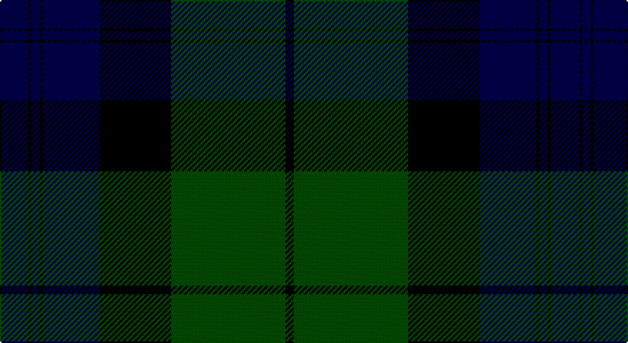

This page is one **sett** — a single exact thread-count. It belongs to the [tartan](/setts/db10k1db3k1db20k25dg40k3/)
(the same proportion at any scale), whose colour order is pattern [BKBKBKGK](/stripes/bkbkbkgk/).

Sourced from weddslist.  It is a [8 stripe tartan](/stripes/stripes8/).

Original link http://www.weddslist.com/cgi-bin/tartans/pg.pl?source=rb

## Thread count
DB/20 K2 DB6 K2 DB40 K50 G80 K/6

One full sett is **386 threads**.

## Palette

Palette: <strong>Tartan Register</strong> <small style="color:#888">(2 of 3 colours)</small>
<table><thead><tr><th>Colour</th><th>Threads</th><th>Shade</th><th>Base</th><th>OKLCh</th></tr></thead><tbody><tr><td>DB/</td><td style="text-align:right;font-variant-numeric:tabular-nums">20</td><td><code style="background-color:#00004C;">#00004C</code> <small style="color:#888">#00004C</small></td><td>B <code style="background-color:#2A418A;">#2A418A</code></td><td><small style="color:#888">oklch(18.8% 0.130 264.1)</small></td></tr><tr><td>K</td><td style="text-align:right;font-variant-numeric:tabular-nums">2</td><td><code style="background-color:#000000;">#000000</code> <small style="color:#888">#000000</small></td><td>K <code style="background-color:#000000;">#000000</code></td><td><small style="color:#888">oklch(0.0% 0.000 0.0)</small></td></tr><tr><td>DB</td><td style="text-align:right;font-variant-numeric:tabular-nums">6</td><td><code style="background-color:#00004C;">#00004C</code> <small style="color:#888">#00004C</small></td><td>B <code style="background-color:#2A418A;">#2A418A</code></td><td><small style="color:#888">oklch(18.8% 0.130 264.1)</small></td></tr><tr><td>K</td><td style="text-align:right;font-variant-numeric:tabular-nums">2</td><td><code style="background-color:#000000;">#000000</code> <small style="color:#888">#000000</small></td><td>K <code style="background-color:#000000;">#000000</code></td><td><small style="color:#888">oklch(0.0% 0.000 0.0)</small></td></tr><tr><td>DB</td><td style="text-align:right;font-variant-numeric:tabular-nums">40</td><td><code style="background-color:#00004C;">#00004C</code> <small style="color:#888">#00004C</small></td><td>B <code style="background-color:#2A418A;">#2A418A</code></td><td><small style="color:#888">oklch(18.8% 0.130 264.1)</small></td></tr><tr><td>K</td><td style="text-align:right;font-variant-numeric:tabular-nums">50</td><td><code style="background-color:#000000;">#000000</code> <small style="color:#888">#000000</small></td><td>K <code style="background-color:#000000;">#000000</code></td><td><small style="color:#888">oklch(0.0% 0.000 0.0)</small></td></tr><tr><td>G</td><td style="text-align:right;font-variant-numeric:tabular-nums">80</td><td><code style="background-color:#004C00;">#004C00</code> <small style="color:#888">#004C00</small></td><td>G <code style="background-color:#006100;">#006100</code></td><td><small style="color:#888">oklch(36.1% 0.123 142.5)</small></td></tr><tr><td>K/</td><td style="text-align:right;font-variant-numeric:tabular-nums">6</td><td><code style="background-color:#000000;">#000000</code> <small style="color:#888">#000000</small></td><td>K <code style="background-color:#000000;">#000000</code></td><td><small style="color:#888">oklch(0.0% 0.000 0.0)</small></td></tr></tbody></table>

# Sample pattern

## Nearest tartans

The nearest existing variants by ΔTartan distance, with this tartan at the top so the swatches line up against it.

ΔTartan

Tartan

Sett

—

<a href="/ttd/edit/#slug=db10k1db3k1db20k25dg40k3~x2">Black Watch RHR</a> <a class="nn-out" href="/variants/s8/db10k1db3k1db20k25dg40k3~x2/" title="open its dictionary page">↗</a>

0.98

<a href="/ttd/edit/#slug=dg20k1dg2k1dg3k14db28k1db2k4~x2&amp;base=db10k1db3k1db20k25dg40k3~x2">Kerr Hunting</a> <a class="nn-out" href="/variants/s10/dg20k1dg2k1dg3k14db28k1db2k4~x2/" title="open its dictionary page">↗</a>

1.28

<a href="/ttd/edit/#slug=r3k2db25k28dg25k2r1db2~x2&amp;base=db10k1db3k1db20k25dg40k3~x2">Common Kilt</a> <a class="nn-out" href="/variants/s8/r3k2db25k28dg25k2r1db2~x2/" title="open its dictionary page">↗</a>

1.31

<a href="/ttd/edit/#slug=k4db16k12dg24r1dg2k2~x2&amp;base=db10k1db3k1db20k25dg40k3~x2">Dundas</a> <a class="nn-out" href="/variants/s7/k4db16k12dg24r1dg2k2~x2/" title="open its dictionary page">↗</a>

1.55

<a href="/ttd/edit/#slug=dg1dg1r2dg21k11db21r2db1db1~x2&amp;base=db10k1db3k1db20k25dg40k3~x2">MacThomas</a> <a class="nn-out" href="/variants/s9/dg1dg1r2dg21k11db21r2db1db1~x2/" title="open its dictionary page">↗</a>

1.65

<a href="/ttd/edit/#slug=ly3dg2k1dg30db24k2db2k2~x2&amp;base=db10k1db3k1db20k25dg40k3~x2">Johnston</a> <a class="nn-out" href="/variants/s8/ly3dg2k1dg30db24k2db2k2~x2/" title="open its dictionary page">↗</a>

1.71

<a href="/ttd/edit/#slug=r3db12k1db1k1db2k12dg30k1dg2~x2&amp;base=db10k1db3k1db20k25dg40k3~x2">Armstrong</a> <a class="nn-out" href="/variants/s10/r3db12k1db1k1db2k12dg30k1dg2~x2/" title="open its dictionary page">↗</a>

1.77

<a href="/ttd/edit/#slug=db26k1db2k18ly2g16k16~x2&amp;base=db10k1db3k1db20k25dg40k3~x2">Mowat</a> <a class="nn-out" href="/variants/s7/db26k1db2k18ly2g16k16~x2/" title="open its dictionary page">↗</a>

1.80

<a href="/ttd/edit/#slug=k4db16k12g24r1g2k2~x2&amp;base=db10k1db3k1db20k25dg40k3~x2">Dundas Clan Tartan</a> <a class="nn-out" href="/variants/s7/k4db16k12g24r1g2k2~x2/" title="open its dictionary page">↗</a>

1.84

<a href="/ttd/edit/#slug=k4db2g24r1g2r1g2k20db24k1db2k4~x2&amp;base=db10k1db3k1db20k25dg40k3~x2">Jedforest</a> <a class="nn-out" href="/variants/s12/k4db2g24r1g2r1g2k20db24k1db2k4~x2/" title="open its dictionary page">↗</a>

1.84

<a href="/ttd/edit/#slug=db4k4db24dg32lb1dg2~x2&amp;base=db10k1db3k1db20k25dg40k3~x2">Oliphant</a> <a class="nn-out" href="/variants/s6/db4k4db24dg32lb1dg2~x2/" title="open its dictionary page">↗</a>

## Neighbour map

Every grey dot is one of 14360 variants placed by the first two principal components of the ΔTartan feature space (44% of its variance). Red is this tartan; blue dots are its nearest — click one to open its page.

<svg viewBox="0 0 640 380" role="img" style="max-width:100%;height:auto;border:1px solid #e0e0e0;border-radius:4px;display:block" xmlns="http://www.w3.org/2000/svg"><image href="/nn/cloud.v1.png" width="640" height="380"/><a href="/variants/s10/dg20k1dg2k1dg3k14db28k1db2k4~x2/"><circle cx="307.6" cy="171.9" r="4" fill="#3465a4"><title>Kerr Hunting</title></circle></a><a href="/variants/s8/r3k2db25k28dg25k2r1db2~x2/"><circle cx="274.5" cy="175.9" r="4" fill="#3465a4"><title>Common Kilt</title></circle></a><a href="/variants/s7/k4db16k12dg24r1dg2k2~x2/"><circle cx="275.3" cy="188.5" r="4" fill="#3465a4"><title>Dundas</title></circle></a><a href="/variants/s9/dg1dg1r2dg21k11db21r2db1db1~x2/"><circle cx="259.2" cy="161.0" r="4" fill="#3465a4"><title>MacThomas</title></circle></a><a href="/variants/s8/ly3dg2k1dg30db24k2db2k2~x2/"><circle cx="354.5" cy="156.4" r="4" fill="#3465a4"><title>Johnston</title></circle></a><a href="/variants/s10/r3db12k1db1k1db2k12dg30k1dg2~x2/"><circle cx="326.7" cy="137.4" r="4" fill="#3465a4"><title>Armstrong</title></circle></a><a href="/variants/s7/db26k1db2k18ly2g16k16~x2/"><circle cx="286.8" cy="199.5" r="4" fill="#3465a4"><title>Mowat</title></circle></a><a href="/variants/s7/k4db16k12g24r1g2k2~x2/"><circle cx="292.0" cy="191.6" r="4" fill="#3465a4"><title>Dundas Clan Tartan</title></circle></a><a href="/variants/s12/k4db2g24r1g2r1g2k20db24k1db2k4~x2/"><circle cx="262.0" cy="148.4" r="4" fill="#3465a4"><title>Jedforest</title></circle></a><a href="/variants/s6/db4k4db24dg32lb1dg2~x2/"><circle cx="373.3" cy="183.9" r="4" fill="#3465a4"><title>Oliphant</title></circle></a><circle cx="314.2" cy="180.4" r="5" fill="#c00000"/></svg>

ID: /variants/s8/db10k1db3k1db20k25dg40k3~x2/
