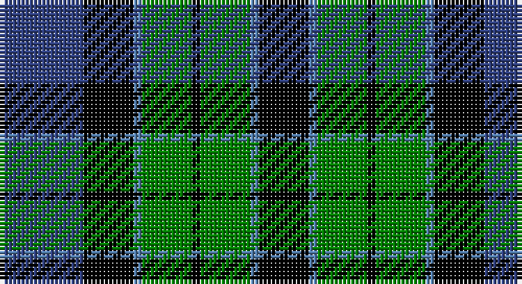

This page is one **sett** — a single exact thread-count. It belongs to the [tartan](/setts/db10k6t1g6k1/)
(the same proportion at any scale), whose colour order is pattern [BKBGKGBK](/stripes/bkbgkgbk/).

Sourced from weddslist.  It is a [8 stripe tartan](/stripes/stripes8/).

Original link http://www.weddslist.com/cgi-bin/tartans/pg.pl?source=sts

## Thread count
B/20 K12 Ba2 G12 K2 G12 Ba2 K/12

One full sett is **116 threads**.

## Palette

Palette: <strong>Ingles Buchan</strong> <small style="color:#888">(1 of 4 colours)</small>
<table><thead><tr><th>Colour</th><th>Threads</th><th>Shade</th><th>Base</th><th>OKLCh</th></tr></thead><tbody><tr><td>B/</td><td style="text-align:right;font-variant-numeric:tabular-nums">20</td><td><code style="background-color:#304080;">#304080</code> <small style="color:#888">#304080</small></td><td>B <code style="background-color:#2A418A;">#2A418A</code></td><td><small style="color:#888">oklch(39.4% 0.109 270.2)</small></td></tr><tr><td>K</td><td style="text-align:right;font-variant-numeric:tabular-nums">12</td><td><code style="background-color:#000000;">#000000</code> <small style="color:#888">#000000</small></td><td>K <code style="background-color:#000000;">#000000</code></td><td><small style="color:#888">oklch(0.0% 0.000 0.0)</small></td></tr><tr><td>Ba</td><td style="text-align:right;font-variant-numeric:tabular-nums">2</td><td><code style="background-color:#5480B0;">#5480B0</code> <small style="color:#888">#5480B0</small></td><td>B <code style="background-color:#2A418A;">#2A418A</code></td><td><small style="color:#888">oklch(58.8% 0.089 251.5)</small></td></tr><tr><td>G</td><td style="text-align:right;font-variant-numeric:tabular-nums">12</td><td><code style="background-color:#008000;">#008000</code> <small style="color:#888">#008000</small></td><td>G <code style="background-color:#006100;">#006100</code></td><td><small style="color:#888">oklch(52.0% 0.177 142.5)</small></td></tr><tr><td>K</td><td style="text-align:right;font-variant-numeric:tabular-nums">2</td><td><code style="background-color:#000000;">#000000</code> <small style="color:#888">#000000</small></td><td>K <code style="background-color:#000000;">#000000</code></td><td><small style="color:#888">oklch(0.0% 0.000 0.0)</small></td></tr><tr><td>G</td><td style="text-align:right;font-variant-numeric:tabular-nums">12</td><td><code style="background-color:#008000;">#008000</code> <small style="color:#888">#008000</small></td><td>G <code style="background-color:#006100;">#006100</code></td><td><small style="color:#888">oklch(52.0% 0.177 142.5)</small></td></tr><tr><td>Ba</td><td style="text-align:right;font-variant-numeric:tabular-nums">2</td><td><code style="background-color:#5480B0;">#5480B0</code> <small style="color:#888">#5480B0</small></td><td>B <code style="background-color:#2A418A;">#2A418A</code></td><td><small style="color:#888">oklch(58.8% 0.089 251.5)</small></td></tr><tr><td>K/</td><td style="text-align:right;font-variant-numeric:tabular-nums">12</td><td><code style="background-color:#000000;">#000000</code> <small style="color:#888">#000000</small></td><td>K <code style="background-color:#000000;">#000000</code></td><td><small style="color:#888">oklch(0.0% 0.000 0.0)</small></td></tr></tbody></table>

# Sample pattern

## Nearest tartans

The nearest existing variants by ΔTartan distance, with this tartan at the top so the swatches line up against it.

ΔTartan

Tartan

Sett

—

<a href="/ttd/edit/#slug=db10k6t1g6k1~x2">Unnamed, No 115</a> <a class="nn-out" href="/variants/s8/db10k6t1g6k1~x2/" title="open its dictionary page">↗</a>

0.54

<a href="/ttd/edit/#slug=k3db17k20g18w4g18k20db18k2db2~x2&amp;base=db10k6t1g6k1~x2">Argyll, Campbell</a> <a class="nn-out" href="/variants/s10/k3db17k20g18w4g18k20db18k2db2~x2/" title="open its dictionary page">↗</a>

0.65

<a href="/ttd/edit/#slug=db3r1db10k8g10r1g3~x4&amp;base=db10k6t1g6k1~x2">Blair</a> <a class="nn-out" href="/variants/s7/db3r1db10k8g10r1g3~x4/" title="open its dictionary page">↗</a>

0.70

<a href="/ttd/edit/#slug=db6k1db6k8r1g8k2~x2&amp;base=db10k6t1g6k1~x2">Fletcher</a> <a class="nn-out" href="/variants/s7/db6k1db6k8r1g8k2~x2/" title="open its dictionary page">↗</a>

0.76

<a href="/ttd/edit/#slug=k4w2g18k13db12k2~x2&amp;base=db10k6t1g6k1~x2">Melville</a> <a class="nn-out" href="/variants/s6/k4w2g18k13db12k2~x2/" title="open its dictionary page">↗</a>

0.76

<a href="/ttd/edit/#slug=w1db9k9g9k2w1~x4&amp;base=db10k6t1g6k1~x2">MacNeil 1</a> <a class="nn-out" href="/variants/s6/w1db9k9g9k2w1~x4/" title="open its dictionary page">↗</a>

0.77

<a href="/ttd/edit/#slug=k4g19k16w2db15g4~x2&amp;base=db10k6t1g6k1~x2">Graham of Montrose</a> <a class="nn-out" href="/variants/s6/k4g19k16w2db15g4~x2/" title="open its dictionary page">↗</a>

0.77

<a href="/ttd/edit/#slug=k2g12k12r1db12g2~x2&amp;base=db10k6t1g6k1~x2">Ferguson of Balquhidder</a> <a class="nn-out" href="/variants/s6/k2g12k12r1db12g2~x2/" title="open its dictionary page">↗</a>

0.77

<a href="/ttd/edit/#slug=t1db11k11g11k2t1~x2&amp;base=db10k6t1g6k1~x2">Unnamed, No 59</a> <a class="nn-out" href="/variants/s6/t1db11k11g11k2t1~x2/" title="open its dictionary page">↗</a>

0.79

<a href="/ttd/edit/#slug=db9k9db9r2k18g12r2g4r2g4~x2&amp;base=db10k6t1g6k1~x2">Newlands</a> <a class="nn-out" href="/variants/s10/db9k9db9r2k18g12r2g4r2g4~x2/" title="open its dictionary page">↗</a>

0.83

<a href="/ttd/edit/#slug=b10k3b10k14r2g14k4~x2&amp;base=db10k6t1g6k1~x2">Fletcher #2</a> <a class="nn-out" href="/variants/s7/b10k3b10k14r2g14k4~x2/" title="open its dictionary page">↗</a>

## Neighbour map

Every grey dot is one of 14360 variants placed by the first two principal components of the ΔTartan feature space (44% of its variance). Red is this tartan; blue dots are its nearest — click one to open its page.

<svg viewBox="0 0 640 380" role="img" style="max-width:100%;height:auto;border:1px solid #e0e0e0;border-radius:4px;display:block" xmlns="http://www.w3.org/2000/svg"><image href="/nn/cloud.v1.png" width="640" height="380"/><a href="/variants/s10/k3db17k20g18w4g18k20db18k2db2~x2/"><circle cx="145.5" cy="207.6" r="4" fill="#3465a4"><title>Argyll, Campbell</title></circle></a><a href="/variants/s7/db3r1db10k8g10r1g3~x4/"><circle cx="167.2" cy="214.6" r="4" fill="#3465a4"><title>Blair</title></circle></a><a href="/variants/s7/db6k1db6k8r1g8k2~x2/"><circle cx="158.2" cy="233.5" r="4" fill="#3465a4"><title>Fletcher</title></circle></a><a href="/variants/s6/k4w2g18k13db12k2~x2/"><circle cx="159.6" cy="222.8" r="4" fill="#3465a4"><title>Melville</title></circle></a><a href="/variants/s6/w1db9k9g9k2w1~x4/"><circle cx="146.4" cy="218.0" r="4" fill="#3465a4"><title>MacNeil 1</title></circle></a><a href="/variants/s6/k4g19k16w2db15g4~x2/"><circle cx="162.0" cy="225.5" r="4" fill="#3465a4"><title>Graham of Montrose</title></circle></a><a href="/variants/s6/k2g12k12r1db12g2~x2/"><circle cx="171.4" cy="213.0" r="4" fill="#3465a4"><title>Ferguson of Balquhidder</title></circle></a><a href="/variants/s6/t1db11k11g11k2t1~x2/"><circle cx="167.5" cy="213.6" r="4" fill="#3465a4"><title>Unnamed, No 59</title></circle></a><a href="/variants/s10/db9k9db9r2k18g12r2g4r2g4~x2/"><circle cx="149.8" cy="203.1" r="4" fill="#3465a4"><title>Newlands</title></circle></a><a href="/variants/s7/b10k3b10k14r2g14k4~x2/"><circle cx="131.7" cy="239.8" r="4" fill="#3465a4"><title>Fletcher #2</title></circle></a><circle cx="146.4" cy="216.1" r="5" fill="#c00000"/></svg>

ID: /variants/s8/db10k6t1g6k1~x2/
