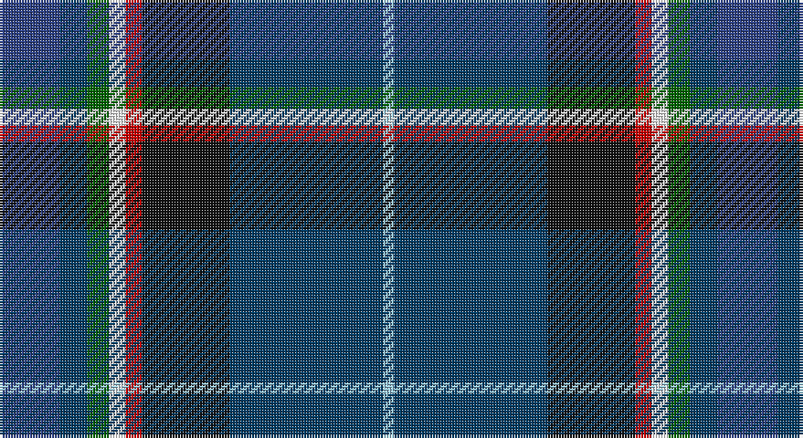

This page is one **sett** — a single exact thread-count. It belongs to the [tartan](/setts/db11dt5g4w3r3k16dt28lb2/)
(the same proportion at any scale), whose colour order is pattern [BBGWRKBW](/stripes/bbgwrkbw/).

Part of the [Scottish Italian](/tartans/scottish-italian/) tartan — the named design grouping this sett with its other cloths.

Sourced from register-of-tartans.  It is a [8 stripe tartan](/stripes/stripes8/).

Original link https://www.tartanregister.gov.uk/tartanDetails.aspx?ref=11248

## Register references

External register numbers recorded for this tartan.

- Scottish Register of Tartans: [11248](https://www.tartanregister.gov.uk/tartanDetails.aspx?ref=11248)

## Thread count
B/22 DB10 G8 W6 R6 K32 DB56 LB/4

One full sett is **262 threads**.

## Palette

Palette: <strong>Tartan Register</strong>
<table><thead><tr><th>Colour</th><th>Threads</th><th>Shade</th><th>Base</th><th>OKLCh</th></tr></thead><tbody><tr><td>B/</td><td style="text-align:right;font-variant-numeric:tabular-nums">22</td><td><code style="background-color:#2C4084;">#2C4084</code> <small style="color:#888">#2C4084</small></td><td>B <code style="background-color:#2A418A;">#2A418A</code></td><td><small style="color:#888">oklch(39.4% 0.117 268.3)</small></td></tr><tr><td>DB</td><td style="text-align:right;font-variant-numeric:tabular-nums">10</td><td><code style="background-color:#003C64;">#003C64</code> <small style="color:#888">#003C64</small></td><td>B <code style="background-color:#2A418A;">#2A418A</code></td><td><small style="color:#888">oklch(34.5% 0.089 246.0)</small></td></tr><tr><td>G</td><td style="text-align:right;font-variant-numeric:tabular-nums">8</td><td><code style="background-color:#006400;">#006400</code> <small style="color:#888">#006400</small></td><td>G <code style="background-color:#006100;">#006100</code></td><td><small style="color:#888">oklch(43.6% 0.148 142.5)</small></td></tr><tr><td>W</td><td style="text-align:right;font-variant-numeric:tabular-nums">6</td><td><code style="background-color:#FFFFFF;">#FFFFFF</code> <small style="color:#888">#FFFFFF</small></td><td>W <code style="background-color:#F7F7F7;">#F7F7F7</code></td><td><small style="color:#888">oklch(100.0% 0.000 89.9)</small></td></tr><tr><td>R</td><td style="text-align:right;font-variant-numeric:tabular-nums">6</td><td><code style="background-color:#C80000;">#C80000</code> <small style="color:#888">#C80000</small></td><td>R <code style="background-color:#CC0000;">#CC0000</code></td><td><small style="color:#888">oklch(52.3% 0.215 29.2)</small></td></tr><tr><td>K</td><td style="text-align:right;font-variant-numeric:tabular-nums">32</td><td><code style="background-color:#101010;">#101010</code> <small style="color:#888">#101010</small></td><td>K <code style="background-color:#000000;">#000000</code></td><td><small style="color:#888">oklch(17.3% 0.000 89.9)</small></td></tr><tr><td>DB</td><td style="text-align:right;font-variant-numeric:tabular-nums">56</td><td><code style="background-color:#003C64;">#003C64</code> <small style="color:#888">#003C64</small></td><td>B <code style="background-color:#2A418A;">#2A418A</code></td><td><small style="color:#888">oklch(34.5% 0.089 246.0)</small></td></tr><tr><td>LB/</td><td style="text-align:right;font-variant-numeric:tabular-nums">4</td><td><code style="background-color:#98C8E8;">#98C8E8</code> <small style="color:#888">#98C8E8</small></td><td>W <code style="background-color:#F7F7F7;">#F7F7F7</code></td><td><small style="color:#888">oklch(81.0% 0.068 237.9)</small></td></tr></tbody></table>

# Sample pattern

## Nearest tartans

The nearest existing variants by ΔTartan distance, with this tartan at the top so the swatches line up against it.

ΔTartan

Tartan

Sett

—

<a href="/ttd/edit/#slug=db11dt5g4w3r3k16dt28lb2~x2">Scottish Italian</a> <a class="nn-out" href="/variants/s8/db11dt5g4w3r3k16dt28lb2~x2/" title="open its dictionary page">↗</a>

0.88

<a href="/ttd/edit/#slug=r4oi10k9o2k9db33dt7g4~x2&amp;base=db11dt5g4w3r3k16dt28lb2~x2">Anne Arundel County</a> <a class="nn-out" href="/variants/s8/r4oi10k9o2k9db33dt7g4~x2/" title="open its dictionary page">↗</a>

1.01

<a href="/variants/s8/db39dyi3k14dyi3t14ly4w2dy2~x2/">Unidentified Lady's kilt</a>

1.03

<a href="/ttd/edit/#slug=db20y1w1lo3g14n4y1dp4~x2&amp;base=db11dt5g4w3r3k16dt28lb2~x2">St. Columba (one green)</a> <a class="nn-out" href="/variants/s8/db20y1w1lo3g14n4y1dp4~x2/" title="open its dictionary page">↗</a>

1.05

<a href="/ttd/edit/#slug=db4dy5g19dp5dy5k5dy5db36ly3~x2&amp;base=db11dt5g4w3r3k16dt28lb2~x2">Suzugamine (Corporate)</a> <a class="nn-out" href="/variants/s9/db4dy5g19dp5dy5k5dy5db36ly3~x2/" title="open its dictionary page">↗</a>

1.06

<a href="/ttd/edit/#slug=b11db5g4w3r3k16db28b2~x2&amp;base=db11dt5g4w3r3k16dt28lb2~x2">Scottish Italian</a> <a class="nn-out" href="/variants/s8/b11db5g4w3r3k16db28b2~x2/" title="open its dictionary page">↗</a>

1.12

<a href="/ttd/edit/#slug=dp4g13db5ly3t6ly3db5n6db28w2~x2&amp;base=db11dt5g4w3r3k16dt28lb2~x2">Highland, Blue (Corporate)</a> <a class="nn-out" href="/variants/s10/dp4g13db5ly3t6ly3db5n6db28w2~x2/" title="open its dictionary page">↗</a>

1.17

<a href="/variants/s8/r4y10k9dy2k9db33ki7g4~x2/">Anne Arundel County</a>

1.24

<a href="/ttd/edit/#slug=dp4db2t8db25k8g13ly4~x2&amp;base=db11dt5g4w3r3k16dt28lb2~x2">Renfrewshire</a> <a class="nn-out" href="/variants/s7/dp4db2t8db25k8g13ly4~x2/" title="open its dictionary page">↗</a>

1.25

<a href="/ttd/edit/#slug=k4t6w4t6do8t37lr12do46o6lo4&amp;base=db11dt5g4w3r3k16dt28lb2~x2">MacLeroy and Troine 1987</a> <a class="nn-out" href="/variants/s10/k4t6w4t6do8t37lr12do46o6lo4/" title="open its dictionary page">↗</a>

1.30

<a href="/ttd/edit/#slug=lo4k28r2db22b8dy3~x2&amp;base=db11dt5g4w3r3k16dt28lb2~x2">Loch Long One Design (Corporate)</a> <a class="nn-out" href="/variants/s6/lo4k28r2db22b8dy3~x2/" title="open its dictionary page">↗</a>

## Neighbour map

Every grey dot is one of 14360 variants placed by the first two principal components of the ΔTartan feature space (44% of its variance). Red is this tartan; blue dots are its nearest — click one to open its page.

<svg viewBox="0 0 640 380" role="img" style="max-width:100%;height:auto;border:1px solid #e0e0e0;border-radius:4px;display:block" xmlns="http://www.w3.org/2000/svg"><image href="/nn/cloud.v1.png" width="640" height="380"/><a href="/variants/s8/r4oi10k9o2k9db33dt7g4~x2/"><circle cx="196.3" cy="143.8" r="4" fill="#3465a4"><title>Anne Arundel County</title></circle></a><a href="/variants/s8/db39dyi3k14dyi3t14ly4w2dy2~x2/"><circle cx="231.1" cy="115.2" r="4" fill="#3465a4"><title>Unidentified Lady's kilt</title></circle></a><a href="/variants/s8/db20y1w1lo3g14n4y1dp4~x2/"><circle cx="206.4" cy="121.5" r="4" fill="#3465a4"><title>St. Columba (one green)</title></circle></a><a href="/variants/s9/db4dy5g19dp5dy5k5dy5db36ly3~x2/"><circle cx="224.2" cy="156.7" r="4" fill="#3465a4"><title>Suzugamine (Corporate)</title></circle></a><a href="/variants/s8/b11db5g4w3r3k16db28b2~x2/"><circle cx="208.2" cy="156.9" r="4" fill="#3465a4"><title>Scottish Italian</title></circle></a><a href="/variants/s10/dp4g13db5ly3t6ly3db5n6db28w2~x2/"><circle cx="205.2" cy="123.0" r="4" fill="#3465a4"><title>Highland, Blue (Corporate)</title></circle></a><a href="/variants/s8/r4y10k9dy2k9db33ki7g4~x2/"><circle cx="162.2" cy="128.6" r="4" fill="#3465a4"><title>Anne Arundel County</title></circle></a><a href="/variants/s7/dp4db2t8db25k8g13ly4~x2/"><circle cx="168.0" cy="174.7" r="4" fill="#3465a4"><title>Renfrewshire</title></circle></a><a href="/variants/s10/k4t6w4t6do8t37lr12do46o6lo4/"><circle cx="183.5" cy="127.9" r="4" fill="#3465a4"><title>MacLeroy and Troine 1987</title></circle></a><a href="/variants/s6/lo4k28r2db22b8dy3~x2/"><circle cx="216.3" cy="178.6" r="4" fill="#3465a4"><title>Loch Long One Design (Corporate)</title></circle></a><circle cx="195.3" cy="147.6" r="5" fill="#c00000"/></svg>

ID: /variants/s8/db11dt5g4w3r3k16dt28lb2~x2/
