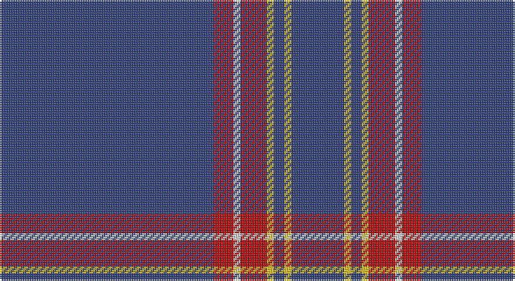

This page is one **sett** — a single exact thread-count. It belongs to the [tartan](/setts/db122r11w4r15ly4db6ly4db30/)
(the same proportion at any scale), whose colour order is pattern [BRWRYBYB](/stripes/brwrybyb/).

Sourced from weddslist.  It is a [8 stripe tartan](/stripes/stripes8/).

Original link http://www.weddslist.com/cgi-bin/tartans/pg.pl?source=sts

## Thread count
B/122 R11 LN4 R15 Y4 B6 Y4 B/30

One full sett is **240 threads**.

## Palette

Palette: <strong>Tartan Dictionary</strong> <small style="color:#888">(1 of 4 colours)</small>
<table><thead><tr><th>Colour</th><th>Threads</th><th>Shade</th><th>Base</th><th>OKLCh</th></tr></thead><tbody><tr><td>B/</td><td style="text-align:right;font-variant-numeric:tabular-nums">122</td><td><code style="background-color:#304080;">#304080</code> <small style="color:#888">#304080</small></td><td>B <code style="background-color:#2A418A;">#2A418A</code></td><td><small style="color:#888">oklch(39.4% 0.109 270.2)</small></td></tr><tr><td>R</td><td style="text-align:right;font-variant-numeric:tabular-nums">11</td><td><code style="background-color:#C00000;">#C00000</code> <small style="color:#888">#C00000</small></td><td>R <code style="background-color:#CC0000;">#CC0000</code></td><td><small style="color:#888">oklch(50.7% 0.208 29.2)</small></td></tr><tr><td>LN</td><td style="text-align:right;font-variant-numeric:tabular-nums">4</td><td><code style="background-color:#E0E0E0;">#E0E0E0</code> <small style="color:#888">#E0E0E0</small></td><td>W <code style="background-color:#F7F7F7;">#F7F7F7</code></td><td><small style="color:#888">oklch(90.7% 0.000 89.9)</small></td></tr><tr><td>R</td><td style="text-align:right;font-variant-numeric:tabular-nums">15</td><td><code style="background-color:#C00000;">#C00000</code> <small style="color:#888">#C00000</small></td><td>R <code style="background-color:#CC0000;">#CC0000</code></td><td><small style="color:#888">oklch(50.7% 0.208 29.2)</small></td></tr><tr><td>Y</td><td style="text-align:right;font-variant-numeric:tabular-nums">4</td><td><code style="background-color:#F0C000;">#F0C000</code> <small style="color:#888">#F0C000</small></td><td>Y <code style="background-color:#F2BF00;">#F2BF00</code></td><td><small style="color:#888">oklch(82.7% 0.169 90.5)</small></td></tr><tr><td>B</td><td style="text-align:right;font-variant-numeric:tabular-nums">6</td><td><code style="background-color:#304080;">#304080</code> <small style="color:#888">#304080</small></td><td>B <code style="background-color:#2A418A;">#2A418A</code></td><td><small style="color:#888">oklch(39.4% 0.109 270.2)</small></td></tr><tr><td>Y</td><td style="text-align:right;font-variant-numeric:tabular-nums">4</td><td><code style="background-color:#F0C000;">#F0C000</code> <small style="color:#888">#F0C000</small></td><td>Y <code style="background-color:#F2BF00;">#F2BF00</code></td><td><small style="color:#888">oklch(82.7% 0.169 90.5)</small></td></tr><tr><td>B/</td><td style="text-align:right;font-variant-numeric:tabular-nums">30</td><td><code style="background-color:#304080;">#304080</code> <small style="color:#888">#304080</small></td><td>B <code style="background-color:#2A418A;">#2A418A</code></td><td><small style="color:#888">oklch(39.4% 0.109 270.2)</small></td></tr></tbody></table>

# Sample pattern

## Nearest tartans

The nearest existing variants by ΔTartan distance, with this tartan at the top so the swatches line up against it.

ΔTartan

Tartan

Sett

—

<a href="/ttd/edit/#slug=db122r11w4r15ly4db6ly4db30">Inverness, Duke of York</a> <a class="nn-out" href="/variants/s8/db122r11w4r15ly4db6ly4db30/" title="open its dictionary page">↗</a>

1.04

<a href="/ttd/edit/#slug=dt35ly1dt3ly1dt3ly1dt20r6w1r5~x2&amp;base=db122r11w4r15ly4db6ly4db30">Alpha Chi Sigma Fraternity</a> <a class="nn-out" href="/variants/s10/dt35ly1dt3ly1dt3ly1dt20r6w1r5~x2/" title="open its dictionary page">↗</a>

1.18

<a href="/ttd/edit/#slug=db32r3db4k1ly3~x2&amp;base=db122r11w4r15ly4db6ly4db30">MacLaine of Lochbuie, hunting</a> <a class="nn-out" href="/variants/s5/db32r3db4k1ly3~x2/" title="open its dictionary page">↗</a>

1.25

<a href="/ttd/edit/#slug=db48w2db7w2db7w2db20t11r2~x2&amp;base=db122r11w4r15ly4db6ly4db30">RAAF #4</a> <a class="nn-out" href="/variants/s9/db48w2db7w2db7w2db20t11r2~x2/" title="open its dictionary page">↗</a>

1.41

<a href="/ttd/edit/#slug=w2db49r5ly2r5ly2~x2&amp;base=db122r11w4r15ly4db6ly4db30">Balmer (Personal)</a> <a class="nn-out" href="/variants/s6/w2db49r5ly2r5ly2~x2/" title="open its dictionary page">↗</a>

1.43

<a href="/ttd/edit/#slug=db7dt5lr6dt5r7dt2db2dt70lr2&amp;base=db122r11w4r15ly4db6ly4db30">United States Trade sett Tartan</a> <a class="nn-out" href="/variants/s9/db7dt5lr6dt5r7dt2db2dt70lr2/" title="open its dictionary page">↗</a>

1.46

<a href="/ttd/edit/#slug=db45ly3db10o4k1w2~x2&amp;base=db122r11w4r15ly4db6ly4db30">Wylie</a> <a class="nn-out" href="/variants/s6/db45ly3db10o4k1w2~x2/" title="open its dictionary page">↗</a>

1.48

<a href="/ttd/edit/#slug=db6lo2db7g4db3g6db2g4db39ly2~x2&amp;base=db122r11w4r15ly4db6ly4db30">Seletar Shipping (Corporate)</a> <a class="nn-out" href="/variants/s10/db6lo2db7g4db3g6db2g4db39ly2~x2/" title="open its dictionary page">↗</a>

1.49

<a href="/ttd/edit/#slug=b7db5w6db5r7db2b2db70w2&amp;base=db122r11w4r15ly4db6ly4db30">United States (Corporate)</a> <a class="nn-out" href="/variants/s9/b7db5w6db5r7db2b2db70w2/" title="open its dictionary page">↗</a>

1.54

<a href="/ttd/edit/#slug=b70db5b3w5b3w5b3r5b8~x2&amp;base=db122r11w4r15ly4db6ly4db30">Wyckoff, Ann Grainger Phillips</a> <a class="nn-out" href="/variants/s9/b70db5b3w5b3w5b3r5b8~x2/" title="open its dictionary page">↗</a>

1.59

<a href="/ttd/edit/#slug=db61w4db2w7p2g3ly2db16~x2&amp;base=db122r11w4r15ly4db6ly4db30">Boat of Garten (District)</a> <a class="nn-out" href="/variants/s8/db61w4db2w7p2g3ly2db16~x2/" title="open its dictionary page">↗</a>

## Neighbour map

Every grey dot is one of 14360 variants placed by the first two principal components of the ΔTartan feature space (44% of its variance). Red is this tartan; blue dots are its nearest — click one to open its page.

<svg viewBox="0 0 640 380" role="img" style="max-width:100%;height:auto;border:1px solid #e0e0e0;border-radius:4px;display:block" xmlns="http://www.w3.org/2000/svg"><image href="/nn/cloud.v1.png" width="640" height="380"/><a href="/variants/s10/dt35ly1dt3ly1dt3ly1dt20r6w1r5~x2/"><circle cx="558.5" cy="131.5" r="4" fill="#3465a4"><title>Alpha Chi Sigma Fraternity</title></circle></a><a href="/variants/s5/db32r3db4k1ly3~x2/"><circle cx="596.1" cy="164.5" r="4" fill="#3465a4"><title>MacLaine of Lochbuie, hunting</title></circle></a><a href="/variants/s9/db48w2db7w2db7w2db20t11r2~x2/"><circle cx="548.7" cy="158.2" r="4" fill="#3465a4"><title>RAAF #4</title></circle></a><a href="/variants/s6/w2db49r5ly2r5ly2~x2/"><circle cx="507.6" cy="140.8" r="4" fill="#3465a4"><title>Balmer (Personal)</title></circle></a><a href="/variants/s9/db7dt5lr6dt5r7dt2db2dt70lr2/"><circle cx="571.0" cy="136.2" r="4" fill="#3465a4"><title>United States Trade sett Tartan</title></circle></a><a href="/variants/s6/db45ly3db10o4k1w2~x2/"><circle cx="592.3" cy="123.9" r="4" fill="#3465a4"><title>Wylie</title></circle></a><a href="/variants/s10/db6lo2db7g4db3g6db2g4db39ly2~x2/"><circle cx="524.5" cy="163.5" r="4" fill="#3465a4"><title>Seletar Shipping (Corporate)</title></circle></a><a href="/variants/s9/b7db5w6db5r7db2b2db70w2/"><circle cx="524.5" cy="107.9" r="4" fill="#3465a4"><title>United States (Corporate)</title></circle></a><a href="/variants/s9/b70db5b3w5b3w5b3r5b8~x2/"><circle cx="558.6" cy="126.5" r="4" fill="#3465a4"><title>Wyckoff, Ann Grainger Phillips</title></circle></a><a href="/variants/s8/db61w4db2w7p2g3ly2db16~x2/"><circle cx="533.5" cy="111.6" r="4" fill="#3465a4"><title>Boat of Garten (District)</title></circle></a><circle cx="575.0" cy="137.8" r="5" fill="#c00000"/></svg>

ID: /variants/s8/db122r11w4r15ly4db6ly4db30/
