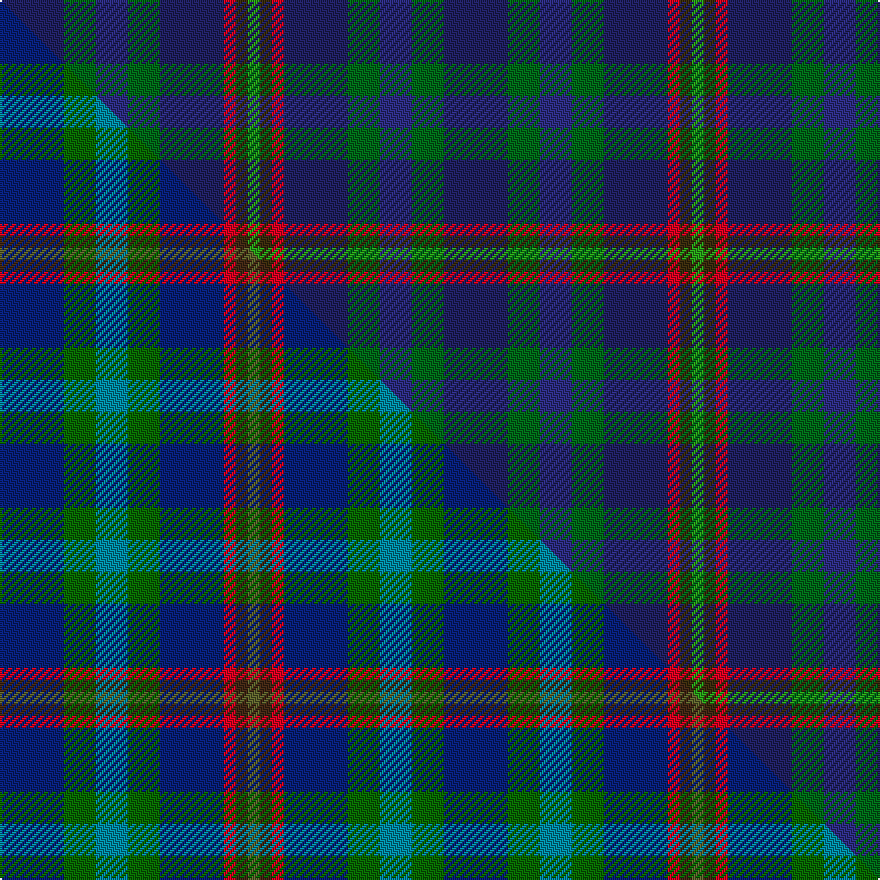

This is one **variant** — a specific cloth: this exact thread count and colourway, with its own
provenance below. It is one weaving of the [sett](/setts/db16dg8dbi8dg8db16r3dy3g3/) (the scale-free proportion — the
same cloth at any scale or shade), whose colour order is pattern [BGBGBRGG](/stripes/bgbgbrgg/).

Part of the [Glen Erin](/tartans/glen-erin/) tartan — the named design grouping this sett with its other cloths.

Sourced from house-of-tartan.  It is a [8 stripe tartan](/stripes/stripes8/).

Original link [http://www.house-of-tartan.scotland.net/house/TartanViewjs.asp?colr=Def&tnam=1909](http://www.house-of-tartan.scotland.net/house/TartanViewjs.asp?colr=Def&tnam=1909)

## Provenance

Earliest known date: pre 2003 Many new designs have been given district names to promote their Scottish connections. However, these names should not be confused with the District tartans which have earned their title through 'use and wont' and not a little history.

Dataset <small>— provenance for this record, inherited from the source manifest</small>

<dl class="dataset-prov">
<dt>source</dt><dd><a href="/sources/house-of-tartan/">House of Tartan</a></dd>
<dt>data captured from</dt><dd><a href="https://github.com/thetartan/tartan-database/blob/master/data/house-of-tartan/data.csv">https://github.com/thetartan/tartan-database/blob/master/data/house-of-tartan/data.csv</a></dd>
<dt>data date</dt><dd>pre 2003 <small>(this record)</small></dd>
<dt>licence</dt><dd><a href="https://creativecommons.org/licenses/by-nc-nd/4.0/">CC BY-NC-ND 4.0</a></dd>
</dl>

Capture chain <small>— the hands this data passed through, oldest first; each capture carries its own licence</small>

<ol class="capture-chain">
<li><a href="http://www.house-of-tartan.scotland.net/">House of Tartan</a> <small>the weaver/retailer's database — the site is now offline; the URL is kept as the ultimate source's identity</small></li>
<li><a href="https://github.com/thetartan/tartan-database">thetartan/tartan-database</a> <small>2016-2017</small> · <a href="https://creativecommons.org/licenses/by-nc-nd/4.0/">CC BY-NC-ND 4.0</a> <small>Levko Kravets's frozen compilation — the capture we vendored, and where its CC licence text came from</small></li>
<li>this dictionary <small>captured 2026-06-10 · commit 5bf86c7566</small> <small>each re-capture is a git commit to data/sources</small></li>
</ol>

## Thread count
DB/32 DG16 DBi16 DG16 DB32 R6 DY6 G/6

One full sett is **222 threads**.

## Palette
<table><thead><tr><th>Colour</th><th>Shade</th><th>OKLCh</th></tr></thead><tbody><tr><td>DB</td><td><code style="background-color:#2C2C80;">#2C2C80</code> <small style="color:#888">#2C2C80</small></td><td><small style="color:#888">oklch(35.0% 0.138 276.6)</small></td></tr><tr><td>DB</td><td><code style="background-color:#202060;">#202060</code> <small style="color:#888">#202060</small></td><td><small style="color:#888">oklch(28.9% 0.111 276.9)</small></td></tr><tr><td>DG</td><td><code style="background-color:#006818;">#006818</code> <small style="color:#888">#006818</small></td><td><small style="color:#888">oklch(45.0% 0.142 145.0)</small></td></tr><tr><td>G</td><td><code style="background-color:#289C18;">#289C18</code> <small style="color:#888">#289C18</small></td><td><small style="color:#888">oklch(60.6% 0.191 141.6)</small></td></tr><tr><td>R</td><td><code style="background-color:#D60020;">#D60020</code> <small style="color:#888">#D60020</small></td><td><small style="color:#888">oklch(55.2% 0.224 25.5)</small></td></tr><tr><td>DY</td><td><code style="background-color:#3A2B0D;">#3A2B0D</code> <small style="color:#888">#3A2B0D</small></td><td><small style="color:#888">oklch(30.0% 0.049 82.0)</small></td></tr></tbody></table>

# Sample pattern

## Compared to the master

This cloth is one sett of its design; the master sett (the exemplar the design is anchored on) is below for comparison.

Its **ΔTartan distance** from the master is **0.65** — the same measure the nearest-tartans table ranks by (0 is identical; a re-scale of the same cloth is near 0, a recolour or a different proportion further).

<figure class="master-compare" style="margin:0">

this sett
master sett ★

<figcaption style="color:#888;font-size:smaller">One weave of this sett against the <a href="/setts/db16dg8t8dg8db16r3do3g3/">master sett ★</a>, split on the diagonal: a shared proportion runs seamlessly across it with only the shades shifting; a different proportion breaks on it.</figcaption>
</figure>

## Nearest tartan variants

The nearest existing variants by ΔTartan distance, with this cloth at the top so the swatches line up against it.

ΔTartan

Threads

Variant

Sett

—

222

<a href="/variants/s8/db16dg8dbi8dg8db16r3dy3g3~x2~db1204274-dg1806142-dbi1406275-g2408144/">Glen Erin Canadian Tartan</a>

<a href="/ttd/edit/#slug=db16dg8t8dg8db16r3do3g3~x2~dg1806142-g1903114&amp;base=db16dg8dbi8dg8db16r3dy3g3~x2~db1204274-dg1806142-dbi1406275-g2408144" title="compare in the TTD">0.38</a>

222

<a href="/variants/s8/db16dg8t8dg8db16r3do3g3~x2~dg1806142-g1903114/">Glen Erin</a>

<a href="/ttd/edit/#slug=db16g8n8g8db16r3o3b3~x2~db0805267-n1604274&amp;base=db16dg8dbi8dg8db16r3dy3g3~x2~db1204274-dg1806142-dbi1406275-g2408144" title="compare in the TTD">0.66</a>

222

<a href="/variants/s8/db16g8dbi8g8db16r3o3b3~x2~db0805267-dbi1604274/">Glen Erin</a>

<a href="/ttd/edit/#slug=dg5db2dg9k19r9y2~x2~db1406275-k0705267&amp;base=db16dg8dbi8dg8db16r3dy3g3~x2~db1204274-dg1806142-dbi1406275-g2408144" title="compare in the TTD">1.97</a>

170

<a href="/variants/s6/dg5dbi2dg9db19r9y2~x2~dbi1406275-db0705267/">Lyle and Scott</a>

<a href="/ttd/edit/#slug=db4dg2w2dg4dt10r2dt12y3~x2~db1406275-dt1204274&amp;base=db16dg8dbi8dg8db16r3dy3g3~x2~db1204274-dg1806142-dbi1406275-g2408144" title="compare in the TTD">2.05</a>

142

<a href="/variants/s8/dbi4dg2w2dg4db10r2db12y3~x2~dbi1406275-db1204274/">United Services Planning Assoc Corporate Tartan</a>

<a href="/ttd/edit/#slug=n4dg2w2dg4db10r2db12y3~x2~n1604274-db0805267&amp;base=db16dg8dbi8dg8db16r3dy3g3~x2~db1204274-dg1806142-dbi1406275-g2408144" title="compare in the TTD">2.06</a>

142

<a href="/variants/s8/dbi4dg2w2dg4db10r2db12y3~x2~dbi1604274-db0805267/">United Services, Planning Association</a>

<a href="/ttd/edit/#slug=dg15db20k2r4k2db20dg15k2dy2~x2&amp;base=db16dg8dbi8dg8db16r3dy3g3~x2~db1204274-dg1806142-dbi1406275-g2408144" title="compare in the TTD">2.30</a>

294

<a href="/variants/s9/dg15db20k2r4k2db20dg15k2dy2~x2/">Manroth (Personal)</a>

<a href="/ttd/edit/#slug=dg3y2dr10dg10db20dg12r3db10w2~x2&amp;base=db16dg8dbi8dg8db16r3dy3g3~x2~db1204274-dg1806142-dbi1406275-g2408144" title="compare in the TTD">2.94</a>

278

<a href="/variants/s9/dg3y2dr10dg10db20dg12r3db10w2~x2/">Patel (2013)</a>

<a href="/ttd/edit/#slug=dg3lo2o10dg10db20dg12r3db10w2~x2&amp;base=db16dg8dbi8dg8db16r3dy3g3~x2~db1204274-dg1806142-dbi1406275-g2408144" title="compare in the TTD">3.35</a>

278

<a href="/variants/s9/dg3lo2o10dg10db20dg12r3db10w2~x2/">Patel Name Tartan</a>

<a href="/ttd/edit/#slug=dg5g2db2dt15r2lg2dg5r2~x4~db1406275-dt1204274&amp;base=db16dg8dbi8dg8db16r3dy3g3~x2~db1204274-dg1806142-dbi1406275-g2408144" title="compare in the TTD">3.35</a>

252

<a href="/variants/s8/dg5g2dbi2db15r2lg2dg5r2~x4~dbi1406275-db1204274/">Remember the Somme 1916</a>

<a href="/ttd/edit/#slug=r3dg20y2dg20n20b20r3~x2&amp;base=db16dg8dbi8dg8db16r3dy3g3~x2~db1204274-dg1806142-dbi1406275-g2408144" title="compare in the TTD">3.39</a>

340

<a href="/variants/s7/r3dg20y2dg20n20b20r3~x2/">Brodie, Silver</a>

## Neighbour map

Every grey dot is one of 13621 variants placed by the first two principal components of the ΔTartan feature space (42% of its variance). Red is this tartan; blue dots are its nearest — click one to open its page.

<svg viewBox="0 0 640 380" role="img" style="max-width:100%;height:auto;border:1px solid #e0e0e0;border-radius:4px;display:block" xmlns="http://www.w3.org/2000/svg"><image href="/nn/cloud.v1.png" width="640" height="380"/><a href="/variants/s8/db16dg8t8dg8db16r3do3g3~x2~dg1806142-g1903114/"><circle cx="230.6" cy="243.1" r="4" fill="#3465a4"><title>Glen Erin</title></circle></a><a href="/variants/s8/db16g8dbi8g8db16r3o3b3~x2~db0805267-dbi1604274/"><circle cx="176.9" cy="221.6" r="4" fill="#3465a4"><title>Glen Erin</title></circle></a><a href="/variants/s6/dg5dbi2dg9db19r9y2~x2~dbi1406275-db0705267/"><circle cx="220.2" cy="215.1" r="4" fill="#3465a4"><title>Lyle and Scott</title></circle></a><a href="/variants/s8/dbi4dg2w2dg4db10r2db12y3~x2~dbi1406275-db1204274/"><circle cx="260.9" cy="212.6" r="4" fill="#3465a4"><title>United Services Planning Assoc Corporate Tartan</title></circle></a><a href="/variants/s8/dbi4dg2w2dg4db10r2db12y3~x2~dbi1604274-db0805267/"><circle cx="231.2" cy="203.4" r="4" fill="#3465a4"><title>United Services, Planning Association</title></circle></a><a href="/variants/s9/dg15db20k2r4k2db20dg15k2dy2~x2/"><circle cx="297.1" cy="194.8" r="4" fill="#3465a4"><title>Manroth (Personal)</title></circle></a><a href="/variants/s9/dg3y2dr10dg10db20dg12r3db10w2~x2/"><circle cx="230.0" cy="203.5" r="4" fill="#3465a4"><title>Patel (2013)</title></circle></a><a href="/variants/s9/dg3lo2o10dg10db20dg12r3db10w2~x2/"><circle cx="196.5" cy="191.9" r="4" fill="#3465a4"><title>Patel Name Tartan</title></circle></a><a href="/variants/s8/dg5g2dbi2db15r2lg2dg5r2~x4~dbi1406275-db1204274/"><circle cx="211.0" cy="188.0" r="4" fill="#3465a4"><title>Remember the Somme 1916</title></circle></a><a href="/variants/s7/r3dg20y2dg20n20b20r3~x2/"><circle cx="268.0" cy="231.7" r="4" fill="#3465a4"><title>Brodie, Silver</title></circle></a><circle cx="244.8" cy="245.0" r="5" fill="#c00000"/><text x="320" y="376" text-anchor="middle" font-size="11" fill="#999">ground</text><text x="11" y="190" text-anchor="middle" font-size="11" fill="#999" transform="rotate(-90 11 190)">complexity</text></svg>

ID: /variants/s8/db16dg8dbi8dg8db16r3dy3g3~x2~db1204274-dg1806142-dbi1406275-g2408144/
