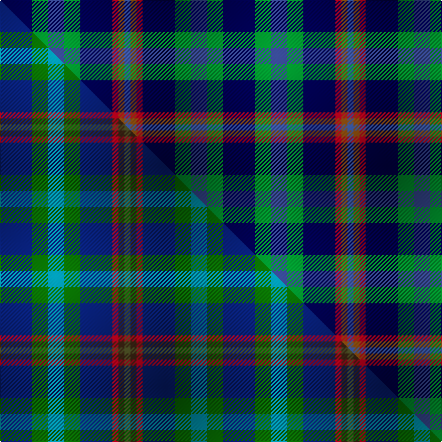

This is one **variant** — a specific cloth: this exact thread count and colourway, with its own
provenance below. It is one weaving of the [sett](/tartans/g/gl/glen-erin/) (the scale-free proportion — the
same cloth at any scale or shade), whose colour order is pattern [BGBGBRRB](/stripes/bgbgbrrb/).

Part of the [Glen Erin](/tartans/g/gl/glen-erin/) tartan — the named design grouping this sett with its other cloths.

Sourced from weddslist.  It is a [8 stripe tartan](/stripes/stripes8/).

Original link [http://www.weddslist.com/cgi-bin/tartans/pg.pl?source=sts](http://www.weddslist.com/cgi-bin/tartans/pg.pl?source=sts)

Dataset <small>— provenance for this record, inherited from the source manifest</small>

<dl class="dataset-prov">
<dt>source</dt><dd><a href="/sources/weddslist/">Weddslist</a></dd>
<dt>data captured from</dt><dd><a href="https://github.com/thetartan/tartan-database/blob/master/data/weddslist/data.csv">https://github.com/thetartan/tartan-database/blob/master/data/weddslist/data.csv</a></dd>
<dt>data date</dt><dd>2016-11-17 <small>(dataset default)</small></dd>
<dt>licence</dt><dd><a href="https://creativecommons.org/licenses/by-nc-nd/4.0/">CC BY-NC-ND 4.0</a></dd>
</dl>

Capture chain <small>— the hands this data passed through, oldest first; each capture carries its own licence</small>

<ol class="capture-chain">
<li><a href="https://www.weddslist.com/tartans/">Weddslist</a> <small>the living privately compiled reference</small></li>
<li><a href="https://github.com/thetartan/tartan-database">thetartan/tartan-database</a> <small>2016-2017</small> · <a href="https://creativecommons.org/licenses/by-nc-nd/4.0/">CC BY-NC-ND 4.0</a> <small>Levko Kravets's frozen compilation — the capture we vendored, and where its CC licence text came from</small></li>
<li>this dictionary <small>captured 2026-06-10 · commit 5bf86c7566</small> <small>each re-capture is a git commit to data/sources</small></li>
</ol>

## Thread count
DB/32 G16 DBi16 G16 DB32 R6 O6 B/6

One full sett is **222 threads**.

## Palette
<table><thead><tr><th>Colour</th><th>Shade</th><th>OKLCh</th></tr></thead><tbody><tr><td>DB</td><td><code style="background-color:#304080;">#304080</code> <small style="color:#888">#304080</small></td><td><small style="color:#888">oklch(39.4% 0.109 270.2)</small></td></tr><tr><td>DB</td><td><code style="background-color:#000050;">#000050</code> <small style="color:#888">#000050</small></td><td><small style="color:#888">oklch(19.5% 0.135 264.1)</small></td></tr><tr><td>B</td><td><code style="background-color:#466CC8;">#466CC8</code> <small style="color:#888">#466CC8</small></td><td><small style="color:#888">oklch(55.1% 0.149 265.0)</small></td></tr><tr><td>G</td><td><code style="background-color:#008B2A;">#008B2A</code> <small style="color:#888">#008B2A</small></td><td><small style="color:#888">oklch(55.4% 0.170 145.9)</small></td></tr><tr><td>O</td><td><code style="background-color:#A65C11;">#A65C11</code> <small style="color:#888">#A65C11</small></td><td><small style="color:#888">oklch(55.0% 0.125 58.3)</small></td></tr><tr><td>R</td><td><code style="background-color:#D60020;">#D60020</code> <small style="color:#888">#D60020</small></td><td><small style="color:#888">oklch(55.2% 0.224 25.5)</small></td></tr></tbody></table>

# Sample pattern

## Compared to the master

This cloth is one sett of its design; the master sett (the exemplar the design is anchored on) is below for comparison.

Its **ΔTartan distance** from the master is **0.42** — the same measure the nearest-tartans table ranks by (0 is identical; a re-scale of the same cloth is near 0, a recolour or a different proportion further).

<figure class="master-compare" style="margin:0">

this sett
master sett ★

<figcaption style="color:#888;font-size:smaller">One weave of this sett against the <a href="/setts/db16dg8t8dg8db16r3do3g3/">master sett ★</a>, split on the diagonal: a shared proportion runs seamlessly across it with only the shades shifting; a different proportion breaks on it.</figcaption>
</figure>

## Nearest tartan variants

The nearest existing variants by ΔTartan distance, with this cloth at the top so the swatches line up against it.

ΔTartan

Threads

Variant

Sett

—

222

<a href="/variants/s8/db16g8dbi8g8db16r3o3b3~x2~db0805267-dbi1604274/">Glen Erin</a>

<a href="/ttd/edit/#slug=db16dg8t8dg8db16r3do3g3~x2~dg1806142-g1903114&amp;base=db16g8dbi8g8db16r3o3b3~x2~db0805267-dbi1604274" title="compare in the TTD">0.42</a>

222

<a href="/variants/s8/db16dg8t8dg8db16r3do3g3~x2~dg1806142-g1903114/">Glen Erin</a>

<a href="/ttd/edit/#slug=dt16dg8db8dg8dt16r3dy3g3~x2~dt1204274-dg1806142-db1406275-g2408144&amp;base=db16g8dbi8g8db16r3o3b3~x2~db0805267-dbi1604274" title="compare in the TTD">0.66</a>

222

<a href="/variants/s8/db16dg8dbi8dg8db16r3dy3g3~x2~db1204274-dg1806142-dbi1406275-g2408144/">Glen Erin Canadian Tartan</a>

<a href="/ttd/edit/#slug=n4dg2w2dg4db10r2db12y3~x2~n1604274-db0805267&amp;base=db16g8dbi8g8db16r3o3b3~x2~db0805267-dbi1604274" title="compare in the TTD">2.05</a>

142

<a href="/variants/s8/dbi4dg2w2dg4db10r2db12y3~x2~dbi1604274-db0805267/">United Services, Planning Association</a>

<a href="/ttd/edit/#slug=db4dg2w2dg4dt10r2dt12y3~x2~db1406275-dt1204274&amp;base=db16g8dbi8g8db16r3o3b3~x2~db0805267-dbi1604274" title="compare in the TTD">2.05</a>

142

<a href="/variants/s8/dbi4dg2w2dg4db10r2db12y3~x2~dbi1406275-db1204274/">United Services Planning Assoc Corporate Tartan</a>

<a href="/ttd/edit/#slug=db2r1db10w1dy4g8y1g2~x4&amp;base=db16g8dbi8g8db16r3o3b3~x2~db0805267-dbi1604274" title="compare in the TTD">2.34</a>

216

<a href="/variants/s8/db2r1db10w1dy4g8y1g2~x4/">Ayrshire District Tartan</a>

<a href="/ttd/edit/#slug=db16k11db24g10y3g17db15k5r6~x2&amp;base=db16g8dbi8g8db16r3o3b3~x2~db0805267-dbi1604274" title="compare in the TTD">2.35</a>

384

<a href="/variants/s9/db16k11db24g10y3g17db15k5r6~x2/">Glackin-McColgan (Personal)</a>

<a href="/ttd/edit/#slug=db2r1db10w1o4g8y1g2~x4&amp;base=db16g8dbi8g8db16r3o3b3~x2~db0805267-dbi1604274" title="compare in the TTD">2.35</a>

216

<a href="/variants/s8/db2r1db10w1o4g8y1g2~x4/">Ayrshire</a>

<a href="/ttd/edit/#slug=dg5t2dg9db19r9ly2~x2&amp;base=db16g8dbi8g8db16r3o3b3~x2~db0805267-dbi1604274" title="compare in the TTD">2.38</a>

170

<a href="/variants/s6/dg5t2dg9db19r9ly2~x2/">Lyle and Scott</a>

<a href="/ttd/edit/#slug=dg5db2dg9k19r9y2~x2~db1406275-k0705267&amp;base=db16g8dbi8g8db16r3o3b3~x2~db0805267-dbi1604274" title="compare in the TTD">2.39</a>

170

<a href="/variants/s6/dg5dbi2dg9db19r9y2~x2~dbi1406275-db0705267/">Lyle and Scott</a>

<a href="/ttd/edit/#slug=db25r10db25w8o6g8y5~x2&amp;base=db16g8dbi8g8db16r3o3b3~x2~db0805267-dbi1604274" title="compare in the TTD">2.74</a>

288

<a href="/variants/s7/db25r10db25w8o6g8y5~x2/">Barneys (Scunthorpe) (Personal)</a>

## Neighbour map

Every grey dot is one of 13656 variants placed by the first two principal components of the ΔTartan feature space (42% of its variance). Red is this tartan; blue dots are its nearest — click one to open its page. The map is a flat projection of a many-dimensional space — [how to read it](/posts/neighbourhood-maps/).

<svg viewBox="0 0 640 380" role="img" style="max-width:100%;height:auto;border:1px solid #e0e0e0;border-radius:4px;display:block" xmlns="http://www.w3.org/2000/svg"><image href="/nn/cloud.v1.png" width="640" height="380"/><a href="/variants/s8/db16dg8t8dg8db16r3do3g3~x2~dg1806142-g1903114/"><circle cx="230.2" cy="242.9" r="4" fill="#3465a4"><title>Glen Erin</title></circle></a><a href="/variants/s8/db16dg8dbi8dg8db16r3dy3g3~x2~db1204274-dg1806142-dbi1406275-g2408144/"><circle cx="244.4" cy="244.9" r="4" fill="#3465a4"><title>Glen Erin Canadian Tartan</title></circle></a><a href="/variants/s8/dbi4dg2w2dg4db10r2db12y3~x2~dbi1604274-db0805267/"><circle cx="230.8" cy="203.0" r="4" fill="#3465a4"><title>United Services, Planning Association</title></circle></a><a href="/variants/s8/dbi4dg2w2dg4db10r2db12y3~x2~dbi1406275-db1204274/"><circle cx="260.6" cy="212.3" r="4" fill="#3465a4"><title>United Services Planning Assoc Corporate Tartan</title></circle></a><a href="/variants/s8/db2r1db10w1dy4g8y1g2~x4/"><circle cx="195.9" cy="180.2" r="4" fill="#3465a4"><title>Ayrshire District Tartan</title></circle></a><a href="/variants/s9/db16k11db24g10y3g17db15k5r6~x2/"><circle cx="179.3" cy="206.6" r="4" fill="#3465a4"><title>Glackin-McColgan (Personal)</title></circle></a><a href="/variants/s8/db2r1db10w1o4g8y1g2~x4/"><circle cx="190.7" cy="176.6" r="4" fill="#3465a4"><title>Ayrshire</title></circle></a><a href="/variants/s6/dg5t2dg9db19r9ly2~x2/"><circle cx="219.2" cy="216.7" r="4" fill="#3465a4"><title>Lyle and Scott</title></circle></a><a href="/variants/s6/dg5dbi2dg9db19r9y2~x2~dbi1406275-db0705267/"><circle cx="219.9" cy="214.6" r="4" fill="#3465a4"><title>Lyle and Scott</title></circle></a><a href="/variants/s7/db25r10db25w8o6g8y5~x2/"><circle cx="204.6" cy="215.3" r="4" fill="#3465a4"><title>Barneys (Scunthorpe) (Personal)</title></circle></a><circle cx="176.5" cy="221.1" r="5" fill="#c00000"/><text x="320" y="376" text-anchor="middle" font-size="11" fill="#999">ground</text><text x="11" y="190" text-anchor="middle" font-size="11" fill="#999" transform="rotate(-90 11 190)">complexity</text></svg>

ID: /variants/s8/db16g8dbi8g8db16r3o3b3~x2~db0805267-dbi1604274/
