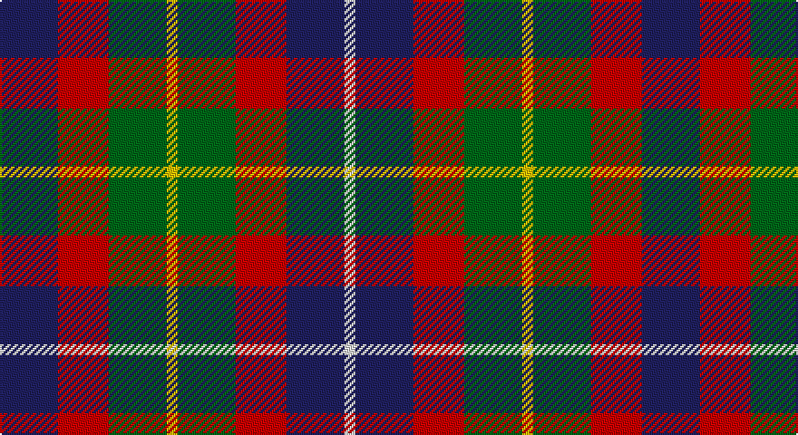

This page is one **sett** — a single exact thread-count. It belongs to the [tartan](/setts/db16r14g16ly3g16r14db16w3/)
(the same proportion at any scale), whose colour order is pattern [BRGYGRBW](/stripes/brgygrbw/).

Part of the [Forrester](/tartans/forrester/) tartan — the named design grouping this sett with its other cloths.

Sourced from register-of-tartans.  It is a [8 stripe tartan](/stripes/stripes8/).

Original link https://www.tartanregister.gov.uk/tartanDetails.aspx?ref=1232

## Also known as

This cloth is also recorded under:

- Forrester / Foster
- James William Forrester of S. Carolina

3 attestations — the source records this cloth was collapsed from (oldest owns this page)

<ul>
<li>01/01/1987 — Forrester (James) (Personal) (register-of-tartans, <a href="https://www.tartanregister.gov.uk/tartanDetails.aspx?ref=1232">record</a>)</li>
<li>pre 2002 — Forrester (James) (Personal) (tartans-authority, <a href="http://www.tartansauthority.com/tartan-ferret/display/2386/">record</a>)</li>
<li>undated — James William Forrester of S. Carolina (weddslist, <a href="http://www.weddslist.com/cgi-bin/tartans/pg.pl?source=sts">record</a>)</li>
</ul>

## Register references

External register numbers recorded for this tartan.

- Scottish Register of Tartans: [1232](https://www.tartanregister.gov.uk/tartanDetails.aspx?ref=1232)
- Scottish Tartans Authority (ITI): 2386
- Scottish Tartans World Register: 2386

## Thread count
DB/32 R28 G32 Y6 G32 R28 DB32 LN/6

One full sett is **354 threads**.

## Palette

Palette: <strong>Tartan Register</strong>
<table><thead><tr><th>Colour</th><th>Threads</th><th>Shade</th><th>Base</th><th>OKLCh</th></tr></thead><tbody><tr><td>DB/</td><td style="text-align:right;font-variant-numeric:tabular-nums">32</td><td><code style="background-color:#202060;">#202060</code> <small style="color:#888">#202060</small></td><td>B <code style="background-color:#2A418A;">#2A418A</code></td><td><small style="color:#888">oklch(28.9% 0.111 276.9)</small></td></tr><tr><td>R</td><td style="text-align:right;font-variant-numeric:tabular-nums">28</td><td><code style="background-color:#C80000;">#C80000</code> <small style="color:#888">#C80000</small></td><td>R <code style="background-color:#CC0000;">#CC0000</code></td><td><small style="color:#888">oklch(52.3% 0.215 29.2)</small></td></tr><tr><td>G</td><td style="text-align:right;font-variant-numeric:tabular-nums">32</td><td><code style="background-color:#006818;">#006818</code> <small style="color:#888">#006818</small></td><td>G <code style="background-color:#006100;">#006100</code></td><td><small style="color:#888">oklch(45.0% 0.142 145.0)</small></td></tr><tr><td>Y</td><td style="text-align:right;font-variant-numeric:tabular-nums">6</td><td><code style="background-color:#E8C000;">#E8C000</code> <small style="color:#888">#E8C000</small></td><td>Y <code style="background-color:#F2BF00;">#F2BF00</code></td><td><small style="color:#888">oklch(81.9% 0.168 93.7)</small></td></tr><tr><td>G</td><td style="text-align:right;font-variant-numeric:tabular-nums">32</td><td><code style="background-color:#006818;">#006818</code> <small style="color:#888">#006818</small></td><td>G <code style="background-color:#006100;">#006100</code></td><td><small style="color:#888">oklch(45.0% 0.142 145.0)</small></td></tr><tr><td>R</td><td style="text-align:right;font-variant-numeric:tabular-nums">28</td><td><code style="background-color:#C80000;">#C80000</code> <small style="color:#888">#C80000</small></td><td>R <code style="background-color:#CC0000;">#CC0000</code></td><td><small style="color:#888">oklch(52.3% 0.215 29.2)</small></td></tr><tr><td>DB</td><td style="text-align:right;font-variant-numeric:tabular-nums">32</td><td><code style="background-color:#202060;">#202060</code> <small style="color:#888">#202060</small></td><td>B <code style="background-color:#2A418A;">#2A418A</code></td><td><small style="color:#888">oklch(28.9% 0.111 276.9)</small></td></tr><tr><td>LN/</td><td style="text-align:right;font-variant-numeric:tabular-nums">6</td><td><code style="background-color:#E0E0E0;">#E0E0E0</code> <small style="color:#888">#E0E0E0</small></td><td>W <code style="background-color:#F7F7F7;">#F7F7F7</code></td><td><small style="color:#888">oklch(90.7% 0.000 89.9)</small></td></tr></tbody></table>

# Sample pattern

## Nearest tartans

The nearest existing variants by ΔTartan distance, with this tartan at the top so the swatches line up against it.

ΔTartan

Tartan

Sett

—

<a href="/ttd/edit/#slug=db16r14g16ly3g16r14db16w3~x2">Forrester (James) (Personal)</a> <a class="nn-out" href="/variants/s8/db16r14g16ly3g16r14db16w3~x2/" title="open its dictionary page">↗</a>

1.13

<a href="/ttd/edit/#slug=o6w2k4dy12k4w2o6r3~x2&amp;base=db16r14g16ly3g16r14db16w3~x2">Strathblane</a> <a class="nn-out" href="/variants/s8/o6w2k4dy12k4w2o6r3~x2/" title="open its dictionary page">↗</a>

1.16

<a href="/ttd/edit/#slug=db8k3db18g6k8g6o12r5o12r3~x2&amp;base=db16r14g16ly3g16r14db16w3~x2">Longford</a> <a class="nn-out" href="/variants/s10/db8k3db18g6k8g6o12r5o12r3~x2/" title="open its dictionary page">↗</a>

1.17

<a href="/ttd/edit/#slug=lo2db4k1db4m4lo4db1~x8&amp;base=db16r14g16ly3g16r14db16w3~x2">Isle of Gigha (District)</a> <a class="nn-out" href="/variants/s7/lo2db4k1db4m4lo4db1~x8/" title="open its dictionary page">↗</a>

1.19

<a href="/variants/s8/dp11y2k10g10lo2~x2/">Selkirk (Personal) Original</a>

1.20

<a href="/variants/s8/g4r3t1k1t3~x4/">Wilson's No.214</a>

1.26

<a href="/ttd/edit/#slug=r3t4k11r11g11do3r3~x4&amp;base=db16r14g16ly3g16r14db16w3~x2">Stewart /Stuart- Fragment Cf 1452 &amp; 1445</a> <a class="nn-out" href="/variants/s7/r3t4k11r11g11do3r3~x4/" title="open its dictionary page">↗</a>

1.31

<a href="/ttd/edit/#slug=g12k2m12k3o12k16o12k3m6~x2&amp;base=db16r14g16ly3g16r14db16w3~x2">Borthwick Family Tartan</a> <a class="nn-out" href="/variants/s9/g12k2m12k3o12k16o12k3m6~x2/" title="open its dictionary page">↗</a>

1.32

<a href="/ttd/edit/#slug=dp11t2k10g10ly3~x2&amp;base=db16r14g16ly3g16r14db16w3~x2">Nobiliary Fraternity</a> <a class="nn-out" href="/variants/s5/dp11t2k10g10ly3~x2/" title="open its dictionary page">↗</a>

1.32

<a href="/variants/s8/k8t3g13dp12ly2~x2/">Wilson's No.176</a>

1.33

<a href="/ttd/edit/#slug=g15dg18db23w4r8~x2&amp;base=db16r14g16ly3g16r14db16w3~x2">Friebe (2014)</a> <a class="nn-out" href="/variants/s5/g15dg18db23w4r8~x2/" title="open its dictionary page">↗</a>

## Neighbour map

Every grey dot is one of 14360 variants placed by the first two principal components of the ΔTartan feature space (44% of its variance). Red is this tartan; blue dots are its nearest — click one to open its page.

<svg viewBox="0 0 640 380" role="img" style="max-width:100%;height:auto;border:1px solid #e0e0e0;border-radius:4px;display:block" xmlns="http://www.w3.org/2000/svg"><image href="/nn/cloud.v1.png" width="640" height="380"/><a href="/variants/s8/o6w2k4dy12k4w2o6r3~x2/"><circle cx="87.3" cy="207.2" r="4" fill="#3465a4"><title>Strathblane</title></circle></a><a href="/variants/s10/db8k3db18g6k8g6o12r5o12r3~x2/"><circle cx="88.1" cy="220.2" r="4" fill="#3465a4"><title>Longford</title></circle></a><a href="/variants/s7/lo2db4k1db4m4lo4db1~x8/"><circle cx="115.1" cy="251.2" r="4" fill="#3465a4"><title>Isle of Gigha (District)</title></circle></a><a href="/variants/s8/dp11y2k10g10lo2~x2/"><circle cx="118.9" cy="237.5" r="4" fill="#3465a4"><title>Selkirk (Personal) Original</title></circle></a><a href="/variants/s8/g4r3t1k1t3~x4/"><circle cx="117.0" cy="251.3" r="4" fill="#3465a4"><title>Wilson's No.214</title></circle></a><a href="/variants/s7/r3t4k11r11g11do3r3~x4/"><circle cx="97.2" cy="234.7" r="4" fill="#3465a4"><title>Stewart /Stuart- Fragment Cf 1452 &amp; 1445</title></circle></a><a href="/variants/s9/g12k2m12k3o12k16o12k3m6~x2/"><circle cx="124.0" cy="223.8" r="4" fill="#3465a4"><title>Borthwick Family Tartan</title></circle></a><a href="/variants/s5/dp11t2k10g10ly3~x2/"><circle cx="87.8" cy="247.3" r="4" fill="#3465a4"><title>Nobiliary Fraternity</title></circle></a><a href="/variants/s8/k8t3g13dp12ly2~x2/"><circle cx="150.3" cy="234.7" r="4" fill="#3465a4"><title>Wilson's No.176</title></circle></a><a href="/variants/s5/g15dg18db23w4r8~x2/"><circle cx="91.0" cy="251.4" r="4" fill="#3465a4"><title>Friebe (2014)</title></circle></a><circle cx="92.7" cy="241.0" r="5" fill="#c00000"/></svg>

ID: /variants/s8/db16r14g16ly3g16r14db16w3~x2/
