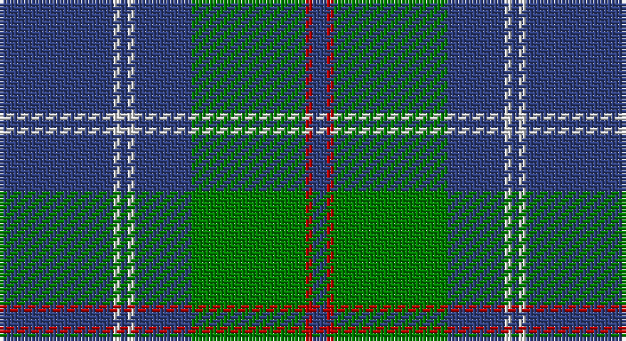

This page is one **sett** — a single exact thread-count. It belongs to the [tartan](/setts/db16w1db1w1db8g16r1db2/)
(the same proportion at any scale), whose colour order is pattern [BRGBWBWB](/stripes/brgbwbwb/).

Sourced from weddslist.  It is a [8 stripe tartan](/stripes/stripes8/).

Original link http://www.weddslist.com/cgi-bin/tartans/pg.pl?source=sts

## Thread count
B/32 LN2 B2 LN2 B16 G32 R2 B/4

One full sett is **148 threads**.

## Palette

Palette: <strong>Tartan Dictionary</strong> <small style="color:#888">(1 of 4 colours)</small>
<table><thead><tr><th>Colour</th><th>Threads</th><th>Shade</th><th>Base</th><th>OKLCh</th></tr></thead><tbody><tr><td>B/</td><td style="text-align:right;font-variant-numeric:tabular-nums">32</td><td><code style="background-color:#304080;">#304080</code> <small style="color:#888">#304080</small></td><td>B <code style="background-color:#2A418A;">#2A418A</code></td><td><small style="color:#888">oklch(39.4% 0.109 270.2)</small></td></tr><tr><td>LN</td><td style="text-align:right;font-variant-numeric:tabular-nums">2</td><td><code style="background-color:#E0E0E0;">#E0E0E0</code> <small style="color:#888">#E0E0E0</small></td><td>W <code style="background-color:#F7F7F7;">#F7F7F7</code></td><td><small style="color:#888">oklch(90.7% 0.000 89.9)</small></td></tr><tr><td>B</td><td style="text-align:right;font-variant-numeric:tabular-nums">2</td><td><code style="background-color:#304080;">#304080</code> <small style="color:#888">#304080</small></td><td>B <code style="background-color:#2A418A;">#2A418A</code></td><td><small style="color:#888">oklch(39.4% 0.109 270.2)</small></td></tr><tr><td>LN</td><td style="text-align:right;font-variant-numeric:tabular-nums">2</td><td><code style="background-color:#E0E0E0;">#E0E0E0</code> <small style="color:#888">#E0E0E0</small></td><td>W <code style="background-color:#F7F7F7;">#F7F7F7</code></td><td><small style="color:#888">oklch(90.7% 0.000 89.9)</small></td></tr><tr><td>B</td><td style="text-align:right;font-variant-numeric:tabular-nums">16</td><td><code style="background-color:#304080;">#304080</code> <small style="color:#888">#304080</small></td><td>B <code style="background-color:#2A418A;">#2A418A</code></td><td><small style="color:#888">oklch(39.4% 0.109 270.2)</small></td></tr><tr><td>G</td><td style="text-align:right;font-variant-numeric:tabular-nums">32</td><td><code style="background-color:#008000;">#008000</code> <small style="color:#888">#008000</small></td><td>G <code style="background-color:#006100;">#006100</code></td><td><small style="color:#888">oklch(52.0% 0.177 142.5)</small></td></tr><tr><td>R</td><td style="text-align:right;font-variant-numeric:tabular-nums">2</td><td><code style="background-color:#C00000;">#C00000</code> <small style="color:#888">#C00000</small></td><td>R <code style="background-color:#CC0000;">#CC0000</code></td><td><small style="color:#888">oklch(50.7% 0.208 29.2)</small></td></tr><tr><td>B/</td><td style="text-align:right;font-variant-numeric:tabular-nums">4</td><td><code style="background-color:#304080;">#304080</code> <small style="color:#888">#304080</small></td><td>B <code style="background-color:#2A418A;">#2A418A</code></td><td><small style="color:#888">oklch(39.4% 0.109 270.2)</small></td></tr></tbody></table>

# Sample pattern

## Nearest tartans

The nearest existing variants by ΔTartan distance, with this tartan at the top so the swatches line up against it.

ΔTartan

Tartan

Sett

—

<a href="/ttd/edit/#slug=db16w1db1w1db8g16r1db2~x2">Roxburgh</a> <a class="nn-out" href="/variants/s8/db16w1db1w1db8g16r1db2~x2/" title="open its dictionary page">↗</a>

0.73

<a href="/ttd/edit/#slug=db3r3g18db16w2db26r3g3~x2&amp;base=db16w1db1w1db8g16r1db2~x2">MacHardy</a> <a class="nn-out" href="/variants/s8/db3r3g18db16w2db26r3g3~x2/" title="open its dictionary page">↗</a>

1.08

<a href="/ttd/edit/#slug=g28r2g2r2g8db24ly3r2~x2&amp;base=db16w1db1w1db8g16r1db2~x2">Leatherneck U.S.Marine Corps Corporate Tartan</a> <a class="nn-out" href="/variants/s8/g28r2g2r2g8db24ly3r2~x2/" title="open its dictionary page">↗</a>

1.09

<a href="/ttd/edit/#slug=g23db3k8db4g4db56ly8&amp;base=db16w1db1w1db8g16r1db2~x2">Tern House</a> <a class="nn-out" href="/variants/s7/g23db3k8db4g4db56ly8/" title="open its dictionary page">↗</a>

1.11

<a href="/ttd/edit/#slug=g40r3g4r3g12db32lo4r3~x2&amp;base=db16w1db1w1db8g16r1db2~x2">US Marine Corps</a> <a class="nn-out" href="/variants/s8/g40r3g4r3g12db32lo4r3~x2/" title="open its dictionary page">↗</a>

1.12

<a href="/ttd/edit/#slug=dg40r3dg4r3dg12db32ly4r3~x2&amp;base=db16w1db1w1db8g16r1db2~x2">U.S. Marine Corps (Military?)</a> <a class="nn-out" href="/variants/s8/dg40r3dg4r3dg12db32ly4r3~x2/" title="open its dictionary page">↗</a>

1.13

<a href="/ttd/edit/#slug=db1k1db8ly1g12ly1db8k1db1~x2&amp;base=db16w1db1w1db8g16r1db2~x2">Rowan</a> <a class="nn-out" href="/variants/s9/db1k1db8ly1g12ly1db8k1db1~x2/" title="open its dictionary page">↗</a>

1.18

<a href="/ttd/edit/#slug=b64k3g14k4b4k12lo4~x2&amp;base=db16w1db1w1db8g16r1db2~x2">Murray of Elibank</a> <a class="nn-out" href="/variants/s7/b64k3g14k4b4k12lo4~x2/" title="open its dictionary page">↗</a>

1.19

<a href="/ttd/edit/#slug=r2db32g14db5g16w2~x2&amp;base=db16w1db1w1db8g16r1db2~x2">Connacht Irish District Tartan</a> <a class="nn-out" href="/variants/s6/r2db32g14db5g16w2~x2/" title="open its dictionary page">↗</a>

1.22

<a href="/ttd/edit/#slug=dt1r1dt10t1dt1t5dt1w1~x6&amp;base=db16w1db1w1db8g16r1db2~x2">A2 (Personal)</a> <a class="nn-out" href="/variants/s8/dt1r1dt10t1dt1t5dt1w1~x6/" title="open its dictionary page">↗</a>

1.22

<a href="/ttd/edit/#slug=y8ly4y35db2lt8db2y4db21y4~x2&amp;base=db16w1db1w1db8g16r1db2~x2">Bedford Academy</a> <a class="nn-out" href="/variants/s9/y8ly4y35db2lt8db2y4db21y4~x2/" title="open its dictionary page">↗</a>

## Neighbour map

Every grey dot is one of 14360 variants placed by the first two principal components of the ΔTartan feature space (44% of its variance). Red is this tartan; blue dots are its nearest — click one to open its page.

<svg viewBox="0 0 640 380" role="img" style="max-width:100%;height:auto;border:1px solid #e0e0e0;border-radius:4px;display:block" xmlns="http://www.w3.org/2000/svg"><image href="/nn/cloud.v1.png" width="640" height="380"/><a href="/variants/s8/db3r3g18db16w2db26r3g3~x2/"><circle cx="360.0" cy="198.7" r="4" fill="#3465a4"><title>MacHardy</title></circle></a><a href="/variants/s8/g28r2g2r2g8db24ly3r2~x2/"><circle cx="330.0" cy="181.0" r="4" fill="#3465a4"><title>Leatherneck U.S.Marine Corps Corporate Tartan</title></circle></a><a href="/variants/s7/g23db3k8db4g4db56ly8/"><circle cx="370.7" cy="175.4" r="4" fill="#3465a4"><title>Tern House</title></circle></a><a href="/variants/s8/g40r3g4r3g12db32lo4r3~x2/"><circle cx="343.4" cy="189.5" r="4" fill="#3465a4"><title>US Marine Corps</title></circle></a><a href="/variants/s8/dg40r3dg4r3dg12db32ly4r3~x2/"><circle cx="342.1" cy="189.2" r="4" fill="#3465a4"><title>U.S. Marine Corps (Military?)</title></circle></a><a href="/variants/s9/db1k1db8ly1g12ly1db8k1db1~x2/"><circle cx="296.9" cy="177.8" r="4" fill="#3465a4"><title>Rowan</title></circle></a><a href="/variants/s7/b64k3g14k4b4k12lo4~x2/"><circle cx="413.1" cy="162.1" r="4" fill="#3465a4"><title>Murray of Elibank</title></circle></a><a href="/variants/s6/r2db32g14db5g16w2~x2/"><circle cx="323.1" cy="202.9" r="4" fill="#3465a4"><title>Connacht Irish District Tartan</title></circle></a><a href="/variants/s8/dt1r1dt10t1dt1t5dt1w1~x6/"><circle cx="371.9" cy="194.4" r="4" fill="#3465a4"><title>A2 (Personal)</title></circle></a><a href="/variants/s9/y8ly4y35db2lt8db2y4db21y4~x2/"><circle cx="336.5" cy="159.7" r="4" fill="#3465a4"><title>Bedford Academy</title></circle></a><circle cx="368.9" cy="181.2" r="5" fill="#c00000"/></svg>

ID: /variants/s8/db16w1db1w1db8g16r1db2~x2/
