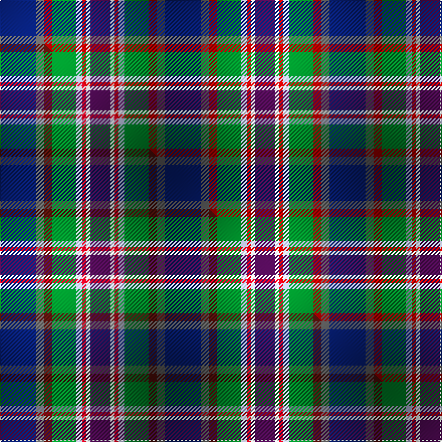

This is one **variant** — a specific cloth: this exact thread count and colourway, with its own
provenance below. It is one weaving of the [sett](/setts/db18n4r4g12lb3ri2w2dp10/) (the scale-free proportion — the
same cloth at any scale or shade), whose colour order is pattern [BBRGWRWB](/stripes/bbrgwrwb/).

Part of the [Serco Caledonian Sleeper](/tartans/serco-caledonian-sleeper/) tartan — the named design grouping this sett with its other cloths.

Sourced from tartans-authority.  It is a [8 stripe tartan](/stripes/stripes8/).

Original link [https://www.tartanregister.gov.uk/tartanDetails.aspx?ref=11233](https://www.tartanregister.gov.uk/tartanDetails.aspx?ref=11233)

Dataset <small>— provenance for this record, inherited from the source manifest</small>

<dl class="dataset-prov">
<dt>source</dt><dd><a href="/sources/tartans-authority/">Scottish Tartans Authority</a></dd>
<dt>data captured from</dt><dd><a href="https://github.com/thetartan/tartan-database/blob/master/data/tartans-authority/data.csv">https://github.com/thetartan/tartan-database/blob/master/data/tartans-authority/data.csv</a></dd>
<dt>data date</dt><dd>2015 <small>(this record)</small></dd>
<dt>licence</dt><dd><a href="https://creativecommons.org/licenses/by-nc-nd/4.0/">CC BY-NC-ND 4.0</a></dd>
</dl>

Capture chain <small>— the hands this data passed through, oldest first; each capture carries its own licence</small>

<ol class="capture-chain">
<li><a href="https://www.tartansauthority.com/">Scottish Tartans Authority</a> <small>the heritage body's archive — its tartan-ferret record browser is retired (links repaired to the SRT, above)</small></li>
<li><a href="https://github.com/thetartan/tartan-database">thetartan/tartan-database</a> <small>2016-2017</small> · <a href="https://creativecommons.org/licenses/by-nc-nd/4.0/">CC BY-NC-ND 4.0</a> <small>Levko Kravets's frozen compilation — the capture we vendored, and where its CC licence text came from</small></li>
<li>this dictionary <small>captured 2026-06-10 · commit 5bf86c7566</small> <small>each re-capture is a git commit to data/sources</small></li>
</ol>

## Register references

External register numbers recorded for this tartan.

- Scottish Register of Tartans: [11233](https://www.tartanregister.gov.uk/tartanDetails?ref=11233)
- Scottish Tartans Authority (ITI): 11233

## Thread count
DB/36 N8 R8 G24 LB6 Ri4 W4 DP/20

One full sett is **164 threads**.

## Palette
<table><thead><tr><th>Colour</th><th>Shade</th><th>OKLCh</th></tr></thead><tbody><tr><td>DB</td><td><code style="background-color:#082077;">#082077</code> <small style="color:#888">#082077</small></td><td><small style="color:#888">oklch(30.0% 0.149 265.1)</small></td></tr><tr><td>R</td><td><code style="background-color:#A00000;">#A00000</code> <small style="color:#888">#A00000</small></td><td><small style="color:#888">oklch(44.3% 0.182 29.2)</small></td></tr><tr><td>G</td><td><code style="background-color:#008B2A;">#008B2A</code> <small style="color:#888">#008B2A</small></td><td><small style="color:#888">oklch(55.4% 0.170 145.9)</small></td></tr><tr><td>LB</td><td><code style="background-color:#B5BBDE;">#B5BBDE</code> <small style="color:#888">#B5BBDE</small></td><td><small style="color:#888">oklch(79.9% 0.050 277.6)</small></td></tr><tr><td>N</td><td><code style="background-color:#636363;">#636363</code> <small style="color:#888">#636363</small></td><td><small style="color:#888">oklch(50.0% 0.000 89.9)</small></td></tr><tr><td>DP</td><td><code style="background-color:#4B0B4F;">#4B0B4F</code> <small style="color:#888">#4B0B4F</small></td><td><small style="color:#888">oklch(30.1% 0.125 325.4)</small></td></tr><tr><td>R</td><td><code style="background-color:#C80000;">#C80000</code> <small style="color:#888">#C80000</small></td><td><small style="color:#888">oklch(52.3% 0.215 29.2)</small></td></tr><tr><td>W</td><td><code style="background-color:#F7F7F7;">#F7F7F7</code> <small style="color:#888">#F7F7F7</small></td><td><small style="color:#888">oklch(97.6% 0.000 89.9)</small></td></tr></tbody></table>

# Sample pattern

## Compared to the master

This cloth is one sett of its design; the master sett (the exemplar the design is anchored on) is below for comparison.

Its **ΔTartan distance** from the master is **0.03** — the same measure the nearest-tartans table ranks by (0 is identical; a re-scale of the same cloth is near 0, a recolour or a different proportion further).

<figure class="master-compare" style="margin:0">

this sett
master sett ★

<figcaption style="color:#888;font-size:smaller">One weave of this sett against the <a href="/setts/db18n4dr4g12lb3r2w2dp10/">master sett ★</a>, split on the diagonal: a shared proportion runs seamlessly across it with only the shades shifting; a different proportion breaks on it.</figcaption>
</figure>

## Nearest tartan variants

The nearest existing variants by ΔTartan distance, with this cloth at the top so the swatches line up against it.

ΔTartan

Threads

Variant

Sett

—

164

<a href="/variants/s8/db18n4r4g12lb3ri2w2dp10~x2~r1807033-ri2109032/">Serco Caledonian Sleeper</a>

<a href="/ttd/edit/#slug=db18n4dr4g12lb3r2w2dp10~x2&amp;base=db18n4r4g12lb3ri2w2dp10~x2~r1807033-ri2109032" title="compare in the TTD">0.03</a>

164

<a href="/variants/s8/db18n4dr4g12lb3r2w2dp10~x2/">Serco Caledonian Sleeper</a>

<a href="/ttd/edit/#slug=r3y2g12dp12db14w3~x2&amp;base=db18n4r4g12lb3ri2w2dp10~x2~r1807033-ri2109032" title="compare in the TTD">1.54</a>

172

<a href="/variants/s6/r3y2g12dp12db14w3~x2/">Jamestown Parish Church (Corporate)</a>

<a href="/ttd/edit/#slug=t32g5lb8db4dp5w5k5ly8~x2~t2205244-db1208266&amp;base=db18n4r4g12lb3ri2w2dp10~x2~r1807033-ri2109032" title="compare in the TTD">1.95</a>

208

<a href="/variants/s8/t32g5lb8db4dp5w5k5ly8~x2~t2205244-db1208266/">Fremsaeter, Jenny (Personal)</a>

<a href="/ttd/edit/#slug=k3n3g15db15dp5r3y2dp1~x2~n1604274-db0805267-dp1607335-r2807041&amp;base=db18n4r4g12lb3ri2w2dp10~x2~r1807033-ri2109032" title="compare in the TTD">2.65</a>

180

<a href="/variants/s8/k3dbi3g15db15dp5r3y2dp1~x2~dbi1604274-db0805267-dp1607335-r2807041/">Young</a>

<a href="/ttd/edit/#slug=r3dt20db20g2lr4lri17w3~x2~lr3001120-lri3001240&amp;base=db18n4r4g12lb3ri2w2dp10~x2~r1807033-ri2109032" title="compare in the TTD">2.71</a>

264

<a href="/variants/s7/r3dt20db20g2lr4lri17w3~x2~lr3001120-lri3001240/">Silversea</a>

<a href="/ttd/edit/#slug=db60lb5w4o12g42dp12lb5dp12&amp;base=db18n4r4g12lb3ri2w2dp10~x2~r1807033-ri2109032" title="compare in the TTD">3.19</a>

232

<a href="/variants/s8/db60lb5w4o12g42dp12lb5dp12/">St Columba</a>

<a href="/ttd/edit/#slug=r2b22dy4lr3dg7ly2dg4lr2dg9dp6ly2dp4lr2~x2&amp;base=db18n4r4g12lb3ri2w2dp10~x2~r1807033-ri2109032" title="compare in the TTD">3.23</a>

268

<a href="/variants/s13/r2b22dy4lr3dg7ly2dg4lr2dg9dp6ly2dp4lr2~x2/">Man, Isle of</a>

<a href="/ttd/edit/#slug=db20y1w1ly3g4dg10n4y1dp4~x2~g1903114-dg1806142&amp;base=db18n4r4g12lb3ri2w2dp10~x2~r1807033-ri2109032" title="compare in the TTD">3.28</a>

144

<a href="/variants/s9/db20y1w1ly3g4dg10n4y1dp4~x2~g1903114-dg1806142/">St. Columba (two greens) (Corporate)</a>

<a href="/ttd/edit/#slug=k9lo6db9n2o3n2dg17db17lb5~x2~lo2806085-o2404072&amp;base=db18n4r4g12lb3ri2w2dp10~x2~r1807033-ri2109032" title="compare in the TTD">3.31</a>

252

<a href="/variants/s9/k9ly6db9n2o3n2dg17db17lb5~x2~ly2806085-o2404072/">Coats (New Zealand)</a>

<a href="/ttd/edit/#slug=dp2g6r1y1db3b10w1~x2&amp;base=db18n4r4g12lb3ri2w2dp10~x2~r1807033-ri2109032" title="compare in the TTD">3.32</a>

90

<a href="/variants/s7/dp2g6r1y1db3b10w1~x2/">Manx National</a>

## Neighbour map

Every grey dot is one of 13621 variants placed by the first two principal components of the ΔTartan feature space (42% of its variance). Red is this tartan; blue dots are its nearest — click one to open its page.

<svg viewBox="0 0 640 380" role="img" style="max-width:100%;height:auto;border:1px solid #e0e0e0;border-radius:4px;display:block" xmlns="http://www.w3.org/2000/svg"><image href="/nn/cloud.v1.png" width="640" height="380"/><a href="/variants/s8/db18n4dr4g12lb3r2w2dp10~x2/"><circle cx="98.2" cy="169.1" r="4" fill="#3465a4"><title>Serco Caledonian Sleeper</title></circle></a><a href="/variants/s6/r3y2g12dp12db14w3~x2/"><circle cx="105.6" cy="220.1" r="4" fill="#3465a4"><title>Jamestown Parish Church (Corporate)</title></circle></a><a href="/variants/s8/t32g5lb8db4dp5w5k5ly8~x2~t2205244-db1208266/"><circle cx="106.6" cy="136.0" r="4" fill="#3465a4"><title>Fremsaeter, Jenny (Personal)</title></circle></a><a href="/variants/s8/k3dbi3g15db15dp5r3y2dp1~x2~dbi1604274-db0805267-dp1607335-r2807041/"><circle cx="102.4" cy="131.4" r="4" fill="#3465a4"><title>Young</title></circle></a><a href="/variants/s7/r3dt20db20g2lr4lri17w3~x2~lr3001120-lri3001240/"><circle cx="101.0" cy="176.2" r="4" fill="#3465a4"><title>Silversea</title></circle></a><a href="/variants/s8/db60lb5w4o12g42dp12lb5dp12/"><circle cx="188.3" cy="152.2" r="4" fill="#3465a4"><title>St Columba</title></circle></a><a href="/variants/s13/r2b22dy4lr3dg7ly2dg4lr2dg9dp6ly2dp4lr2~x2/"><circle cx="121.8" cy="135.5" r="4" fill="#3465a4"><title>Man, Isle of</title></circle></a><a href="/variants/s9/db20y1w1ly3g4dg10n4y1dp4~x2~g1903114-dg1806142/"><circle cx="205.6" cy="125.6" r="4" fill="#3465a4"><title>St. Columba (two greens) (Corporate)</title></circle></a><a href="/variants/s9/k9ly6db9n2o3n2dg17db17lb5~x2~ly2806085-o2404072/"><circle cx="90.4" cy="168.5" r="4" fill="#3465a4"><title>Coats (New Zealand)</title></circle></a><a href="/variants/s7/dp2g6r1y1db3b10w1~x2/"><circle cx="180.6" cy="172.9" r="4" fill="#3465a4"><title>Manx National</title></circle></a><circle cx="89.0" cy="162.6" r="5" fill="#c00000"/><text x="320" y="376" text-anchor="middle" font-size="11" fill="#999">ground</text><text x="11" y="190" text-anchor="middle" font-size="11" fill="#999" transform="rotate(-90 11 190)">complexity</text></svg>

ID: /variants/s8/db18n4r4g12lb3ri2w2dp10~x2~r1807033-ri2109032/
