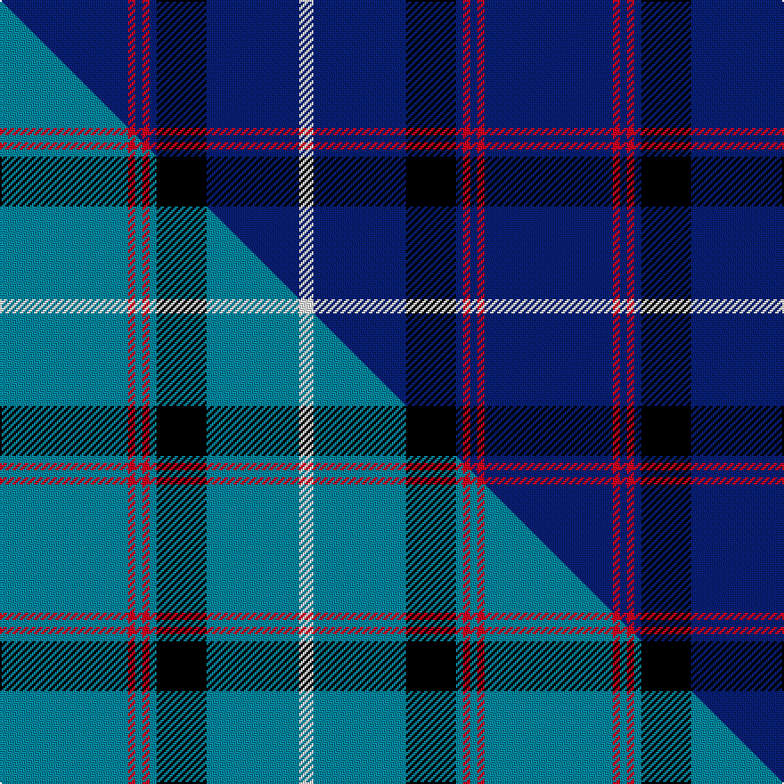

This page is one **sett** — a single exact thread-count. It belongs to the [tartan](/setts/db18r1db1r1db1k7db13w2/)
(the same proportion at any scale), whose colour order is pattern [BRBRBKBW](/stripes/brbrbkbw/).

Part of the [Tokyo Bluebells](/tartans/tokyo-bluebells/) tartan — the named design grouping this sett with its other cloths.

Sourced from weddslist.  It is a [8 stripe tartan](/stripes/stripes8/).

Original link http://www.weddslist.com/cgi-bin/tartans/pg.pl?source=sts

## Thread count
DB/72 R4 DB4 R4 DB4 K28 DB52 W/8

One full sett is **272 threads**.

## Palette
<table><thead><tr><th>Colour</th><th>Shade</th><th>OKLCh</th></tr></thead><tbody><tr><td>DB</td><td><code style="background-color:#082077;">#082077</code> <small style="color:#888">#082077</small></td><td><small style="color:#888">oklch(30.0% 0.149 265.1)</small></td></tr><tr><td>K</td><td><code style="background-color:#000000;">#000000</code> <small style="color:#888">#000000</small></td><td><small style="color:#888">oklch(0.0% 0.000 0.0)</small></td></tr><tr><td>W</td><td><code style="background-color:#F7F7F7;">#F7F7F7</code> <small style="color:#888">#F7F7F7</small></td><td><small style="color:#888">oklch(97.6% 0.000 89.9)</small></td></tr><tr><td>R</td><td><code style="background-color:#D60020;">#D60020</code> <small style="color:#888">#D60020</small></td><td><small style="color:#888">oklch(55.2% 0.224 25.5)</small></td></tr></tbody></table>

# Sample pattern

## Compared to the master

This cloth is one sett of its design; the master sett (the exemplar the design is anchored on) is below for comparison.

Its **ΔTartan distance** from the master is **0.22** — the same measure the nearest-tartans table ranks by (0 is identical; a re-scale of the same cloth is near 0, a recolour or a different proportion further).

<figure class="master-compare" style="margin:0">

this sett
master sett ★

<figcaption style="color:#888;font-size:smaller">One weave of this sett against the <a href="/setts/t18r1t1r1t1k7t13w2/">master sett ★</a>, split on the diagonal: a shared proportion runs seamlessly across it with only the shades shifting; a different proportion breaks on it.</figcaption>
</figure>

## Nearest tartan variants

The nearest existing variants by ΔTartan distance, with this cloth at the top so the swatches line up against it.

ΔTartan

Threads

Variant

Sett

—

272

<a href="/variants/s8/db18r1db1r1db1k7db13w2~x4/">Tokyo Bluebells</a>

<a href="/ttd/edit/#slug=r5db20r3db20w6db3lb2db1~x2&amp;base=db18r1db1r1db1k7db13w2~x4" title="compare in the TTD">1.02</a>

228

<a href="/variants/s8/r5db20r3db20w6db3lb2db1~x2/">Masai Shuka 29 (Artefact)</a>

<a href="/ttd/edit/#slug=db73g16db10r8db10k4db10w2~x2&amp;base=db18r1db1r1db1k7db13w2~x4" title="compare in the TTD">1.04</a>

382

<a href="/variants/s8/db73g16db10r8db10k4db10w2~x2/">Scotch Whisky Heritage Centre</a>

<a href="/ttd/edit/#slug=db73g16db10r8db10k4db10w2&amp;base=db18r1db1r1db1k7db13w2~x4" title="compare in the TTD">1.04</a>

191

<a href="/variants/s8/db73g16db10r8db10k4db10w2/">Scotch Whisky, Heritage</a>

<a href="/ttd/edit/#slug=g8db13w1db40r5db40w1db13g8k4~x2&amp;base=db18r1db1r1db1k7db13w2~x4" title="compare in the TTD">1.64</a>

508

<a href="/variants/s10/g8db13w1db40r5db40w1db13g8k4~x2/">London Scottish Rugby Club Corporate Sport Tartan</a>

<a href="/ttd/edit/#slug=db48w2db7w2db7w2db20lb11r2~x2&amp;base=db18r1db1r1db1k7db13w2~x4" title="compare in the TTD">1.69</a>

304

<a href="/variants/s9/db48w2db7w2db7w2db20lb11r2~x2/">RAAF #4</a>

<a href="/ttd/edit/#slug=y1db2w1db15k4y1db1y1db5w1~x4&amp;base=db18r1db1r1db1k7db13w2~x4" title="compare in the TTD">1.77</a>

248

<a href="/variants/s10/y1db2w1db15k4y1db1y1db5w1~x4/">SPA Association (Corporate)</a>

<a href="/ttd/edit/#slug=db42k6db3k3db3w5db17w7dy10k3~x2&amp;base=db18r1db1r1db1k7db13w2~x4" title="compare in the TTD">1.83</a>

306

<a href="/variants/s10/db42k6db3k3db3w5db17w7dy10k3~x2/">California Riverside, University of (Corporate)</a>

<a href="/ttd/edit/#slug=db42k6db3k3db3w5db17w7ly10k3~x2&amp;base=db18r1db1r1db1k7db13w2~x4" title="compare in the TTD">1.83</a>

306

<a href="/variants/s10/db42k6db3k3db3w5db17w7ly10k3~x2/">California Riverside, Uni. (Corp)</a>

<a href="/ttd/edit/#slug=db35k10db4w2db3r2~x2&amp;base=db18r1db1r1db1k7db13w2~x4" title="compare in the TTD">1.94</a>

150

<a href="/variants/s6/db35k10db4w2db3r2~x2/">Laidlaw's Highland Drovers</a>

<a href="/ttd/edit/#slug=db35k10db4w2db3r2y2~x2&amp;base=db18r1db1r1db1k7db13w2~x4" title="compare in the TTD">1.95</a>

158

<a href="/variants/s7/db35k10db4w2db3r2y2~x2/">Laidlaw's Highland Drovers (Corp)</a>

## Neighbour map

Every grey dot is one of 13620 variants placed by the first two principal components of the ΔTartan feature space (42% of its variance). Red is this tartan; blue dots are its nearest — click one to open its page.

<svg viewBox="0 0 640 380" role="img" style="max-width:100%;height:auto;border:1px solid #e0e0e0;border-radius:4px;display:block" xmlns="http://www.w3.org/2000/svg"><image href="/nn/cloud.v1.png" width="640" height="380"/><a href="/variants/s8/r5db20r3db20w6db3lb2db1~x2/"><circle cx="417.0" cy="153.2" r="4" fill="#3465a4"><title>Masai Shuka 29 (Artefact)</title></circle></a><a href="/variants/s8/db73g16db10r8db10k4db10w2~x2/"><circle cx="481.2" cy="97.2" r="4" fill="#3465a4"><title>Scotch Whisky Heritage Centre</title></circle></a><a href="/variants/s8/db73g16db10r8db10k4db10w2/"><circle cx="481.2" cy="97.2" r="4" fill="#3465a4"><title>Scotch Whisky, Heritage</title></circle></a><a href="/variants/s10/g8db13w1db40r5db40w1db13g8k4~x2/"><circle cx="487.8" cy="101.3" r="4" fill="#3465a4"><title>London Scottish Rugby Club Corporate Sport Tartan</title></circle></a><a href="/variants/s9/db48w2db7w2db7w2db20lb11r2~x2/"><circle cx="505.7" cy="128.8" r="4" fill="#3465a4"><title>RAAF #4</title></circle></a><a href="/variants/s10/y1db2w1db15k4y1db1y1db5w1~x4/"><circle cx="391.8" cy="124.8" r="4" fill="#3465a4"><title>SPA Association (Corporate)</title></circle></a><a href="/variants/s10/db42k6db3k3db3w5db17w7dy10k3~x2/"><circle cx="327.1" cy="133.9" r="4" fill="#3465a4"><title>California Riverside, University of (Corporate)</title></circle></a><a href="/variants/s10/db42k6db3k3db3w5db17w7ly10k3~x2/"><circle cx="314.7" cy="130.8" r="4" fill="#3465a4"><title>California Riverside, Uni. (Corp)</title></circle></a><a href="/variants/s6/db35k10db4w2db3r2~x2/"><circle cx="452.5" cy="145.5" r="4" fill="#3465a4"><title>Laidlaw's Highland Drovers</title></circle></a><a href="/variants/s7/db35k10db4w2db3r2y2~x2/"><circle cx="412.0" cy="121.1" r="4" fill="#3465a4"><title>Laidlaw's Highland Drovers (Corp)</title></circle></a><circle cx="431.7" cy="139.3" r="5" fill="#c00000"/><text x="320" y="376" text-anchor="middle" font-size="11" fill="#999">ground</text><text x="11" y="190" text-anchor="middle" font-size="11" fill="#999" transform="rotate(-90 11 190)">complexity</text></svg>

ID: /variants/s8/db18r1db1r1db1k7db13w2~x4/
