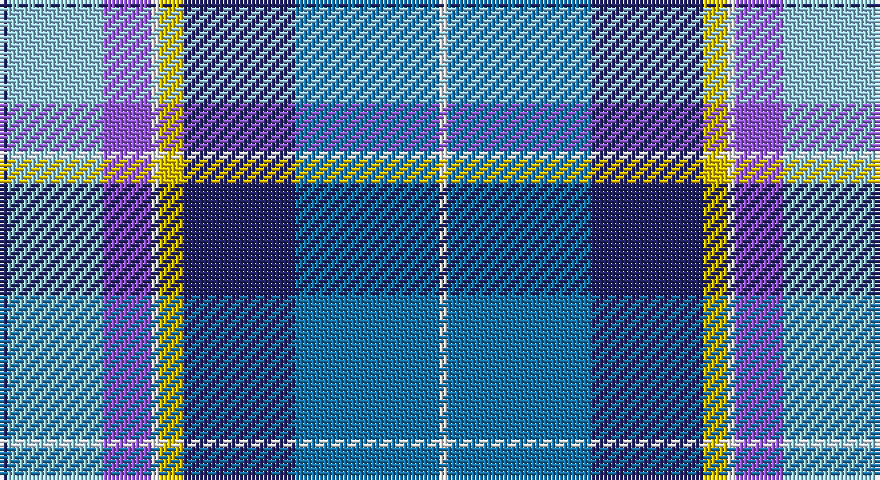

This page is one **sett** — a single exact thread-count. It belongs to the [tartan](/setts/db1lb12p6w1ly3db14b18w1/)
(the same proportion at any scale), whose colour order is pattern [BWBWYBBW](/stripes/bwbwybbw/).

Sourced from tartans-authority.  It is a [8 stripe tartan](/stripes/stripes8/).

Original link http://www.tartansauthority.com/tartan-ferret/display/11029/

## Register references

External register numbers recorded for this tartan.

- Scottish Register of Tartans: [11029](https://www.tartanregister.gov.uk/tartanDetails?ref=11029)
- Scottish Tartans Authority (ITI): 11029

## Thread count
DB/2 LB24 P12 W2 Y6 DB28 B36 W/2

One full sett is **220 threads**.

## Palette

Palette: <strong>Tartan Register</strong>
<table><thead><tr><th>Colour</th><th>Threads</th><th>Shade</th><th>Base</th><th>OKLCh</th></tr></thead><tbody><tr><td>DB/</td><td style="text-align:right;font-variant-numeric:tabular-nums">2</td><td><code style="background-color:#202060;">#202060</code> <small style="color:#888">#202060</small></td><td>B <code style="background-color:#2A418A;">#2A418A</code></td><td><small style="color:#888">oklch(28.9% 0.111 276.9)</small></td></tr><tr><td>LB</td><td style="text-align:right;font-variant-numeric:tabular-nums">24</td><td><code style="background-color:#98C8E8;">#98C8E8</code> <small style="color:#888">#98C8E8</small></td><td>W <code style="background-color:#F7F7F7;">#F7F7F7</code></td><td><small style="color:#888">oklch(81.0% 0.068 237.9)</small></td></tr><tr><td>P</td><td style="text-align:right;font-variant-numeric:tabular-nums">12</td><td><code style="background-color:#9058D8;">#9058D8</code> <small style="color:#888">#9058D8</small></td><td>B <code style="background-color:#2A418A;">#2A418A</code></td><td><small style="color:#888">oklch(58.4% 0.190 300.8)</small></td></tr><tr><td>W</td><td style="text-align:right;font-variant-numeric:tabular-nums">2</td><td><code style="background-color:#FCFCFC;">#FCFCFC</code> <small style="color:#888">#FCFCFC</small></td><td>W <code style="background-color:#F7F7F7;">#F7F7F7</code></td><td><small style="color:#888">oklch(99.1% 0.000 89.9)</small></td></tr><tr><td>Y</td><td style="text-align:right;font-variant-numeric:tabular-nums">6</td><td><code style="background-color:#E8C000;">#E8C000</code> <small style="color:#888">#E8C000</small></td><td>Y <code style="background-color:#F2BF00;">#F2BF00</code></td><td><small style="color:#888">oklch(81.9% 0.168 93.7)</small></td></tr><tr><td>DB</td><td style="text-align:right;font-variant-numeric:tabular-nums">28</td><td><code style="background-color:#202060;">#202060</code> <small style="color:#888">#202060</small></td><td>B <code style="background-color:#2A418A;">#2A418A</code></td><td><small style="color:#888">oklch(28.9% 0.111 276.9)</small></td></tr><tr><td>B</td><td style="text-align:right;font-variant-numeric:tabular-nums">36</td><td><code style="background-color:#1870A4;">#1870A4</code> <small style="color:#888">#1870A4</small></td><td>B <code style="background-color:#2A418A;">#2A418A</code></td><td><small style="color:#888">oklch(52.2% 0.113 241.2)</small></td></tr><tr><td>W/</td><td style="text-align:right;font-variant-numeric:tabular-nums">2</td><td><code style="background-color:#FCFCFC;">#FCFCFC</code> <small style="color:#888">#FCFCFC</small></td><td>W <code style="background-color:#F7F7F7;">#F7F7F7</code></td><td><small style="color:#888">oklch(99.1% 0.000 89.9)</small></td></tr></tbody></table>

# Sample pattern

## Nearest tartans

The nearest existing variants by ΔTartan distance, with this tartan at the top so the swatches line up against it.

ΔTartan

Tartan

Sett

—

<a href="/ttd/edit/#slug=db1lb12p6w1ly3db14b18w1~x2">Ancient Gathering</a> <a class="nn-out" href="/variants/s8/db1lb12p6w1ly3db14b18w1~x2/" title="open its dictionary page">↗</a>

1.12

<a href="/ttd/edit/#slug=lo4r2b32k10dp4lb21dp2~x2&amp;base=db1lb12p6w1ly3db14b18w1~x2">Dignan School of Dancing</a> <a class="nn-out" href="/variants/s7/lo4r2b32k10dp4lb21dp2~x2/" title="open its dictionary page">↗</a>

1.15

<a href="/ttd/edit/#slug=db28r3w3r3w3r3db14k12t38ly8&amp;base=db1lb12p6w1ly3db14b18w1~x2">GYL (Personal)</a> <a class="nn-out" href="/variants/s10/db28r3w3r3w3r3db14k12t38ly8/" title="open its dictionary page">↗</a>

1.17

<a href="/ttd/edit/#slug=db4w3db17lb10k1dp5k1lb6dg3~x2&amp;base=db1lb12p6w1ly3db14b18w1~x2">Queen Margaret University</a> <a class="nn-out" href="/variants/s9/db4w3db17lb10k1dp5k1lb6dg3~x2/" title="open its dictionary page">↗</a>

1.21

<a href="/ttd/edit/#slug=db1t12m6w1lo3db14dt18w1~x2&amp;base=db1lb12p6w1ly3db14b18w1~x2">Ancient Gathering</a> <a class="nn-out" href="/variants/s8/db1t12m6w1lo3db14dt18w1~x2/" title="open its dictionary page">↗</a>

1.28

<a href="/ttd/edit/#slug=k16w6k4b64m19k8g42ly6&amp;base=db1lb12p6w1ly3db14b18w1~x2">Unidentified (Woven sample)</a> <a class="nn-out" href="/variants/s8/k16w6k4b64m19k8g42ly6/" title="open its dictionary page">↗</a>

1.31

<a href="/ttd/edit/#slug=r3lr25dbi6db3r2t5db18w3~x2&amp;base=db1lb12p6w1ly3db14b18w1~x2">Fulbright Foundation</a> <a class="nn-out" href="/variants/s8/r3lr25dbi6db3r2t5db18w3~x2/" title="open its dictionary page">↗</a>

1.32

<a href="/ttd/edit/#slug=lr5lbi3lb7lr5lb27b8dt43w3lb3&amp;base=db1lb12p6w1ly3db14b18w1~x2">Queensferry High (School)</a> <a class="nn-out" href="/variants/s9/lr5lbi3lb7lr5lb27b8dt43w3lb3/" title="open its dictionary page">↗</a>

1.32

<a href="/ttd/edit/#slug=t3r3k5g8w2k13db13t26w3~x2&amp;base=db1lb12p6w1ly3db14b18w1~x2">Moran (Virgin Islands) (Personal)</a> <a class="nn-out" href="/variants/s9/t3r3k5g8w2k13db13t26w3~x2/" title="open its dictionary page">↗</a>

1.33

<a href="/ttd/edit/#slug=w3k1db24dbi10o24k1ly3~x2&amp;base=db1lb12p6w1ly3db14b18w1~x2">George Heriot's School</a> <a class="nn-out" href="/variants/s7/w3k1db24dbi10o24k1ly3~x2/" title="open its dictionary page">↗</a>

1.34

<a href="/ttd/edit/#slug=g5m2g2m9k9lr9db30w5~x2&amp;base=db1lb12p6w1ly3db14b18w1~x2">Alexander of Menstry</a> <a class="nn-out" href="/variants/s8/g5m2g2m9k9lr9db30w5~x2/" title="open its dictionary page">↗</a>

## Neighbour map

Every grey dot is one of 14360 variants placed by the first two principal components of the ΔTartan feature space (44% of its variance). Red is this tartan; blue dots are its nearest — click one to open its page.

<svg viewBox="0 0 640 380" role="img" style="max-width:100%;height:auto;border:1px solid #e0e0e0;border-radius:4px;display:block" xmlns="http://www.w3.org/2000/svg"><image href="/nn/cloud.v1.png" width="640" height="380"/><a href="/variants/s7/lo4r2b32k10dp4lb21dp2~x2/"><circle cx="177.7" cy="129.2" r="4" fill="#3465a4"><title>Dignan School of Dancing</title></circle></a><a href="/variants/s10/db28r3w3r3w3r3db14k12t38ly8/"><circle cx="144.0" cy="128.6" r="4" fill="#3465a4"><title>GYL (Personal)</title></circle></a><a href="/variants/s9/db4w3db17lb10k1dp5k1lb6dg3~x2/"><circle cx="169.2" cy="128.3" r="4" fill="#3465a4"><title>Queen Margaret University</title></circle></a><a href="/variants/s8/db1t12m6w1lo3db14dt18w1~x2/"><circle cx="148.0" cy="145.4" r="4" fill="#3465a4"><title>Ancient Gathering</title></circle></a><a href="/variants/s8/k16w6k4b64m19k8g42ly6/"><circle cx="161.5" cy="136.3" r="4" fill="#3465a4"><title>Unidentified (Woven sample)</title></circle></a><a href="/variants/s8/r3lr25dbi6db3r2t5db18w3~x2/"><circle cx="152.7" cy="134.4" r="4" fill="#3465a4"><title>Fulbright Foundation</title></circle></a><a href="/variants/s9/lr5lbi3lb7lr5lb27b8dt43w3lb3/"><circle cx="196.4" cy="122.8" r="4" fill="#3465a4"><title>Queensferry High (School)</title></circle></a><a href="/variants/s9/t3r3k5g8w2k13db13t26w3~x2/"><circle cx="133.1" cy="146.0" r="4" fill="#3465a4"><title>Moran (Virgin Islands) (Personal)</title></circle></a><a href="/variants/s7/w3k1db24dbi10o24k1ly3~x2/"><circle cx="196.2" cy="126.1" r="4" fill="#3465a4"><title>George Heriot's School</title></circle></a><a href="/variants/s8/g5m2g2m9k9lr9db30w5~x2/"><circle cx="163.7" cy="135.9" r="4" fill="#3465a4"><title>Alexander of Menstry</title></circle></a><circle cx="125.1" cy="131.2" r="5" fill="#c00000"/></svg>

ID: /variants/s8/db1lb12p6w1ly3db14b18w1~x2/
