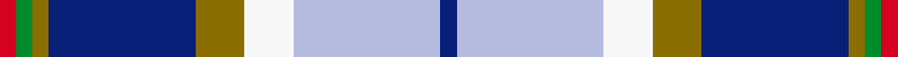

This is one **variant** — a specific cloth: this exact thread count and colourway, with its own
provenance below. It is one weaving of the [sett](/tartans/c/cu/curd/) (the scale-free proportion — the
same cloth at any scale or shade), whose colour order is pattern [BWWGBGGR](/stripes/bwwgbggr/).

Part of the [Curd](/tartans/c/cu/curd/) tartan — the named design grouping this sett with its other cloths.

Sourced from register-of-tartans.  It is a [8 stripe tartan](/stripes/stripes8/).

Original link [https://www.tartanregister.gov.uk/tartanDetails.aspx?ref=10942](https://www.tartanregister.gov.uk/tartanDetails.aspx?ref=10942)

2 attestations — the source records this cloth was collapsed from (oldest owns this page)

<ul>
<li>05/11/2013 — Curd (2013) (register-of-tartans, <a href="https://www.tartanregister.gov.uk/tartanDetails.aspx?ref=10942">record</a>)  <em>Matt Curd was inspired by his wedding and honeymoon in Scotland to create a family tartan. He is happy for it to be used by anyone who shares the same surname. The colours used in the tartan are of significance to the family.</em></li>
<li>2013 — Curd (2013) (tartans-authority, <a href="https://web.archive.org/web/*/http://www.tartansauthority.com/tartan-ferret/display/10942/*">record</a>)  <em>Matt Curd was inspired by his wedding and honeymoon in Scotland to create a family tartan. He is happy for it to be used by anyone who shares the same surname. The colours used in the tartan are of significance to the family.</em></li>
</ul>

Dataset <small>— provenance for this record, inherited from the source manifest</small>

<dl class="dataset-prov">
<dt>source</dt><dd><a href="/sources/register-of-tartans/">Scottish Register of Tartans</a></dd>
<dt>data captured from</dt><dd><a href="https://github.com/thetartan/tartan-database/blob/master/data/register-of-tartans/data.csv">https://github.com/thetartan/tartan-database/blob/master/data/register-of-tartans/data.csv</a></dd>
<dt>data date</dt><dd>05/11/2013 <small>(this record)</small></dd>
<dt>licence</dt><dd><a href="https://www.tartanregister.gov.uk/copyright">Crown copyright</a></dd>
</dl>

Capture chain <small>— the hands this data passed through, oldest first; each capture carries its own licence</small>

<ol class="capture-chain">
<li><a href="https://www.tartanregister.gov.uk/">Scottish Register of Tartans</a> · <a href="https://www.tartanregister.gov.uk/copyright">Crown copyright</a> <small>the living register — still published by National Records of Scotland</small></li>
<li><a href="https://github.com/thetartan/tartan-database">thetartan/tartan-database</a> <small>2016-2017</small> · <a href="https://creativecommons.org/licenses/by-nc-nd/4.0/">CC BY-NC-ND 4.0</a> <small>Levko Kravets's frozen compilation — the capture we vendored, and where its CC licence text came from</small></li>
<li>this dictionary <small>captured 2026-06-10 · commit 5bf86c7566</small> <small>each re-capture is a git commit to data/sources</small></li>
</ol>

## Register references

External register numbers recorded for this tartan.

- Scottish Register of Tartans: [10942](https://www.tartanregister.gov.uk/tartanDetails?ref=10942)
- Scottish Tartans Authority (ITI): 10942

## Thread count
R/4 G4 Y4 DB36 Y12 W12 LB36 DB/4

One full sett is **216 threads**.

## Palette
<table><thead><tr><th>Colour</th><th>Shade</th><th>OKLCh</th></tr></thead><tbody><tr><td>DB</td><td><code style="background-color:#082077;">#082077</code> <small style="color:#888">#082077</small></td><td><small style="color:#888">oklch(30.0% 0.149 265.1)</small></td></tr><tr><td>G</td><td><code style="background-color:#008B2A;">#008B2A</code> <small style="color:#888">#008B2A</small></td><td><small style="color:#888">oklch(55.4% 0.170 145.9)</small></td></tr><tr><td>W</td><td><code style="background-color:#F7F7F7;">#F7F7F7</code> <small style="color:#888">#F7F7F7</small></td><td><small style="color:#888">oklch(97.6% 0.000 89.9)</small></td></tr><tr><td>Y</td><td><code style="background-color:#8B6E00;">#8B6E00</code> <small style="color:#888">#8B6E00</small></td><td><small style="color:#888">oklch(55.1% 0.113 90.4)</small></td></tr><tr><td>LB</td><td><code style="background-color:#B5BBDE;">#B5BBDE</code> <small style="color:#888">#B5BBDE</small></td><td><small style="color:#888">oklch(79.9% 0.050 277.6)</small></td></tr><tr><td>R</td><td><code style="background-color:#D60020;">#D60020</code> <small style="color:#888">#D60020</small></td><td><small style="color:#888">oklch(55.2% 0.224 25.5)</small></td></tr></tbody></table>

# Sample pattern

## Nearest tartan variants

The nearest existing variants by ΔTartan distance, with this cloth at the top so the swatches line up against it.

ΔTartan

Threads

Variant

Sett

—

216

<a href="/variants/s8/db1lb9w3y3db9y1g1r1~x4/">Curd (2013)</a>

<a href="/ttd/edit/#slug=db4r1w1r1db4k2lb6y1~x6&amp;base=db1lb9w3y3db9y1g1r1~x4" title="compare in the TTD">1.77</a>

210

<a href="/variants/s8/db4r1w1r1db4k2lb6y1~x6/">Lopatinsky</a>

<a href="/ttd/edit/#slug=r15lb98db72ly25db8w15&amp;base=db1lb9w3y3db9y1g1r1~x4" title="compare in the TTD">1.93</a>

436

<a href="/variants/s6/r15lb98db72ly25db8w15/">Afternoon Tea / Earl Grey</a>

<a href="/ttd/edit/#slug=lb27db2lb2db16g5r5y2db2dy14db2~x2&amp;base=db1lb9w3y3db9y1g1r1~x4" title="compare in the TTD">2.10</a>

250

<a href="/variants/s10/lb27db2lb2db16g5r5y2db2dy14db2~x2/">Lyon, Jeffrey M (Hunting) (Personal)</a>

<a href="/ttd/edit/#slug=r3lb25db6dbi3r2t5dbi18w3~x2~db1004274-dbi1106275&amp;base=db1lb9w3y3db9y1g1r1~x4" title="compare in the TTD">2.14</a>

248

<a href="/variants/s8/r3lb25db6dbi3r2t5dbi18w3~x2~db1004274-dbi1106275/">Fulbright Foundation</a>

<a href="/ttd/edit/#slug=db13y2r4g2lb8w2~x6&amp;base=db1lb9w3y3db9y1g1r1~x4" title="compare in the TTD">2.25</a>

282

<a href="/variants/s6/db13y2r4g2lb8w2~x6/">Meh Dundee</a>

<a href="/ttd/edit/#slug=db3w3r3w24y4dy6db3r2db16b12y2db3~x2&amp;base=db1lb9w3y3db9y1g1r1~x4" title="compare in the TTD">2.29</a>

312

<a href="/variants/s12/db3w3r3w24y4dy6db3r2db16b12y2db3~x2/">Lashbrooke of Barrowfield</a>

<a href="/ttd/edit/#slug=r2db12dg2b11dg4db5b2w24g2~x2&amp;base=db1lb9w3y3db9y1g1r1~x4" title="compare in the TTD">2.33</a>

248

<a href="/variants/s9/r2db12dg2b11dg4db5b2w24g2~x2/">Fraser Gathering, dress</a>

<a href="/ttd/edit/#slug=db28r3w3r3w3r3db14k12lb38y8&amp;base=db1lb9w3y3db9y1g1r1~x4" title="compare in the TTD">2.34</a>

194

<a href="/variants/s10/db28r3w3r3w3r3db14k12lb38y8/">GYL (Personal)</a>

<a href="/ttd/edit/#slug=db28r3w3r3w3r3db28k12lb38wi8~w3600000-wi3905105&amp;base=db1lb9w3y3db9y1g1r1~x4" title="compare in the TTD">2.43</a>

222

<a href="/variants/s10/db28r3w3r3w3r3db28k12lb38wi8~w3600000-wi3905105/">GYL family (Personal)</a>

<a href="/ttd/edit/#slug=db24r6w6r6w6r6db25k12t36y6&amp;base=db1lb9w3y3db9y1g1r1~x4" title="compare in the TTD">2.49</a>

236

<a href="/variants/s10/db24r6w6r6w6r6db25k12t36y6/">Lopatinsky (Personal)</a>

## Neighbour map

Every grey dot is one of 13656 variants placed by the first two principal components of the ΔTartan feature space (42% of its variance). Red is this tartan; blue dots are its nearest — click one to open its page. The map is a flat projection of a many-dimensional space — [how to read it](/posts/neighbourhood-maps/).

<svg viewBox="0 0 640 380" role="img" style="max-width:100%;height:auto;border:1px solid #e0e0e0;border-radius:4px;display:block" xmlns="http://www.w3.org/2000/svg"><image href="/nn/cloud.v1.png" width="640" height="380"/><a href="/variants/s8/db4r1w1r1db4k2lb6y1~x6/"><circle cx="94.8" cy="183.1" r="4" fill="#3465a4"><title>Lopatinsky</title></circle></a><a href="/variants/s6/r15lb98db72ly25db8w15/"><circle cx="208.0" cy="191.3" r="4" fill="#3465a4"><title>Afternoon Tea / Earl Grey</title></circle></a><a href="/variants/s10/lb27db2lb2db16g5r5y2db2dy14db2~x2/"><circle cx="159.7" cy="137.1" r="4" fill="#3465a4"><title>Lyon, Jeffrey M (Hunting) (Personal)</title></circle></a><a href="/variants/s8/r3lb25db6dbi3r2t5dbi18w3~x2~db1004274-dbi1106275/"><circle cx="161.5" cy="152.1" r="4" fill="#3465a4"><title>Fulbright Foundation</title></circle></a><a href="/variants/s6/db13y2r4g2lb8w2~x6/"><circle cx="143.4" cy="200.5" r="4" fill="#3465a4"><title>Meh Dundee</title></circle></a><a href="/variants/s12/db3w3r3w24y4dy6db3r2db16b12y2db3~x2/"><circle cx="112.4" cy="136.6" r="4" fill="#3465a4"><title>Lashbrooke of Barrowfield</title></circle></a><a href="/variants/s9/r2db12dg2b11dg4db5b2w24g2~x2/"><circle cx="134.4" cy="147.4" r="4" fill="#3465a4"><title>Fraser Gathering, dress</title></circle></a><a href="/variants/s10/db28r3w3r3w3r3db14k12lb38y8/"><circle cx="117.8" cy="124.0" r="4" fill="#3465a4"><title>GYL (Personal)</title></circle></a><a href="/variants/s10/db28r3w3r3w3r3db28k12lb38wi8~w3600000-wi3905105/"><circle cx="142.9" cy="124.3" r="4" fill="#3465a4"><title>GYL family (Personal)</title></circle></a><a href="/variants/s10/db24r6w6r6w6r6db25k12t36y6/"><circle cx="84.2" cy="174.1" r="4" fill="#3465a4"><title>Lopatinsky (Personal)</title></circle></a><circle cx="133.1" cy="168.4" r="5" fill="#c00000"/><text x="320" y="376" text-anchor="middle" font-size="11" fill="#999">ground</text><text x="11" y="190" text-anchor="middle" font-size="11" fill="#999" transform="rotate(-90 11 190)">complexity</text></svg>

ID: /variants/s8/db1lb9w3y3db9y1g1r1~x4/
