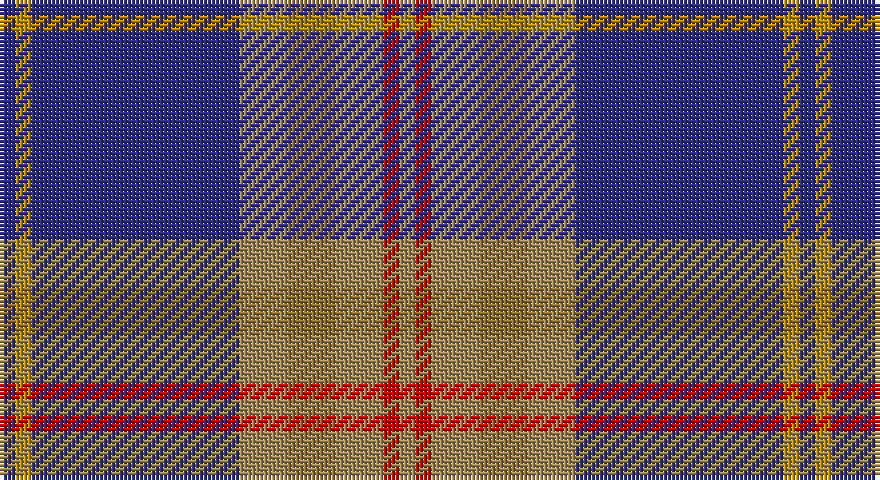

This page is one **sett** — a single exact thread-count. It belongs to the [tartan](/setts/db1lo1db13loi3y3loi3r1loi1/)
(the same proportion at any scale), whose colour order is pattern [BYBYGYRY](/stripes/bybygyry/).

Sourced from register-of-tartans.  It is a [8 stripe tartan](/stripes/stripes8/).

Original link https://www.tartanregister.gov.uk/tartanDetails.aspx?ref=1385

2 attestations — the source records this cloth was collapsed from (oldest owns this page)

<ul>
<li>01/04/2004 — Glen Moray (register-of-tartans, <a href="https://www.tartanregister.gov.uk/tartanDetails.aspx?ref=1385">record</a>)</li>
<li>Apr 2004 — Glen Moray (Corporate) (tartans-authority, <a href="http://www.tartansauthority.com/tartan-ferret/display/6249/">record</a>)</li>
</ul>

## Register references

External register numbers recorded for this tartan.

- Scottish Register of Tartans: [1385](https://www.tartanregister.gov.uk/tartanDetails.aspx?ref=1385)
- Scottish Tartans Authority (ITI): 6249

## Thread count
DB/4 DY4 DB52 LTa12 LT12 LTa12 R4 LTa/4

One full sett is **200 threads**.

## Palette

Palette: <strong>Tartan Register</strong>
<table><thead><tr><th>Colour</th><th>Threads</th><th>Shade</th><th>Base</th><th>OKLCh</th></tr></thead><tbody><tr><td>DB/</td><td style="text-align:right;font-variant-numeric:tabular-nums">4</td><td><code style="background-color:#2C2C80;">#2C2C80</code> <small style="color:#888">#2C2C80</small></td><td>B <code style="background-color:#2A418A;">#2A418A</code></td><td><small style="color:#888">oklch(35.0% 0.138 276.6)</small></td></tr><tr><td>DY</td><td style="text-align:right;font-variant-numeric:tabular-nums">4</td><td><code style="background-color:#BC8C00;">#BC8C00</code> <small style="color:#888">#BC8C00</small></td><td>Y <code style="background-color:#F2BF00;">#F2BF00</code></td><td><small style="color:#888">oklch(66.8% 0.137 84.1)</small></td></tr><tr><td>DB</td><td style="text-align:right;font-variant-numeric:tabular-nums">52</td><td><code style="background-color:#2C2C80;">#2C2C80</code> <small style="color:#888">#2C2C80</small></td><td>B <code style="background-color:#2A418A;">#2A418A</code></td><td><small style="color:#888">oklch(35.0% 0.138 276.6)</small></td></tr><tr><td>LTa</td><td style="text-align:right;font-variant-numeric:tabular-nums">12</td><td><code style="background-color:#A08858;">#A08858</code> <small style="color:#888">#A08858</small></td><td>Y <code style="background-color:#F2BF00;">#F2BF00</code></td><td><small style="color:#888">oklch(63.7% 0.071 84.0)</small></td></tr><tr><td>LT</td><td style="text-align:right;font-variant-numeric:tabular-nums">12</td><td><code style="background-color:#8C7038;">#8C7038</code> <small style="color:#888">#8C7038</small></td><td>G <code style="background-color:#006100;">#006100</code></td><td><small style="color:#888">oklch(56.0% 0.082 83.0)</small></td></tr><tr><td>LTa</td><td style="text-align:right;font-variant-numeric:tabular-nums">12</td><td><code style="background-color:#A08858;">#A08858</code> <small style="color:#888">#A08858</small></td><td>Y <code style="background-color:#F2BF00;">#F2BF00</code></td><td><small style="color:#888">oklch(63.7% 0.071 84.0)</small></td></tr><tr><td>R</td><td style="text-align:right;font-variant-numeric:tabular-nums">4</td><td><code style="background-color:#C80000;">#C80000</code> <small style="color:#888">#C80000</small></td><td>R <code style="background-color:#CC0000;">#CC0000</code></td><td><small style="color:#888">oklch(52.3% 0.215 29.2)</small></td></tr><tr><td>LTa/</td><td style="text-align:right;font-variant-numeric:tabular-nums">4</td><td><code style="background-color:#A08858;">#A08858</code> <small style="color:#888">#A08858</small></td><td>Y <code style="background-color:#F2BF00;">#F2BF00</code></td><td><small style="color:#888">oklch(63.7% 0.071 84.0)</small></td></tr></tbody></table>

# Sample pattern

## Nearest tartans

The nearest existing variants by ΔTartan distance, with this tartan at the top so the swatches line up against it.

ΔTartan

Tartan

Sett

—

<a href="/ttd/edit/#slug=db1lo1db13loi3y3loi3r1loi1~x4">Glen Moray</a> <a class="nn-out" href="/variants/s8/db1lo1db13loi3y3loi3r1loi1~x4/" title="open its dictionary page">↗</a>

1.06

<a href="/ttd/edit/#slug=db8o27ly2r3ly2o27db22k2db4k2db4k4~x2&amp;base=db1lo1db13loi3y3loi3r1loi1~x4">Falkirk</a> <a class="nn-out" href="/variants/s12/db8o27ly2r3ly2o27db22k2db4k2db4k4~x2/" title="open its dictionary page">↗</a>

1.07

<a href="/ttd/edit/#slug=db8w2k8g12r2db3r2db24r2~x2&amp;base=db1lo1db13loi3y3loi3r1loi1~x4">Burt #2 (Name)</a> <a class="nn-out" href="/variants/s9/db8w2k8g12r2db3r2db24r2~x2/" title="open its dictionary page">↗</a>

1.09

<a href="/ttd/edit/#slug=r16db2o6r3k4t2db40t6~x2&amp;base=db1lo1db13loi3y3loi3r1loi1~x4">St. Leonards (Corporate)</a> <a class="nn-out" href="/variants/s8/r16db2o6r3k4t2db40t6~x2/" title="open its dictionary page">↗</a>

1.14

<a href="/ttd/edit/#slug=db34lo6g6r2w2r2g10lo8db23w2~x2&amp;base=db1lo1db13loi3y3loi3r1loi1~x4">International Pairs (Corporate)</a> <a class="nn-out" href="/variants/s10/db34lo6g6r2w2r2g10lo8db23w2~x2/" title="open its dictionary page">↗</a>

1.15

<a href="/ttd/edit/#slug=r4b18r4t3r4k12r3b24k2ly3~x2&amp;base=db1lo1db13loi3y3loi3r1loi1~x4">Keogh (Name)</a> <a class="nn-out" href="/variants/s10/r4b18r4t3r4k12r3b24k2ly3~x2/" title="open its dictionary page">↗</a>

1.20

<a href="/ttd/edit/#slug=w4y15db8k4db28k2db4w2&amp;base=db1lo1db13loi3y3loi3r1loi1~x4">Kelvinside Academy (School)</a> <a class="nn-out" href="/variants/s8/w4y15db8k4db28k2db4w2/" title="open its dictionary page">↗</a>

1.20

<a href="/ttd/edit/#slug=db2ly1db18g7r7db1g1~x2&amp;base=db1lo1db13loi3y3loi3r1loi1~x4">Unnamed C20th - USA</a> <a class="nn-out" href="/variants/s7/db2ly1db18g7r7db1g1~x2/" title="open its dictionary page">↗</a>

1.23

<a href="/ttd/edit/#slug=r4g2r2k5dt22w2~x4&amp;base=db1lo1db13loi3y3loi3r1loi1~x4">Reese (Personal)</a> <a class="nn-out" href="/variants/s6/r4g2r2k5dt22w2~x4/" title="open its dictionary page">↗</a>

1.23

<a href="/ttd/edit/#slug=db3n10db3k3w10r4n28k2~x2&amp;base=db1lo1db13loi3y3loi3r1loi1~x4">Moorpark Primary School (Corporate)</a> <a class="nn-out" href="/variants/s8/db3n10db3k3w10r4n28k2~x2/" title="open its dictionary page">↗</a>

1.24

<a href="/ttd/edit/#slug=dp3r3dp34g18lo2g18lb2r3~x2&amp;base=db1lo1db13loi3y3loi3r1loi1~x4">Singh</a> <a class="nn-out" href="/variants/s8/dp3r3dp34g18lo2g18lb2r3~x2/" title="open its dictionary page">↗</a>

## Neighbour map

Every grey dot is one of 14360 variants placed by the first two principal components of the ΔTartan feature space (44% of its variance). Red is this tartan; blue dots are its nearest — click one to open its page.

<svg viewBox="0 0 640 380" role="img" style="max-width:100%;height:auto;border:1px solid #e0e0e0;border-radius:4px;display:block" xmlns="http://www.w3.org/2000/svg"><image href="/nn/cloud.v1.png" width="640" height="380"/><a href="/variants/s12/db8o27ly2r3ly2o27db22k2db4k2db4k4~x2/"><circle cx="291.5" cy="147.4" r="4" fill="#3465a4"><title>Falkirk</title></circle></a><a href="/variants/s9/db8w2k8g12r2db3r2db24r2~x2/"><circle cx="287.6" cy="172.4" r="4" fill="#3465a4"><title>Burt #2 (Name)</title></circle></a><a href="/variants/s8/r16db2o6r3k4t2db40t6~x2/"><circle cx="318.2" cy="137.0" r="4" fill="#3465a4"><title>St. Leonards (Corporate)</title></circle></a><a href="/variants/s10/db34lo6g6r2w2r2g10lo8db23w2~x2/"><circle cx="323.7" cy="143.7" r="4" fill="#3465a4"><title>International Pairs (Corporate)</title></circle></a><a href="/variants/s10/r4b18r4t3r4k12r3b24k2ly3~x2/"><circle cx="258.5" cy="155.3" r="4" fill="#3465a4"><title>Keogh (Name)</title></circle></a><a href="/variants/s8/w4y15db8k4db28k2db4w2/"><circle cx="351.5" cy="187.3" r="4" fill="#3465a4"><title>Kelvinside Academy (School)</title></circle></a><a href="/variants/s7/db2ly1db18g7r7db1g1~x2/"><circle cx="349.9" cy="173.6" r="4" fill="#3465a4"><title>Unnamed C20th - USA</title></circle></a><a href="/variants/s6/r4g2r2k5dt22w2~x4/"><circle cx="321.8" cy="177.6" r="4" fill="#3465a4"><title>Reese (Personal)</title></circle></a><a href="/variants/s8/db3n10db3k3w10r4n28k2~x2/"><circle cx="303.7" cy="150.6" r="4" fill="#3465a4"><title>Moorpark Primary School (Corporate)</title></circle></a><a href="/variants/s8/dp3r3dp34g18lo2g18lb2r3~x2/"><circle cx="287.8" cy="155.2" r="4" fill="#3465a4"><title>Singh</title></circle></a><circle cx="306.1" cy="157.9" r="5" fill="#c00000"/></svg>

ID: /variants/s8/db1lo1db13loi3y3loi3r1loi1~x4/
