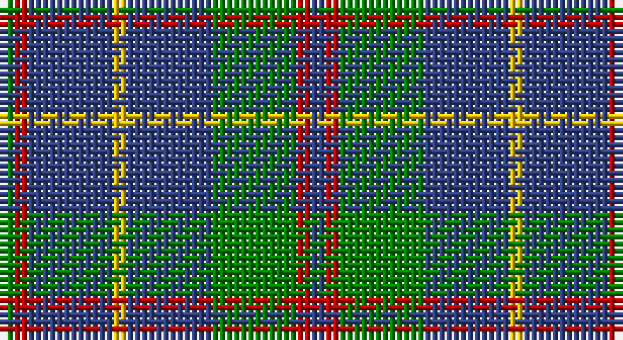

This page is one **sett** — a single exact thread-count. It belongs to the [tartan](/setts/db1r1g6db6ly1db6r1g1/)
(the same proportion at any scale), whose colour order is pattern [BRGBYBRG](/stripes/brgbybrg/).

Part of the [MacHardy](/tartans/machardy/) tartan — the named design grouping this sett with its other cloths.

Sourced from weddslist.  It is a [8 stripe tartan](/stripes/stripes8/).

Original link http://www.weddslist.com/cgi-bin/tartans/pg.pl?source=sts

## Also known as

This cloth is also recorded under:

- MacHardy Black
- MacHardy, Blue

## Thread count
G/2 R2 B12 Y2 B12 G12 R2 B/2

One full sett is **88 threads**.

## Palette

Palette: <strong>custom</strong>
<table><thead><tr><th>Colour</th><th>Threads</th><th>Shade</th><th>Base</th><th>OKLCh</th></tr></thead><tbody><tr><td>G/</td><td style="text-align:right;font-variant-numeric:tabular-nums">2</td><td><code style="background-color:#008000;">#008000</code> <small style="color:#888">#008000</small></td><td>G <code style="background-color:#006100;">#006100</code></td><td><small style="color:#888">oklch(52.0% 0.177 142.5)</small></td></tr><tr><td>R</td><td style="text-align:right;font-variant-numeric:tabular-nums">2</td><td><code style="background-color:#C00000;">#C00000</code> <small style="color:#888">#C00000</small></td><td>R <code style="background-color:#CC0000;">#CC0000</code></td><td><small style="color:#888">oklch(50.7% 0.208 29.2)</small></td></tr><tr><td>B</td><td style="text-align:right;font-variant-numeric:tabular-nums">12</td><td><code style="background-color:#304080;">#304080</code> <small style="color:#888">#304080</small></td><td>B <code style="background-color:#2A418A;">#2A418A</code></td><td><small style="color:#888">oklch(39.4% 0.109 270.2)</small></td></tr><tr><td>Y</td><td style="text-align:right;font-variant-numeric:tabular-nums">2</td><td><code style="background-color:#F0C000;">#F0C000</code> <small style="color:#888">#F0C000</small></td><td>Y <code style="background-color:#F2BF00;">#F2BF00</code></td><td><small style="color:#888">oklch(82.7% 0.169 90.5)</small></td></tr><tr><td>B</td><td style="text-align:right;font-variant-numeric:tabular-nums">12</td><td><code style="background-color:#304080;">#304080</code> <small style="color:#888">#304080</small></td><td>B <code style="background-color:#2A418A;">#2A418A</code></td><td><small style="color:#888">oklch(39.4% 0.109 270.2)</small></td></tr><tr><td>G</td><td style="text-align:right;font-variant-numeric:tabular-nums">12</td><td><code style="background-color:#008000;">#008000</code> <small style="color:#888">#008000</small></td><td>G <code style="background-color:#006100;">#006100</code></td><td><small style="color:#888">oklch(52.0% 0.177 142.5)</small></td></tr><tr><td>R</td><td style="text-align:right;font-variant-numeric:tabular-nums">2</td><td><code style="background-color:#C00000;">#C00000</code> <small style="color:#888">#C00000</small></td><td>R <code style="background-color:#CC0000;">#CC0000</code></td><td><small style="color:#888">oklch(50.7% 0.208 29.2)</small></td></tr><tr><td>B/</td><td style="text-align:right;font-variant-numeric:tabular-nums">2</td><td><code style="background-color:#304080;">#304080</code> <small style="color:#888">#304080</small></td><td>B <code style="background-color:#2A418A;">#2A418A</code></td><td><small style="color:#888">oklch(39.4% 0.109 270.2)</small></td></tr></tbody></table>

# Sample pattern

## Nearest tartans

The nearest existing variants by ΔTartan distance, with this tartan at the top so the swatches line up against it.

ΔTartan

Tartan

Sett

—

<a href="/ttd/edit/#slug=db1r1g6db6ly1db6r1g1~x2">MacHardy</a> <a class="nn-out" href="/variants/s8/db1r1g6db6ly1db6r1g1~x2/" title="open its dictionary page">↗</a>

0.85

<a href="/ttd/edit/#slug=dg1r1db6ly1db6dg6r1db1~x2&amp;base=db1r1g6db6ly1db6r1g1~x2">MacHardy</a> <a class="nn-out" href="/variants/s8/dg1r1db6ly1db6dg6r1db1~x2/" title="open its dictionary page">↗</a>

1.05

<a href="/ttd/edit/#slug=db6r3g26db26w4db26r5g5~x2&amp;base=db1r1g6db6ly1db6r1g1~x2">MacHardy, Blue</a> <a class="nn-out" href="/variants/s8/db6r3g26db26w4db26r5g5~x2/" title="open its dictionary page">↗</a>

1.09

<a href="/ttd/edit/#slug=r5g20r5g20db24g6ly4&amp;base=db1r1g6db6ly1db6r1g1~x2">Cameron of Lochiel (Hunting) Clan/Family Tartan</a> <a class="nn-out" href="/variants/s7/r5g20r5g20db24g6ly4/" title="open its dictionary page">↗</a>

1.13

<a href="/ttd/edit/#slug=r3g10r3g14db16g3ly2~x2&amp;base=db1r1g6db6ly1db6r1g1~x2">Cameron of Lochiel (Hunting)</a> <a class="nn-out" href="/variants/s7/r3g10r3g14db16g3ly2~x2/" title="open its dictionary page">↗</a>

1.16

<a href="/ttd/edit/#slug=w1db8g2db2g6db1g6db2g2db8ly1~x4&amp;base=db1r1g6db6ly1db6r1g1~x2">Bruce (Personal)</a> <a class="nn-out" href="/variants/s11/w1db8g2db2g6db1g6db2g2db8ly1~x4/" title="open its dictionary page">↗</a>

1.21

<a href="/ttd/edit/#slug=r1g8db2g2db6g1db6g2db2g8ly1~x4&amp;base=db1r1g6db6ly1db6r1g1~x2">Bruce of Crionaich (Personal)</a> <a class="nn-out" href="/variants/s11/r1g8db2g2db6g1db6g2db2g8ly1~x4/" title="open its dictionary page">↗</a>

1.21

<a href="/ttd/edit/#slug=db8r4db24g35lb4g8&amp;base=db1r1g6db6ly1db6r1g1~x2">Heritage Tartan, The</a> <a class="nn-out" href="/variants/s6/db8r4db24g35lb4g8/" title="open its dictionary page">↗</a>

1.27

<a href="/ttd/edit/#slug=n8k5n16o9n3o3n3o3n10lb3~x2&amp;base=db1r1g6db6ly1db6r1g1~x2">Digital Equipment Corp.</a> <a class="nn-out" href="/variants/s10/n8k5n16o9n3o3n3o3n10lb3~x2/" title="open its dictionary page">↗</a>

1.28

<a href="/ttd/edit/#slug=dg10r1dg1r2dg8db10dg1ly1~x4&amp;base=db1r1g6db6ly1db6r1g1~x2">Glen Esk</a> <a class="nn-out" href="/variants/s8/dg10r1dg1r2dg8db10dg1ly1~x4/" title="open its dictionary page">↗</a>

1.29

<a href="/ttd/edit/#slug=db12w2db7g15k2g4k2g15db2k7~x2&amp;base=db1r1g6db6ly1db6r1g1~x2">Smeaton #2 (Name)</a> <a class="nn-out" href="/variants/s10/db12w2db7g15k2g4k2g15db2k7~x2/" title="open its dictionary page">↗</a>

## Neighbour map

Every grey dot is one of 14360 variants placed by the first two principal components of the ΔTartan feature space (44% of its variance). Red is this tartan; blue dots are its nearest — click one to open its page.

<svg viewBox="0 0 640 380" role="img" style="max-width:100%;height:auto;border:1px solid #e0e0e0;border-radius:4px;display:block" xmlns="http://www.w3.org/2000/svg"><image href="/nn/cloud.v1.png" width="640" height="380"/><a href="/variants/s8/dg1r1db6ly1db6dg6r1db1~x2/"><circle cx="309.7" cy="239.8" r="4" fill="#3465a4"><title>MacHardy</title></circle></a><a href="/variants/s8/db6r3g26db26w4db26r5g5~x2/"><circle cx="303.1" cy="215.9" r="4" fill="#3465a4"><title>MacHardy, Blue</title></circle></a><a href="/variants/s7/r5g20r5g20db24g6ly4/"><circle cx="263.7" cy="248.8" r="4" fill="#3465a4"><title>Cameron of Lochiel (Hunting) Clan/Family Tartan</title></circle></a><a href="/variants/s7/r3g10r3g14db16g3ly2~x2/"><circle cx="259.6" cy="225.9" r="4" fill="#3465a4"><title>Cameron of Lochiel (Hunting)</title></circle></a><a href="/variants/s11/w1db8g2db2g6db1g6db2g2db8ly1~x4/"><circle cx="285.8" cy="215.4" r="4" fill="#3465a4"><title>Bruce (Personal)</title></circle></a><a href="/variants/s11/r1g8db2g2db6g1db6g2db2g8ly1~x4/"><circle cx="306.6" cy="226.4" r="4" fill="#3465a4"><title>Bruce of Crionaich (Personal)</title></circle></a><a href="/variants/s6/db8r4db24g35lb4g8/"><circle cx="284.6" cy="229.3" r="4" fill="#3465a4"><title>Heritage Tartan, The</title></circle></a><a href="/variants/s10/n8k5n16o9n3o3n3o3n10lb3~x2/"><circle cx="307.6" cy="245.2" r="4" fill="#3465a4"><title>Digital Equipment Corp.</title></circle></a><a href="/variants/s8/dg10r1dg1r2dg8db10dg1ly1~x4/"><circle cx="324.4" cy="208.7" r="4" fill="#3465a4"><title>Glen Esk</title></circle></a><a href="/variants/s10/db12w2db7g15k2g4k2g15db2k7~x2/"><circle cx="248.8" cy="227.1" r="4" fill="#3465a4"><title>Smeaton #2 (Name)</title></circle></a><circle cx="291.2" cy="229.6" r="5" fill="#c00000"/></svg>

ID: /variants/s8/db1r1g6db6ly1db6r1g1~x2/
