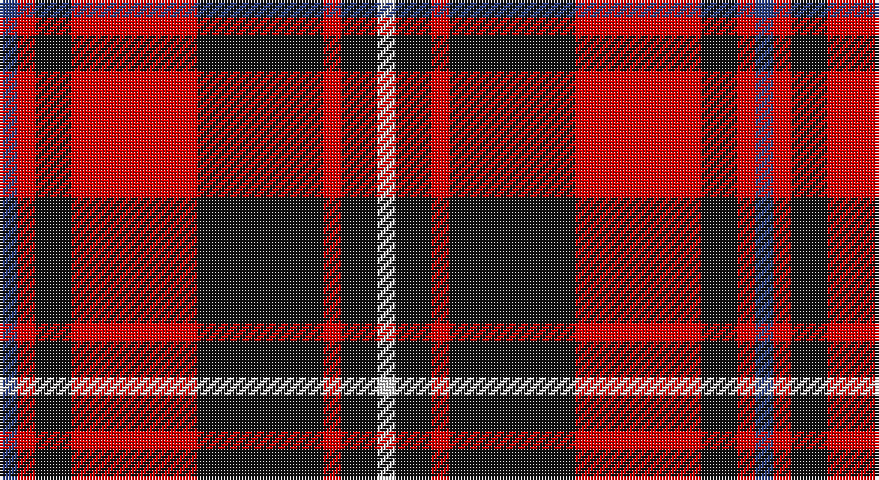

This page is one **sett** — a single exact thread-count. It belongs to the [tartan](/setts/db1r1k2r7k7r1k2w1/)
(the same proportion at any scale), whose colour order is pattern [BRKRKRKW](/stripes/brkrkrkw/).

Sourced from register-of-tartans.  It is a [8 stripe tartan](/stripes/stripes8/).

Original link https://www.tartanregister.gov.uk/tartanDetails.aspx?ref=5997

## Register references

External register numbers recorded for this tartan.

- Scottish Register of Tartans: [5997](https://www.tartanregister.gov.uk/tartanDetails.aspx?ref=5997)
- Scottish Tartans Authority (ITI): 7742
- Scottish Tartans World Register: 3288

## Thread count
B/6 R6 K12 R42 K42 R6 K12 LN/6

One full sett is **252 threads**.

## Palette

Palette: <strong>Tartan Register</strong>
<table><thead><tr><th>Colour</th><th>Threads</th><th>Shade</th><th>Base</th><th>OKLCh</th></tr></thead><tbody><tr><td>B/</td><td style="text-align:right;font-variant-numeric:tabular-nums">6</td><td><code style="background-color:#2C4084;">#2C4084</code> <small style="color:#888">#2C4084</small></td><td>B <code style="background-color:#2A418A;">#2A418A</code></td><td><small style="color:#888">oklch(39.4% 0.117 268.3)</small></td></tr><tr><td>R</td><td style="text-align:right;font-variant-numeric:tabular-nums">6</td><td><code style="background-color:#DC0000;">#DC0000</code> <small style="color:#888">#DC0000</small></td><td>R <code style="background-color:#CC0000;">#CC0000</code></td><td><small style="color:#888">oklch(56.2% 0.230 29.2)</small></td></tr><tr><td>K</td><td style="text-align:right;font-variant-numeric:tabular-nums">12</td><td><code style="background-color:#101010;">#101010</code> <small style="color:#888">#101010</small></td><td>K <code style="background-color:#000000;">#000000</code></td><td><small style="color:#888">oklch(17.3% 0.000 89.9)</small></td></tr><tr><td>R</td><td style="text-align:right;font-variant-numeric:tabular-nums">42</td><td><code style="background-color:#DC0000;">#DC0000</code> <small style="color:#888">#DC0000</small></td><td>R <code style="background-color:#CC0000;">#CC0000</code></td><td><small style="color:#888">oklch(56.2% 0.230 29.2)</small></td></tr><tr><td>K</td><td style="text-align:right;font-variant-numeric:tabular-nums">42</td><td><code style="background-color:#101010;">#101010</code> <small style="color:#888">#101010</small></td><td>K <code style="background-color:#000000;">#000000</code></td><td><small style="color:#888">oklch(17.3% 0.000 89.9)</small></td></tr><tr><td>R</td><td style="text-align:right;font-variant-numeric:tabular-nums">6</td><td><code style="background-color:#DC0000;">#DC0000</code> <small style="color:#888">#DC0000</small></td><td>R <code style="background-color:#CC0000;">#CC0000</code></td><td><small style="color:#888">oklch(56.2% 0.230 29.2)</small></td></tr><tr><td>K</td><td style="text-align:right;font-variant-numeric:tabular-nums">12</td><td><code style="background-color:#101010;">#101010</code> <small style="color:#888">#101010</small></td><td>K <code style="background-color:#000000;">#000000</code></td><td><small style="color:#888">oklch(17.3% 0.000 89.9)</small></td></tr><tr><td>LN/</td><td style="text-align:right;font-variant-numeric:tabular-nums">6</td><td><code style="background-color:#E0E0E0;">#E0E0E0</code> <small style="color:#888">#E0E0E0</small></td><td>W <code style="background-color:#F7F7F7;">#F7F7F7</code></td><td><small style="color:#888">oklch(90.7% 0.000 89.9)</small></td></tr></tbody></table>

# Sample pattern

## Nearest tartans

The nearest existing variants by ΔTartan distance, with this tartan at the top so the swatches line up against it.

ΔTartan

Tartan

Sett

—

<a href="/ttd/edit/#slug=db1r1k2r7k7r1k2w1~x6">Nakayama (Personal)</a> <a class="nn-out" href="/variants/s8/db1r1k2r7k7r1k2w1~x6/" title="open its dictionary page">↗</a>

0.24

<a href="/ttd/edit/#slug=b1r1k2r7k7r1k2w1~x6&amp;base=db1r1k2r7k7r1k2w1~x6">Nakayama (Fashion)</a> <a class="nn-out" href="/variants/s8/b1r1k2r7k7r1k2w1~x6/" title="open its dictionary page">↗</a>

0.85

<a href="/ttd/edit/#slug=w2r12k3r3k16r3k3r12ly2~x2&amp;base=db1r1k2r7k7r1k2w1~x6">MacIver (Clan)</a> <a class="nn-out" href="/variants/s9/w2r12k3r3k16r3k3r12ly2~x2/" title="open its dictionary page">↗</a>

0.86

<a href="/ttd/edit/#slug=r6k3r29k23w4k7ly3~x2&amp;base=db1r1k2r7k7r1k2w1~x6">MacPherson Red Cluny</a> <a class="nn-out" href="/variants/s7/r6k3r29k23w4k7ly3~x2/" title="open its dictionary page">↗</a>

0.93

<a href="/ttd/edit/#slug=r12db2r4db4k15g4r4g2r12~x2&amp;base=db1r1k2r7k7r1k2w1~x6">Alexander</a> <a class="nn-out" href="/variants/s9/r12db2r4db4k15g4r4g2r12~x2/" title="open its dictionary page">↗</a>

1.03

<a href="/ttd/edit/#slug=k10t1k1r10t1k1t1r10g6r2~x2&amp;base=db1r1k2r7k7r1k2w1~x6">Scoepaig, fragment</a> <a class="nn-out" href="/variants/s10/k10t1k1r10t1k1t1r10g6r2~x2/" title="open its dictionary page">↗</a>

1.06

<a href="/ttd/edit/#slug=dp3r4k5r12k24r3k10r26k12dp3r6w3~x2&amp;base=db1r1k2r7k7r1k2w1~x6">MacKinnon Black (Personal)</a> <a class="nn-out" href="/variants/s12/dp3r4k5r12k24r3k10r26k12dp3r6w3~x2/" title="open its dictionary page">↗</a>

1.09

<a href="/ttd/edit/#slug=r6g3r6db1w1db1r2db8r4~x4&amp;base=db1r1k2r7k7r1k2w1~x6">Cameron of Locheil #2</a> <a class="nn-out" href="/variants/s9/r6g3r6db1w1db1r2db8r4~x4/" title="open its dictionary page">↗</a>

1.12

<a href="/ttd/edit/#slug=r24db8r23k4w4k4r10k32r8&amp;base=db1r1k2r7k7r1k2w1~x6">Cameron of Locheil #3</a> <a class="nn-out" href="/variants/s9/r24db8r23k4w4k4r10k32r8/" title="open its dictionary page">↗</a>

1.16

<a href="/ttd/edit/#slug=db1r12k6ly1k6db1~x4&amp;base=db1r1k2r7k7r1k2w1~x6">Cetoloni (Personal)</a> <a class="nn-out" href="/variants/s6/db1r12k6ly1k6db1~x4/" title="open its dictionary page">↗</a>

1.20

<a href="/variants/s8/r26k18r7k4ly4~x2/">Haig &amp; Haig Whisky</a>

## Neighbour map

Every grey dot is one of 14360 variants placed by the first two principal components of the ΔTartan feature space (44% of its variance). Red is this tartan; blue dots are its nearest — click one to open its page.

<svg viewBox="0 0 640 380" role="img" style="max-width:100%;height:auto;border:1px solid #e0e0e0;border-radius:4px;display:block" xmlns="http://www.w3.org/2000/svg"><image href="/nn/cloud.v1.png" width="640" height="380"/><a href="/variants/s8/b1r1k2r7k7r1k2w1~x6/"><circle cx="265.0" cy="193.4" r="4" fill="#3465a4"><title>Nakayama (Fashion)</title></circle></a><a href="/variants/s9/w2r12k3r3k16r3k3r12ly2~x2/"><circle cx="281.8" cy="183.1" r="4" fill="#3465a4"><title>MacIver (Clan)</title></circle></a><a href="/variants/s7/r6k3r29k23w4k7ly3~x2/"><circle cx="260.4" cy="175.4" r="4" fill="#3465a4"><title>MacPherson Red Cluny</title></circle></a><a href="/variants/s9/r12db2r4db4k15g4r4g2r12~x2/"><circle cx="242.2" cy="196.1" r="4" fill="#3465a4"><title>Alexander</title></circle></a><a href="/variants/s10/k10t1k1r10t1k1t1r10g6r2~x2/"><circle cx="247.2" cy="161.8" r="4" fill="#3465a4"><title>Scoepaig, fragment</title></circle></a><a href="/variants/s12/dp3r4k5r12k24r3k10r26k12dp3r6w3~x2/"><circle cx="257.7" cy="175.0" r="4" fill="#3465a4"><title>MacKinnon Black (Personal)</title></circle></a><a href="/variants/s9/r6g3r6db1w1db1r2db8r4~x4/"><circle cx="267.4" cy="196.6" r="4" fill="#3465a4"><title>Cameron of Locheil #2</title></circle></a><a href="/variants/s9/r24db8r23k4w4k4r10k32r8/"><circle cx="279.9" cy="187.0" r="4" fill="#3465a4"><title>Cameron of Locheil #3</title></circle></a><a href="/variants/s6/db1r12k6ly1k6db1~x4/"><circle cx="272.6" cy="188.5" r="4" fill="#3465a4"><title>Cetoloni (Personal)</title></circle></a><a href="/variants/s8/r26k18r7k4ly4~x2/"><circle cx="283.1" cy="228.6" r="4" fill="#3465a4"><title>Haig &amp; Haig Whisky</title></circle></a><circle cx="261.5" cy="189.8" r="5" fill="#c00000"/></svg>

ID: /variants/s8/db1r1k2r7k7r1k2w1~x6/
