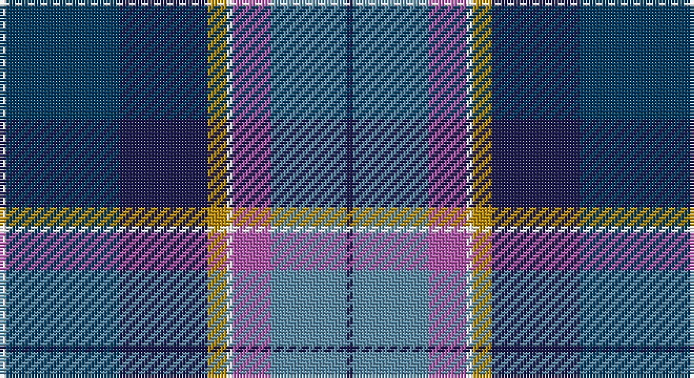

This page is one **sett** — a single exact thread-count. It belongs to the [tartan](/setts/db1t12m6w1lo3db14dt18w1/)
(the same proportion at any scale), whose colour order is pattern [BBRWYBBW](/stripes/bbrwybbw/).

Sourced from register-of-tartans.  It is a [8 stripe tartan](/stripes/stripes8/).

Original link https://www.tartanregister.gov.uk/tartanDetails.aspx?ref=11029

## Register references

External register numbers recorded for this tartan.

- Scottish Register of Tartans: [11029](https://www.tartanregister.gov.uk/tartanDetails.aspx?ref=11029)

## Thread count
W/2 DB36 DBa28 DY6 W2 P12 B24 DBa/2

One full sett is **220 threads**.

## Palette

Palette: <strong>Tartan Register</strong>
<table><thead><tr><th>Colour</th><th>Threads</th><th>Shade</th><th>Base</th><th>OKLCh</th></tr></thead><tbody><tr><td>W/</td><td style="text-align:right;font-variant-numeric:tabular-nums">2</td><td><code style="background-color:#FFFFFF;">#FFFFFF</code> <small style="color:#888">#FFFFFF</small></td><td>W <code style="background-color:#F7F7F7;">#F7F7F7</code></td><td><small style="color:#888">oklch(100.0% 0.000 89.9)</small></td></tr><tr><td>DB</td><td style="text-align:right;font-variant-numeric:tabular-nums">36</td><td><code style="background-color:#003C64;">#003C64</code> <small style="color:#888">#003C64</small></td><td>B <code style="background-color:#2A418A;">#2A418A</code></td><td><small style="color:#888">oklch(34.5% 0.089 246.0)</small></td></tr><tr><td>DBa</td><td style="text-align:right;font-variant-numeric:tabular-nums">28</td><td><code style="background-color:#1C1C50;">#1C1C50</code> <small style="color:#888">#1C1C50</small></td><td>B <code style="background-color:#2A418A;">#2A418A</code></td><td><small style="color:#888">oklch(26.2% 0.093 277.9)</small></td></tr><tr><td>DY</td><td style="text-align:right;font-variant-numeric:tabular-nums">6</td><td><code style="background-color:#BC8C00;">#BC8C00</code> <small style="color:#888">#BC8C00</small></td><td>Y <code style="background-color:#F2BF00;">#F2BF00</code></td><td><small style="color:#888">oklch(66.8% 0.137 84.1)</small></td></tr><tr><td>W</td><td style="text-align:right;font-variant-numeric:tabular-nums">2</td><td><code style="background-color:#FFFFFF;">#FFFFFF</code> <small style="color:#888">#FFFFFF</small></td><td>W <code style="background-color:#F7F7F7;">#F7F7F7</code></td><td><small style="color:#888">oklch(100.0% 0.000 89.9)</small></td></tr><tr><td>P</td><td style="text-align:right;font-variant-numeric:tabular-nums">12</td><td><code style="background-color:#B458AC;">#B458AC</code> <small style="color:#888">#B458AC</small></td><td>R <code style="background-color:#CC0000;">#CC0000</code></td><td><small style="color:#888">oklch(60.2% 0.158 330.7)</small></td></tr><tr><td>B</td><td style="text-align:right;font-variant-numeric:tabular-nums">24</td><td><code style="background-color:#5C8CA8;">#5C8CA8</code> <small style="color:#888">#5C8CA8</small></td><td>B <code style="background-color:#2A418A;">#2A418A</code></td><td><small style="color:#888">oklch(61.7% 0.067 235.0)</small></td></tr><tr><td>DBa/</td><td style="text-align:right;font-variant-numeric:tabular-nums">2</td><td><code style="background-color:#1C1C50;">#1C1C50</code> <small style="color:#888">#1C1C50</small></td><td>B <code style="background-color:#2A418A;">#2A418A</code></td><td><small style="color:#888">oklch(26.2% 0.093 277.9)</small></td></tr></tbody></table>

# Sample pattern

## Nearest tartans

The nearest existing variants by ΔTartan distance, with this tartan at the top so the swatches line up against it.

ΔTartan

Tartan

Sett

—

<a href="/ttd/edit/#slug=db1t12m6w1lo3db14dt18w1~x2">Ancient Gathering</a> <a class="nn-out" href="/variants/s8/db1t12m6w1lo3db14dt18w1~x2/" title="open its dictionary page">↗</a>

0.92

<a href="/ttd/edit/#slug=t1ly3g14w2db22w2dp14t3ly1~x2&amp;base=db1t12m6w1lo3db14dt18w1~x2">Yule (Name)</a> <a class="nn-out" href="/variants/s9/t1ly3g14w2db22w2dp14t3ly1~x2/" title="open its dictionary page">↗</a>

0.96

<a href="/ttd/edit/#slug=k16w6k4b64m19k8g42ly6&amp;base=db1t12m6w1lo3db14dt18w1~x2">Unidentified (Woven sample)</a> <a class="nn-out" href="/variants/s8/k16w6k4b64m19k8g42ly6/" title="open its dictionary page">↗</a>

1.01

<a href="/ttd/edit/#slug=w3k1db24dbi10o24k1ly3~x2&amp;base=db1t12m6w1lo3db14dt18w1~x2">George Heriot's School</a> <a class="nn-out" href="/variants/s7/w3k1db24dbi10o24k1ly3~x2/" title="open its dictionary page">↗</a>

1.06

<a href="/ttd/edit/#slug=w4dbi8r3dbi25k13db4t29dbi3t8dbi2r3~x2&amp;base=db1t12m6w1lo3db14dt18w1~x2">Royal Air Force Regimental Tartan</a> <a class="nn-out" href="/variants/s11/w4dbi8r3dbi25k13db4t29dbi3t8dbi2r3~x2/" title="open its dictionary page">↗</a>

1.13

<a href="/ttd/edit/#slug=db6w1t18k6t4k4p8lg1p8k2db5~x2&amp;base=db1t12m6w1lo3db14dt18w1~x2">Bute Heather, Ancient</a> <a class="nn-out" href="/variants/s11/db6w1t18k6t4k4p8lg1p8k2db5~x2/" title="open its dictionary page">↗</a>

1.13

<a href="/ttd/edit/#slug=g5m2g2m9k9lr9db30w5~x2&amp;base=db1t12m6w1lo3db14dt18w1~x2">Alexander of Menstry</a> <a class="nn-out" href="/variants/s8/g5m2g2m9k9lr9db30w5~x2/" title="open its dictionary page">↗</a>

1.14

<a href="/ttd/edit/#slug=t26db13k13w2g8k5r3t3~x2&amp;base=db1t12m6w1lo3db14dt18w1~x2">Moran (Coilessan) (Personal)</a> <a class="nn-out" href="/variants/s8/t26db13k13w2g8k5r3t3~x2/" title="open its dictionary page">↗</a>

1.15

<a href="/ttd/edit/#slug=w4db8m3db25k13g4t29db3t8db2m3~x2&amp;base=db1t12m6w1lo3db14dt18w1~x2">Air Force</a> <a class="nn-out" href="/variants/s11/w4db8m3db25k13g4t29db3t8db2m3~x2/" title="open its dictionary page">↗</a>

1.17

<a href="/ttd/edit/#slug=t3r3k5g8w2k13db13t26w3~x2&amp;base=db1t12m6w1lo3db14dt18w1~x2">Moran (Virgin Islands) (Personal)</a> <a class="nn-out" href="/variants/s9/t3r3k5g8w2k13db13t26w3~x2/" title="open its dictionary page">↗</a>

1.18

<a href="/ttd/edit/#slug=dp3o1db4g2r2g21o3dp21db25w3~x2&amp;base=db1t12m6w1lo3db14dt18w1~x2">Accenture</a> <a class="nn-out" href="/variants/s10/dp3o1db4g2r2g21o3dp21db25w3~x2/" title="open its dictionary page">↗</a>

## Neighbour map

Every grey dot is one of 14360 variants placed by the first two principal components of the ΔTartan feature space (44% of its variance). Red is this tartan; blue dots are its nearest — click one to open its page.

<svg viewBox="0 0 640 380" role="img" style="max-width:100%;height:auto;border:1px solid #e0e0e0;border-radius:4px;display:block" xmlns="http://www.w3.org/2000/svg"><image href="/nn/cloud.v1.png" width="640" height="380"/><a href="/variants/s9/t1ly3g14w2db22w2dp14t3ly1~x2/"><circle cx="166.0" cy="112.7" r="4" fill="#3465a4"><title>Yule (Name)</title></circle></a><a href="/variants/s8/k16w6k4b64m19k8g42ly6/"><circle cx="161.5" cy="136.3" r="4" fill="#3465a4"><title>Unidentified (Woven sample)</title></circle></a><a href="/variants/s7/w3k1db24dbi10o24k1ly3~x2/"><circle cx="196.2" cy="126.1" r="4" fill="#3465a4"><title>George Heriot's School</title></circle></a><a href="/variants/s11/w4dbi8r3dbi25k13db4t29dbi3t8dbi2r3~x2/"><circle cx="174.6" cy="135.9" r="4" fill="#3465a4"><title>Royal Air Force Regimental Tartan</title></circle></a><a href="/variants/s11/db6w1t18k6t4k4p8lg1p8k2db5~x2/"><circle cx="142.7" cy="137.3" r="4" fill="#3465a4"><title>Bute Heather, Ancient</title></circle></a><a href="/variants/s8/g5m2g2m9k9lr9db30w5~x2/"><circle cx="163.7" cy="135.9" r="4" fill="#3465a4"><title>Alexander of Menstry</title></circle></a><a href="/variants/s8/t26db13k13w2g8k5r3t3~x2/"><circle cx="150.7" cy="160.2" r="4" fill="#3465a4"><title>Moran (Coilessan) (Personal)</title></circle></a><a href="/variants/s11/w4db8m3db25k13g4t29db3t8db2m3~x2/"><circle cx="161.2" cy="130.8" r="4" fill="#3465a4"><title>Air Force</title></circle></a><a href="/variants/s9/t3r3k5g8w2k13db13t26w3~x2/"><circle cx="133.1" cy="146.0" r="4" fill="#3465a4"><title>Moran (Virgin Islands) (Personal)</title></circle></a><a href="/variants/s10/dp3o1db4g2r2g21o3dp21db25w3~x2/"><circle cx="204.2" cy="117.2" r="4" fill="#3465a4"><title>Accenture</title></circle></a><circle cx="148.0" cy="145.4" r="5" fill="#c00000"/></svg>

ID: /variants/s8/db1t12m6w1lo3db14dt18w1~x2/
