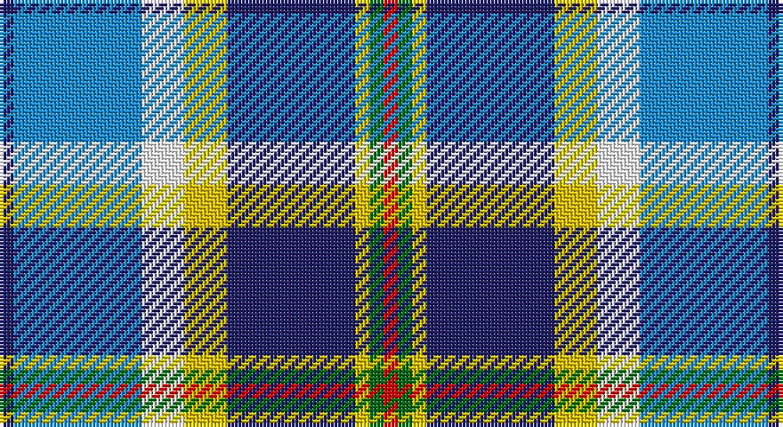

This page is one **sett** — a single exact thread-count. It belongs to the [tartan](/setts/db1t9w3ly3db9ly1g1r1/)
(the same proportion at any scale), whose colour order is pattern [BBWYBYGR](/stripes/bbwybygr/).

Part of the [Curd](/tartans/curd/) tartan — the named design grouping this sett with its other cloths.

Sourced from tartans-authority.  It is a [8 stripe tartan](/stripes/stripes8/).

Original link http://www.tartansauthority.com/tartan-ferret/display/10942/

## Register references

External register numbers recorded for this tartan.

- Scottish Register of Tartans: [10942](https://www.tartanregister.gov.uk/tartanDetails?ref=10942)
- Scottish Tartans Authority (ITI): 10942

## Thread count
DB/4 B36 W12 Y12 DB36 Y4 G4 R/4

One full sett is **216 threads**.

## Palette

Palette: <strong>Tartan Register</strong>
<table><thead><tr><th>Colour</th><th>Threads</th><th>Shade</th><th>Base</th><th>OKLCh</th></tr></thead><tbody><tr><td>DB/</td><td style="text-align:right;font-variant-numeric:tabular-nums">4</td><td><code style="background-color:#202060;">#202060</code> <small style="color:#888">#202060</small></td><td>B <code style="background-color:#2A418A;">#2A418A</code></td><td><small style="color:#888">oklch(28.9% 0.111 276.9)</small></td></tr><tr><td>B</td><td style="text-align:right;font-variant-numeric:tabular-nums">36</td><td><code style="background-color:#2888C4;">#2888C4</code> <small style="color:#888">#2888C4</small></td><td>B <code style="background-color:#2A418A;">#2A418A</code></td><td><small style="color:#888">oklch(60.1% 0.125 241.5)</small></td></tr><tr><td>W</td><td style="text-align:right;font-variant-numeric:tabular-nums">12</td><td><code style="background-color:#FCFCFC;">#FCFCFC</code> <small style="color:#888">#FCFCFC</small></td><td>W <code style="background-color:#F7F7F7;">#F7F7F7</code></td><td><small style="color:#888">oklch(99.1% 0.000 89.9)</small></td></tr><tr><td>Y</td><td style="text-align:right;font-variant-numeric:tabular-nums">12</td><td><code style="background-color:#E8C000;">#E8C000</code> <small style="color:#888">#E8C000</small></td><td>Y <code style="background-color:#F2BF00;">#F2BF00</code></td><td><small style="color:#888">oklch(81.9% 0.168 93.7)</small></td></tr><tr><td>DB</td><td style="text-align:right;font-variant-numeric:tabular-nums">36</td><td><code style="background-color:#202060;">#202060</code> <small style="color:#888">#202060</small></td><td>B <code style="background-color:#2A418A;">#2A418A</code></td><td><small style="color:#888">oklch(28.9% 0.111 276.9)</small></td></tr><tr><td>Y</td><td style="text-align:right;font-variant-numeric:tabular-nums">4</td><td><code style="background-color:#E8C000;">#E8C000</code> <small style="color:#888">#E8C000</small></td><td>Y <code style="background-color:#F2BF00;">#F2BF00</code></td><td><small style="color:#888">oklch(81.9% 0.168 93.7)</small></td></tr><tr><td>G</td><td style="text-align:right;font-variant-numeric:tabular-nums">4</td><td><code style="background-color:#006818;">#006818</code> <small style="color:#888">#006818</small></td><td>G <code style="background-color:#006100;">#006100</code></td><td><small style="color:#888">oklch(45.0% 0.142 145.0)</small></td></tr><tr><td>R/</td><td style="text-align:right;font-variant-numeric:tabular-nums">4</td><td><code style="background-color:#C80000;">#C80000</code> <small style="color:#888">#C80000</small></td><td>R <code style="background-color:#CC0000;">#CC0000</code></td><td><small style="color:#888">oklch(52.3% 0.215 29.2)</small></td></tr></tbody></table>

# Sample pattern

## Compared to the master

This cloth is one sett of its design; the master sett (the exemplar the design is anchored on) is below for comparison.

<figure style="margin:0"><figcaption style="color:#888;font-size:smaller">this sett</figcaption></figure>
<figure style="margin:0"><figcaption style="color:#888;font-size:smaller"><a href="/setts/r1g1ly1t9ly3w3lr9t1/">master sett →</a></figcaption></figure>

## Nearest tartans

The nearest existing variants by ΔTartan distance, with this tartan at the top so the swatches line up against it.

ΔTartan

Tartan

Sett

—

<a href="/ttd/edit/#slug=db1t9w3ly3db9ly1g1r1~x4">Curd (2013)</a> <a class="nn-out" href="/variants/s8/db1t9w3ly3db9ly1g1r1~x4/" title="open its dictionary page">↗</a>

0.86

<a href="/ttd/edit/#slug=r4dy2b15ly2k14w14k2w4~x2&amp;base=db1t9w3ly3db9ly1g1r1~x4">Culloden Blue, Stirling</a> <a class="nn-out" href="/variants/s8/r4dy2b15ly2k14w14k2w4~x2/" title="open its dictionary page">↗</a>

0.95

<a href="/ttd/edit/#slug=g5db22g6k10w24ly2db2w2r2~x2&amp;base=db1t9w3ly3db9ly1g1r1~x4">Haymarket, dress Blue</a> <a class="nn-out" href="/variants/s9/g5db22g6k10w24ly2db2w2r2~x2/" title="open its dictionary page">↗</a>

0.96

<a href="/ttd/edit/#slug=r3dt25k6lb20ly2lb2w3~x2&amp;base=db1t9w3ly3db9ly1g1r1~x4">Madras College (Corporate)</a> <a class="nn-out" href="/variants/s7/r3dt25k6lb20ly2lb2w3~x2/" title="open its dictionary page">↗</a>

1.01

<a href="/ttd/edit/#slug=dp4k2w3k2db30g9k4w20ly3~x2&amp;base=db1t9w3ly3db9ly1g1r1~x4">Minnesota Dress</a> <a class="nn-out" href="/variants/s9/dp4k2w3k2db30g9k4w20ly3~x2/" title="open its dictionary page">↗</a>

1.02

<a href="/ttd/edit/#slug=dt2g2dt11o2w8t12ly2t2~x2&amp;base=db1t9w3ly3db9ly1g1r1~x4">Elora (District)</a> <a class="nn-out" href="/variants/s8/dt2g2dt11o2w8t12ly2t2~x2/" title="open its dictionary page">↗</a>

1.03

<a href="/ttd/edit/#slug=w30t4db6dp4db6g6db12g13lb4~x2&amp;base=db1t9w3ly3db9ly1g1r1~x4">Sound of Iona</a> <a class="nn-out" href="/variants/s9/w30t4db6dp4db6g6db12g13lb4~x2/" title="open its dictionary page">↗</a>

1.03

<a href="/ttd/edit/#slug=db4b13r2db2k2db2w5db2ly2db2b2~x2&amp;base=db1t9w3ly3db9ly1g1r1~x4">Manchester City Football Club &quot;Blue</a> <a class="nn-out" href="/variants/s11/db4b13r2db2k2db2w5db2ly2db2b2~x2/" title="open its dictionary page">↗</a>

1.08

<a href="/ttd/edit/#slug=t12k1t1k1t1db8w9y2~x4&amp;base=db1t9w3ly3db9ly1g1r1~x4">Arran (Pendleton)</a> <a class="nn-out" href="/variants/s8/t12k1t1k1t1db8w9y2~x4/" title="open its dictionary page">↗</a>

1.09

<a href="/ttd/edit/#slug=r3w2db27k19w27dp2ly3~x2&amp;base=db1t9w3ly3db9ly1g1r1~x4">Christian Dress (Personal)</a> <a class="nn-out" href="/variants/s7/r3w2db27k19w27dp2ly3~x2/" title="open its dictionary page">↗</a>

1.10

<a href="/ttd/edit/#slug=r3lr25dbi6db3r2t5db18w3~x2&amp;base=db1t9w3ly3db9ly1g1r1~x4">Fulbright Foundation</a> <a class="nn-out" href="/variants/s8/r3lr25dbi6db3r2t5db18w3~x2/" title="open its dictionary page">↗</a>

## Neighbour map

Every grey dot is one of 14360 variants placed by the first two principal components of the ΔTartan feature space (44% of its variance). Red is this tartan; blue dots are its nearest — click one to open its page.

<svg viewBox="0 0 640 380" role="img" style="max-width:100%;height:auto;border:1px solid #e0e0e0;border-radius:4px;display:block" xmlns="http://www.w3.org/2000/svg"><image href="/nn/cloud.v1.png" width="640" height="380"/><a href="/variants/s8/r4dy2b15ly2k14w14k2w4~x2/"><circle cx="63.1" cy="153.3" r="4" fill="#3465a4"><title>Culloden Blue, Stirling</title></circle></a><a href="/variants/s9/g5db22g6k10w24ly2db2w2r2~x2/"><circle cx="104.7" cy="118.5" r="4" fill="#3465a4"><title>Haymarket, dress Blue</title></circle></a><a href="/variants/s7/r3dt25k6lb20ly2lb2w3~x2/"><circle cx="171.5" cy="140.8" r="4" fill="#3465a4"><title>Madras College (Corporate)</title></circle></a><a href="/variants/s9/dp4k2w3k2db30g9k4w20ly3~x2/"><circle cx="142.1" cy="106.5" r="4" fill="#3465a4"><title>Minnesota Dress</title></circle></a><a href="/variants/s8/dt2g2dt11o2w8t12ly2t2~x2/"><circle cx="82.0" cy="171.1" r="4" fill="#3465a4"><title>Elora (District)</title></circle></a><a href="/variants/s9/w30t4db6dp4db6g6db12g13lb4~x2/"><circle cx="76.8" cy="143.8" r="4" fill="#3465a4"><title>Sound of Iona</title></circle></a><a href="/variants/s11/db4b13r2db2k2db2w5db2ly2db2b2~x2/"><circle cx="111.9" cy="149.3" r="4" fill="#3465a4"><title>Manchester City Football Club &quot;Blue</title></circle></a><a href="/variants/s8/t12k1t1k1t1db8w9y2~x4/"><circle cx="157.8" cy="148.9" r="4" fill="#3465a4"><title>Arran (Pendleton)</title></circle></a><a href="/variants/s7/r3w2db27k19w27dp2ly3~x2/"><circle cx="118.8" cy="125.1" r="4" fill="#3465a4"><title>Christian Dress (Personal)</title></circle></a><a href="/variants/s8/r3lr25dbi6db3r2t5db18w3~x2/"><circle cx="152.7" cy="134.4" r="4" fill="#3465a4"><title>Fulbright Foundation</title></circle></a><circle cx="108.8" cy="144.5" r="5" fill="#c00000"/></svg>

ID: /variants/s8/db1t9w3ly3db9ly1g1r1~x4/
