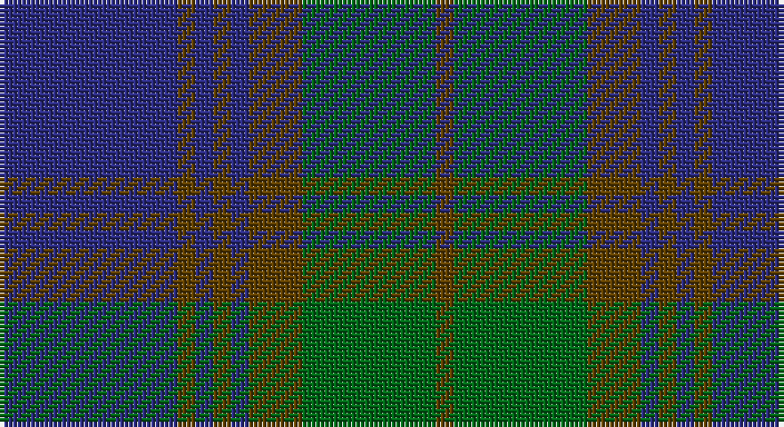

This page is one **sett** — a single exact thread-count. It belongs to the [tartan](/setts/db20dy2db2dy2db2dy6g15dy2/)
(the same proportion at any scale), whose colour order is pattern [BGBGBGGG](/stripes/bgbgbggg/).

Part of the [Gammell](/tartans/gammell/) tartan — the named design grouping this sett with its other cloths.

Sourced from register-of-tartans.  It is a [8 stripe tartan](/stripes/stripes8/).

Original link https://www.tartanregister.gov.uk/tartanDetails.aspx?ref=1313

2 attestations — the source records this cloth was collapsed from (oldest owns this page)

<ul>
<li>01/01/1989 — Gammell (Brown) (Personal) (register-of-tartans, <a href="https://www.tartanregister.gov.uk/tartanDetails.aspx?ref=1313">record</a>)</li>
<li>1989 — Gammell (Brown) (Personal) (tartans-authority, <a href="http://www.tartansauthority.com/tartan-ferret/display/4959/">record</a>)</li>
</ul>

## Register references

External register numbers recorded for this tartan.

- Scottish Register of Tartans: [1313](https://www.tartanregister.gov.uk/tartanDetails.aspx?ref=1313)
- Scottish Tartans Authority (ITI): 4959

## Thread count
DB/40 T4 DB4 T4 DB4 T12 G30 T/4

One full sett is **160 threads**.

## Palette

Palette: <strong>Tartan Register</strong>
<table><thead><tr><th>Colour</th><th>Threads</th><th>Shade</th><th>Base</th><th>OKLCh</th></tr></thead><tbody><tr><td>DB/</td><td style="text-align:right;font-variant-numeric:tabular-nums">40</td><td><code style="background-color:#2C2C80;">#2C2C80</code> <small style="color:#888">#2C2C80</small></td><td>B <code style="background-color:#2A418A;">#2A418A</code></td><td><small style="color:#888">oklch(35.0% 0.138 276.6)</small></td></tr><tr><td>T</td><td style="text-align:right;font-variant-numeric:tabular-nums">4</td><td><code style="background-color:#604000;">#604000</code> <small style="color:#888">#604000</small></td><td>G <code style="background-color:#006100;">#006100</code></td><td><small style="color:#888">oklch(39.8% 0.083 76.8)</small></td></tr><tr><td>DB</td><td style="text-align:right;font-variant-numeric:tabular-nums">4</td><td><code style="background-color:#2C2C80;">#2C2C80</code> <small style="color:#888">#2C2C80</small></td><td>B <code style="background-color:#2A418A;">#2A418A</code></td><td><small style="color:#888">oklch(35.0% 0.138 276.6)</small></td></tr><tr><td>T</td><td style="text-align:right;font-variant-numeric:tabular-nums">4</td><td><code style="background-color:#604000;">#604000</code> <small style="color:#888">#604000</small></td><td>G <code style="background-color:#006100;">#006100</code></td><td><small style="color:#888">oklch(39.8% 0.083 76.8)</small></td></tr><tr><td>DB</td><td style="text-align:right;font-variant-numeric:tabular-nums">4</td><td><code style="background-color:#2C2C80;">#2C2C80</code> <small style="color:#888">#2C2C80</small></td><td>B <code style="background-color:#2A418A;">#2A418A</code></td><td><small style="color:#888">oklch(35.0% 0.138 276.6)</small></td></tr><tr><td>T</td><td style="text-align:right;font-variant-numeric:tabular-nums">12</td><td><code style="background-color:#604000;">#604000</code> <small style="color:#888">#604000</small></td><td>G <code style="background-color:#006100;">#006100</code></td><td><small style="color:#888">oklch(39.8% 0.083 76.8)</small></td></tr><tr><td>G</td><td style="text-align:right;font-variant-numeric:tabular-nums">30</td><td><code style="background-color:#006818;">#006818</code> <small style="color:#888">#006818</small></td><td>G <code style="background-color:#006100;">#006100</code></td><td><small style="color:#888">oklch(45.0% 0.142 145.0)</small></td></tr><tr><td>T/</td><td style="text-align:right;font-variant-numeric:tabular-nums">4</td><td><code style="background-color:#604000;">#604000</code> <small style="color:#888">#604000</small></td><td>G <code style="background-color:#006100;">#006100</code></td><td><small style="color:#888">oklch(39.8% 0.083 76.8)</small></td></tr></tbody></table>

# Sample pattern

## Compared to the master

This cloth is one sett of its design; the master sett (the exemplar the design is anchored on) is below for comparison.

<figure style="margin:0"><figcaption style="color:#888;font-size:smaller">this sett</figcaption></figure>
<figure style="margin:0"><figcaption style="color:#888;font-size:smaller"><a href="/setts/t32r3t3r3t3r10g24ri3/">master sett →</a></figcaption></figure>

## Nearest tartans

The nearest existing variants by ΔTartan distance, with this tartan at the top so the swatches line up against it.

ΔTartan

Tartan

Sett

—

<a href="/ttd/edit/#slug=db20dy2db2dy2db2dy6g15dy2~x2">Gammell (Brown) (Personal)</a> <a class="nn-out" href="/variants/s8/db20dy2db2dy2db2dy6g15dy2~x2/" title="open its dictionary page">↗</a>

1.05

<a href="/ttd/edit/#slug=k3n6k2n8dt20o3dt2o2dt3~x2&amp;base=db20dy2db2dy2db2dy6g15dy2~x2">Scottish Monuments (Corporate)</a> <a class="nn-out" href="/variants/s9/k3n6k2n8dt20o3dt2o2dt3~x2/" title="open its dictionary page">↗</a>

1.05

<a href="/ttd/edit/#slug=db32do3db3do3db3do10g24r3~x2&amp;base=db20dy2db2dy2db2dy6g15dy2~x2">Gammell Family Tartan</a> <a class="nn-out" href="/variants/s8/db32do3db3do3db3do10g24r3~x2/" title="open its dictionary page">↗</a>

1.12

<a href="/ttd/edit/#slug=dg11r4dg4r7dg41db11t4db41r4db8&amp;base=db20dy2db2dy2db2dy6g15dy2~x2">Stuart/Stewart of Appin #2</a> <a class="nn-out" href="/variants/s10/dg11r4dg4r7dg41db11t4db41r4db8/" title="open its dictionary page">↗</a>

1.14

<a href="/ttd/edit/#slug=db12k1db1k1db1k3g6k1~x2&amp;base=db20dy2db2dy2db2dy6g15dy2~x2">Black Watch (Miniature) Regimental Tartan</a> <a class="nn-out" href="/variants/s8/db12k1db1k1db1k3g6k1~x2/" title="open its dictionary page">↗</a>

1.15

<a href="/ttd/edit/#slug=dp4dt18r2dt2r2dt9g20dt3g4~x2&amp;base=db20dy2db2dy2db2dy6g15dy2~x2">St. Andrews New Golf Club</a> <a class="nn-out" href="/variants/s9/dp4dt18r2dt2r2dt9g20dt3g4~x2/" title="open its dictionary page">↗</a>

1.15

<a href="/ttd/edit/#slug=db22g3db3g3db3g9y28g3y6~x2&amp;base=db20dy2db2dy2db2dy6g15dy2~x2">Manx Centenary</a> <a class="nn-out" href="/variants/s9/db22g3db3g3db3g9y28g3y6~x2/" title="open its dictionary page">↗</a>

1.17

<a href="/ttd/edit/#slug=dg8r3dg3r5dg26db7t3db28r3db6~x2&amp;base=db20dy2db2dy2db2dy6g15dy2~x2">Stuart/Stewart of Appin</a> <a class="nn-out" href="/variants/s10/dg8r3dg3r5dg26db7t3db28r3db6~x2/" title="open its dictionary page">↗</a>

1.19

<a href="/ttd/edit/#slug=dg12k11dg1k1dg1db10dg1k1dg1~x4&amp;base=db20dy2db2dy2db2dy6g15dy2~x2">Herron from Ulster (Personal)</a> <a class="nn-out" href="/variants/s9/dg12k11dg1k1dg1db10dg1k1dg1~x4/" title="open its dictionary page">↗</a>

1.29

<a href="/ttd/edit/#slug=db2dp26dg26db2dg3db2dg3db14dp2db2~x2&amp;base=db20dy2db2dy2db2dy6g15dy2~x2">Wcwm 1527-2</a> <a class="nn-out" href="/variants/s10/db2dp26dg26db2dg3db2dg3db14dp2db2~x2/" title="open its dictionary page">↗</a>

1.33

<a href="/ttd/edit/#slug=db6t3db3t15dg7db7dg5db17dg46dgi4&amp;base=db20dy2db2dy2db2dy6g15dy2~x2">Jones (Welsh Name)</a> <a class="nn-out" href="/variants/s10/db6t3db3t15dg7db7dg5db17dg46dgi4/" title="open its dictionary page">↗</a>

## Neighbour map

Every grey dot is one of 14360 variants placed by the first two principal components of the ΔTartan feature space (44% of its variance). Red is this tartan; blue dots are its nearest — click one to open its page.

<svg viewBox="0 0 640 380" role="img" style="max-width:100%;height:auto;border:1px solid #e0e0e0;border-radius:4px;display:block" xmlns="http://www.w3.org/2000/svg"><image href="/nn/cloud.v1.png" width="640" height="380"/><a href="/variants/s9/k3n6k2n8dt20o3dt2o2dt3~x2/"><circle cx="328.7" cy="219.9" r="4" fill="#3465a4"><title>Scottish Monuments (Corporate)</title></circle></a><a href="/variants/s8/db32do3db3do3db3do10g24r3~x2/"><circle cx="315.5" cy="217.5" r="4" fill="#3465a4"><title>Gammell Family Tartan</title></circle></a><a href="/variants/s10/dg11r4dg4r7dg41db11t4db41r4db8/"><circle cx="305.5" cy="206.9" r="4" fill="#3465a4"><title>Stuart/Stewart of Appin #2</title></circle></a><a href="/variants/s8/db12k1db1k1db1k3g6k1~x2/"><circle cx="385.9" cy="231.8" r="4" fill="#3465a4"><title>Black Watch (Miniature) Regimental Tartan</title></circle></a><a href="/variants/s9/dp4dt18r2dt2r2dt9g20dt3g4~x2/"><circle cx="341.2" cy="233.8" r="4" fill="#3465a4"><title>St. Andrews New Golf Club</title></circle></a><a href="/variants/s9/db22g3db3g3db3g9y28g3y6~x2/"><circle cx="303.5" cy="229.9" r="4" fill="#3465a4"><title>Manx Centenary</title></circle></a><a href="/variants/s10/dg8r3dg3r5dg26db7t3db28r3db6~x2/"><circle cx="293.9" cy="211.6" r="4" fill="#3465a4"><title>Stuart/Stewart of Appin</title></circle></a><a href="/variants/s9/dg12k11dg1k1dg1db10dg1k1dg1~x4/"><circle cx="319.9" cy="227.9" r="4" fill="#3465a4"><title>Herron from Ulster (Personal)</title></circle></a><a href="/variants/s10/db2dp26dg26db2dg3db2dg3db14dp2db2~x2/"><circle cx="315.4" cy="213.2" r="4" fill="#3465a4"><title>Wcwm 1527-2</title></circle></a><a href="/variants/s10/db6t3db3t15dg7db7dg5db17dg46dgi4/"><circle cx="349.4" cy="198.6" r="4" fill="#3465a4"><title>Jones (Welsh Name)</title></circle></a><circle cx="340.6" cy="239.6" r="5" fill="#c00000"/></svg>

ID: /variants/s8/db20dy2db2dy2db2dy6g15dy2~x2/
