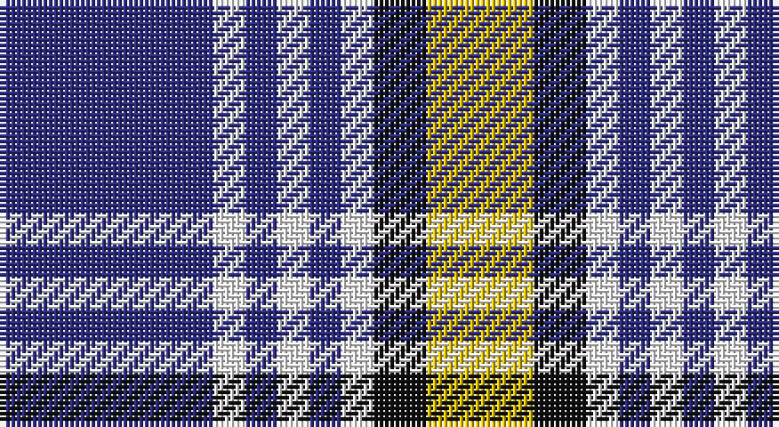

This page is one **sett** — a single exact thread-count. It belongs to the [tartan](/setts/db20w3db3w3db3w3k5ly10/)
(the same proportion at any scale), whose colour order is pattern [BWBWBWKY](/stripes/bwbwbwky/).

Part of the [Kile](/tartans/kile/) tartan — the named design grouping this sett with its other cloths.

Sourced from tartans-authority.  It is a [8 stripe tartan](/stripes/stripes8/).

Original link http://www.tartansauthority.com/tartan-ferret/display/1320/

## Provenance

Earliest known date: January, 1983 This sett was recorded by Peter MacDonald on the 17th of January, 1983. MacDonald was engaged in research work for the Scottish Tartans Society at the time but the correspondence up until 1985 does not indicate whether the design was ever finalised or even woven. There is a similarity in structure with the Kyle tartan recorded in 1984. Interest in the Kile tartan was revived in 1995. (Scottish Tartans Society correspondence) The name, Kyle or Kile, is associated with the Carrick District.

3 attestations — the source records this cloth was collapsed from (oldest owns this page)

<ul>
<li>1983 — Kile (No red line) (Personal) (tartans-authority, <a href="http://www.tartansauthority.com/tartan-ferret/display/1320/">record</a>)</li>
<li>undated — Kile (weddslist, <a href="http://www.weddslist.com/cgi-bin/tartans/pg.pl?source=sts">record</a>)</li>
<li>undated — Kile Family Tartan (house-of-tartan, <a href="http://www.house-of-tartan.scotland.net/house/TartanViewjs.asp?colr=Def&tnam=1320">record</a>)</li>
</ul>

## Register references

External register numbers recorded for this tartan.

- Scottish Tartans Authority (ITI): 1320

## Thread count
DB/40 W6 DB6 W6 DB6 W6 K10 Y/20

One full sett is **140 threads**.

## Palette

Palette: <strong>Tartan Register</strong>
<table><thead><tr><th>Colour</th><th>Threads</th><th>Shade</th><th>Base</th><th>OKLCh</th></tr></thead><tbody><tr><td>DB/</td><td style="text-align:right;font-variant-numeric:tabular-nums">40</td><td><code style="background-color:#2C2C80;">#2C2C80</code> <small style="color:#888">#2C2C80</small></td><td>B <code style="background-color:#2A418A;">#2A418A</code></td><td><small style="color:#888">oklch(35.0% 0.138 276.6)</small></td></tr><tr><td>W</td><td style="text-align:right;font-variant-numeric:tabular-nums">6</td><td><code style="background-color:#FCFCFC;">#FCFCFC</code> <small style="color:#888">#FCFCFC</small></td><td>W <code style="background-color:#F7F7F7;">#F7F7F7</code></td><td><small style="color:#888">oklch(99.1% 0.000 89.9)</small></td></tr><tr><td>DB</td><td style="text-align:right;font-variant-numeric:tabular-nums">6</td><td><code style="background-color:#2C2C80;">#2C2C80</code> <small style="color:#888">#2C2C80</small></td><td>B <code style="background-color:#2A418A;">#2A418A</code></td><td><small style="color:#888">oklch(35.0% 0.138 276.6)</small></td></tr><tr><td>W</td><td style="text-align:right;font-variant-numeric:tabular-nums">6</td><td><code style="background-color:#FCFCFC;">#FCFCFC</code> <small style="color:#888">#FCFCFC</small></td><td>W <code style="background-color:#F7F7F7;">#F7F7F7</code></td><td><small style="color:#888">oklch(99.1% 0.000 89.9)</small></td></tr><tr><td>DB</td><td style="text-align:right;font-variant-numeric:tabular-nums">6</td><td><code style="background-color:#2C2C80;">#2C2C80</code> <small style="color:#888">#2C2C80</small></td><td>B <code style="background-color:#2A418A;">#2A418A</code></td><td><small style="color:#888">oklch(35.0% 0.138 276.6)</small></td></tr><tr><td>W</td><td style="text-align:right;font-variant-numeric:tabular-nums">6</td><td><code style="background-color:#FCFCFC;">#FCFCFC</code> <small style="color:#888">#FCFCFC</small></td><td>W <code style="background-color:#F7F7F7;">#F7F7F7</code></td><td><small style="color:#888">oklch(99.1% 0.000 89.9)</small></td></tr><tr><td>K</td><td style="text-align:right;font-variant-numeric:tabular-nums">10</td><td><code style="background-color:#101010;">#101010</code> <small style="color:#888">#101010</small></td><td>K <code style="background-color:#000000;">#000000</code></td><td><small style="color:#888">oklch(17.3% 0.000 89.9)</small></td></tr><tr><td>Y/</td><td style="text-align:right;font-variant-numeric:tabular-nums">20</td><td><code style="background-color:#E8C000;">#E8C000</code> <small style="color:#888">#E8C000</small></td><td>Y <code style="background-color:#F2BF00;">#F2BF00</code></td><td><small style="color:#888">oklch(81.9% 0.168 93.7)</small></td></tr></tbody></table>

# Sample pattern

## Nearest tartans

The nearest existing variants by ΔTartan distance, with this tartan at the top so the swatches line up against it.

ΔTartan

Tartan

Sett

—

<a href="/ttd/edit/#slug=db20w3db3w3db3w3k5ly10~x2">Kile (No red line) (Personal)</a> <a class="nn-out" href="/variants/s8/db20w3db3w3db3w3k5ly10~x2/" title="open its dictionary page">↗</a>

1.14

<a href="/ttd/edit/#slug=db32r4db4ly4db9lr9db4lr16w7~x2&amp;base=db20w3db3w3db3w3k5ly10~x2">Nevada State</a> <a class="nn-out" href="/variants/s9/db32r4db4ly4db9lr9db4lr16w7~x2/" title="open its dictionary page">↗</a>

1.16

<a href="/variants/s8/wi32db3r4db3r8db32w3db4~x2/">Clemens and August (Personal)</a>

1.18

<a href="/ttd/edit/#slug=g6db11w8k4w8k4w8k27w4~x2&amp;base=db20w3db3w3db3w3k5ly10~x2">Breton District Tartan</a> <a class="nn-out" href="/variants/s9/g6db11w8k4w8k4w8k27w4~x2/" title="open its dictionary page">↗</a>

1.20

<a href="/ttd/edit/#slug=w5k3w26db21w3db8ly3~x2&amp;base=db20w3db3w3db3w3k5ly10~x2">MacPherson Dress Blue (Dance)</a> <a class="nn-out" href="/variants/s7/w5k3w26db21w3db8ly3~x2/" title="open its dictionary page">↗</a>

1.25

<a href="/ttd/edit/#slug=r9w5t57k5t9r29k18w9&amp;base=db20w3db3w3db3w3k5ly10~x2">Yale College of Wrexham (Corporate)</a> <a class="nn-out" href="/variants/s8/r9w5t57k5t9r29k18w9/" title="open its dictionary page">↗</a>

1.27

<a href="/ttd/edit/#slug=k6m2k12y3k6lb16y3lb16k2~x2&amp;base=db20w3db3w3db3w3k5ly10~x2">MacMillan</a> <a class="nn-out" href="/variants/s9/k6m2k12y3k6lb16y3lb16k2~x2/" title="open its dictionary page">↗</a>

1.27

<a href="/ttd/edit/#slug=lr3dg18k4lb12dg2lb3dg2lb3dg2lb12lr4lb3~x2&amp;base=db20w3db3w3db3w3k5ly10~x2">Breifne</a> <a class="nn-out" href="/variants/s12/lr3dg18k4lb12dg2lb3dg2lb3dg2lb12lr4lb3~x2/" title="open its dictionary page">↗</a>

1.27

<a href="/ttd/edit/#slug=r3db15w13o6db2o2r2~x2&amp;base=db20w3db3w3db3w3k5ly10~x2">Thom(p)son, Navy</a> <a class="nn-out" href="/variants/s7/r3db15w13o6db2o2r2~x2/" title="open its dictionary page">↗</a>

1.29

<a href="/variants/s14/db20w3db3w3db3w3k5ly10~x2/">Kile (No red line) (Personal)</a>

1.29

<a href="/ttd/edit/#slug=r12k3w14dt10k2dt24r2~x2&amp;base=db20w3db3w3db3w3k5ly10~x2">Yusra Personal Tartan</a> <a class="nn-out" href="/variants/s7/r12k3w14dt10k2dt24r2~x2/" title="open its dictionary page">↗</a>

## Neighbour map

Every grey dot is one of 14360 variants placed by the first two principal components of the ΔTartan feature space (44% of its variance). Red is this tartan; blue dots are its nearest — click one to open its page.

<svg viewBox="0 0 640 380" role="img" style="max-width:100%;height:auto;border:1px solid #e0e0e0;border-radius:4px;display:block" xmlns="http://www.w3.org/2000/svg"><image href="/nn/cloud.v1.png" width="640" height="380"/><a href="/variants/s9/db32r4db4ly4db9lr9db4lr16w7~x2/"><circle cx="227.0" cy="166.3" r="4" fill="#3465a4"><title>Nevada State</title></circle></a><a href="/variants/s8/wi32db3r4db3r8db32w3db4~x2/"><circle cx="227.9" cy="149.0" r="4" fill="#3465a4"><title>Clemens and August (Personal)</title></circle></a><a href="/variants/s9/g6db11w8k4w8k4w8k27w4~x2/"><circle cx="158.4" cy="192.3" r="4" fill="#3465a4"><title>Breton District Tartan</title></circle></a><a href="/variants/s7/w5k3w26db21w3db8ly3~x2/"><circle cx="234.0" cy="178.1" r="4" fill="#3465a4"><title>MacPherson Dress Blue (Dance)</title></circle></a><a href="/variants/s8/r9w5t57k5t9r29k18w9/"><circle cx="225.3" cy="167.9" r="4" fill="#3465a4"><title>Yale College of Wrexham (Corporate)</title></circle></a><a href="/variants/s9/k6m2k12y3k6lb16y3lb16k2~x2/"><circle cx="207.8" cy="187.8" r="4" fill="#3465a4"><title>MacMillan</title></circle></a><a href="/variants/s12/lr3dg18k4lb12dg2lb3dg2lb3dg2lb12lr4lb3~x2/"><circle cx="219.4" cy="167.9" r="4" fill="#3465a4"><title>Breifne</title></circle></a><a href="/variants/s7/r3db15w13o6db2o2r2~x2/"><circle cx="151.2" cy="190.0" r="4" fill="#3465a4"><title>Thom(p)son, Navy</title></circle></a><a href="/variants/s14/db20w3db3w3db3w3k5ly10~x2/"><circle cx="157.5" cy="156.2" r="4" fill="#3465a4"><title>Kile (No red line) (Personal)</title></circle></a><a href="/variants/s7/r12k3w14dt10k2dt24r2~x2/"><circle cx="227.4" cy="183.8" r="4" fill="#3465a4"><title>Yusra Personal Tartan</title></circle></a><circle cx="205.8" cy="183.1" r="5" fill="#c00000"/></svg>

ID: /variants/s8/db20w3db3w3db3w3k5ly10~x2/
