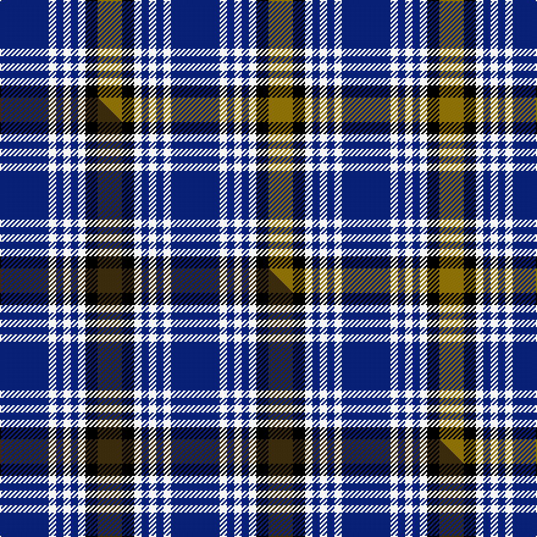

This is one **variant** — a specific cloth: this exact thread count and colourway, with its own
provenance below. It is one weaving of the [sett](/tartans/k/ki/kile/) (the scale-free proportion — the
same cloth at any scale or shade), whose colour order is pattern [BWBWBWKG](/stripes/bwbwbwkg/).

Part of the [Kile](/tartans/k/ki/kile/) tartan — the named design grouping this sett with its other cloths.

Sourced from weddslist.  It is a [8 stripe tartan](/stripes/stripes8/).

Original link [http://www.weddslist.com/cgi-bin/tartans/pg.pl?source=sts](http://www.weddslist.com/cgi-bin/tartans/pg.pl?source=sts)

## Provenance

Earliest known date: January, 1983 This sett was recorded by Peter MacDonald on the 17th of January, 1983. MacDonald was engaged in research work for the Scottish Tartans Society at the time but the correspondence up until 1985 does not indicate whether the design was ever finalised or even woven. There is a similarity in structure with the Kyle tartan recorded in 1984. Interest in the Kile tartan was revived in 1995. (Scottish Tartans Society correspondence) The name, Kyle or Kile, is associated with the Carrick District.

2 attestations — the source records this cloth was collapsed from (oldest owns this page)

<ul>
<li>undated — Kile (weddslist, <a href="http://www.weddslist.com/cgi-bin/tartans/pg.pl?source=sts">record</a>) </li>
<li>undated — Kile Family Tartan (house-of-tartan, <a href="http://www.house-of-tartan.scotland.net/house/TartanViewjs.asp?colr=Def&tnam=1320">record</a>) </li>
</ul>

Dataset <small>— provenance for this record, inherited from the source manifest</small>

<dl class="dataset-prov">
<dt>source</dt><dd><a href="/sources/weddslist/">Weddslist</a></dd>
<dt>data captured from</dt><dd><a href="https://github.com/thetartan/tartan-database/blob/master/data/weddslist/data.csv">https://github.com/thetartan/tartan-database/blob/master/data/weddslist/data.csv</a></dd>
<dt>data date</dt><dd>2016-11-17 <small>(dataset default)</small></dd>
<dt>licence</dt><dd><a href="https://creativecommons.org/licenses/by-nc-nd/4.0/">CC BY-NC-ND 4.0</a></dd>
</dl>

Capture chain <small>— the hands this data passed through, oldest first; each capture carries its own licence</small>

<ol class="capture-chain">
<li><a href="https://www.weddslist.com/tartans/">Weddslist</a> <small>the living privately compiled reference</small></li>
<li><a href="https://github.com/thetartan/tartan-database">thetartan/tartan-database</a> <small>2016-2017</small> · <a href="https://creativecommons.org/licenses/by-nc-nd/4.0/">CC BY-NC-ND 4.0</a> <small>Levko Kravets's frozen compilation — the capture we vendored, and where its CC licence text came from</small></li>
<li>this dictionary <small>captured 2026-06-10 · commit 5bf86c7566</small> <small>each re-capture is a git commit to data/sources</small></li>
</ol>

## Thread count
DB/40 W6 DB6 W6 DB6 W6 K10 Y/20

One full sett is **140 threads**.

## Palette
<table><thead><tr><th>Colour</th><th>Shade</th><th>OKLCh</th></tr></thead><tbody><tr><td>DB</td><td><code style="background-color:#082077;">#082077</code> <small style="color:#888">#082077</small></td><td><small style="color:#888">oklch(30.0% 0.149 265.1)</small></td></tr><tr><td>K</td><td><code style="background-color:#000000;">#000000</code> <small style="color:#888">#000000</small></td><td><small style="color:#888">oklch(0.0% 0.000 0.0)</small></td></tr><tr><td>W</td><td><code style="background-color:#F7F7F7;">#F7F7F7</code> <small style="color:#888">#F7F7F7</small></td><td><small style="color:#888">oklch(97.6% 0.000 89.9)</small></td></tr><tr><td>Y</td><td><code style="background-color:#8B6E00;">#8B6E00</code> <small style="color:#888">#8B6E00</small></td><td><small style="color:#888">oklch(55.1% 0.113 90.4)</small></td></tr></tbody></table>

# Sample pattern

## Compared to the master

This cloth is one sett of its design; the master sett (the exemplar the design is anchored on) is below for comparison.

Its **ΔTartan distance** from the master is **0.10** — the same measure the nearest-tartans table ranks by (0 is identical; a re-scale of the same cloth is near 0, a recolour or a different proportion further).

<figure class="master-compare" style="margin:0">

this sett
master sett ★

<figcaption style="color:#888;font-size:smaller">One weave of this sett against the <a href="/setts/db20w3db3w3db3w3k5dy10/">master sett ★</a>, split on the diagonal: a shared proportion runs seamlessly across it with only the shades shifting; a different proportion breaks on it.</figcaption>
</figure>

## Nearest tartan variants

The nearest existing variants by ΔTartan distance, with this cloth at the top so the swatches line up against it.

ΔTartan

Threads

Variant

Sett

—

140

<a href="/variants/s8/db20w3db3w3db3w3k5y10~x2/">Kile</a>

<a href="/ttd/edit/#slug=db20w3db3w3db3w3k5dy10~x2&amp;base=db20w3db3w3db3w3k5y10~x2" title="compare in the TTD">0.10</a>

140

<a href="/variants/s8/db20w3db3w3db3w3k5dy10~x2/">Kile (No red line) (Personal)</a>

<a href="/ttd/edit/#slug=db18w3db3w3dr3w3k5ly12~x2&amp;base=db20w3db3w3db3w3k5y10~x2" title="compare in the TTD">1.31</a>

140

<a href="/variants/s8/db18w3db3w3dr3w3k5ly12~x2/">Kile (Red line) (Personal)</a>

<a href="/ttd/edit/#slug=r3db2w2db26k22w3db3w3~x2&amp;base=db20w3db3w3db3w3k5y10~x2" title="compare in the TTD">2.27</a>

244

<a href="/variants/s8/r3db2w2db26k22w3db3w3~x2/">DeCloud-McMasters (Personal)</a>

<a href="/ttd/edit/#slug=k3lb10db2g6db18g2~x2&amp;base=db20w3db3w3db3w3k5y10~x2" title="compare in the TTD">2.28</a>

154

<a href="/variants/s6/k3lb10db2g6db18g2~x2/">Crombie House Check</a>

<a href="/ttd/edit/#slug=w5k3w26db21w3db8y3~x2&amp;base=db20w3db3w3db3w3k5y10~x2" title="compare in the TTD">2.35</a>

260

<a href="/variants/s7/w5k3w26db21w3db8y3~x2/">MacPherson Dress Blue (Dance)</a>

<a href="/ttd/edit/#slug=k3lo2b14k14lb2k14lb2b6lb2b16lb3~x2&amp;base=db20w3db3w3db3w3k5y10~x2" title="compare in the TTD">2.49</a>

300

<a href="/variants/s11/k3lo2b14k14lb2k14lb2b6lb2b16lb3~x2/">Immanuel Presbyterian Church (Corp)</a>

<a href="/ttd/edit/#slug=n19k2w2k2b5k2b5~x4&amp;base=db20w3db3w3db3w3k5y10~x2" title="compare in the TTD">2.57</a>

200

<a href="/variants/s7/n19k2w2k2b5k2b5~x4/">Kyle</a>

<a href="/ttd/edit/#slug=w4r2db20k6w5k4w3k2r2db2~x2&amp;base=db20w3db3w3db3w3k5y10~x2" title="compare in the TTD">2.64</a>

188

<a href="/variants/s10/w4r2db20k6w5k4w3k2r2db2~x2/">Knights Templar St Andrews Corporate Tartan</a>

<a href="/ttd/edit/#slug=db18g6db2lb10k3lb10db2g6db18g2~x2~db1406275&amp;base=db20w3db3w3db3w3k5y10~x2" title="compare in the TTD">2.78</a>

268

<a href="/variants/s10/db18g6db2lb10k3lb10db2g6db18g2~x2~db1406275/">Crombie House Check Corporate Tartan</a>

<a href="/ttd/edit/#slug=db11k4w5k1r3k1w5k4db11r1~x4~db1406275&amp;base=db20w3db3w3db3w3k5y10~x2" title="compare in the TTD">2.79</a>

320

<a href="/variants/s10/db11k4w5k1r3k1w5k4db11r1~x4~db1406275/">Hydro-Electric</a>

## Neighbour map

Every grey dot is one of 13656 variants placed by the first two principal components of the ΔTartan feature space (42% of its variance). Red is this tartan; blue dots are its nearest — click one to open its page. The map is a flat projection of a many-dimensional space — [how to read it](/posts/neighbourhood-maps/).

<svg viewBox="0 0 640 380" role="img" style="max-width:100%;height:auto;border:1px solid #e0e0e0;border-radius:4px;display:block" xmlns="http://www.w3.org/2000/svg"><image href="/nn/cloud.v1.png" width="640" height="380"/><a href="/variants/s8/db20w3db3w3db3w3k5dy10~x2/"><circle cx="147.1" cy="162.4" r="4" fill="#3465a4"><title>Kile (No red line) (Personal)</title></circle></a><a href="/variants/s8/db18w3db3w3dr3w3k5ly12~x2/"><circle cx="120.9" cy="185.9" r="4" fill="#3465a4"><title>Kile (Red line) (Personal)</title></circle></a><a href="/variants/s8/r3db2w2db26k22w3db3w3~x2/"><circle cx="234.7" cy="144.9" r="4" fill="#3465a4"><title>DeCloud-McMasters (Personal)</title></circle></a><a href="/variants/s6/k3lb10db2g6db18g2~x2/"><circle cx="208.6" cy="199.4" r="4" fill="#3465a4"><title>Crombie House Check</title></circle></a><a href="/variants/s7/w5k3w26db21w3db8y3~x2/"><circle cx="227.3" cy="188.2" r="4" fill="#3465a4"><title>MacPherson Dress Blue (Dance)</title></circle></a><a href="/variants/s11/k3lo2b14k14lb2k14lb2b6lb2b16lb3~x2/"><circle cx="186.9" cy="177.8" r="4" fill="#3465a4"><title>Immanuel Presbyterian Church (Corp)</title></circle></a><a href="/variants/s7/n19k2w2k2b5k2b5~x4/"><circle cx="257.8" cy="176.0" r="4" fill="#3465a4"><title>Kyle</title></circle></a><a href="/variants/s10/w4r2db20k6w5k4w3k2r2db2~x2/"><circle cx="166.1" cy="147.7" r="4" fill="#3465a4"><title>Knights Templar St Andrews Corporate Tartan</title></circle></a><a href="/variants/s10/db18g6db2lb10k3lb10db2g6db18g2~x2~db1406275/"><circle cx="234.4" cy="194.6" r="4" fill="#3465a4"><title>Crombie House Check Corporate Tartan</title></circle></a><a href="/variants/s10/db11k4w5k1r3k1w5k4db11r1~x4~db1406275/"><circle cx="171.2" cy="163.6" r="4" fill="#3465a4"><title>Hydro-Electric</title></circle></a><circle cx="199.9" cy="186.1" r="5" fill="#c00000"/><text x="320" y="376" text-anchor="middle" font-size="11" fill="#999">ground</text><text x="11" y="190" text-anchor="middle" font-size="11" fill="#999" transform="rotate(-90 11 190)">complexity</text></svg>

ID: /variants/s8/db20w3db3w3db3w3k5y10~x2/
