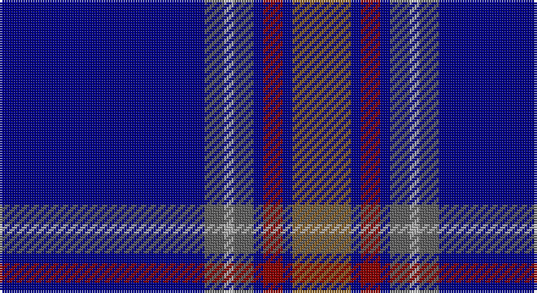

This page is one **sett** — a single exact thread-count. It belongs to the [tartan](/setts/db21n2lr1n2db1r2db1o6/)
(the same proportion at any scale), whose colour order is pattern [BBYBBRBR](/stripes/bbybbrbr/).

Part of the [Blue Rust](/tartans/blue-rust/) tartan — the named design grouping this sett with its other cloths.

Sourced from tartans-authority.  It is a [8 stripe tartan](/stripes/stripes8/).

Original link http://www.tartansauthority.com/tartan-ferret/display/3709/

## Register references

External register numbers recorded for this tartan.

- Scottish Tartans Authority (ITI): 3709

## Thread count
DB/84 N8 Na4 N8 DB4 DR8 DB4 LT/24

One full sett is **180 threads**.

## Palette

Palette: <strong>Tartan Register</strong> <small style="color:#888">(1 of 5 colours)</small>
<table><thead><tr><th>Colour</th><th>Threads</th><th>Shade</th><th>Base</th><th>OKLCh</th></tr></thead><tbody><tr><td>DB/</td><td style="text-align:right;font-variant-numeric:tabular-nums">84</td><td><code style="background-color:#000088;">#000088</code> <small style="color:#888">#000088</small></td><td>B <code style="background-color:#2A418A;">#2A418A</code></td><td><small style="color:#888">oklch(28.3% 0.196 264.1)</small></td></tr><tr><td>N</td><td style="text-align:right;font-variant-numeric:tabular-nums">8</td><td><code style="background-color:#606060;">#606060</code> <small style="color:#888">#606060</small></td><td>B <code style="background-color:#2A418A;">#2A418A</code></td><td><small style="color:#888">oklch(48.9% 0.000 89.9)</small></td></tr><tr><td>Na</td><td style="text-align:right;font-variant-numeric:tabular-nums">4</td><td><code style="background-color:#ACACAC;">#ACACAC</code> <small style="color:#888">#ACACAC</small></td><td>Y <code style="background-color:#F2BF00;">#F2BF00</code></td><td><small style="color:#888">oklch(74.4% 0.000 89.9)</small></td></tr><tr><td>N</td><td style="text-align:right;font-variant-numeric:tabular-nums">8</td><td><code style="background-color:#606060;">#606060</code> <small style="color:#888">#606060</small></td><td>B <code style="background-color:#2A418A;">#2A418A</code></td><td><small style="color:#888">oklch(48.9% 0.000 89.9)</small></td></tr><tr><td>DB</td><td style="text-align:right;font-variant-numeric:tabular-nums">4</td><td><code style="background-color:#000088;">#000088</code> <small style="color:#888">#000088</small></td><td>B <code style="background-color:#2A418A;">#2A418A</code></td><td><small style="color:#888">oklch(28.3% 0.196 264.1)</small></td></tr><tr><td>DR</td><td style="text-align:right;font-variant-numeric:tabular-nums">8</td><td><code style="background-color:#880000;">#880000</code> <small style="color:#888">#880000</small></td><td>R <code style="background-color:#CC0000;">#CC0000</code></td><td><small style="color:#888">oklch(39.4% 0.162 29.2)</small></td></tr><tr><td>DB</td><td style="text-align:right;font-variant-numeric:tabular-nums">4</td><td><code style="background-color:#000088;">#000088</code> <small style="color:#888">#000088</small></td><td>B <code style="background-color:#2A418A;">#2A418A</code></td><td><small style="color:#888">oklch(28.3% 0.196 264.1)</small></td></tr><tr><td>LT/</td><td style="text-align:right;font-variant-numeric:tabular-nums">24</td><td><code style="background-color:#886024;">#886024</code> <small style="color:#888">#886024</small></td><td>R <code style="background-color:#CC0000;">#CC0000</code></td><td><small style="color:#888">oklch(52.0% 0.092 74.0)</small></td></tr></tbody></table>

# Sample pattern

## Compared to the master

This cloth is one sett of its design; the master sett (the exemplar the design is anchored on) is below for comparison.

<figure style="margin:0"><figcaption style="color:#888;font-size:smaller">this sett</figcaption></figure>
<figure style="margin:0"><figcaption style="color:#888;font-size:smaller"><a href="/setts/db21n2w1n2db1r2db1o6/">master sett →</a></figcaption></figure>

## Nearest tartans

The nearest existing variants by ΔTartan distance, with this tartan at the top so the swatches line up against it.

ΔTartan

Tartan

Sett

—

<a href="/ttd/edit/#slug=db21n2lr1n2db1r2db1o6~x4">Blue Rust (Corporate)</a> <a class="nn-out" href="/variants/s8/db21n2lr1n2db1r2db1o6~x4/" title="open its dictionary page">↗</a>

0.43

<a href="/ttd/edit/#slug=db21n2w1n2db1r2db1o6~x4&amp;base=db21n2lr1n2db1r2db1o6~x4">Blue Rust</a> <a class="nn-out" href="/variants/s8/db21n2w1n2db1r2db1o6~x4/" title="open its dictionary page">↗</a>

1.04

<a href="/ttd/edit/#slug=db36k8g3r3g6k1lo2~x2&amp;base=db21n2lr1n2db1r2db1o6~x4">MacLaurin of Broich (Clan)</a> <a class="nn-out" href="/variants/s7/db36k8g3r3g6k1lo2~x2/" title="open its dictionary page">↗</a>

1.15

<a href="/ttd/edit/#slug=dt2w2dt43b5db4k8db2w2~x2&amp;base=db21n2lr1n2db1r2db1o6~x4">Fife Flyers</a> <a class="nn-out" href="/variants/s8/dt2w2dt43b5db4k8db2w2~x2/" title="open its dictionary page">↗</a>

1.16

<a href="/ttd/edit/#slug=db68o5k9o3k3lb3k3n20db9k3db5lb4&amp;base=db21n2lr1n2db1r2db1o6~x4">British Caledonian Airways #3</a> <a class="nn-out" href="/variants/s12/db68o5k9o3k3lb3k3n20db9k3db5lb4/" title="open its dictionary page">↗</a>

1.20

<a href="/ttd/edit/#slug=db32lb1db1lo2db1r1db4dg16~x4&amp;base=db21n2lr1n2db1r2db1o6~x4">Royal Agricultural Winter Fair</a> <a class="nn-out" href="/variants/s8/db32lb1db1lo2db1r1db4dg16~x4/" title="open its dictionary page">↗</a>

1.23

<a href="/ttd/edit/#slug=lb3k6lbi2k6db2k2db32k2n1~x2&amp;base=db21n2lr1n2db1r2db1o6~x4">Nocken (Personal)</a> <a class="nn-out" href="/variants/s9/lb3k6lbi2k6db2k2db32k2n1~x2/" title="open its dictionary page">↗</a>

1.26

<a href="/ttd/edit/#slug=r1db2dt1dbi3dt19db3ly1db2ly1~x4&amp;base=db21n2lr1n2db1r2db1o6~x4">Pagus Wasia</a> <a class="nn-out" href="/variants/s9/r1db2dt1dbi3dt19db3ly1db2ly1~x4/" title="open its dictionary page">↗</a>

1.32

<a href="/ttd/edit/#slug=db6dp3db56k24g6r6g6&amp;base=db21n2lr1n2db1r2db1o6~x4">Wcwm 9275-1395</a> <a class="nn-out" href="/variants/s7/db6dp3db56k24g6r6g6/" title="open its dictionary page">↗</a>

1.33

<a href="/ttd/edit/#slug=g20lr6db20ly3db48r6db4r6~x2&amp;base=db21n2lr1n2db1r2db1o6~x4">Warren Wilson College (Corporate)</a> <a class="nn-out" href="/variants/s8/g20lr6db20ly3db48r6db4r6~x2/" title="open its dictionary page">↗</a>

1.35

<a href="/ttd/edit/#slug=db20dy1db1dy1dg8k1w3~x2&amp;base=db21n2lr1n2db1r2db1o6~x4">Chestico</a> <a class="nn-out" href="/variants/s7/db20dy1db1dy1dg8k1w3~x2/" title="open its dictionary page">↗</a>

## Neighbour map

Every grey dot is one of 14360 variants placed by the first two principal components of the ΔTartan feature space (44% of its variance). Red is this tartan; blue dots are its nearest — click one to open its page.

<svg viewBox="0 0 640 380" role="img" style="max-width:100%;height:auto;border:1px solid #e0e0e0;border-radius:4px;display:block" xmlns="http://www.w3.org/2000/svg"><image href="/nn/cloud.v1.png" width="640" height="380"/><a href="/variants/s8/db21n2w1n2db1r2db1o6~x4/"><circle cx="382.8" cy="133.9" r="4" fill="#3465a4"><title>Blue Rust</title></circle></a><a href="/variants/s7/db36k8g3r3g6k1lo2~x2/"><circle cx="399.5" cy="132.9" r="4" fill="#3465a4"><title>MacLaurin of Broich (Clan)</title></circle></a><a href="/variants/s8/dt2w2dt43b5db4k8db2w2~x2/"><circle cx="395.4" cy="129.0" r="4" fill="#3465a4"><title>Fife Flyers</title></circle></a><a href="/variants/s12/db68o5k9o3k3lb3k3n20db9k3db5lb4/"><circle cx="379.8" cy="114.6" r="4" fill="#3465a4"><title>British Caledonian Airways #3</title></circle></a><a href="/variants/s8/db32lb1db1lo2db1r1db4dg16~x4/"><circle cx="449.5" cy="140.3" r="4" fill="#3465a4"><title>Royal Agricultural Winter Fair</title></circle></a><a href="/variants/s9/lb3k6lbi2k6db2k2db32k2n1~x2/"><circle cx="406.6" cy="120.6" r="4" fill="#3465a4"><title>Nocken (Personal)</title></circle></a><a href="/variants/s9/r1db2dt1dbi3dt19db3ly1db2ly1~x4/"><circle cx="375.2" cy="141.7" r="4" fill="#3465a4"><title>Pagus Wasia</title></circle></a><a href="/variants/s7/db6dp3db56k24g6r6g6/"><circle cx="358.2" cy="171.5" r="4" fill="#3465a4"><title>Wcwm 9275-1395</title></circle></a><a href="/variants/s8/g20lr6db20ly3db48r6db4r6~x2/"><circle cx="350.6" cy="165.9" r="4" fill="#3465a4"><title>Warren Wilson College (Corporate)</title></circle></a><a href="/variants/s7/db20dy1db1dy1dg8k1w3~x2/"><circle cx="352.6" cy="145.2" r="4" fill="#3465a4"><title>Chestico</title></circle></a><circle cx="395.7" cy="140.5" r="5" fill="#c00000"/></svg>

ID: /variants/s8/db21n2lr1n2db1r2db1o6~x4/
