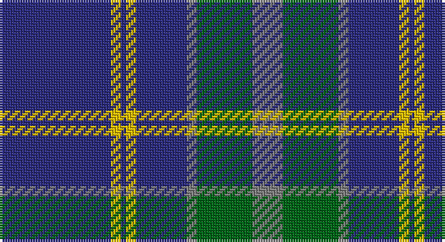

This page is one **sett** — a single exact thread-count. It belongs to the [tartan](/setts/db22ly2db1ly2db10y2g11y6/)
(the same proportion at any scale), whose colour order is pattern [BYBYBGGG](/stripes/bybybggg/).

Part of the [Katsushika](/tartans/katsushika/) tartan — the named design grouping this sett with its other cloths.

Sourced from tartans-authority.  It is a [8 stripe tartan](/stripes/stripes8/).

Original link http://www.tartansauthority.com/tartan-ferret/display/2343/

## Also known as

This cloth is also recorded under:

- Katsushika Scottish Country Dancers

## Register references

External register numbers recorded for this tartan.

- Scottish Tartans Authority (ITI): 2343

## Thread count
DB/44 Y4 DB2 Y4 DB20 N4 G22 N/12

One full sett is **168 threads**.

## Palette

Palette: <strong>Tartan Register</strong>
<table><thead><tr><th>Colour</th><th>Threads</th><th>Shade</th><th>Base</th><th>OKLCh</th></tr></thead><tbody><tr><td>DB/</td><td style="text-align:right;font-variant-numeric:tabular-nums">44</td><td><code style="background-color:#2C2C80;">#2C2C80</code> <small style="color:#888">#2C2C80</small></td><td>B <code style="background-color:#2A418A;">#2A418A</code></td><td><small style="color:#888">oklch(35.0% 0.138 276.6)</small></td></tr><tr><td>Y</td><td style="text-align:right;font-variant-numeric:tabular-nums">4</td><td><code style="background-color:#E8C000;">#E8C000</code> <small style="color:#888">#E8C000</small></td><td>Y <code style="background-color:#F2BF00;">#F2BF00</code></td><td><small style="color:#888">oklch(81.9% 0.168 93.7)</small></td></tr><tr><td>DB</td><td style="text-align:right;font-variant-numeric:tabular-nums">2</td><td><code style="background-color:#2C2C80;">#2C2C80</code> <small style="color:#888">#2C2C80</small></td><td>B <code style="background-color:#2A418A;">#2A418A</code></td><td><small style="color:#888">oklch(35.0% 0.138 276.6)</small></td></tr><tr><td>Y</td><td style="text-align:right;font-variant-numeric:tabular-nums">4</td><td><code style="background-color:#E8C000;">#E8C000</code> <small style="color:#888">#E8C000</small></td><td>Y <code style="background-color:#F2BF00;">#F2BF00</code></td><td><small style="color:#888">oklch(81.9% 0.168 93.7)</small></td></tr><tr><td>DB</td><td style="text-align:right;font-variant-numeric:tabular-nums">20</td><td><code style="background-color:#2C2C80;">#2C2C80</code> <small style="color:#888">#2C2C80</small></td><td>B <code style="background-color:#2A418A;">#2A418A</code></td><td><small style="color:#888">oklch(35.0% 0.138 276.6)</small></td></tr><tr><td>N</td><td style="text-align:right;font-variant-numeric:tabular-nums">4</td><td><code style="background-color:#808080;">#808080</code> <small style="color:#888">#808080</small></td><td>G <code style="background-color:#006100;">#006100</code></td><td><small style="color:#888">oklch(60.0% 0.000 89.9)</small></td></tr><tr><td>G</td><td style="text-align:right;font-variant-numeric:tabular-nums">22</td><td><code style="background-color:#006818;">#006818</code> <small style="color:#888">#006818</small></td><td>G <code style="background-color:#006100;">#006100</code></td><td><small style="color:#888">oklch(45.0% 0.142 145.0)</small></td></tr><tr><td>N/</td><td style="text-align:right;font-variant-numeric:tabular-nums">12</td><td><code style="background-color:#808080;">#808080</code> <small style="color:#888">#808080</small></td><td>G <code style="background-color:#006100;">#006100</code></td><td><small style="color:#888">oklch(60.0% 0.000 89.9)</small></td></tr></tbody></table>

# Sample pattern

## Nearest tartans

The nearest existing variants by ΔTartan distance, with this tartan at the top so the swatches line up against it.

ΔTartan

Tartan

Sett

—

<a href="/ttd/edit/#slug=db22ly2db1ly2db10y2g11y6~x2">Katsushika (Corporate)</a> <a class="nn-out" href="/variants/s8/db22ly2db1ly2db10y2g11y6~x2/" title="open its dictionary page">↗</a>

0.82

<a href="/ttd/edit/#slug=g23db3k8db4g4db56ly8&amp;base=db22ly2db1ly2db10y2g11y6~x2">Tern House</a> <a class="nn-out" href="/variants/s7/g23db3k8db4g4db56ly8/" title="open its dictionary page">↗</a>

0.84

<a href="/ttd/edit/#slug=db22ly2db1ly2db10r2g11r6~x2&amp;base=db22ly2db1ly2db10y2g11y6~x2">Katsushika Scottish Country Dancers</a> <a class="nn-out" href="/variants/s8/db22ly2db1ly2db10r2g11r6~x2/" title="open its dictionary page">↗</a>

0.85

<a href="/ttd/edit/#slug=y8ly4y35db2lt8db2y4db21y4~x2&amp;base=db22ly2db1ly2db10y2g11y6~x2">Bedford Academy</a> <a class="nn-out" href="/variants/s9/y8ly4y35db2lt8db2y4db21y4~x2/" title="open its dictionary page">↗</a>

0.93

<a href="/ttd/edit/#slug=n42db2n2db17lo8db4~x2&amp;base=db22ly2db1ly2db10y2g11y6~x2">Connecticut State Police PB (Cor.)</a> <a class="nn-out" href="/variants/s6/n42db2n2db17lo8db4~x2/" title="open its dictionary page">↗</a>

0.94

<a href="/ttd/edit/#slug=w4y15db8k4db28k2db4w2&amp;base=db22ly2db1ly2db10y2g11y6~x2">Kelvinside Academy (School)</a> <a class="nn-out" href="/variants/s8/w4y15db8k4db28k2db4w2/" title="open its dictionary page">↗</a>

1.00

<a href="/ttd/edit/#slug=db2ly1db18g7r7db1g1~x2&amp;base=db22ly2db1ly2db10y2g11y6~x2">Unnamed C20th - USA</a> <a class="nn-out" href="/variants/s7/db2ly1db18g7r7db1g1~x2/" title="open its dictionary page">↗</a>

1.06

<a href="/ttd/edit/#slug=o1lb6db4lb1db16n1db4n6lb1~x4&amp;base=db22ly2db1ly2db10y2g11y6~x2">Fujisankei Serene (Corporate)</a> <a class="nn-out" href="/variants/s9/o1lb6db4lb1db16n1db4n6lb1~x4/" title="open its dictionary page">↗</a>

1.13

<a href="/ttd/edit/#slug=db3r3g18db16w2db26r3g3~x2&amp;base=db22ly2db1ly2db10y2g11y6~x2">MacHardy</a> <a class="nn-out" href="/variants/s8/db3r3g18db16w2db26r3g3~x2/" title="open its dictionary page">↗</a>

1.15

<a href="/ttd/edit/#slug=dg20db2g6db2dg4db27lo2db8~x2&amp;base=db22ly2db1ly2db10y2g11y6~x2">Kinross (Fashion)</a> <a class="nn-out" href="/variants/s8/dg20db2g6db2dg4db27lo2db8~x2/" title="open its dictionary page">↗</a>

1.15

<a href="/ttd/edit/#slug=k9t4k2t4k2t30k9t4db14ly2~x2&amp;base=db22ly2db1ly2db10y2g11y6~x2">Hannay Blue (Fashion?)</a> <a class="nn-out" href="/variants/s10/k9t4k2t4k2t30k9t4db14ly2~x2/" title="open its dictionary page">↗</a>

## Neighbour map

Every grey dot is one of 14360 variants placed by the first two principal components of the ΔTartan feature space (44% of its variance). Red is this tartan; blue dots are its nearest — click one to open its page.

<svg viewBox="0 0 640 380" role="img" style="max-width:100%;height:auto;border:1px solid #e0e0e0;border-radius:4px;display:block" xmlns="http://www.w3.org/2000/svg"><image href="/nn/cloud.v1.png" width="640" height="380"/><a href="/variants/s7/g23db3k8db4g4db56ly8/"><circle cx="370.7" cy="175.4" r="4" fill="#3465a4"><title>Tern House</title></circle></a><a href="/variants/s8/db22ly2db1ly2db10r2g11r6~x2/"><circle cx="346.2" cy="166.7" r="4" fill="#3465a4"><title>Katsushika Scottish Country Dancers</title></circle></a><a href="/variants/s9/y8ly4y35db2lt8db2y4db21y4~x2/"><circle cx="336.5" cy="159.7" r="4" fill="#3465a4"><title>Bedford Academy</title></circle></a><a href="/variants/s6/n42db2n2db17lo8db4~x2/"><circle cx="380.8" cy="179.7" r="4" fill="#3465a4"><title>Connecticut State Police PB (Cor.)</title></circle></a><a href="/variants/s8/w4y15db8k4db28k2db4w2/"><circle cx="351.5" cy="187.3" r="4" fill="#3465a4"><title>Kelvinside Academy (School)</title></circle></a><a href="/variants/s7/db2ly1db18g7r7db1g1~x2/"><circle cx="349.9" cy="173.6" r="4" fill="#3465a4"><title>Unnamed C20th - USA</title></circle></a><a href="/variants/s9/o1lb6db4lb1db16n1db4n6lb1~x4/"><circle cx="344.2" cy="168.9" r="4" fill="#3465a4"><title>Fujisankei Serene (Corporate)</title></circle></a><a href="/variants/s8/db3r3g18db16w2db26r3g3~x2/"><circle cx="360.0" cy="198.7" r="4" fill="#3465a4"><title>MacHardy</title></circle></a><a href="/variants/s8/dg20db2g6db2dg4db27lo2db8~x2/"><circle cx="333.8" cy="198.5" r="4" fill="#3465a4"><title>Kinross (Fashion)</title></circle></a><a href="/variants/s10/k9t4k2t4k2t30k9t4db14ly2~x2/"><circle cx="284.3" cy="161.9" r="4" fill="#3465a4"><title>Hannay Blue (Fashion?)</title></circle></a><circle cx="348.8" cy="173.7" r="5" fill="#c00000"/></svg>

ID: /variants/s8/db22ly2db1ly2db10y2g11y6~x2/
