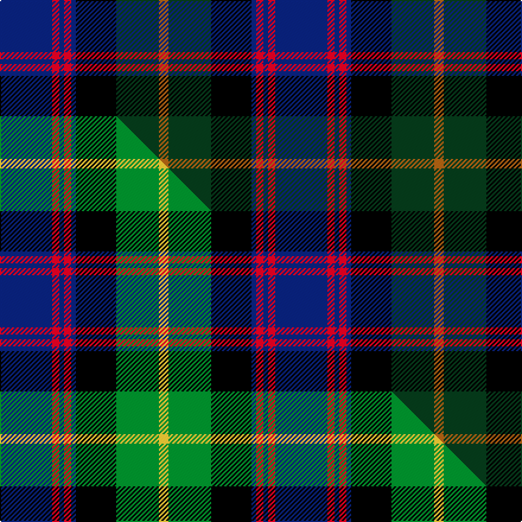

This is one **variant** — a specific cloth: this exact thread count and colourway, with its own
provenance below. It is one weaving of the [sett](/setts/db22r3db2r3db2k17dg18o4/) (the scale-free proportion — the
same cloth at any scale or shade), whose colour order is pattern [BRBRBKGR](/stripes/brbrbkgr/).

Part of the [Scotch House 2000 Original](/tartans/s/sc/scotch-house-2000-original/) tartan — the named design grouping this sett with its other cloths.

Sourced from weddslist.  It is a [8 stripe tartan](/stripes/stripes8/).

Original link [http://www.weddslist.com/cgi-bin/tartans/pg.pl?source=sts](http://www.weddslist.com/cgi-bin/tartans/pg.pl?source=sts)

Dataset <small>— provenance for this record, inherited from the source manifest</small>

<dl class="dataset-prov">
<dt>source</dt><dd><a href="/sources/weddslist/">Weddslist</a></dd>
<dt>data captured from</dt><dd><a href="https://github.com/thetartan/tartan-database/blob/master/data/weddslist/data.csv">https://github.com/thetartan/tartan-database/blob/master/data/weddslist/data.csv</a></dd>
<dt>data date</dt><dd>2016-11-17 <small>(dataset default)</small></dd>
<dt>licence</dt><dd><a href="https://creativecommons.org/licenses/by-nc-nd/4.0/">CC BY-NC-ND 4.0</a></dd>
</dl>

Capture chain <small>— the hands this data passed through, oldest first; each capture carries its own licence</small>

<ol class="capture-chain">
<li><a href="https://www.weddslist.com/tartans/">Weddslist</a> <small>the living privately compiled reference</small></li>
<li><a href="https://github.com/thetartan/tartan-database">thetartan/tartan-database</a> <small>2016-2017</small> · <a href="https://creativecommons.org/licenses/by-nc-nd/4.0/">CC BY-NC-ND 4.0</a> <small>Levko Kravets's frozen compilation — the capture we vendored, and where its CC licence text came from</small></li>
<li>this dictionary <small>captured 2026-06-10 · commit 5bf86c7566</small> <small>each re-capture is a git commit to data/sources</small></li>
</ol>

## Thread count
DB/44 R6 DB4 R6 DB4 K34 DG36 O/8

One full sett is **232 threads**.

## Palette
<table><thead><tr><th>Colour</th><th>Shade</th><th>OKLCh</th></tr></thead><tbody><tr><td>DB</td><td><code style="background-color:#082077;">#082077</code> <small style="color:#888">#082077</small></td><td><small style="color:#888">oklch(30.0% 0.149 265.1)</small></td></tr><tr><td>DG</td><td><code style="background-color:#053819;">#053819</code> <small style="color:#888">#053819</small></td><td><small style="color:#888">oklch(30.0% 0.075 151.3)</small></td></tr><tr><td>K</td><td><code style="background-color:#000000;">#000000</code> <small style="color:#888">#000000</small></td><td><small style="color:#888">oklch(0.0% 0.000 0.0)</small></td></tr><tr><td>O</td><td><code style="background-color:#A65C11;">#A65C11</code> <small style="color:#888">#A65C11</small></td><td><small style="color:#888">oklch(55.0% 0.125 58.3)</small></td></tr><tr><td>R</td><td><code style="background-color:#D60020;">#D60020</code> <small style="color:#888">#D60020</small></td><td><small style="color:#888">oklch(55.2% 0.224 25.5)</small></td></tr></tbody></table>

# Sample pattern

## Compared to the master

This cloth is one sett of its design; the master sett (the exemplar the design is anchored on) is below for comparison.

Its **ΔTartan distance** from the master is **0.39** — the same measure the nearest-tartans table ranks by (0 is identical; a re-scale of the same cloth is near 0, a recolour or a different proportion further).

<figure class="master-compare" style="margin:0">

this sett
master sett ★

<figcaption style="color:#888;font-size:smaller">One weave of this sett against the <a href="/setts/db22r3db2r3db2k17g18ly4/">master sett ★</a>, split on the diagonal: a shared proportion runs seamlessly across it with only the shades shifting; a different proportion breaks on it.</figcaption>
</figure>

## Nearest tartan variants

The nearest existing variants by ΔTartan distance, with this cloth at the top so the swatches line up against it.

ΔTartan

Threads

Variant

Sett

—

232

<a href="/variants/s8/db22r3db2r3db2k17dg18o4~x2/">Scotch House 2000, original</a>

<a href="/ttd/edit/#slug=dt11k1dt1k1dt1k7dg8r1n7~x4~dt1204274-n2203265&amp;base=db22r3db2r3db2k17dg18o4~x2" title="compare in the TTD">1.44</a>

232

<a href="/variants/s9/db11k1db1k1db1k7dg8r1n7~x4~db1204274-n2203265/">Damm, Alexander (Personal)</a>

<a href="/ttd/edit/#slug=db22r3db2r3db2k17dy18g4~x2&amp;base=db22r3db2r3db2k17dg18o4~x2" title="compare in the TTD">1.70</a>

232

<a href="/variants/s8/db22r3db2r3db2k17dy18g4~x2/">Scotch House 2000 Antique</a>

<a href="/ttd/edit/#slug=db22r3db2r3db2k17o18dg4~x2&amp;base=db22r3db2r3db2k17dg18o4~x2" title="compare in the TTD">1.70</a>

232

<a href="/variants/s8/db22r3db2r3db2k17o18dg4~x2/">Scotch House 2000, antique</a>

<a href="/ttd/edit/#slug=dg3db12lb1k12dg13r2dg2~x2&amp;base=db22r3db2r3db2k17dg18o4~x2" title="compare in the TTD">1.81</a>

170

<a href="/variants/s7/dg3db12lb1k12dg13r2dg2~x2/">MacPhedran/MacFadzean</a>

<a href="/ttd/edit/#slug=r6db3r3db32k30g30y3r3~x2&amp;base=db22r3db2r3db2k17dg18o4~x2" title="compare in the TTD">1.83</a>

422

<a href="/variants/s8/r6db3r3db32k30g30y3r3~x2/">MacDonald of Borrodale (Clan)</a>

<a href="/ttd/edit/#slug=ly4dg17k10db3k3db17dr3db3~x2&amp;base=db22r3db2r3db2k17dg18o4~x2" title="compare in the TTD">1.90</a>

226

<a href="/variants/s8/ly4dg17k10db3k3db17dr3db3~x2/">Royal Highland Society (Corporate)</a>

<a href="/ttd/edit/#slug=lb4dg17k10db3k3db17dr3db3~x2&amp;base=db22r3db2r3db2k17dg18o4~x2" title="compare in the TTD">1.90</a>

226

<a href="/variants/s8/lb4dg17k10db3k3db17dr3db3~x2/">Royal Highland</a>

<a href="/ttd/edit/#slug=dr3dg2dr6dg20k15dg3db18w2~x2&amp;base=db22r3db2r3db2k17dg18o4~x2" title="compare in the TTD">1.90</a>

266

<a href="/variants/s8/dr3dg2dr6dg20k15dg3db18w2~x2/">Curry (Irish) (Name)</a>

<a href="/ttd/edit/#slug=db10r1db1r1db1k6y9t2~x2&amp;base=db22r3db2r3db2k17dg18o4~x2" title="compare in the TTD">1.94</a>

100

<a href="/variants/s8/db10r1db1r1db1k6y9t2~x2/">Antique 2000</a>

<a href="/ttd/edit/#slug=r3dg2r6dg20k15dg3db18w2~x2&amp;base=db22r3db2r3db2k17dg18o4~x2" title="compare in the TTD">1.94</a>

266

<a href="/variants/s8/r3dg2r6dg20k15dg3db18w2~x2/">Curry (Personal)</a>

## Neighbour map

Every grey dot is one of 13621 variants placed by the first two principal components of the ΔTartan feature space (42% of its variance). Red is this tartan; blue dots are its nearest — click one to open its page. The map is a flat projection of a many-dimensional space — [how to read it](/posts/neighbourhood-maps/).

<svg viewBox="0 0 640 380" role="img" style="max-width:100%;height:auto;border:1px solid #e0e0e0;border-radius:4px;display:block" xmlns="http://www.w3.org/2000/svg"><image href="/nn/cloud.v1.png" width="640" height="380"/><a href="/variants/s9/db11k1db1k1db1k7dg8r1n7~x4~db1204274-n2203265/"><circle cx="161.7" cy="171.9" r="4" fill="#3465a4"><title>Damm, Alexander (Personal)</title></circle></a><a href="/variants/s8/db22r3db2r3db2k17dy18g4~x2/"><circle cx="172.3" cy="172.0" r="4" fill="#3465a4"><title>Scotch House 2000 Antique</title></circle></a><a href="/variants/s8/db22r3db2r3db2k17o18dg4~x2/"><circle cx="147.4" cy="160.6" r="4" fill="#3465a4"><title>Scotch House 2000, antique</title></circle></a><a href="/variants/s7/dg3db12lb1k12dg13r2dg2~x2/"><circle cx="203.3" cy="183.4" r="4" fill="#3465a4"><title>MacPhedran/MacFadzean</title></circle></a><a href="/variants/s8/r6db3r3db32k30g30y3r3~x2/"><circle cx="121.9" cy="160.7" r="4" fill="#3465a4"><title>MacDonald of Borrodale (Clan)</title></circle></a><a href="/variants/s8/ly4dg17k10db3k3db17dr3db3~x2/"><circle cx="151.2" cy="208.1" r="4" fill="#3465a4"><title>Royal Highland Society (Corporate)</title></circle></a><a href="/variants/s8/lb4dg17k10db3k3db17dr3db3~x2/"><circle cx="156.2" cy="209.9" r="4" fill="#3465a4"><title>Royal Highland</title></circle></a><a href="/variants/s8/dr3dg2dr6dg20k15dg3db18w2~x2/"><circle cx="175.5" cy="188.4" r="4" fill="#3465a4"><title>Curry (Irish) (Name)</title></circle></a><a href="/variants/s8/db10r1db1r1db1k6y9t2~x2/"><circle cx="159.3" cy="165.7" r="4" fill="#3465a4"><title>Antique 2000</title></circle></a><a href="/variants/s8/r3dg2r6dg20k15dg3db18w2~x2/"><circle cx="144.8" cy="175.5" r="4" fill="#3465a4"><title>Curry (Personal)</title></circle></a><circle cx="171.7" cy="172.5" r="5" fill="#c00000"/><text x="320" y="376" text-anchor="middle" font-size="11" fill="#999">ground</text><text x="11" y="190" text-anchor="middle" font-size="11" fill="#999" transform="rotate(-90 11 190)">complexity</text></svg>

ID: /variants/s8/db22r3db2r3db2k17dg18o4~x2/
