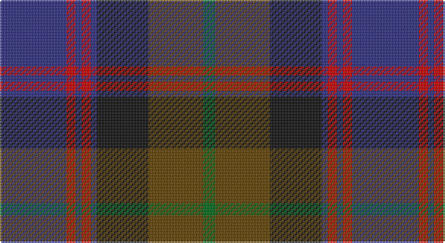

This page is one **sett** — a single exact thread-count. It belongs to the [tartan](/setts/db22r3db2r3db2k17dy18g4/)
(the same proportion at any scale), whose colour order is pattern [BRBRBKGG](/stripes/brbrbkgg/).

Part of the [Scotch House 2000 Antique](/tartans/scotch-house-2000-antique/) tartan — the named design grouping this sett with its other cloths.

Sourced from register-of-tartans.  It is a [8 stripe tartan](/stripes/stripes8/).

Original link https://www.tartanregister.gov.uk/tartanDetails.aspx?ref=3668

## Also known as

This cloth is also recorded under:

- Scotch House 2000, antique

2 attestations — the source records this cloth was collapsed from (oldest owns this page)

<ul>
<li>01/01/1999 — Scotch House 2000 Antique (register-of-tartans, <a href="https://www.tartanregister.gov.uk/tartanDetails.aspx?ref=3668">record</a>)</li>
<li>1999 — Scotch House 2000 Antique (Fashion) (tartans-authority, <a href="http://www.tartansauthority.com/tartan-ferret/display/2636/">record</a>)</li>
</ul>

## Register references

External register numbers recorded for this tartan.

- Scottish Register of Tartans: [3668](https://www.tartanregister.gov.uk/tartanDetails.aspx?ref=3668)
- Scottish Tartans Authority (ITI): 2636
- Scottish Tartans World Register: 2636

## Thread count
DB/44 R6 DB4 R6 DB4 K34 T36 G/8

One full sett is **232 threads**.

## Palette

Palette: <strong>Tartan Register</strong>
<table><thead><tr><th>Colour</th><th>Threads</th><th>Shade</th><th>Base</th><th>OKLCh</th></tr></thead><tbody><tr><td>DB/</td><td style="text-align:right;font-variant-numeric:tabular-nums">44</td><td><code style="background-color:#2C2C80;">#2C2C80</code> <small style="color:#888">#2C2C80</small></td><td>B <code style="background-color:#2A418A;">#2A418A</code></td><td><small style="color:#888">oklch(35.0% 0.138 276.6)</small></td></tr><tr><td>R</td><td style="text-align:right;font-variant-numeric:tabular-nums">6</td><td><code style="background-color:#C80000;">#C80000</code> <small style="color:#888">#C80000</small></td><td>R <code style="background-color:#CC0000;">#CC0000</code></td><td><small style="color:#888">oklch(52.3% 0.215 29.2)</small></td></tr><tr><td>DB</td><td style="text-align:right;font-variant-numeric:tabular-nums">4</td><td><code style="background-color:#2C2C80;">#2C2C80</code> <small style="color:#888">#2C2C80</small></td><td>B <code style="background-color:#2A418A;">#2A418A</code></td><td><small style="color:#888">oklch(35.0% 0.138 276.6)</small></td></tr><tr><td>R</td><td style="text-align:right;font-variant-numeric:tabular-nums">6</td><td><code style="background-color:#C80000;">#C80000</code> <small style="color:#888">#C80000</small></td><td>R <code style="background-color:#CC0000;">#CC0000</code></td><td><small style="color:#888">oklch(52.3% 0.215 29.2)</small></td></tr><tr><td>DB</td><td style="text-align:right;font-variant-numeric:tabular-nums">4</td><td><code style="background-color:#2C2C80;">#2C2C80</code> <small style="color:#888">#2C2C80</small></td><td>B <code style="background-color:#2A418A;">#2A418A</code></td><td><small style="color:#888">oklch(35.0% 0.138 276.6)</small></td></tr><tr><td>K</td><td style="text-align:right;font-variant-numeric:tabular-nums">34</td><td><code style="background-color:#101010;">#101010</code> <small style="color:#888">#101010</small></td><td>K <code style="background-color:#000000;">#000000</code></td><td><small style="color:#888">oklch(17.3% 0.000 89.9)</small></td></tr><tr><td>T</td><td style="text-align:right;font-variant-numeric:tabular-nums">36</td><td><code style="background-color:#604000;">#604000</code> <small style="color:#888">#604000</small></td><td>G <code style="background-color:#006100;">#006100</code></td><td><small style="color:#888">oklch(39.8% 0.083 76.8)</small></td></tr><tr><td>G/</td><td style="text-align:right;font-variant-numeric:tabular-nums">8</td><td><code style="background-color:#006818;">#006818</code> <small style="color:#888">#006818</small></td><td>G <code style="background-color:#006100;">#006100</code></td><td><small style="color:#888">oklch(45.0% 0.142 145.0)</small></td></tr></tbody></table>

# Sample pattern

## Nearest tartans

The nearest existing variants by ΔTartan distance, with this tartan at the top so the swatches line up against it.

ΔTartan

Tartan

Sett

—

<a href="/ttd/edit/#slug=db22r3db2r3db2k17dy18g4~x2">Scotch House 2000 Antique</a> <a class="nn-out" href="/variants/s8/db22r3db2r3db2k17dy18g4~x2/" title="open its dictionary page">↗</a>

0.88

<a href="/ttd/edit/#slug=k6r4k19dg4db25r5dg3ly2~x2&amp;base=db22r3db2r3db2k17dy18g4~x2">Bootneck 350</a> <a class="nn-out" href="/variants/s8/k6r4k19dg4db25r5dg3ly2~x2/" title="open its dictionary page">↗</a>

0.91

<a href="/ttd/edit/#slug=g11k2g1r4db1r4db13t2db1~x4&amp;base=db22r3db2r3db2k17dy18g4~x2">Dunbartonshire</a> <a class="nn-out" href="/variants/s9/g11k2g1r4db1r4db13t2db1~x4/" title="open its dictionary page">↗</a>

0.91

<a href="/ttd/edit/#slug=k23y2m3db7m3y2dg15m21y5~x2&amp;base=db22r3db2r3db2k17dy18g4~x2">Land's End (Unnamed Maroon)</a> <a class="nn-out" href="/variants/s9/k23y2m3db7m3y2dg15m21y5~x2/" title="open its dictionary page">↗</a>

0.93

<a href="/ttd/edit/#slug=dt10r1dt1r1dt1k6y9b2~x2&amp;base=db22r3db2r3db2k17dy18g4~x2">Antique 2000</a> <a class="nn-out" href="/variants/s8/dt10r1dt1r1dt1k6y9b2~x2/" title="open its dictionary page">↗</a>

0.95

<a href="/ttd/edit/#slug=db11k1db1k1db1k7dg8r1t7~x4&amp;base=db22r3db2r3db2k17dy18g4~x2">Damm, Alexander (Personal)</a> <a class="nn-out" href="/variants/s9/db11k1db1k1db1k7dg8r1t7~x4/" title="open its dictionary page">↗</a>

0.99

<a href="/ttd/edit/#slug=dt23lo2r3db7r3lo2g15r21lo5~x2&amp;base=db22r3db2r3db2k17dy18g4~x2">Land's End Maroon</a> <a class="nn-out" href="/variants/s9/dt23lo2r3db7r3lo2g15r21lo5~x2/" title="open its dictionary page">↗</a>

0.99

<a href="/ttd/edit/#slug=db22r3db2r3db2k17g18lo4~x2&amp;base=db22r3db2r3db2k17dy18g4~x2">Scotch House 2000 Original</a> <a class="nn-out" href="/variants/s8/db22r3db2r3db2k17g18lo4~x2/" title="open its dictionary page">↗</a>

1.07

<a href="/ttd/edit/#slug=n1o1n7k3n1k1n1k1db9lo1~x4&amp;base=db22r3db2r3db2k17dy18g4~x2">Brady 60th, Keith James (Personal)</a> <a class="nn-out" href="/variants/s10/n1o1n7k3n1k1n1k1db9lo1~x4/" title="open its dictionary page">↗</a>

1.08

<a href="/ttd/edit/#slug=db24k4r3k4dg24k4ri4~x2&amp;base=db22r3db2r3db2k17dy18g4~x2">Skene</a> <a class="nn-out" href="/variants/s7/db24k4r3k4dg24k4ri4~x2/" title="open its dictionary page">↗</a>

1.11

<a href="/ttd/edit/#slug=dt20b3dt4r3dt3k10g21k4r20~x2&amp;base=db22r3db2r3db2k17dy18g4~x2">Holland &amp; Sherry (Corporate)</a> <a class="nn-out" href="/variants/s9/dt20b3dt4r3dt3k10g21k4r20~x2/" title="open its dictionary page">↗</a>

## Neighbour map

Every grey dot is one of 14360 variants placed by the first two principal components of the ΔTartan feature space (44% of its variance). Red is this tartan; blue dots are its nearest — click one to open its page.

<svg viewBox="0 0 640 380" role="img" style="max-width:100%;height:auto;border:1px solid #e0e0e0;border-radius:4px;display:block" xmlns="http://www.w3.org/2000/svg"><image href="/nn/cloud.v1.png" width="640" height="380"/><a href="/variants/s8/k6r4k19dg4db25r5dg3ly2~x2/"><circle cx="220.7" cy="188.6" r="4" fill="#3465a4"><title>Bootneck 350</title></circle></a><a href="/variants/s9/g11k2g1r4db1r4db13t2db1~x4/"><circle cx="228.3" cy="178.3" r="4" fill="#3465a4"><title>Dunbartonshire</title></circle></a><a href="/variants/s9/k23y2m3db7m3y2dg15m21y5~x2/"><circle cx="171.2" cy="180.3" r="4" fill="#3465a4"><title>Land's End (Unnamed Maroon)</title></circle></a><a href="/variants/s8/dt10r1dt1r1dt1k6y9b2~x2/"><circle cx="203.9" cy="190.2" r="4" fill="#3465a4"><title>Antique 2000</title></circle></a><a href="/variants/s9/db11k1db1k1db1k7dg8r1t7~x4/"><circle cx="197.4" cy="201.0" r="4" fill="#3465a4"><title>Damm, Alexander (Personal)</title></circle></a><a href="/variants/s9/dt23lo2r3db7r3lo2g15r21lo5~x2/"><circle cx="185.9" cy="184.2" r="4" fill="#3465a4"><title>Land's End Maroon</title></circle></a><a href="/variants/s8/db22r3db2r3db2k17g18lo4~x2/"><circle cx="188.3" cy="190.2" r="4" fill="#3465a4"><title>Scotch House 2000 Original</title></circle></a><a href="/variants/s10/n1o1n7k3n1k1n1k1db9lo1~x4/"><circle cx="222.5" cy="180.9" r="4" fill="#3465a4"><title>Brady 60th, Keith James (Personal)</title></circle></a><a href="/variants/s7/db24k4r3k4dg24k4ri4~x2/"><circle cx="200.9" cy="208.7" r="4" fill="#3465a4"><title>Skene</title></circle></a><a href="/variants/s9/dt20b3dt4r3dt3k10g21k4r20~x2/"><circle cx="157.4" cy="218.7" r="4" fill="#3465a4"><title>Holland &amp; Sherry (Corporate)</title></circle></a><circle cx="213.2" cy="198.5" r="5" fill="#c00000"/></svg>

ID: /variants/s8/db22r3db2r3db2k17dy18g4~x2/
