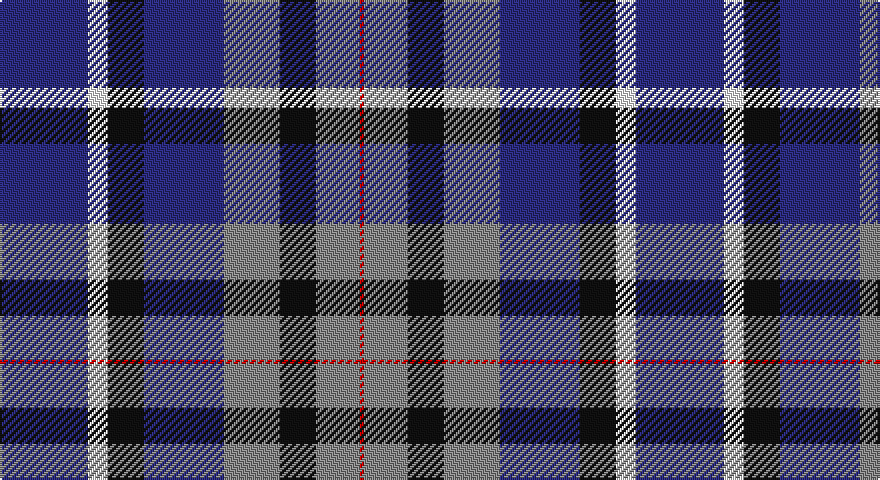

This page is one **sett** — a single exact thread-count. It belongs to the [tartan](/setts/db22w5k9db20o14k9o11r1/)
(the same proportion at any scale), whose colour order is pattern [BWKBRKRR](/stripes/bwkbrkrr/).

Sourced from tartans-authority.  It is a [8 stripe tartan](/stripes/stripes8/).

Original link http://www.tartansauthority.com/tartan-ferret/display/11136/

## Register references

External register numbers recorded for this tartan.

- Scottish Register of Tartans: [11136](https://www.tartanregister.gov.uk/tartanDetails?ref=11136)
- Scottish Tartans Authority (ITI): 11136

## Thread count
DB/44 W10 K18 DB40 N28 K18 N22 R/2

One full sett is **318 threads**.

## Palette

Palette: <strong>Tartan Register</strong>
<table><thead><tr><th>Colour</th><th>Threads</th><th>Shade</th><th>Base</th><th>OKLCh</th></tr></thead><tbody><tr><td>DB/</td><td style="text-align:right;font-variant-numeric:tabular-nums">44</td><td><code style="background-color:#2C2C80;">#2C2C80</code> <small style="color:#888">#2C2C80</small></td><td>B <code style="background-color:#2A418A;">#2A418A</code></td><td><small style="color:#888">oklch(35.0% 0.138 276.6)</small></td></tr><tr><td>W</td><td style="text-align:right;font-variant-numeric:tabular-nums">10</td><td><code style="background-color:#FCFCFC;">#FCFCFC</code> <small style="color:#888">#FCFCFC</small></td><td>W <code style="background-color:#F7F7F7;">#F7F7F7</code></td><td><small style="color:#888">oklch(99.1% 0.000 89.9)</small></td></tr><tr><td>K</td><td style="text-align:right;font-variant-numeric:tabular-nums">18</td><td><code style="background-color:#101010;">#101010</code> <small style="color:#888">#101010</small></td><td>K <code style="background-color:#000000;">#000000</code></td><td><small style="color:#888">oklch(17.3% 0.000 89.9)</small></td></tr><tr><td>DB</td><td style="text-align:right;font-variant-numeric:tabular-nums">40</td><td><code style="background-color:#2C2C80;">#2C2C80</code> <small style="color:#888">#2C2C80</small></td><td>B <code style="background-color:#2A418A;">#2A418A</code></td><td><small style="color:#888">oklch(35.0% 0.138 276.6)</small></td></tr><tr><td>N</td><td style="text-align:right;font-variant-numeric:tabular-nums">28</td><td><code style="background-color:#888888;">#888888</code> <small style="color:#888">#888888</small></td><td>R <code style="background-color:#CC0000;">#CC0000</code></td><td><small style="color:#888">oklch(62.7% 0.000 89.9)</small></td></tr><tr><td>K</td><td style="text-align:right;font-variant-numeric:tabular-nums">18</td><td><code style="background-color:#101010;">#101010</code> <small style="color:#888">#101010</small></td><td>K <code style="background-color:#000000;">#000000</code></td><td><small style="color:#888">oklch(17.3% 0.000 89.9)</small></td></tr><tr><td>N</td><td style="text-align:right;font-variant-numeric:tabular-nums">22</td><td><code style="background-color:#888888;">#888888</code> <small style="color:#888">#888888</small></td><td>R <code style="background-color:#CC0000;">#CC0000</code></td><td><small style="color:#888">oklch(62.7% 0.000 89.9)</small></td></tr><tr><td>R/</td><td style="text-align:right;font-variant-numeric:tabular-nums">2</td><td><code style="background-color:#C80000;">#C80000</code> <small style="color:#888">#C80000</small></td><td>R <code style="background-color:#CC0000;">#CC0000</code></td><td><small style="color:#888">oklch(52.3% 0.215 29.2)</small></td></tr></tbody></table>

# Sample pattern

## Nearest tartans

The nearest existing variants by ΔTartan distance, with this tartan at the top so the swatches line up against it.

ΔTartan

Tartan

Sett

—

<a href="/ttd/edit/#slug=db22w5k9db20o14k9o11r1~x2">Akintiev (2014)</a> <a class="nn-out" href="/variants/s8/db22w5k9db20o14k9o11r1~x2/" title="open its dictionary page">↗</a>

0.11

<a href="/ttd/edit/#slug=db22w5k9db20y14k9y11r1~x2&amp;base=db22w5k9db20o14k9o11r1~x2">Akintiev (2014)</a> <a class="nn-out" href="/variants/s8/db22w5k9db20y14k9y11r1~x2/" title="open its dictionary page">↗</a>

1.47

<a href="/ttd/edit/#slug=b12lo2b12k6m10k1w2k1m10k6~x2&amp;base=db22w5k9db20o14k9o11r1~x2">Soroptimist International</a> <a class="nn-out" href="/variants/s10/b12lo2b12k6m10k1w2k1m10k6~x2/" title="open its dictionary page">↗</a>

1.49

<a href="/ttd/edit/#slug=r3ly1db15g16db3r6db6g8db15w3~x2&amp;base=db22w5k9db20o14k9o11r1~x2">Steve Walls</a> <a class="nn-out" href="/variants/s10/r3ly1db15g16db3r6db6g8db15w3~x2/" title="open its dictionary page">↗</a>

1.50

<a href="/ttd/edit/#slug=db4k4db10k10ly2k10lr4db8lr12db2dp1~x2&amp;base=db22w5k9db20o14k9o11r1~x2">Dutton, Stuart (Personal)</a> <a class="nn-out" href="/variants/s11/db4k4db10k10ly2k10lr4db8lr12db2dp1~x2/" title="open its dictionary page">↗</a>

1.50

<a href="/ttd/edit/#slug=g14dp11t3k2t3dp11g14ly1~x2&amp;base=db22w5k9db20o14k9o11r1~x2">Wellington (Wilson 122)</a> <a class="nn-out" href="/variants/s8/g14dp11t3k2t3dp11g14ly1~x2/" title="open its dictionary page">↗</a>

1.51

<a href="/variants/s10/db11w2db11k4g8r1~x2/">Dalmeny - 2002 (Fashion)</a>

1.54

<a href="/ttd/edit/#slug=dp13w2t38k13t28k8dp17dg2dp17k4dt11&amp;base=db22w5k9db20o14k9o11r1~x2">Bute Heather, Ancient (Fashion)</a> <a class="nn-out" href="/variants/s11/dp13w2t38k13t28k8dp17dg2dp17k4dt11/" title="open its dictionary page">↗</a>

1.56

<a href="/ttd/edit/#slug=b23dt18w5dt2r14dt18~x2&amp;base=db22w5k9db20o14k9o11r1~x2">Pitt (Name)</a> <a class="nn-out" href="/variants/s6/b23dt18w5dt2r14dt18~x2/" title="open its dictionary page">↗</a>

1.57

<a href="/ttd/edit/#slug=w12db48k13o22k3ly6&amp;base=db22w5k9db20o14k9o11r1~x2">Clunie (Personal)</a> <a class="nn-out" href="/variants/s6/w12db48k13o22k3ly6/" title="open its dictionary page">↗</a>

1.60

<a href="/ttd/edit/#slug=r25g10db30w4db30g10r25w2~x2&amp;base=db22w5k9db20o14k9o11r1~x2">Highland Spring Dress (2004)</a> <a class="nn-out" href="/variants/s8/r25g10db30w4db30g10r25w2~x2/" title="open its dictionary page">↗</a>

## Neighbour map

Every grey dot is one of 14360 variants placed by the first two principal components of the ΔTartan feature space (44% of its variance). Red is this tartan; blue dots are its nearest — click one to open its page.

<svg viewBox="0 0 640 380" role="img" style="max-width:100%;height:auto;border:1px solid #e0e0e0;border-radius:4px;display:block" xmlns="http://www.w3.org/2000/svg"><image href="/nn/cloud.v1.png" width="640" height="380"/><a href="/variants/s8/db22w5k9db20y14k9y11r1~x2/"><circle cx="212.0" cy="179.3" r="4" fill="#3465a4"><title>Akintiev (2014)</title></circle></a><a href="/variants/s10/b12lo2b12k6m10k1w2k1m10k6~x2/"><circle cx="172.9" cy="181.2" r="4" fill="#3465a4"><title>Soroptimist International</title></circle></a><a href="/variants/s10/r3ly1db15g16db3r6db6g8db15w3~x2/"><circle cx="246.2" cy="172.5" r="4" fill="#3465a4"><title>Steve Walls</title></circle></a><a href="/variants/s11/db4k4db10k10ly2k10lr4db8lr12db2dp1~x2/"><circle cx="136.9" cy="177.5" r="4" fill="#3465a4"><title>Dutton, Stuart (Personal)</title></circle></a><a href="/variants/s8/g14dp11t3k2t3dp11g14ly1~x2/"><circle cx="245.0" cy="190.1" r="4" fill="#3465a4"><title>Wellington (Wilson 122)</title></circle></a><a href="/variants/s10/db11w2db11k4g8r1~x2/"><circle cx="224.0" cy="197.8" r="4" fill="#3465a4"><title>Dalmeny - 2002 (Fashion)</title></circle></a><a href="/variants/s11/dp13w2t38k13t28k8dp17dg2dp17k4dt11/"><circle cx="195.7" cy="139.6" r="4" fill="#3465a4"><title>Bute Heather, Ancient (Fashion)</title></circle></a><a href="/variants/s6/b23dt18w5dt2r14dt18~x2/"><circle cx="223.4" cy="234.9" r="4" fill="#3465a4"><title>Pitt (Name)</title></circle></a><a href="/variants/s6/w12db48k13o22k3ly6/"><circle cx="197.0" cy="161.4" r="4" fill="#3465a4"><title>Clunie (Personal)</title></circle></a><a href="/variants/s8/r25g10db30w4db30g10r25w2~x2/"><circle cx="231.0" cy="198.0" r="4" fill="#3465a4"><title>Highland Spring Dress (2004)</title></circle></a><circle cx="209.1" cy="177.5" r="5" fill="#c00000"/></svg>

ID: /variants/s8/db22w5k9db20o14k9o11r1~x2/
