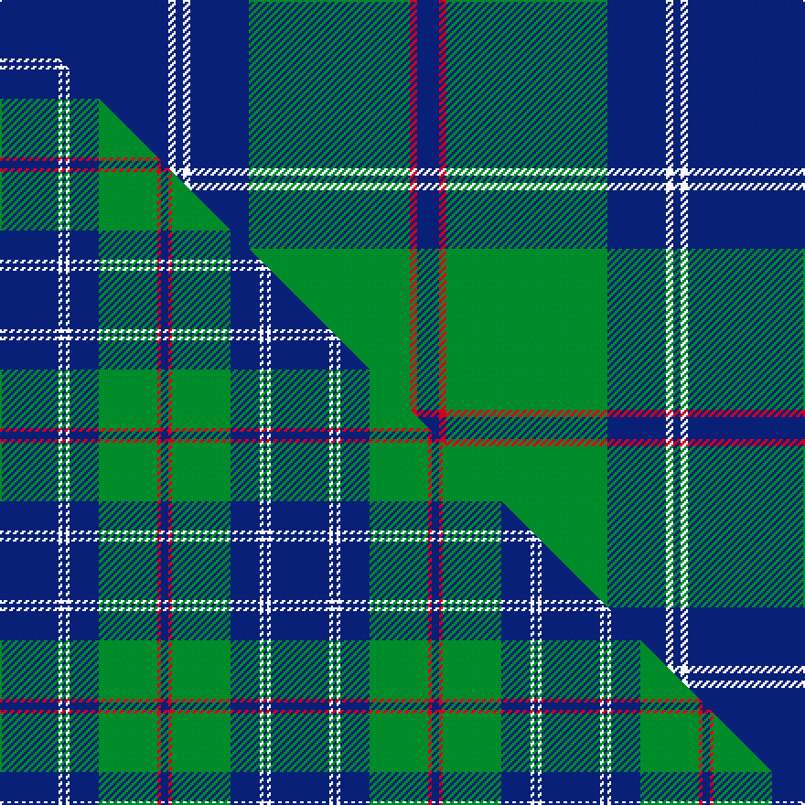

This page is one **sett** — a single exact thread-count. It belongs to the [tartan](/setts/db23w1db1w1db8g22r1db3/)
(the same proportion at any scale), whose colour order is pattern [BRGBWBWB](/stripes/brgbwbwb/).

Part of the [Roxburgh](/tartans/roxburgh/) tartan — the named design grouping this sett with its other cloths.

Sourced from tartans-authority.  It is a [8 stripe tartan](/stripes/stripes8/).

Original link [https://www.tartanregister.gov.uk/tartanDetails.aspx?ref=500](https://www.tartanregister.gov.uk/tartanDetails.aspx?ref=500)

Dataset <small>— provenance for this record, inherited from the source manifest</small>

<dl class="dataset-prov">
<dt>source</dt><dd><a href="/sources/tartans-authority/">Scottish Tartans Authority</a></dd>
<dt>data captured from</dt><dd><a href="https://github.com/thetartan/tartan-database/blob/master/data/tartans-authority/data.csv">https://github.com/thetartan/tartan-database/blob/master/data/tartans-authority/data.csv</a></dd>
<dt>data date</dt><dd>1940 <small>(this record)</small></dd>
<dt>licence</dt><dd><a href="https://creativecommons.org/licenses/by-nc-nd/4.0/">CC BY-NC-ND 4.0</a></dd>
</dl>

Capture chain <small>— the hands this data passed through, oldest first; each capture carries its own licence</small>

<ol class="capture-chain">
<li><a href="https://www.tartansauthority.com/">Scottish Tartans Authority</a> <small>the heritage body's archive — its tartan-ferret record browser is retired (links repaired to the SRT, above)</small></li>
<li><a href="https://github.com/thetartan/tartan-database">thetartan/tartan-database</a> <small>2016-2017</small> · <a href="https://creativecommons.org/licenses/by-nc-nd/4.0/">CC BY-NC-ND 4.0</a> <small>Levko Kravets's frozen compilation — the capture we vendored, and where its CC licence text came from</small></li>
<li>this dictionary <small>captured 2026-06-10 · commit 5bf86c7566</small> <small>each re-capture is a git commit to data/sources</small></li>
</ol>

## Register references

External register numbers recorded for this tartan.

- Scottish Tartans Authority (ITI): 500

## Thread count
DB/92 W4 DB4 W4 DB32 G88 R4 DB/12

One full sett is **376 threads**.

## Palette
<table><thead><tr><th>Colour</th><th>Shade</th><th>OKLCh</th></tr></thead><tbody><tr><td>DB</td><td><code style="background-color:#082077;">#082077</code> <small style="color:#888">#082077</small></td><td><small style="color:#888">oklch(30.0% 0.149 265.1)</small></td></tr><tr><td>G</td><td><code style="background-color:#008B2A;">#008B2A</code> <small style="color:#888">#008B2A</small></td><td><small style="color:#888">oklch(55.4% 0.170 145.9)</small></td></tr><tr><td>R</td><td><code style="background-color:#D60020;">#D60020</code> <small style="color:#888">#D60020</small></td><td><small style="color:#888">oklch(55.2% 0.224 25.5)</small></td></tr><tr><td>W</td><td><code style="background-color:#F7F7F7;">#F7F7F7</code> <small style="color:#888">#F7F7F7</small></td><td><small style="color:#888">oklch(97.6% 0.000 89.9)</small></td></tr></tbody></table>

# Sample pattern

## Compared to the master

This cloth is one sett of its design; the master sett (the exemplar the design is anchored on) is below for comparison.

Its **ΔTartan distance** from the master is **0.32** — the same measure the nearest-tartans table ranks by (0 is identical; a re-scale of the same cloth is near 0, a recolour or a different proportion further).

<figure class="master-compare" style="margin:0">

this sett
master sett ★

<figcaption style="color:#888;font-size:smaller">One weave of this sett against the <a href="/setts/db16w1db1w1db8g16r1db2/">master sett ★</a>, split on the diagonal: a shared proportion runs seamlessly across it with only the shades shifting; a different proportion breaks on it.</figcaption>
</figure>

## Nearest tartan variants

The nearest existing variants by ΔTartan distance, with this cloth at the top so the swatches line up against it.

ΔTartan

Threads

Variant

Sett

—

376

<a href="/variants/s8/db23w1db1w1db8g22r1db3~x4/">Roxburgh, Green (District)</a>

<a href="/ttd/edit/#slug=db16w1db1w1db8g16r1db2~x2&amp;base=db23w1db1w1db8g22r1db3~x4" title="compare in the TTD">0.32</a>

148

<a href="/variants/s8/db16w1db1w1db8g16r1db2~x2/">Roxburgh</a>

<a href="/ttd/edit/#slug=b36w4b4w4b16dg64r9b6~x2&amp;base=db23w1db1w1db8g22r1db3~x4" title="compare in the TTD">0.77</a>

488

<a href="/variants/s8/b36w4b4w4b16dg64r9b6~x2/">Colvin</a>

<a href="/ttd/edit/#slug=db30r3db3y3db3g30db36w5~x2&amp;base=db23w1db1w1db8g22r1db3~x4" title="compare in the TTD">1.68</a>

382

<a href="/variants/s8/db30r3db3y3db3g30db36w5~x2/">De Nardi Hunting (Personal)</a>

<a href="/ttd/edit/#slug=db1k1db8y1g12y1db8k1db1~x2&amp;base=db23w1db1w1db8g22r1db3~x4" title="compare in the TTD">1.75</a>

132

<a href="/variants/s9/db1k1db8y1g12y1db8k1db1~x2/">Rowan</a>

<a href="/ttd/edit/#slug=db6r3g26db26w4db26r5g5~x2&amp;base=db23w1db1w1db8g22r1db3~x4" title="compare in the TTD">1.90</a>

382

<a href="/variants/s8/db6r3g26db26w4db26r5g5~x2/">MacHardy, Blue</a>

<a href="/ttd/edit/#slug=db3r3g18db16w2db26r3g3~x2&amp;base=db23w1db1w1db8g22r1db3~x4" title="compare in the TTD">1.98</a>

284

<a href="/variants/s8/db3r3g18db16w2db26r3g3~x2/">MacHardy</a>

<a href="/ttd/edit/#slug=w6db2w3db2g2db20r1~x2&amp;base=db23w1db1w1db8g22r1db3~x4" title="compare in the TTD">2.40</a>

130

<a href="/variants/s7/w6db2w3db2g2db20r1~x2/">Gonzaga University’s True Blue and White</a>

<a href="/ttd/edit/#slug=g23db3k8db4g4db56ly8&amp;base=db23w1db1w1db8g22r1db3~x4" title="compare in the TTD">2.41</a>

181

<a href="/variants/s7/g23db3k8db4g4db56ly8/">Tern House</a>

<a href="/ttd/edit/#slug=g23db3k8db4g4db56dy8&amp;base=db23w1db1w1db8g22r1db3~x4" title="compare in the TTD">2.44</a>

181

<a href="/variants/s7/g23db3k8db4g4db56dy8/">Tern House</a>

<a href="/ttd/edit/#slug=db120g9r7y12g33y33db26&amp;base=db23w1db1w1db8g22r1db3~x4" title="compare in the TTD">2.46</a>

334

<a href="/variants/s7/db120g9r7y12g33y33db26/">Supporter.com</a>

## Neighbour map

Every grey dot is one of 13621 variants placed by the first two principal components of the ΔTartan feature space (42% of its variance). Red is this tartan; blue dots are its nearest — click one to open its page.

<svg viewBox="0 0 640 380" role="img" style="max-width:100%;height:auto;border:1px solid #e0e0e0;border-radius:4px;display:block" xmlns="http://www.w3.org/2000/svg"><image href="/nn/cloud.v1.png" width="640" height="380"/><a href="/variants/s8/db16w1db1w1db8g16r1db2~x2/"><circle cx="347.6" cy="167.3" r="4" fill="#3465a4"><title>Roxburgh</title></circle></a><a href="/variants/s8/b36w4b4w4b16dg64r9b6~x2/"><circle cx="294.1" cy="169.6" r="4" fill="#3465a4"><title>Colvin</title></circle></a><a href="/variants/s8/db30r3db3y3db3g30db36w5~x2/"><circle cx="340.5" cy="171.9" r="4" fill="#3465a4"><title>De Nardi Hunting (Personal)</title></circle></a><a href="/variants/s9/db1k1db8y1g12y1db8k1db1~x2/"><circle cx="290.0" cy="167.5" r="4" fill="#3465a4"><title>Rowan</title></circle></a><a href="/variants/s8/db6r3g26db26w4db26r5g5~x2/"><circle cx="294.9" cy="208.5" r="4" fill="#3465a4"><title>MacHardy, Blue</title></circle></a><a href="/variants/s8/db3r3g18db16w2db26r3g3~x2/"><circle cx="339.8" cy="184.1" r="4" fill="#3465a4"><title>MacHardy</title></circle></a><a href="/variants/s7/w6db2w3db2g2db20r1~x2/"><circle cx="374.4" cy="143.6" r="4" fill="#3465a4"><title>Gonzaga University’s True Blue and White</title></circle></a><a href="/variants/s7/g23db3k8db4g4db56ly8/"><circle cx="324.7" cy="146.7" r="4" fill="#3465a4"><title>Tern House</title></circle></a><a href="/variants/s7/g23db3k8db4g4db56dy8/"><circle cx="352.2" cy="155.1" r="4" fill="#3465a4"><title>Tern House</title></circle></a><a href="/variants/s7/db120g9r7y12g33y33db26/"><circle cx="373.5" cy="177.2" r="4" fill="#3465a4"><title>Supporter.com</title></circle></a><circle cx="368.9" cy="149.8" r="5" fill="#c00000"/><text x="320" y="376" text-anchor="middle" font-size="11" fill="#999">ground</text><text x="11" y="190" text-anchor="middle" font-size="11" fill="#999" transform="rotate(-90 11 190)">complexity</text></svg>

ID: /variants/s8/db23w1db1w1db8g22r1db3~x4/
