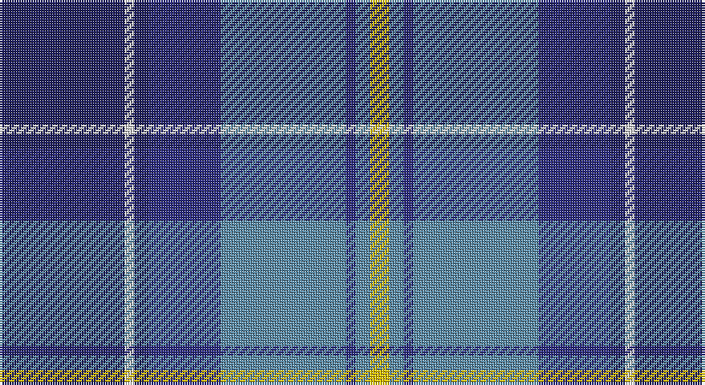

This page is one **sett** — a single exact thread-count. It belongs to the [tartan](/setts/db26w2db3dbi15t26dbi2t3ly4/)
(the same proportion at any scale), whose colour order is pattern [BWBBBBBY](/stripes/bwbbbbby/).

Part of the [Banff and Buchan](/tartans/banff-and-buchan/) tartan — the named design grouping this sett with its other cloths.

Sourced from house-of-tartan.  It is a [8 stripe tartan](/stripes/stripes8/).

Original link http://www.house-of-tartan.scotland.net/house/TartanViewjs.asp?colr=Def&tnam=2150

## Provenance

Earliest known date: 1992 This tartan has been designed for the District of Banff and Buchan. It is based on the sett of the Ogilvy Tartan which originates from this district. The colours are taken from the surrounding landscape - the blues of the mountains and the sea, also of the sky, with touches of white. The yellow is reminiscent of the cornfields. (J.Roberts) The tartan is produced by Macnaughtons of Pitlochry.

## Also known as

This cloth is also recorded under:

- Banff, and Buchan

## Thread count
DBa/52 LN4 DBa6 DB30 B52 DB4 B6 Y/8

One full sett is **264 threads**.

## Palette

Palette: <strong>Tartan Register</strong>
<table><thead><tr><th>Colour</th><th>Threads</th><th>Shade</th><th>Base</th><th>OKLCh</th></tr></thead><tbody><tr><td>DBa/</td><td style="text-align:right;font-variant-numeric:tabular-nums">52</td><td><code style="background-color:#202060;">#202060</code> <small style="color:#888">#202060</small></td><td>B <code style="background-color:#2A418A;">#2A418A</code></td><td><small style="color:#888">oklch(28.9% 0.111 276.9)</small></td></tr><tr><td>LN</td><td style="text-align:right;font-variant-numeric:tabular-nums">4</td><td><code style="background-color:#E0E0E0;">#E0E0E0</code> <small style="color:#888">#E0E0E0</small></td><td>W <code style="background-color:#F7F7F7;">#F7F7F7</code></td><td><small style="color:#888">oklch(90.7% 0.000 89.9)</small></td></tr><tr><td>DBa</td><td style="text-align:right;font-variant-numeric:tabular-nums">6</td><td><code style="background-color:#202060;">#202060</code> <small style="color:#888">#202060</small></td><td>B <code style="background-color:#2A418A;">#2A418A</code></td><td><small style="color:#888">oklch(28.9% 0.111 276.9)</small></td></tr><tr><td>DB</td><td style="text-align:right;font-variant-numeric:tabular-nums">30</td><td><code style="background-color:#2C2C80;">#2C2C80</code> <small style="color:#888">#2C2C80</small></td><td>B <code style="background-color:#2A418A;">#2A418A</code></td><td><small style="color:#888">oklch(35.0% 0.138 276.6)</small></td></tr><tr><td>B</td><td style="text-align:right;font-variant-numeric:tabular-nums">52</td><td><code style="background-color:#5C8CA8;">#5C8CA8</code> <small style="color:#888">#5C8CA8</small></td><td>B <code style="background-color:#2A418A;">#2A418A</code></td><td><small style="color:#888">oklch(61.7% 0.067 235.0)</small></td></tr><tr><td>DB</td><td style="text-align:right;font-variant-numeric:tabular-nums">4</td><td><code style="background-color:#2C2C80;">#2C2C80</code> <small style="color:#888">#2C2C80</small></td><td>B <code style="background-color:#2A418A;">#2A418A</code></td><td><small style="color:#888">oklch(35.0% 0.138 276.6)</small></td></tr><tr><td>B</td><td style="text-align:right;font-variant-numeric:tabular-nums">6</td><td><code style="background-color:#5C8CA8;">#5C8CA8</code> <small style="color:#888">#5C8CA8</small></td><td>B <code style="background-color:#2A418A;">#2A418A</code></td><td><small style="color:#888">oklch(61.7% 0.067 235.0)</small></td></tr><tr><td>Y/</td><td style="text-align:right;font-variant-numeric:tabular-nums">8</td><td><code style="background-color:#E8C000;">#E8C000</code> <small style="color:#888">#E8C000</small></td><td>Y <code style="background-color:#F2BF00;">#F2BF00</code></td><td><small style="color:#888">oklch(81.9% 0.168 93.7)</small></td></tr></tbody></table>

# Sample pattern

## Compared to the master

This cloth is one sett of its design; the master sett (the exemplar the design is anchored on) is below for comparison.

<figure style="margin:0"><figcaption style="color:#888;font-size:smaller">this sett</figcaption></figure>
<figure style="margin:0"><figcaption style="color:#888;font-size:smaller"><a href="/setts/k17lb2k3db16t28db2t3lo2/">master sett →</a></figcaption></figure>

## Nearest tartans

The nearest existing variants by ΔTartan distance, with this tartan at the top so the swatches line up against it.

ΔTartan

Tartan

Sett

—

<a href="/ttd/edit/#slug=db26w2db3dbi15t26dbi2t3ly4~x2">Banff and Buchan District Tartan</a> <a class="nn-out" href="/variants/s8/db26w2db3dbi15t26dbi2t3ly4~x2/" title="open its dictionary page">↗</a>

0.68

<a href="/ttd/edit/#slug=dbi26w2dbi3db15t26db2t3ly4~x2&amp;base=db26w2db3dbi15t26dbi2t3ly4~x2">Banff, and Buchan</a> <a class="nn-out" href="/variants/s8/dbi26w2dbi3db15t26db2t3ly4~x2/" title="open its dictionary page">↗</a>

0.75

<a href="/ttd/edit/#slug=db3t24k11db20w2db5lo3~x2&amp;base=db26w2db3dbi15t26dbi2t3ly4~x2">Icelandair</a> <a class="nn-out" href="/variants/s7/db3t24k11db20w2db5lo3~x2/" title="open its dictionary page">↗</a>

0.83

<a href="/ttd/edit/#slug=w4db24ly2dbi24t5db4ly4~x2&amp;base=db26w2db3dbi15t26dbi2t3ly4~x2">Mina Perhonen Japanese Corporate Tartan</a> <a class="nn-out" href="/variants/s7/w4db24ly2dbi24t5db4ly4~x2/" title="open its dictionary page">↗</a>

1.07

<a href="/ttd/edit/#slug=ly3db20db4dt4db4dt20g4dp4ly2~x2&amp;base=db26w2db3dbi15t26dbi2t3ly4~x2">Blue Peter</a> <a class="nn-out" href="/variants/s9/ly3db20db4dt4db4dt20g4dp4ly2~x2/" title="open its dictionary page">↗</a>

1.09

<a href="/ttd/edit/#slug=n12k2n2k2n2k12db12b3w1~x2&amp;base=db26w2db3dbi15t26dbi2t3ly4~x2">de Franck, Matt (Personal)</a> <a class="nn-out" href="/variants/s9/n12k2n2k2n2k12db12b3w1~x2/" title="open its dictionary page">↗</a>

1.10

<a href="/ttd/edit/#slug=db25k3db7k15b25k2b2w4~x2&amp;base=db26w2db3dbi15t26dbi2t3ly4~x2">Sabema</a> <a class="nn-out" href="/variants/s8/db25k3db7k15b25k2b2w4~x2/" title="open its dictionary page">↗</a>

1.11

<a href="/ttd/edit/#slug=g5db15t11w2t1w1dg4~x4&amp;base=db26w2db3dbi15t26dbi2t3ly4~x2">Highlands Country Club</a> <a class="nn-out" href="/variants/s7/g5db15t11w2t1w1dg4~x4/" title="open its dictionary page">↗</a>

1.12

<a href="/ttd/edit/#slug=w4dbi8r3dbi25k13db4t29dbi3t8dbi2r3~x2&amp;base=db26w2db3dbi15t26dbi2t3ly4~x2">Royal Air Force Regimental Tartan</a> <a class="nn-out" href="/variants/s11/w4dbi8r3dbi25k13db4t29dbi3t8dbi2r3~x2/" title="open its dictionary page">↗</a>

1.19

<a href="/variants/s10/db28r3w3r3w3r3db28k12b38wi8/">GYL family (Personal)</a>

1.21

<a href="/ttd/edit/#slug=r2dp1t13n13dp4n4dp4n4t13dp1w2~x2&amp;base=db26w2db3dbi15t26dbi2t3ly4~x2">Toronto Blue Jays</a> <a class="nn-out" href="/variants/s11/r2dp1t13n13dp4n4dp4n4t13dp1w2~x2/" title="open its dictionary page">↗</a>

## Neighbour map

Every grey dot is one of 14360 variants placed by the first two principal components of the ΔTartan feature space (44% of its variance). Red is this tartan; blue dots are its nearest — click one to open its page.

<svg viewBox="0 0 640 380" role="img" style="max-width:100%;height:auto;border:1px solid #e0e0e0;border-radius:4px;display:block" xmlns="http://www.w3.org/2000/svg"><image href="/nn/cloud.v1.png" width="640" height="380"/><a href="/variants/s8/dbi26w2dbi3db15t26db2t3ly4~x2/"><circle cx="182.0" cy="165.4" r="4" fill="#3465a4"><title>Banff, and Buchan</title></circle></a><a href="/variants/s7/db3t24k11db20w2db5lo3~x2/"><circle cx="206.7" cy="188.5" r="4" fill="#3465a4"><title>Icelandair</title></circle></a><a href="/variants/s7/w4db24ly2dbi24t5db4ly4~x2/"><circle cx="212.6" cy="177.3" r="4" fill="#3465a4"><title>Mina Perhonen Japanese Corporate Tartan</title></circle></a><a href="/variants/s9/ly3db20db4dt4db4dt20g4dp4ly2~x2/"><circle cx="233.8" cy="188.9" r="4" fill="#3465a4"><title>Blue Peter</title></circle></a><a href="/variants/s9/n12k2n2k2n2k12db12b3w1~x2/"><circle cx="179.5" cy="184.1" r="4" fill="#3465a4"><title>de Franck, Matt (Personal)</title></circle></a><a href="/variants/s8/db25k3db7k15b25k2b2w4~x2/"><circle cx="215.5" cy="195.5" r="4" fill="#3465a4"><title>Sabema</title></circle></a><a href="/variants/s7/g5db15t11w2t1w1dg4~x4/"><circle cx="198.6" cy="178.9" r="4" fill="#3465a4"><title>Highlands Country Club</title></circle></a><a href="/variants/s11/w4dbi8r3dbi25k13db4t29dbi3t8dbi2r3~x2/"><circle cx="174.6" cy="135.9" r="4" fill="#3465a4"><title>Royal Air Force Regimental Tartan</title></circle></a><a href="/variants/s10/db28r3w3r3w3r3db28k12b38wi8/"><circle cx="183.4" cy="139.1" r="4" fill="#3465a4"><title>GYL family (Personal)</title></circle></a><a href="/variants/s11/r2dp1t13n13dp4n4dp4n4t13dp1w2~x2/"><circle cx="216.6" cy="167.4" r="4" fill="#3465a4"><title>Toronto Blue Jays</title></circle></a><circle cx="196.0" cy="169.2" r="5" fill="#c00000"/></svg>

ID: /variants/s8/db26w2db3dbi15t26dbi2t3ly4~x2/
