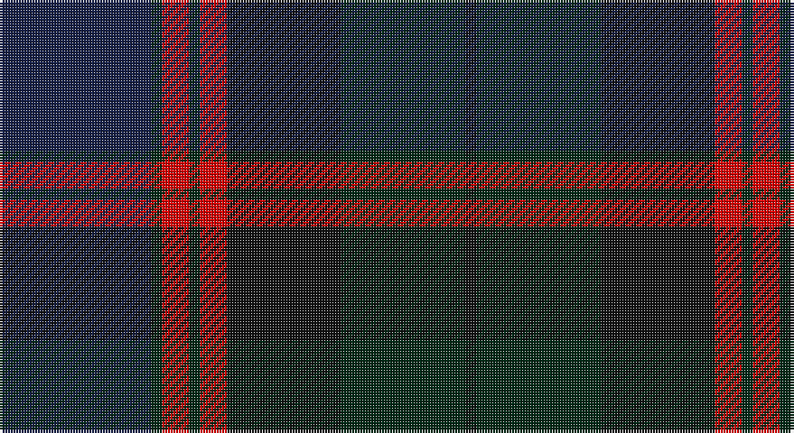

This page is one **sett** — a single exact thread-count. It belongs to the [tartan](/setts/db28dg2r5dg2r5k21dg23k2/)
(the same proportion at any scale), whose colour order is pattern [BGRGRKGK](/stripes/bgrgrkgk/).

Sourced from register-of-tartans.  It is a [8 stripe tartan](/stripes/stripes8/).

Original link https://www.tartanregister.gov.uk/tartanDetails.aspx?ref=250

## Register references

External register numbers recorded for this tartan.

- Scottish Register of Tartans: [250](https://www.tartanregister.gov.uk/tartanDetails.aspx?ref=250)
- Scottish Tartans World Register: 2717

## Thread count
DBa/56 DG4 R10 DG4 R10 K42 DG46 K/4

One full sett is **292 threads**.

## Palette

Palette: <strong>Tartan Register</strong> <small style="color:#888">(7 of 8 colours)</small>
<table><thead><tr><th>Colour</th><th>Threads</th><th>Shade</th><th>Base</th><th>OKLCh</th></tr></thead><tbody><tr><td>DBa/</td><td style="text-align:right;font-variant-numeric:tabular-nums">56</td><td><code style="background-color:#141E46;">#141E46</code> <small style="color:#888">#141E46</small></td><td>B <code style="background-color:#2A418A;">#2A418A</code></td><td><small style="color:#888">oklch(25.2% 0.076 269.7)</small></td></tr><tr><td>DG</td><td style="text-align:right;font-variant-numeric:tabular-nums">4</td><td><code style="background-color:#002814;">#002814</code> <small style="color:#888">#002814</small></td><td>G <code style="background-color:#006100;">#006100</code></td><td><small style="color:#888">oklch(24.4% 0.059 156.5)</small></td></tr><tr><td>R</td><td style="text-align:right;font-variant-numeric:tabular-nums">10</td><td><code style="background-color:#DC0000;">#DC0000</code> <small style="color:#888">#DC0000</small></td><td>R <code style="background-color:#CC0000;">#CC0000</code></td><td><small style="color:#888">oklch(56.2% 0.230 29.2)</small></td></tr><tr><td>DG</td><td style="text-align:right;font-variant-numeric:tabular-nums">4</td><td><code style="background-color:#002814;">#002814</code> <small style="color:#888">#002814</small></td><td>G <code style="background-color:#006100;">#006100</code></td><td><small style="color:#888">oklch(24.4% 0.059 156.5)</small></td></tr><tr><td>R</td><td style="text-align:right;font-variant-numeric:tabular-nums">10</td><td><code style="background-color:#DC0000;">#DC0000</code> <small style="color:#888">#DC0000</small></td><td>R <code style="background-color:#CC0000;">#CC0000</code></td><td><small style="color:#888">oklch(56.2% 0.230 29.2)</small></td></tr><tr><td>K</td><td style="text-align:right;font-variant-numeric:tabular-nums">42</td><td><code style="background-color:#101010;">#101010</code> <small style="color:#888">#101010</small></td><td>K <code style="background-color:#000000;">#000000</code></td><td><small style="color:#888">oklch(17.3% 0.000 89.9)</small></td></tr><tr><td>DG</td><td style="text-align:right;font-variant-numeric:tabular-nums">46</td><td><code style="background-color:#002814;">#002814</code> <small style="color:#888">#002814</small></td><td>G <code style="background-color:#006100;">#006100</code></td><td><small style="color:#888">oklch(24.4% 0.059 156.5)</small></td></tr><tr><td>K/</td><td style="text-align:right;font-variant-numeric:tabular-nums">4</td><td><code style="background-color:#101010;">#101010</code> <small style="color:#888">#101010</small></td><td>K <code style="background-color:#000000;">#000000</code></td><td><small style="color:#888">oklch(17.3% 0.000 89.9)</small></td></tr></tbody></table>

# Sample pattern

## Nearest tartans

The nearest existing variants by ΔTartan distance, with this tartan at the top so the swatches line up against it.

ΔTartan

Tartan

Sett

—

<a href="/ttd/edit/#slug=db28dg2r5dg2r5k21dg23k2~x2">Bentley</a> <a class="nn-out" href="/variants/s8/db28dg2r5dg2r5k21dg23k2~x2/" title="open its dictionary page">↗</a>

1.30

<a href="/ttd/edit/#slug=r7dg3r2dg33k31db31k3db3&amp;base=db28dg2r5dg2r5k21dg23k2~x2">Baird</a> <a class="nn-out" href="/variants/s8/r7dg3r2dg33k31db31k3db3/" title="open its dictionary page">↗</a>

1.34

<a href="/ttd/edit/#slug=k12g1k1g1k1r5k10g1k2~x4&amp;base=db28dg2r5dg2r5k21dg23k2~x2">Lindsay (Crimson version) (Clan?)</a> <a class="nn-out" href="/variants/s9/k12g1k1g1k1r5k10g1k2~x4/" title="open its dictionary page">↗</a>

1.35

<a href="/ttd/edit/#slug=y24r2y3db14dt24r2dt3db3~x2&amp;base=db28dg2r5dg2r5k21dg23k2~x2">Grampian (District)</a> <a class="nn-out" href="/variants/s8/y24r2y3db14dt24r2dt3db3~x2/" title="open its dictionary page">↗</a>

1.44

<a href="/ttd/edit/#slug=dt17o2dt2o2dt2k17db13k4~x2&amp;base=db28dg2r5dg2r5k21dg23k2~x2">Balmoral Hotel</a> <a class="nn-out" href="/variants/s8/dt17o2dt2o2dt2k17db13k4~x2/" title="open its dictionary page">↗</a>

1.46

<a href="/ttd/edit/#slug=dp8k1dg2k1do2k6dg8k1w2~x4&amp;base=db28dg2r5dg2r5k21dg23k2~x2">Coffield-Limesand (Personal)</a> <a class="nn-out" href="/variants/s9/dp8k1dg2k1do2k6dg8k1w2~x4/" title="open its dictionary page">↗</a>

1.48

<a href="/ttd/edit/#slug=do2dy12do12r1k12dy2~x6&amp;base=db28dg2r5dg2r5k21dg23k2~x2">Ferguson Britt (Corporate)</a> <a class="nn-out" href="/variants/s6/do2dy12do12r1k12dy2~x6/" title="open its dictionary page">↗</a>

1.51

<a href="/ttd/edit/#slug=do6o4n22r4k22do22k2r5k2do6~x2&amp;base=db28dg2r5dg2r5k21dg23k2~x2">Lochaber (Ingles Buchan)</a> <a class="nn-out" href="/variants/s10/do6o4n22r4k22do22k2r5k2do6~x2/" title="open its dictionary page">↗</a>

1.55

<a href="/ttd/edit/#slug=r1dy2k12dy8db16lo1~x2&amp;base=db28dg2r5dg2r5k21dg23k2~x2">Bobby Jones (Personal)</a> <a class="nn-out" href="/variants/s6/r1dy2k12dy8db16lo1~x2/" title="open its dictionary page">↗</a>

1.58

<a href="/ttd/edit/#slug=db16r2db2r2db2r6dg13lo2dg3~x2&amp;base=db28dg2r5dg2r5k21dg23k2~x2">Dewar, Christian (Personal)</a> <a class="nn-out" href="/variants/s9/db16r2db2r2db2r6dg13lo2dg3~x2/" title="open its dictionary page">↗</a>

1.59

<a href="/ttd/edit/#slug=r1dy2dt12dy8db16lo1~x2&amp;base=db28dg2r5dg2r5k21dg23k2~x2">Bobby Jones (Personal)</a> <a class="nn-out" href="/variants/s6/r1dy2dt12dy8db16lo1~x2/" title="open its dictionary page">↗</a>

## Neighbour map

Every grey dot is one of 14360 variants placed by the first two principal components of the ΔTartan feature space (44% of its variance). Red is this tartan; blue dots are its nearest — click one to open its page.

<svg viewBox="0 0 640 380" role="img" style="max-width:100%;height:auto;border:1px solid #e0e0e0;border-radius:4px;display:block" xmlns="http://www.w3.org/2000/svg"><image href="/nn/cloud.v1.png" width="640" height="380"/><a href="/variants/s8/r7dg3r2dg33k31db31k3db3/"><circle cx="256.2" cy="209.2" r="4" fill="#3465a4"><title>Baird</title></circle></a><a href="/variants/s9/k12g1k1g1k1r5k10g1k2~x4/"><circle cx="291.5" cy="206.8" r="4" fill="#3465a4"><title>Lindsay (Crimson version) (Clan?)</title></circle></a><a href="/variants/s8/y24r2y3db14dt24r2dt3db3~x2/"><circle cx="277.9" cy="221.1" r="4" fill="#3465a4"><title>Grampian (District)</title></circle></a><a href="/variants/s8/dt17o2dt2o2dt2k17db13k4~x2/"><circle cx="260.4" cy="249.0" r="4" fill="#3465a4"><title>Balmoral Hotel</title></circle></a><a href="/variants/s9/dp8k1dg2k1do2k6dg8k1w2~x4/"><circle cx="199.3" cy="229.6" r="4" fill="#3465a4"><title>Coffield-Limesand (Personal)</title></circle></a><a href="/variants/s6/do2dy12do12r1k12dy2~x6/"><circle cx="260.8" cy="247.5" r="4" fill="#3465a4"><title>Ferguson Britt (Corporate)</title></circle></a><a href="/variants/s10/do6o4n22r4k22do22k2r5k2do6~x2/"><circle cx="236.2" cy="206.8" r="4" fill="#3465a4"><title>Lochaber (Ingles Buchan)</title></circle></a><a href="/variants/s6/r1dy2k12dy8db16lo1~x2/"><circle cx="286.2" cy="218.8" r="4" fill="#3465a4"><title>Bobby Jones (Personal)</title></circle></a><a href="/variants/s9/db16r2db2r2db2r6dg13lo2dg3~x2/"><circle cx="282.3" cy="231.6" r="4" fill="#3465a4"><title>Dewar, Christian (Personal)</title></circle></a><a href="/variants/s6/r1dy2dt12dy8db16lo1~x2/"><circle cx="306.2" cy="229.7" r="4" fill="#3465a4"><title>Bobby Jones (Personal)</title></circle></a><circle cx="257.8" cy="225.8" r="5" fill="#c00000"/></svg>

ID: /variants/s8/db28dg2r5dg2r5k21dg23k2~x2/
