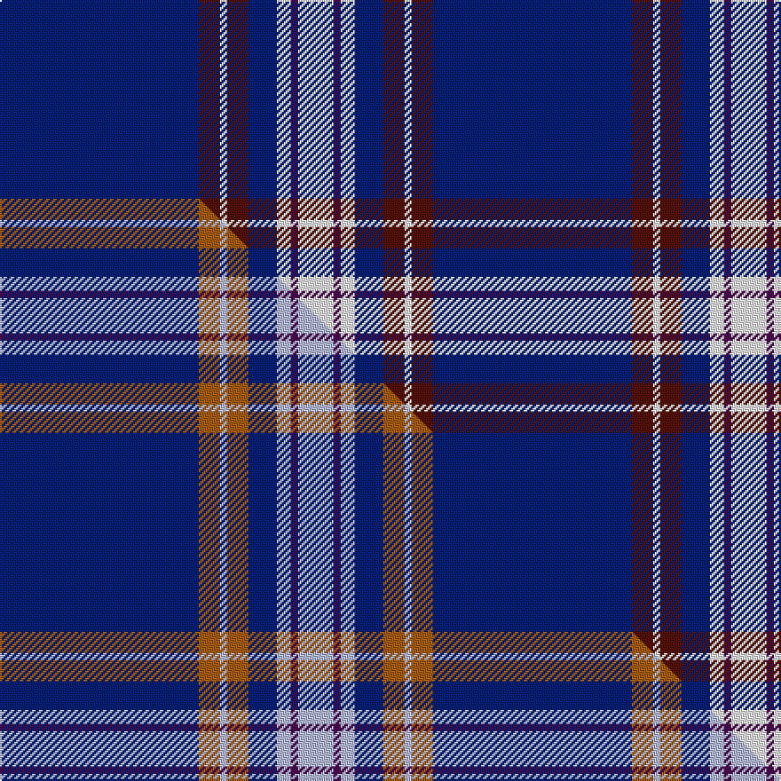

This is one **variant** — a specific cloth: this exact thread count and colourway, with its own
provenance below. It is one weaving of the [sett](/setts/db28dr3w1dr3db4w2dp1w5/) (the scale-free proportion — the
same cloth at any scale or shade), whose colour order is pattern [BBWBBWBW](/stripes/bbwbbwbw/).

Part of the [Baker](/tartans/b/ba/baker/) tartan — the named design grouping this sett with its other cloths.

Sourced from house-of-tartan.  It is a [8 stripe tartan](/stripes/stripes8/).

Original link [http://www.house-of-tartan.scotland.net/house/TartanViewjs.asp?colr=Def&tnam=613](http://www.house-of-tartan.scotland.net/house/TartanViewjs.asp?colr=Def&tnam=613)

## Provenance

Earliest known date: pre 2003 STS notes 'Sample in trade specimens file.'

Dataset <small>— provenance for this record, inherited from the source manifest</small>

<dl class="dataset-prov">
<dt>source</dt><dd><a href="/sources/house-of-tartan/">House of Tartan</a></dd>
<dt>data captured from</dt><dd><a href="https://github.com/thetartan/tartan-database/blob/master/data/house-of-tartan/data.csv">https://github.com/thetartan/tartan-database/blob/master/data/house-of-tartan/data.csv</a></dd>
<dt>data date</dt><dd>pre 2003 <small>(this record)</small></dd>
<dt>licence</dt><dd><a href="https://creativecommons.org/licenses/by-nc-nd/4.0/">CC BY-NC-ND 4.0</a></dd>
</dl>

Capture chain <small>— the hands this data passed through, oldest first; each capture carries its own licence</small>

<ol class="capture-chain">
<li><a href="http://www.house-of-tartan.scotland.net/">House of Tartan</a> <small>the weaver/retailer's database — the site is now offline; the URL is kept as the ultimate source's identity</small></li>
<li><a href="https://github.com/thetartan/tartan-database">thetartan/tartan-database</a> <small>2016-2017</small> · <a href="https://creativecommons.org/licenses/by-nc-nd/4.0/">CC BY-NC-ND 4.0</a> <small>Levko Kravets's frozen compilation — the capture we vendored, and where its CC licence text came from</small></li>
<li>this dictionary <small>captured 2026-06-10 · commit 5bf86c7566</small> <small>each re-capture is a git commit to data/sources</small></li>
</ol>

## Thread count
DB/112 DR12 W4 DR12 DB16 W8 DP4 W/20

One full sett is **244 threads**.

## Palette
<table><thead><tr><th>Colour</th><th>Shade</th><th>OKLCh</th></tr></thead><tbody><tr><td>DB</td><td><code style="background-color:#082077;">#082077</code> <small style="color:#888">#082077</small></td><td><small style="color:#888">oklch(30.0% 0.149 265.1)</small></td></tr><tr><td>DR</td><td><code style="background-color:#55120C;">#55120C</code> <small style="color:#888">#55120C</small></td><td><small style="color:#888">oklch(30.0% 0.099 29.3)</small></td></tr><tr><td>W</td><td><code style="background-color:#F7F7F7;">#F7F7F7</code> <small style="color:#888">#F7F7F7</small></td><td><small style="color:#888">oklch(97.6% 0.000 89.9)</small></td></tr><tr><td>DP</td><td><code style="background-color:#4B0B4F;">#4B0B4F</code> <small style="color:#888">#4B0B4F</small></td><td><small style="color:#888">oklch(30.1% 0.125 325.4)</small></td></tr></tbody></table>

# Sample pattern

## Compared to the master

This cloth is one sett of its design; the master sett (the exemplar the design is anchored on) is below for comparison.

Its **ΔTartan distance** from the master is **5.23** — the same measure the nearest-tartans table ranks by (0 is identical; a re-scale of the same cloth is near 0, a recolour or a different proportion further).

<figure class="master-compare" style="margin:0">

this sett
master sett ★

<figcaption style="color:#888;font-size:smaller">One weave of this sett against the <a href="/setts/db28o3lb1o3db4lb2dp1lb5/">master sett ★</a>, split on the diagonal: a shared proportion runs seamlessly across it with only the shades shifting; a different proportion breaks on it.</figcaption>
</figure>

## Nearest tartan variants

The nearest existing variants by ΔTartan distance, with this cloth at the top so the swatches line up against it.

ΔTartan

Threads

Variant

Sett

—

244

<a href="/variants/s8/db28dr3w1dr3db4w2dp1w5~x4/">Baker Family Tartan</a>

<a href="/ttd/edit/#slug=db28o3w1o3db4w2dp1w5~x4&amp;base=db28dr3w1dr3db4w2dp1w5~x4" title="compare in the TTD">0.60</a>

244

<a href="/variants/s8/db28o3w1o3db4w2dp1w5~x4/">Baker</a>

<a href="/ttd/edit/#slug=db28y3w1y3db4w2r1w5~x4&amp;base=db28dr3w1dr3db4w2dp1w5~x4" title="compare in the TTD">0.90</a>

244

<a href="/variants/s8/db28y3w1y3db4w2r1w5~x4/">Baker Dress Family Tartan</a>

<a href="/ttd/edit/#slug=db28ly3lb1ly3db4lb2dp1lb5~x4&amp;base=db28dr3w1dr3db4w2dp1w5~x4" title="compare in the TTD">1.00</a>

244

<a href="/variants/s8/db28ly3lb1ly3db4lb2dp1lb5~x4/">Baker (Name)</a>

<a href="/ttd/edit/#slug=db128dr8lb41dt4lb4dt4&amp;base=db28dr3w1dr3db4w2dp1w5~x4" title="compare in the TTD">1.98</a>

246

<a href="/variants/s6/db128dr8lb41dt4lb4dt4/">French Freemasons' Pride</a>

<a href="/ttd/edit/#slug=db29dbi2db1dbi1db1dbi1lb8lo1~x4~db1106275-dbi1406275&amp;base=db28dr3w1dr3db4w2dp1w5~x4" title="compare in the TTD">2.42</a>

232

<a href="/variants/s8/db29dbi2db1dbi1db1dbi1lb8lo1~x4~db1106275-dbi1406275/">Marist School, The</a>

<a href="/ttd/edit/#slug=db67w10y14db10w2&amp;base=db28dr3w1dr3db4w2dp1w5~x4" title="compare in the TTD">2.50</a>

137

<a href="/variants/s5/db67w10y14db10w2/">St. John (Corporate?)</a>

<a href="/ttd/edit/#slug=lb4db1lb4db24w6db4w1db2~x4&amp;base=db28dr3w1dr3db4w2dp1w5~x4" title="compare in the TTD">2.62</a>

344

<a href="/variants/s8/lb4db1lb4db24w6db4w1db2~x4/">Antigonish</a>

<a href="/ttd/edit/#slug=db62w2db4w5db6y2dr8y3w4~x2&amp;base=db28dr3w1dr3db4w2dp1w5~x4" title="compare in the TTD">2.84</a>

252

<a href="/variants/s9/db62w2db4w5db6y2dr8y3w4~x2/">George, Stuart (Personal)</a>

<a href="/ttd/edit/#slug=w8db16w2db2w1db1~x4&amp;base=db28dr3w1dr3db4w2dp1w5~x4" title="compare in the TTD">2.98</a>

204

<a href="/variants/s6/w8db16w2db2w1db1~x4/">Ikelman #1 (Personal)</a>

<a href="/ttd/edit/#slug=y3db34dg5w2dg2w10db4lr3~x2&amp;base=db28dr3w1dr3db4w2dp1w5~x4" title="compare in the TTD">3.01</a>

240

<a href="/variants/s8/y3db34dg5w2dg2w10db4lr3~x2/">Royal Troon Golf Club, The</a>

## Neighbour map

Every grey dot is one of 13656 variants placed by the first two principal components of the ΔTartan feature space (42% of its variance). Red is this tartan; blue dots are its nearest — click one to open its page. The map is a flat projection of a many-dimensional space — [how to read it](/posts/neighbourhood-maps/).

<svg viewBox="0 0 640 380" role="img" style="max-width:100%;height:auto;border:1px solid #e0e0e0;border-radius:4px;display:block" xmlns="http://www.w3.org/2000/svg"><image href="/nn/cloud.v1.png" width="640" height="380"/><a href="/variants/s8/db28o3w1o3db4w2dp1w5~x4/"><circle cx="406.9" cy="115.4" r="4" fill="#3465a4"><title>Baker</title></circle></a><a href="/variants/s8/db28y3w1y3db4w2r1w5~x4/"><circle cx="411.1" cy="119.4" r="4" fill="#3465a4"><title>Baker Dress Family Tartan</title></circle></a><a href="/variants/s8/db28ly3lb1ly3db4lb2dp1lb5~x4/"><circle cx="457.7" cy="147.9" r="4" fill="#3465a4"><title>Baker (Name)</title></circle></a><a href="/variants/s6/db128dr8lb41dt4lb4dt4/"><circle cx="480.8" cy="155.9" r="4" fill="#3465a4"><title>French Freemasons' Pride</title></circle></a><a href="/variants/s8/db29dbi2db1dbi1db1dbi1lb8lo1~x4~db1106275-dbi1406275/"><circle cx="497.6" cy="135.5" r="4" fill="#3465a4"><title>Marist School, The</title></circle></a><a href="/variants/s5/db67w10y14db10w2/"><circle cx="504.6" cy="172.7" r="4" fill="#3465a4"><title>St. John (Corporate?)</title></circle></a><a href="/variants/s8/lb4db1lb4db24w6db4w1db2~x4/"><circle cx="448.9" cy="176.7" r="4" fill="#3465a4"><title>Antigonish</title></circle></a><a href="/variants/s9/db62w2db4w5db6y2dr8y3w4~x2/"><circle cx="495.9" cy="110.4" r="4" fill="#3465a4"><title>George, Stuart (Personal)</title></circle></a><a href="/variants/s6/w8db16w2db2w1db1~x4/"><circle cx="439.8" cy="222.8" r="4" fill="#3465a4"><title>Ikelman #1 (Personal)</title></circle></a><a href="/variants/s8/y3db34dg5w2dg2w10db4lr3~x2/"><circle cx="327.2" cy="142.1" r="4" fill="#3465a4"><title>Royal Troon Golf Club, The</title></circle></a><circle cx="449.9" cy="142.6" r="5" fill="#c00000"/><text x="320" y="376" text-anchor="middle" font-size="11" fill="#999">ground</text><text x="11" y="190" text-anchor="middle" font-size="11" fill="#999" transform="rotate(-90 11 190)">complexity</text></svg>

ID: /variants/s8/db28dr3w1dr3db4w2dp1w5~x4/
