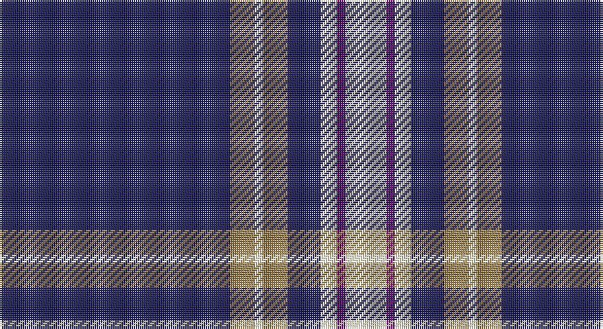

This page is one **sett** — a single exact thread-count. It belongs to the [tartan](/setts/db28lo3w1lo3db4w2dp1w5/)
(the same proportion at any scale), whose colour order is pattern [BYWYBWBW](/stripes/bywybwbw/).

Part of the [Baker](/tartans/baker/) tartan — the named design grouping this sett with its other cloths.

Sourced from tartans-authority.  It is a [8 stripe tartan](/stripes/stripes8/).

Original link http://www.tartansauthority.com/tartan-ferret/display/613/

## Register references

External register numbers recorded for this tartan.

- Scottish Tartans Authority (ITI): 613

## Thread count
DB/112 LT12 LY4 LT12 DB16 LY8 P4 LY/20

One full sett is **244 threads**.

## Palette

Palette: <strong>Tartan Register</strong> <small style="color:#888">(3 of 4 colours)</small>
<table><thead><tr><th>Colour</th><th>Threads</th><th>Shade</th><th>Base</th><th>OKLCh</th></tr></thead><tbody><tr><td>DB/</td><td style="text-align:right;font-variant-numeric:tabular-nums">112</td><td><code style="background-color:#202060;">#202060</code> <small style="color:#888">#202060</small></td><td>B <code style="background-color:#2A418A;">#2A418A</code></td><td><small style="color:#888">oklch(28.9% 0.111 276.9)</small></td></tr><tr><td>LT</td><td style="text-align:right;font-variant-numeric:tabular-nums">12</td><td><code style="background-color:#A08858;">#A08858</code> <small style="color:#888">#A08858</small></td><td>Y <code style="background-color:#F2BF00;">#F2BF00</code></td><td><small style="color:#888">oklch(63.7% 0.071 84.0)</small></td></tr><tr><td>LY</td><td style="text-align:right;font-variant-numeric:tabular-nums">4</td><td><code style="background-color:#F8F4D0;">#F8F4D0</code> <small style="color:#888">#F8F4D0</small></td><td>W <code style="background-color:#F7F7F7;">#F7F7F7</code></td><td><small style="color:#888">oklch(96.1% 0.047 102.0)</small></td></tr><tr><td>LT</td><td style="text-align:right;font-variant-numeric:tabular-nums">12</td><td><code style="background-color:#A08858;">#A08858</code> <small style="color:#888">#A08858</small></td><td>Y <code style="background-color:#F2BF00;">#F2BF00</code></td><td><small style="color:#888">oklch(63.7% 0.071 84.0)</small></td></tr><tr><td>DB</td><td style="text-align:right;font-variant-numeric:tabular-nums">16</td><td><code style="background-color:#202060;">#202060</code> <small style="color:#888">#202060</small></td><td>B <code style="background-color:#2A418A;">#2A418A</code></td><td><small style="color:#888">oklch(28.9% 0.111 276.9)</small></td></tr><tr><td>LY</td><td style="text-align:right;font-variant-numeric:tabular-nums">8</td><td><code style="background-color:#F8F4D0;">#F8F4D0</code> <small style="color:#888">#F8F4D0</small></td><td>W <code style="background-color:#F7F7F7;">#F7F7F7</code></td><td><small style="color:#888">oklch(96.1% 0.047 102.0)</small></td></tr><tr><td>P</td><td style="text-align:right;font-variant-numeric:tabular-nums">4</td><td><code style="background-color:#780078;">#780078</code> <small style="color:#888">#780078</small></td><td>B <code style="background-color:#2A418A;">#2A418A</code></td><td><small style="color:#888">oklch(40.2% 0.185 328.4)</small></td></tr><tr><td>LY/</td><td style="text-align:right;font-variant-numeric:tabular-nums">20</td><td><code style="background-color:#F8F4D0;">#F8F4D0</code> <small style="color:#888">#F8F4D0</small></td><td>W <code style="background-color:#F7F7F7;">#F7F7F7</code></td><td><small style="color:#888">oklch(96.1% 0.047 102.0)</small></td></tr></tbody></table>

# Sample pattern

## Nearest tartans

The nearest existing variants by ΔTartan distance, with this tartan at the top so the swatches line up against it.

ΔTartan

Tartan

Sett

—

<a href="/ttd/edit/#slug=db28lo3w1lo3db4w2dp1w5~x4">Baker (Name)</a> <a class="nn-out" href="/variants/s8/db28lo3w1lo3db4w2dp1w5~x4/" title="open its dictionary page">↗</a>

0.07

<a href="/ttd/edit/#slug=db28o3w1o3db4w2dp1w5~x4&amp;base=db28lo3w1lo3db4w2dp1w5~x4">Baker</a> <a class="nn-out" href="/variants/s8/db28o3w1o3db4w2dp1w5~x4/" title="open its dictionary page">↗</a>

0.54

<a href="/ttd/edit/#slug=db28ly3w1ly3db4w2r1w5~x4&amp;base=db28lo3w1lo3db4w2dp1w5~x4">Baker Dress Family Tartan</a> <a class="nn-out" href="/variants/s8/db28ly3w1ly3db4w2r1w5~x4/" title="open its dictionary page">↗</a>

0.80

<a href="/ttd/edit/#slug=db28dr3w1dr3db4w2dp1w5~x4&amp;base=db28lo3w1lo3db4w2dp1w5~x4">Baker Family Tartan</a> <a class="nn-out" href="/variants/s8/db28dr3w1dr3db4w2dp1w5~x4/" title="open its dictionary page">↗</a>

0.86

<a href="/ttd/edit/#slug=db28o3w1o3db4w2p1w5~x4&amp;base=db28lo3w1lo3db4w2dp1w5~x4">Baker</a> <a class="nn-out" href="/variants/s8/db28o3w1o3db4w2p1w5~x4/" title="open its dictionary page">↗</a>

0.89

<a href="/ttd/edit/#slug=w6db2w3db2g2db20r1~x2&amp;base=db28lo3w1lo3db4w2dp1w5~x4">Gonzaga University’s True Blue and White</a> <a class="nn-out" href="/variants/s7/w6db2w3db2g2db20r1~x2/" title="open its dictionary page">↗</a>

1.09

<a href="/ttd/edit/#slug=db96ly11db8ly11db16ly6w4ly16w8&amp;base=db28lo3w1lo3db4w2dp1w5~x4">University of North Carolina at Greensboro, The</a> <a class="nn-out" href="/variants/s9/db96ly11db8ly11db16ly6w4ly16w8/" title="open its dictionary page">↗</a>

1.14

<a href="/ttd/edit/#slug=db62w2db4w5db6ly2r8ly3w4~x2&amp;base=db28lo3w1lo3db4w2dp1w5~x4">George, Stuart (Personal)</a> <a class="nn-out" href="/variants/s9/db62w2db4w5db6ly2r8ly3w4~x2/" title="open its dictionary page">↗</a>

1.22

<a href="/ttd/edit/#slug=db62w2db4w5db6lo2r8lo3w4~x2&amp;base=db28lo3w1lo3db4w2dp1w5~x4">George, Stuart (Personal)</a> <a class="nn-out" href="/variants/s9/db62w2db4w5db6lo2r8lo3w4~x2/" title="open its dictionary page">↗</a>

1.24

<a href="/ttd/edit/#slug=w6db32o3db3o1db3o2dbi4db1ly2~x2&amp;base=db28lo3w1lo3db4w2dp1w5~x4">X Marks the Scot</a> <a class="nn-out" href="/variants/s10/w6db32o3db3o1db3o2dbi4db1ly2~x2/" title="open its dictionary page">↗</a>

1.28

<a href="/ttd/edit/#slug=w6ly3db3ly2db3ly4db48ly4&amp;base=db28lo3w1lo3db4w2dp1w5~x4">Morris Welsh Name Tartan</a> <a class="nn-out" href="/variants/s8/w6ly3db3ly2db3ly4db48ly4/" title="open its dictionary page">↗</a>

## Neighbour map

Every grey dot is one of 14360 variants placed by the first two principal components of the ΔTartan feature space (44% of its variance). Red is this tartan; blue dots are its nearest — click one to open its page.

<svg viewBox="0 0 640 380" role="img" style="max-width:100%;height:auto;border:1px solid #e0e0e0;border-radius:4px;display:block" xmlns="http://www.w3.org/2000/svg"><image href="/nn/cloud.v1.png" width="640" height="380"/><a href="/variants/s8/db28o3w1o3db4w2dp1w5~x4/"><circle cx="413.7" cy="116.1" r="4" fill="#3465a4"><title>Baker</title></circle></a><a href="/variants/s8/db28ly3w1ly3db4w2r1w5~x4/"><circle cx="411.7" cy="112.9" r="4" fill="#3465a4"><title>Baker Dress Family Tartan</title></circle></a><a href="/variants/s8/db28dr3w1dr3db4w2dp1w5~x4/"><circle cx="427.3" cy="122.7" r="4" fill="#3465a4"><title>Baker Family Tartan</title></circle></a><a href="/variants/s8/db28o3w1o3db4w2p1w5~x4/"><circle cx="434.7" cy="125.4" r="4" fill="#3465a4"><title>Baker</title></circle></a><a href="/variants/s7/w6db2w3db2g2db20r1~x2/"><circle cx="376.0" cy="139.3" r="4" fill="#3465a4"><title>Gonzaga University’s True Blue and White</title></circle></a><a href="/variants/s9/db96ly11db8ly11db16ly6w4ly16w8/"><circle cx="424.4" cy="130.2" r="4" fill="#3465a4"><title>University of North Carolina at Greensboro, The</title></circle></a><a href="/variants/s9/db62w2db4w5db6ly2r8ly3w4~x2/"><circle cx="481.5" cy="101.2" r="4" fill="#3465a4"><title>George, Stuart (Personal)</title></circle></a><a href="/variants/s9/db62w2db4w5db6lo2r8lo3w4~x2/"><circle cx="483.1" cy="102.7" r="4" fill="#3465a4"><title>George, Stuart (Personal)</title></circle></a><a href="/variants/s10/w6db32o3db3o1db3o2dbi4db1ly2~x2/"><circle cx="413.8" cy="91.9" r="4" fill="#3465a4"><title>X Marks the Scot</title></circle></a><a href="/variants/s8/w6ly3db3ly2db3ly4db48ly4/"><circle cx="479.4" cy="132.6" r="4" fill="#3465a4"><title>Morris Welsh Name Tartan</title></circle></a><circle cx="412.6" cy="115.8" r="5" fill="#c00000"/></svg>

ID: /variants/s8/db28lo3w1lo3db4w2dp1w5~x4/
