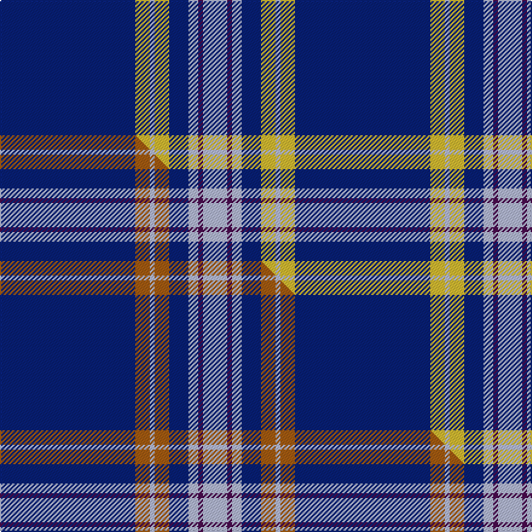

This page is one **sett** — a single exact thread-count. It belongs to the [tartan](/setts/db28ly3lb1ly3db4lb2dp1lb5/)
(the same proportion at any scale), whose colour order is pattern [BYWYBWBW](/stripes/bywybwbw/).

Part of the [Baker](/tartans/baker/) tartan — the named design grouping this sett with its other cloths.

Sourced from tartans-authority.  It is a [8 stripe tartan](/stripes/stripes8/).

Original link [https://www.tartanregister.gov.uk/tartanDetails.aspx?ref=613](https://www.tartanregister.gov.uk/tartanDetails.aspx?ref=613)

Dataset <small>— provenance for this record, inherited from the source manifest</small>

<dl class="dataset-prov">
<dt>source</dt><dd><a href="/sources/tartans-authority/">Scottish Tartans Authority</a></dd>
<dt>data captured from</dt><dd><a href="https://github.com/thetartan/tartan-database/blob/master/data/tartans-authority/data.csv">https://github.com/thetartan/tartan-database/blob/master/data/tartans-authority/data.csv</a></dd>
<dt>data date</dt><dd>1986 <small>(this record)</small></dd>
<dt>licence</dt><dd><a href="https://creativecommons.org/licenses/by-nc-nd/4.0/">CC BY-NC-ND 4.0</a></dd>
</dl>

Capture chain <small>— the hands this data passed through, oldest first; each capture carries its own licence</small>

<ol class="capture-chain">
<li><a href="https://www.tartansauthority.com/">Scottish Tartans Authority</a> <small>the heritage body's archive — its tartan-ferret record browser is retired (links repaired to the SRT, above)</small></li>
<li><a href="https://github.com/thetartan/tartan-database">thetartan/tartan-database</a> <small>2016-2017</small> · <a href="https://creativecommons.org/licenses/by-nc-nd/4.0/">CC BY-NC-ND 4.0</a> <small>Levko Kravets's frozen compilation — the capture we vendored, and where its CC licence text came from</small></li>
<li>this dictionary <small>captured 2026-06-10 · commit 5bf86c7566</small> <small>each re-capture is a git commit to data/sources</small></li>
</ol>

## Register references

External register numbers recorded for this tartan.

- Scottish Tartans Authority (ITI): 613

## Thread count
DB/112 LY12 LB4 LY12 DB16 LB8 DP4 LB/20

One full sett is **244 threads**.

## Palette
<table><thead><tr><th>Colour</th><th>Shade</th><th>OKLCh</th></tr></thead><tbody><tr><td>DB</td><td><code style="background-color:#082077;">#082077</code> <small style="color:#888">#082077</small></td><td><small style="color:#888">oklch(30.0% 0.149 265.1)</small></td></tr><tr><td>LY</td><td><code style="background-color:#DCBC32;">#DCBC32</code> <small style="color:#888">#DCBC32</small></td><td><small style="color:#888">oklch(80.0% 0.150 95.2)</small></td></tr><tr><td>LB</td><td><code style="background-color:#B5BBDE;">#B5BBDE</code> <small style="color:#888">#B5BBDE</small></td><td><small style="color:#888">oklch(79.9% 0.050 277.6)</small></td></tr><tr><td>DP</td><td><code style="background-color:#4B0B4F;">#4B0B4F</code> <small style="color:#888">#4B0B4F</small></td><td><small style="color:#888">oklch(30.1% 0.125 325.4)</small></td></tr></tbody></table>

# Sample pattern

## Compared to the master

This cloth is one sett of its design; the master sett (the exemplar the design is anchored on) is below for comparison.

Its **ΔTartan distance** from the master is **0.60** — the same measure the nearest-tartans table ranks by (0 is identical; a re-scale of the same cloth is near 0, a recolour or a different proportion further).

<figure class="master-compare" style="margin:0">

this sett
master sett ★

<figcaption style="color:#888;font-size:smaller">One weave of this sett against the <a href="/setts/db28o3lb1o3db4lb2dp1lb5/">master sett ★</a>, split on the diagonal: a shared proportion runs seamlessly across it with only the shades shifting; a different proportion breaks on it.</figcaption>
</figure>

## Nearest tartan variants

The nearest existing variants by ΔTartan distance, with this cloth at the top so the swatches line up against it.

ΔTartan

Threads

Variant

Sett

—

244

<a href="/variants/s8/db28ly3lb1ly3db4lb2dp1lb5~x4/">Baker (Name)</a>

<a href="/ttd/edit/#slug=db28o3lb1o3db4lb2dp1lb5~x4&amp;base=db28ly3lb1ly3db4lb2dp1lb5~x4" title="compare in the TTD">0.60</a>

244

<a href="/variants/s8/db28o3lb1o3db4lb2dp1lb5~x4/">Baker</a>

<a href="/ttd/edit/#slug=t15db65y7t4y3db30t15w3~x2&amp;base=db28ly3lb1ly3db4lb2dp1lb5~x4" title="compare in the TTD">0.88</a>

532

<a href="/variants/s8/t15db65y7t4y3db30t15w3~x2/">Hoosier (Fashion)</a>

<a href="/ttd/edit/#slug=db28dr3w1dr3db4w2dp1w5~x4&amp;base=db28ly3lb1ly3db4lb2dp1lb5~x4" title="compare in the TTD">1.00</a>

244

<a href="/variants/s8/db28dr3w1dr3db4w2dp1w5~x4/">Baker Family Tartan</a>

<a href="/ttd/edit/#slug=db13lb1db3lb6y1lb1~x4&amp;base=db28ly3lb1ly3db4lb2dp1lb5~x4" title="compare in the TTD">1.77</a>

144

<a href="/variants/s6/db13lb1db3lb6y1lb1~x4/">Hepburn #2</a>

<a href="/ttd/edit/#slug=db128dr8lb41dt4lb4dt4&amp;base=db28ly3lb1ly3db4lb2dp1lb5~x4" title="compare in the TTD">2.07</a>

246

<a href="/variants/s6/db128dr8lb41dt4lb4dt4/">French Freemasons' Pride</a>

<a href="/ttd/edit/#slug=lb4db1lb4db24w6db4w1db2~x4&amp;base=db28ly3lb1ly3db4lb2dp1lb5~x4" title="compare in the TTD">2.42</a>

344

<a href="/variants/s8/lb4db1lb4db24w6db4w1db2~x4/">Antigonish</a>

<a href="/ttd/edit/#slug=db144dr9lb44db4lb4db4&amp;base=db28ly3lb1ly3db4lb2dp1lb5~x4" title="compare in the TTD">2.60</a>

270

<a href="/variants/s6/db144dr9lb44db4lb4db4/">United French Freemasons (Corporate</a>

<a href="/ttd/edit/#slug=db72lb6db12lb17w6~x2&amp;base=db28ly3lb1ly3db4lb2dp1lb5~x4" title="compare in the TTD">2.75</a>

296

<a href="/variants/s5/db72lb6db12lb17w6~x2/">GulfMark</a>

<a href="/ttd/edit/#slug=db29dbi2db1dbi1db1dbi1lb8lo1~x4~db1106275-dbi1406275&amp;base=db28ly3lb1ly3db4lb2dp1lb5~x4" title="compare in the TTD">2.88</a>

232

<a href="/variants/s8/db29dbi2db1dbi1db1dbi1lb8lo1~x4~db1106275-dbi1406275/">Marist School, The</a>

<a href="/ttd/edit/#slug=db5lb1db15lb25db1lb5~x4&amp;base=db28ly3lb1ly3db4lb2dp1lb5~x4" title="compare in the TTD">3.13</a>

376

<a href="/variants/s6/db5lb1db15lb25db1lb5~x4/">Dram! (Corporate)</a>

## Neighbour map

Every grey dot is one of 13621 variants placed by the first two principal components of the ΔTartan feature space (42% of its variance). Red is this tartan; blue dots are its nearest — click one to open its page.

<svg viewBox="0 0 640 380" role="img" style="max-width:100%;height:auto;border:1px solid #e0e0e0;border-radius:4px;display:block" xmlns="http://www.w3.org/2000/svg"><image href="/nn/cloud.v1.png" width="640" height="380"/><a href="/variants/s8/db28o3lb1o3db4lb2dp1lb5~x4/"><circle cx="434.1" cy="123.9" r="4" fill="#3465a4"><title>Baker</title></circle></a><a href="/variants/s8/t15db65y7t4y3db30t15w3~x2/"><circle cx="461.5" cy="179.2" r="4" fill="#3465a4"><title>Hoosier (Fashion)</title></circle></a><a href="/variants/s8/db28dr3w1dr3db4w2dp1w5~x4/"><circle cx="449.9" cy="142.9" r="4" fill="#3465a4"><title>Baker Family Tartan</title></circle></a><a href="/variants/s6/db13lb1db3lb6y1lb1~x4/"><circle cx="414.6" cy="214.8" r="4" fill="#3465a4"><title>Hepburn #2</title></circle></a><a href="/variants/s6/db128dr8lb41dt4lb4dt4/"><circle cx="480.9" cy="156.1" r="4" fill="#3465a4"><title>French Freemasons' Pride</title></circle></a><a href="/variants/s8/lb4db1lb4db24w6db4w1db2~x4/"><circle cx="449.0" cy="177.1" r="4" fill="#3465a4"><title>Antigonish</title></circle></a><a href="/variants/s6/db144dr9lb44db4lb4db4/"><circle cx="539.3" cy="162.4" r="4" fill="#3465a4"><title>United French Freemasons (Corporate</title></circle></a><a href="/variants/s5/db72lb6db12lb17w6~x2/"><circle cx="498.1" cy="230.6" r="4" fill="#3465a4"><title>GulfMark</title></circle></a><a href="/variants/s8/db29dbi2db1dbi1db1dbi1lb8lo1~x4~db1106275-dbi1406275/"><circle cx="497.7" cy="135.5" r="4" fill="#3465a4"><title>Marist School, The</title></circle></a><a href="/variants/s6/db5lb1db15lb25db1lb5~x4/"><circle cx="453.6" cy="221.0" r="4" fill="#3465a4"><title>Dram! (Corporate)</title></circle></a><circle cx="457.8" cy="148.1" r="5" fill="#c00000"/><text x="320" y="376" text-anchor="middle" font-size="11" fill="#999">ground</text><text x="11" y="190" text-anchor="middle" font-size="11" fill="#999" transform="rotate(-90 11 190)">complexity</text></svg>

ID: /variants/s8/db28ly3lb1ly3db4lb2dp1lb5~x4/
