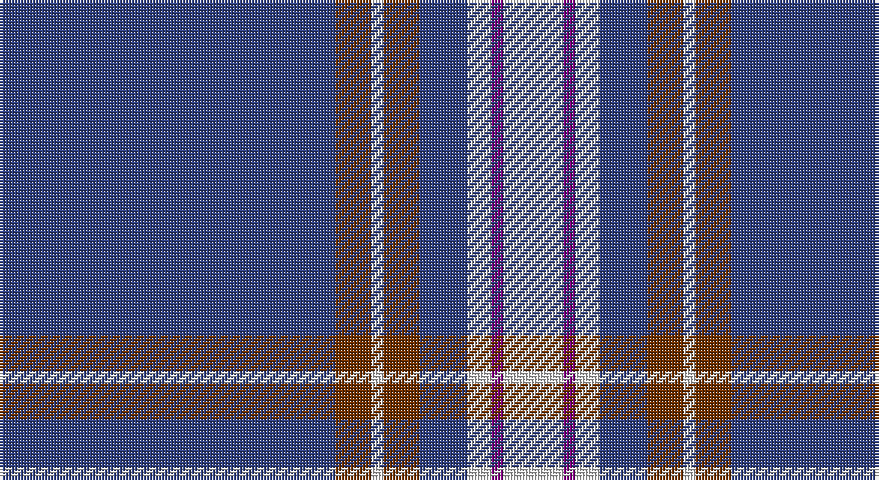

This page is one **sett** — a single exact thread-count. It belongs to the [tartan](/setts/db28o3w1o3db4w2p1w5/)
(the same proportion at any scale), whose colour order is pattern [BRWRBWBW](/stripes/brwrbwbw/).

Sourced from weddslist.  It is a [8 stripe tartan](/stripes/stripes8/).

Original link http://www.weddslist.com/cgi-bin/tartans/pg.pl?source=sts

## Thread count
B/112 T12 LN4 T12 B16 LN8 P4 LN/20

One full sett is **244 threads**.

## Palette

Palette: <strong>Tartan Dictionary</strong> <small style="color:#888">(1 of 4 colours)</small>
<table><thead><tr><th>Colour</th><th>Threads</th><th>Shade</th><th>Base</th><th>OKLCh</th></tr></thead><tbody><tr><td>B/</td><td style="text-align:right;font-variant-numeric:tabular-nums">112</td><td><code style="background-color:#304080;">#304080</code> <small style="color:#888">#304080</small></td><td>B <code style="background-color:#2A418A;">#2A418A</code></td><td><small style="color:#888">oklch(39.4% 0.109 270.2)</small></td></tr><tr><td>T</td><td style="text-align:right;font-variant-numeric:tabular-nums">12</td><td><code style="background-color:#703000;">#703000</code> <small style="color:#888">#703000</small></td><td>R <code style="background-color:#CC0000;">#CC0000</code></td><td><small style="color:#888">oklch(39.1% 0.105 49.1)</small></td></tr><tr><td>LN</td><td style="text-align:right;font-variant-numeric:tabular-nums">4</td><td><code style="background-color:#E0E0E0;">#E0E0E0</code> <small style="color:#888">#E0E0E0</small></td><td>W <code style="background-color:#F7F7F7;">#F7F7F7</code></td><td><small style="color:#888">oklch(90.7% 0.000 89.9)</small></td></tr><tr><td>T</td><td style="text-align:right;font-variant-numeric:tabular-nums">12</td><td><code style="background-color:#703000;">#703000</code> <small style="color:#888">#703000</small></td><td>R <code style="background-color:#CC0000;">#CC0000</code></td><td><small style="color:#888">oklch(39.1% 0.105 49.1)</small></td></tr><tr><td>B</td><td style="text-align:right;font-variant-numeric:tabular-nums">16</td><td><code style="background-color:#304080;">#304080</code> <small style="color:#888">#304080</small></td><td>B <code style="background-color:#2A418A;">#2A418A</code></td><td><small style="color:#888">oklch(39.4% 0.109 270.2)</small></td></tr><tr><td>LN</td><td style="text-align:right;font-variant-numeric:tabular-nums">8</td><td><code style="background-color:#E0E0E0;">#E0E0E0</code> <small style="color:#888">#E0E0E0</small></td><td>W <code style="background-color:#F7F7F7;">#F7F7F7</code></td><td><small style="color:#888">oklch(90.7% 0.000 89.9)</small></td></tr><tr><td>P</td><td style="text-align:right;font-variant-numeric:tabular-nums">4</td><td><code style="background-color:#800080;">#800080</code> <small style="color:#888">#800080</small></td><td>B <code style="background-color:#2A418A;">#2A418A</code></td><td><small style="color:#888">oklch(42.1% 0.193 328.4)</small></td></tr><tr><td>LN/</td><td style="text-align:right;font-variant-numeric:tabular-nums">20</td><td><code style="background-color:#E0E0E0;">#E0E0E0</code> <small style="color:#888">#E0E0E0</small></td><td>W <code style="background-color:#F7F7F7;">#F7F7F7</code></td><td><small style="color:#888">oklch(90.7% 0.000 89.9)</small></td></tr></tbody></table>

# Sample pattern

## Nearest tartans

The nearest existing variants by ΔTartan distance, with this tartan at the top so the swatches line up against it.

ΔTartan

Tartan

Sett

—

<a href="/ttd/edit/#slug=db28o3w1o3db4w2p1w5~x4">Baker</a> <a class="nn-out" href="/variants/s8/db28o3w1o3db4w2p1w5~x4/" title="open its dictionary page">↗</a>

0.75

<a href="/ttd/edit/#slug=db28dr3w1dr3db4w2dp1w5~x4&amp;base=db28o3w1o3db4w2p1w5~x4">Baker Family Tartan</a> <a class="nn-out" href="/variants/s8/db28dr3w1dr3db4w2dp1w5~x4/" title="open its dictionary page">↗</a>

0.78

<a href="/ttd/edit/#slug=db28ly3w1ly3db4w2r1w5~x4&amp;base=db28o3w1o3db4w2p1w5~x4">Baker Dress Family Tartan</a> <a class="nn-out" href="/variants/s8/db28ly3w1ly3db4w2r1w5~x4/" title="open its dictionary page">↗</a>

0.84

<a href="/ttd/edit/#slug=db28o3w1o3db4w2dp1w5~x4&amp;base=db28o3w1o3db4w2p1w5~x4">Baker</a> <a class="nn-out" href="/variants/s8/db28o3w1o3db4w2dp1w5~x4/" title="open its dictionary page">↗</a>

0.86

<a href="/ttd/edit/#slug=db28lo3w1lo3db4w2dp1w5~x4&amp;base=db28o3w1o3db4w2p1w5~x4">Baker (Name)</a> <a class="nn-out" href="/variants/s8/db28lo3w1lo3db4w2dp1w5~x4/" title="open its dictionary page">↗</a>

1.23

<a href="/ttd/edit/#slug=w6db32o3db3o1db3o2dbi4db1ly2~x2&amp;base=db28o3w1o3db4w2p1w5~x4">X Marks the Scot</a> <a class="nn-out" href="/variants/s10/w6db32o3db3o1db3o2dbi4db1ly2~x2/" title="open its dictionary page">↗</a>

1.27

<a href="/ttd/edit/#slug=db32ly4dbi12db2dbi4db2o16db67ly6&amp;base=db28o3w1o3db4w2p1w5~x4">Calum's Cabin</a> <a class="nn-out" href="/variants/s9/db32ly4dbi12db2dbi4db2o16db67ly6/" title="open its dictionary page">↗</a>

1.30

<a href="/ttd/edit/#slug=db42r2y16r2db6r2y8lo3~x2&amp;base=db28o3w1o3db4w2p1w5~x4">Prince George's Police Pipe Band</a> <a class="nn-out" href="/variants/s8/db42r2y16r2db6r2y8lo3~x2/" title="open its dictionary page">↗</a>

1.32

<a href="/ttd/edit/#slug=db96ly11db8ly11db16ly6w4ly16w8&amp;base=db28o3w1o3db4w2p1w5~x4">University of North Carolina at Greensboro, The</a> <a class="nn-out" href="/variants/s9/db96ly11db8ly11db16ly6w4ly16w8/" title="open its dictionary page">↗</a>

1.33

<a href="/ttd/edit/#slug=t4db1t4db24w6db4w1db2~x4&amp;base=db28o3w1o3db4w2p1w5~x4">Antigonish</a> <a class="nn-out" href="/variants/s8/t4db1t4db24w6db4w1db2~x4/" title="open its dictionary page">↗</a>

1.36

<a href="/ttd/edit/#slug=w6db2w3db2g2db20r1~x2&amp;base=db28o3w1o3db4w2p1w5~x4">Gonzaga University’s True Blue and White</a> <a class="nn-out" href="/variants/s7/w6db2w3db2g2db20r1~x2/" title="open its dictionary page">↗</a>

## Neighbour map

Every grey dot is one of 14360 variants placed by the first two principal components of the ΔTartan feature space (44% of its variance). Red is this tartan; blue dots are its nearest — click one to open its page.

<svg viewBox="0 0 640 380" role="img" style="max-width:100%;height:auto;border:1px solid #e0e0e0;border-radius:4px;display:block" xmlns="http://www.w3.org/2000/svg"><image href="/nn/cloud.v1.png" width="640" height="380"/><a href="/variants/s8/db28dr3w1dr3db4w2dp1w5~x4/"><circle cx="427.3" cy="122.7" r="4" fill="#3465a4"><title>Baker Family Tartan</title></circle></a><a href="/variants/s8/db28ly3w1ly3db4w2r1w5~x4/"><circle cx="411.7" cy="112.9" r="4" fill="#3465a4"><title>Baker Dress Family Tartan</title></circle></a><a href="/variants/s8/db28o3w1o3db4w2dp1w5~x4/"><circle cx="413.7" cy="116.1" r="4" fill="#3465a4"><title>Baker</title></circle></a><a href="/variants/s8/db28lo3w1lo3db4w2dp1w5~x4/"><circle cx="412.6" cy="115.8" r="4" fill="#3465a4"><title>Baker (Name)</title></circle></a><a href="/variants/s10/w6db32o3db3o1db3o2dbi4db1ly2~x2/"><circle cx="413.8" cy="91.9" r="4" fill="#3465a4"><title>X Marks the Scot</title></circle></a><a href="/variants/s9/db32ly4dbi12db2dbi4db2o16db67ly6/"><circle cx="467.0" cy="140.8" r="4" fill="#3465a4"><title>Calum's Cabin</title></circle></a><a href="/variants/s8/db42r2y16r2db6r2y8lo3~x2/"><circle cx="365.1" cy="146.9" r="4" fill="#3465a4"><title>Prince George's Police Pipe Band</title></circle></a><a href="/variants/s9/db96ly11db8ly11db16ly6w4ly16w8/"><circle cx="424.4" cy="130.2" r="4" fill="#3465a4"><title>University of North Carolina at Greensboro, The</title></circle></a><a href="/variants/s8/t4db1t4db24w6db4w1db2~x4/"><circle cx="415.8" cy="151.4" r="4" fill="#3465a4"><title>Antigonish</title></circle></a><a href="/variants/s7/w6db2w3db2g2db20r1~x2/"><circle cx="376.0" cy="139.3" r="4" fill="#3465a4"><title>Gonzaga University’s True Blue and White</title></circle></a><circle cx="434.7" cy="125.4" r="5" fill="#c00000"/></svg>

ID: /variants/s8/db28o3w1o3db4w2p1w5~x4/
