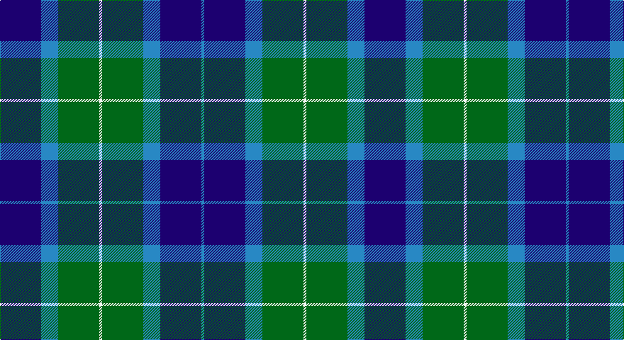

This page is one **sett** — a single exact thread-count. It belongs to the [tartan](/setts/db29t12g29w2g29t12db29t2/)
(the same proportion at any scale), whose colour order is pattern [BBBGWGBB](/stripes/bbbgwgbb/).

Part of the [Wallace](/tartans/wallace/) tartan — the named design grouping this sett with its other cloths.

Sourced from register-of-tartans.  It is a [8 stripe tartan](/stripes/stripes8/).

Original link https://www.tartanregister.gov.uk/tartanDetails.aspx?ref=4483

## Also known as

This cloth is also recorded under:

- Wallace Blue
- Wallace, Blue Wallace

## Register references

External register numbers recorded for this tartan.

- Scottish Register of Tartans: [4483](https://www.tartanregister.gov.uk/tartanDetails.aspx?ref=4483)
- Scottish Tartans Authority (ITI): 46
- Scottish Tartans World Register: 46

## Thread count
DB/58 B24 G58 W4 G58 B24 DB58 B/4

One full sett is **514 threads**.

## Palette

Palette: <strong>Tartan Register</strong>
<table><thead><tr><th>Colour</th><th>Threads</th><th>Shade</th><th>Base</th><th>OKLCh</th></tr></thead><tbody><tr><td>DB/</td><td style="text-align:right;font-variant-numeric:tabular-nums">58</td><td><code style="background-color:#1C0070;">#1C0070</code> <small style="color:#888">#1C0070</small></td><td>B <code style="background-color:#2A418A;">#2A418A</code></td><td><small style="color:#888">oklch(26.3% 0.162 277.1)</small></td></tr><tr><td>B</td><td style="text-align:right;font-variant-numeric:tabular-nums">24</td><td><code style="background-color:#2888C4;">#2888C4</code> <small style="color:#888">#2888C4</small></td><td>B <code style="background-color:#2A418A;">#2A418A</code></td><td><small style="color:#888">oklch(60.1% 0.125 241.5)</small></td></tr><tr><td>G</td><td style="text-align:right;font-variant-numeric:tabular-nums">58</td><td><code style="background-color:#006818;">#006818</code> <small style="color:#888">#006818</small></td><td>G <code style="background-color:#006100;">#006100</code></td><td><small style="color:#888">oklch(45.0% 0.142 145.0)</small></td></tr><tr><td>W</td><td style="text-align:right;font-variant-numeric:tabular-nums">4</td><td><code style="background-color:#F8F8F8;">#F8F8F8</code> <small style="color:#888">#F8F8F8</small></td><td>W <code style="background-color:#F7F7F7;">#F7F7F7</code></td><td><small style="color:#888">oklch(97.9% 0.000 89.9)</small></td></tr><tr><td>G</td><td style="text-align:right;font-variant-numeric:tabular-nums">58</td><td><code style="background-color:#006818;">#006818</code> <small style="color:#888">#006818</small></td><td>G <code style="background-color:#006100;">#006100</code></td><td><small style="color:#888">oklch(45.0% 0.142 145.0)</small></td></tr><tr><td>B</td><td style="text-align:right;font-variant-numeric:tabular-nums">24</td><td><code style="background-color:#2888C4;">#2888C4</code> <small style="color:#888">#2888C4</small></td><td>B <code style="background-color:#2A418A;">#2A418A</code></td><td><small style="color:#888">oklch(60.1% 0.125 241.5)</small></td></tr><tr><td>DB</td><td style="text-align:right;font-variant-numeric:tabular-nums">58</td><td><code style="background-color:#1C0070;">#1C0070</code> <small style="color:#888">#1C0070</small></td><td>B <code style="background-color:#2A418A;">#2A418A</code></td><td><small style="color:#888">oklch(26.3% 0.162 277.1)</small></td></tr><tr><td>B/</td><td style="text-align:right;font-variant-numeric:tabular-nums">4</td><td><code style="background-color:#2888C4;">#2888C4</code> <small style="color:#888">#2888C4</small></td><td>B <code style="background-color:#2A418A;">#2A418A</code></td><td><small style="color:#888">oklch(60.1% 0.125 241.5)</small></td></tr></tbody></table>

# Sample pattern

## Compared to the master

This cloth is one sett of its design; the master sett (the exemplar the design is anchored on) is below for comparison.

<figure style="margin:0"><figcaption style="color:#888;font-size:smaller">this sett</figcaption></figure>
<figure style="margin:0"><figcaption style="color:#888;font-size:smaller"><a href="/setts/k1r8k8ly1/">master sett →</a></figcaption></figure>

## Nearest tartans

The nearest existing variants by ΔTartan distance, with this tartan at the top so the swatches line up against it.

ΔTartan

Tartan

Sett

—

<a href="/ttd/edit/#slug=db29t12g29w2g29t12db29t2~x2">Wallace Blue</a> <a class="nn-out" href="/variants/s8/db29t12g29w2g29t12db29t2~x2/" title="open its dictionary page">↗</a>

1.14

<a href="/ttd/edit/#slug=k4g2db10ly1db2g13k11g13db13ly2~x2&amp;base=db29t12g29w2g29t12db29t2~x2">Pinney's of Scotland</a> <a class="nn-out" href="/variants/s10/k4g2db10ly1db2g13k11g13db13ly2~x2/" title="open its dictionary page">↗</a>

1.15

<a href="/ttd/edit/#slug=k10b10k15g40k15b10k10ly3~x2&amp;base=db29t12g29w2g29t12db29t2~x2">U.S. Border Patrol</a> <a class="nn-out" href="/variants/s8/k10b10k15g40k15b10k10ly3~x2/" title="open its dictionary page">↗</a>

1.20

<a href="/ttd/edit/#slug=w2db16g16t4k4t4g16db16w1~x2&amp;base=db29t12g29w2g29t12db29t2~x2">Douglas</a> <a class="nn-out" href="/variants/s9/w2db16g16t4k4t4g16db16w1~x2/" title="open its dictionary page">↗</a>

1.26

<a href="/variants/s6/b12k4g6ly1~x8/">Sinclair of Ulbster</a>

1.27

<a href="/ttd/edit/#slug=g24b6lb3k6b12k15g4~x2&amp;base=db29t12g29w2g29t12db29t2~x2">Blaylock Annandale</a> <a class="nn-out" href="/variants/s7/g24b6lb3k6b12k15g4~x2/" title="open its dictionary page">↗</a>

1.31

<a href="/ttd/edit/#slug=db4g2dbi10ly1dbi2g13db11g13dbi13ly2~x2&amp;base=db29t12g29w2g29t12db29t2~x2">Pinney's of Scotland</a> <a class="nn-out" href="/variants/s10/db4g2dbi10ly1dbi2g13db11g13dbi13ly2~x2/" title="open its dictionary page">↗</a>

1.32

<a href="/ttd/edit/#slug=g27k21db12k4db40k4db12k21g27w4~x2&amp;base=db29t12g29w2g29t12db29t2~x2">Granger/Grainger (Personal)</a> <a class="nn-out" href="/variants/s10/g27k21db12k4db40k4db12k21g27w4~x2/" title="open its dictionary page">↗</a>

1.32

<a href="/ttd/edit/#slug=k2g12k11b12w1~x2&amp;base=db29t12g29w2g29t12db29t2~x2">MacKirdy</a> <a class="nn-out" href="/variants/s5/k2g12k11b12w1~x2/" title="open its dictionary page">↗</a>

1.34

<a href="/ttd/edit/#slug=dg3lr3dg18db14r5db14r5db14dg21lr3~x2&amp;base=db29t12g29w2g29t12db29t2~x2">Hamilton of Clayton (Personal)</a> <a class="nn-out" href="/variants/s10/dg3lr3dg18db14r5db14r5db14dg21lr3~x2/" title="open its dictionary page">↗</a>

1.34

<a href="/ttd/edit/#slug=db30k10g10lb2g15lb2~x2&amp;base=db29t12g29w2g29t12db29t2~x2">MacRobart (Personal)</a> <a class="nn-out" href="/variants/s6/db30k10g10lb2g15lb2~x2/" title="open its dictionary page">↗</a>

## Neighbour map

Every grey dot is one of 14360 variants placed by the first two principal components of the ΔTartan feature space (44% of its variance). Red is this tartan; blue dots are its nearest — click one to open its page.

<svg viewBox="0 0 640 380" role="img" style="max-width:100%;height:auto;border:1px solid #e0e0e0;border-radius:4px;display:block" xmlns="http://www.w3.org/2000/svg"><image href="/nn/cloud.v1.png" width="640" height="380"/><a href="/variants/s10/k4g2db10ly1db2g13k11g13db13ly2~x2/"><circle cx="190.7" cy="199.0" r="4" fill="#3465a4"><title>Pinney's of Scotland</title></circle></a><a href="/variants/s8/k10b10k15g40k15b10k10ly3~x2/"><circle cx="228.3" cy="204.7" r="4" fill="#3465a4"><title>U.S. Border Patrol</title></circle></a><a href="/variants/s9/w2db16g16t4k4t4g16db16w1~x2/"><circle cx="217.3" cy="186.4" r="4" fill="#3465a4"><title>Douglas</title></circle></a><a href="/variants/s6/b12k4g6ly1~x8/"><circle cx="191.9" cy="240.6" r="4" fill="#3465a4"><title>Sinclair of Ulbster</title></circle></a><a href="/variants/s7/g24b6lb3k6b12k15g4~x2/"><circle cx="189.5" cy="236.9" r="4" fill="#3465a4"><title>Blaylock Annandale</title></circle></a><a href="/variants/s10/db4g2dbi10ly1dbi2g13db11g13dbi13ly2~x2/"><circle cx="228.1" cy="217.4" r="4" fill="#3465a4"><title>Pinney's of Scotland</title></circle></a><a href="/variants/s10/g27k21db12k4db40k4db12k21g27w4~x2/"><circle cx="197.4" cy="225.7" r="4" fill="#3465a4"><title>Granger/Grainger (Personal)</title></circle></a><a href="/variants/s5/k2g12k11b12w1~x2/"><circle cx="179.1" cy="234.0" r="4" fill="#3465a4"><title>MacKirdy</title></circle></a><a href="/variants/s10/dg3lr3dg18db14r5db14r5db14dg21lr3~x2/"><circle cx="204.9" cy="236.4" r="4" fill="#3465a4"><title>Hamilton of Clayton (Personal)</title></circle></a><a href="/variants/s6/db30k10g10lb2g15lb2~x2/"><circle cx="264.1" cy="218.3" r="4" fill="#3465a4"><title>MacRobart (Personal)</title></circle></a><circle cx="216.6" cy="217.4" r="5" fill="#c00000"/></svg>

ID: /variants/s8/db29t12g29w2g29t12db29t2~x2/
