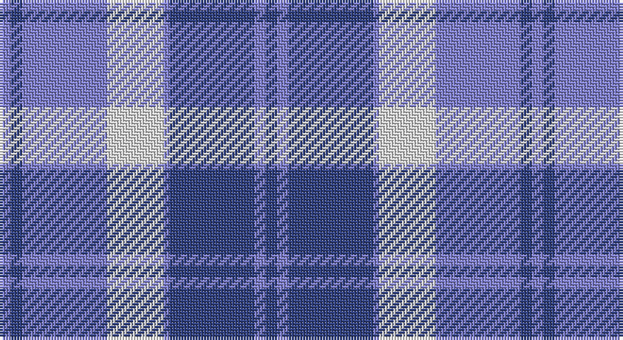

This page is one **sett** — a single exact thread-count. It belongs to the [tartan](/setts/db2b2db15b1w10b15db2b2/)
(the same proportion at any scale), whose colour order is pattern [BBBBWBBB](/stripes/bbbbwbbb/).

Part of the [Bannockbane](/tartans/bannockbane/) tartan — the named design grouping this sett with its other cloths.

Sourced from weddslist.  It is a [8 stripe tartan](/stripes/stripes8/).

Original link http://www.weddslist.com/cgi-bin/tartans/pg.pl?source=sts

## Also known as

This cloth is also recorded under:

- Bannockbane Blue
- Bannockbane Blue #1
- Bannockbane Blue #2
- Bannockbane Blue #3
- Bannockbane Brown #2
- Bannockbane Green
- Bannockbane Grey #1
- Bannockbane Grey #2
- Bannockbane Grey #3
- Bannockbane, Blue
- Bannockbane, Green
- Bannockbane, Grey
- Bannockbane, Light Tan

## Thread count
B/4 Ba4 B30 LN20 B2 Ba30 B4 Ba/4

One full sett is **188 threads**.

## Palette

Palette: <strong>Tartan Dictionary</strong> <small style="color:#888">(1 of 3 colours)</small>
<table><thead><tr><th>Colour</th><th>Threads</th><th>Shade</th><th>Base</th><th>OKLCh</th></tr></thead><tbody><tr><td>B/</td><td style="text-align:right;font-variant-numeric:tabular-nums">4</td><td><code style="background-color:#8080D0;">#8080D0</code> <small style="color:#888">#8080D0</small></td><td>B <code style="background-color:#2A418A;">#2A418A</code></td><td><small style="color:#888">oklch(63.4% 0.119 282.5)</small></td></tr><tr><td>Ba</td><td style="text-align:right;font-variant-numeric:tabular-nums">4</td><td><code style="background-color:#304080;">#304080</code> <small style="color:#888">#304080</small></td><td>B <code style="background-color:#2A418A;">#2A418A</code></td><td><small style="color:#888">oklch(39.4% 0.109 270.2)</small></td></tr><tr><td>B</td><td style="text-align:right;font-variant-numeric:tabular-nums">30</td><td><code style="background-color:#8080D0;">#8080D0</code> <small style="color:#888">#8080D0</small></td><td>B <code style="background-color:#2A418A;">#2A418A</code></td><td><small style="color:#888">oklch(63.4% 0.119 282.5)</small></td></tr><tr><td>LN</td><td style="text-align:right;font-variant-numeric:tabular-nums">20</td><td><code style="background-color:#E0E0E0;">#E0E0E0</code> <small style="color:#888">#E0E0E0</small></td><td>W <code style="background-color:#F7F7F7;">#F7F7F7</code></td><td><small style="color:#888">oklch(90.7% 0.000 89.9)</small></td></tr><tr><td>B</td><td style="text-align:right;font-variant-numeric:tabular-nums">2</td><td><code style="background-color:#8080D0;">#8080D0</code> <small style="color:#888">#8080D0</small></td><td>B <code style="background-color:#2A418A;">#2A418A</code></td><td><small style="color:#888">oklch(63.4% 0.119 282.5)</small></td></tr><tr><td>Ba</td><td style="text-align:right;font-variant-numeric:tabular-nums">30</td><td><code style="background-color:#304080;">#304080</code> <small style="color:#888">#304080</small></td><td>B <code style="background-color:#2A418A;">#2A418A</code></td><td><small style="color:#888">oklch(39.4% 0.109 270.2)</small></td></tr><tr><td>B</td><td style="text-align:right;font-variant-numeric:tabular-nums">4</td><td><code style="background-color:#8080D0;">#8080D0</code> <small style="color:#888">#8080D0</small></td><td>B <code style="background-color:#2A418A;">#2A418A</code></td><td><small style="color:#888">oklch(63.4% 0.119 282.5)</small></td></tr><tr><td>Ba/</td><td style="text-align:right;font-variant-numeric:tabular-nums">4</td><td><code style="background-color:#304080;">#304080</code> <small style="color:#888">#304080</small></td><td>B <code style="background-color:#2A418A;">#2A418A</code></td><td><small style="color:#888">oklch(39.4% 0.109 270.2)</small></td></tr></tbody></table>

# Sample pattern

## Compared to the master

This cloth is one sett of its design; the master sett (the exemplar the design is anchored on) is below for comparison.

<figure style="margin:0"><figcaption style="color:#888;font-size:smaller">this sett</figcaption></figure>
<figure style="margin:0"><figcaption style="color:#888;font-size:smaller"><a href="/setts/o2dy2o15dy2w10lo15dy2lo2/">master sett →</a></figcaption></figure>

## Nearest tartans

The nearest existing variants by ΔTartan distance, with this tartan at the top so the swatches line up against it.

ΔTartan

Tartan

Sett

—

<a href="/ttd/edit/#slug=db2b2db15b1w10b15db2b2~x2">Bannockbane</a> <a class="nn-out" href="/variants/s8/db2b2db15b1w10b15db2b2~x2/" title="open its dictionary page">↗</a>

1.02

<a href="/ttd/edit/#slug=db2t2db15t1w10t15db2t2~x2&amp;base=db2b2db15b1w10b15db2b2~x2">Bannockbane Light Blue</a> <a class="nn-out" href="/variants/s8/db2t2db15t1w10t15db2t2~x2/" title="open its dictionary page">↗</a>

1.18

<a href="/ttd/edit/#slug=t22db3t3db3t3db9lb28db3lb6~x2&amp;base=db2b2db15b1w10b15db2b2~x2">Kildonan Blue (Fashion)</a> <a class="nn-out" href="/variants/s9/t22db3t3db3t3db9lb28db3lb6~x2/" title="open its dictionary page">↗</a>

1.26

<a href="/ttd/edit/#slug=db12lb2db2t6db4lb3db4lb18r1~x4&amp;base=db2b2db15b1w10b15db2b2~x2">Thorburn #1 (Name)</a> <a class="nn-out" href="/variants/s9/db12lb2db2t6db4lb3db4lb18r1~x4/" title="open its dictionary page">↗</a>

1.34

<a href="/ttd/edit/#slug=w9b3ly3b24db24ly2db2ly2~x2&amp;base=db2b2db15b1w10b15db2b2~x2">Halesowen (District)</a> <a class="nn-out" href="/variants/s8/w9b3ly3b24db24ly2db2ly2~x2/" title="open its dictionary page">↗</a>

1.41

<a href="/ttd/edit/#slug=db3dbi2db14dbi1lb10lbi16dbi2lbi3~x2&amp;base=db2b2db15b1w10b15db2b2~x2">Bannockbane Blue #2</a> <a class="nn-out" href="/variants/s8/db3dbi2db14dbi1lb10lbi16dbi2lbi3~x2/" title="open its dictionary page">↗</a>

1.50

<a href="/ttd/edit/#slug=db12lb4db4t12db8lb5db8lb35r4~x2&amp;base=db2b2db15b1w10b15db2b2~x2">Thorburn (1992)</a> <a class="nn-out" href="/variants/s9/db12lb4db4t12db8lb5db8lb35r4~x2/" title="open its dictionary page">↗</a>

1.52

<a href="/ttd/edit/#slug=t57k5t9m29k18w9m9w5&amp;base=db2b2db15b1w10b15db2b2~x2">Yale College, Wrexham</a> <a class="nn-out" href="/variants/s8/t57k5t9m29k18w9m9w5/" title="open its dictionary page">↗</a>

1.58

<a href="/ttd/edit/#slug=dt7w3dt2w6dt16t26r4~x2&amp;base=db2b2db15b1w10b15db2b2~x2">Keela (Corporate)</a> <a class="nn-out" href="/variants/s7/dt7w3dt2w6dt16t26r4~x2/" title="open its dictionary page">↗</a>

1.60

<a href="/ttd/edit/#slug=db3o2db18o1w10y18o2y3~x2&amp;base=db2b2db15b1w10b15db2b2~x2">Bannockbane, Modern Silver</a> <a class="nn-out" href="/variants/s8/db3o2db18o1w10y18o2y3~x2/" title="open its dictionary page">↗</a>

1.60

<a href="/ttd/edit/#slug=db41t2w2t2db5b12w31db4~x2&amp;base=db2b2db15b1w10b15db2b2~x2">Harmony, Eildon</a> <a class="nn-out" href="/variants/s8/db41t2w2t2db5b12w31db4~x2/" title="open its dictionary page">↗</a>

## Neighbour map

Every grey dot is one of 14360 variants placed by the first two principal components of the ΔTartan feature space (44% of its variance). Red is this tartan; blue dots are its nearest — click one to open its page.

<svg viewBox="0 0 640 380" role="img" style="max-width:100%;height:auto;border:1px solid #e0e0e0;border-radius:4px;display:block" xmlns="http://www.w3.org/2000/svg"><image href="/nn/cloud.v1.png" width="640" height="380"/><a href="/variants/s8/db2t2db15t1w10t15db2t2~x2/"><circle cx="233.9" cy="179.3" r="4" fill="#3465a4"><title>Bannockbane Light Blue</title></circle></a><a href="/variants/s9/t22db3t3db3t3db9lb28db3lb6~x2/"><circle cx="236.3" cy="190.1" r="4" fill="#3465a4"><title>Kildonan Blue (Fashion)</title></circle></a><a href="/variants/s9/db12lb2db2t6db4lb3db4lb18r1~x4/"><circle cx="249.3" cy="157.8" r="4" fill="#3465a4"><title>Thorburn #1 (Name)</title></circle></a><a href="/variants/s8/w9b3ly3b24db24ly2db2ly2~x2/"><circle cx="210.7" cy="169.5" r="4" fill="#3465a4"><title>Halesowen (District)</title></circle></a><a href="/variants/s8/db3dbi2db14dbi1lb10lbi16dbi2lbi3~x2/"><circle cx="183.4" cy="160.6" r="4" fill="#3465a4"><title>Bannockbane Blue #2</title></circle></a><a href="/variants/s9/db12lb4db4t12db8lb5db8lb35r4~x2/"><circle cx="226.6" cy="182.0" r="4" fill="#3465a4"><title>Thorburn (1992)</title></circle></a><a href="/variants/s8/t57k5t9m29k18w9m9w5/"><circle cx="223.1" cy="167.6" r="4" fill="#3465a4"><title>Yale College, Wrexham</title></circle></a><a href="/variants/s7/dt7w3dt2w6dt16t26r4~x2/"><circle cx="213.0" cy="182.8" r="4" fill="#3465a4"><title>Keela (Corporate)</title></circle></a><a href="/variants/s8/db3o2db18o1w10y18o2y3~x2/"><circle cx="223.5" cy="163.9" r="4" fill="#3465a4"><title>Bannockbane, Modern Silver</title></circle></a><a href="/variants/s8/db41t2w2t2db5b12w31db4~x2/"><circle cx="285.9" cy="135.9" r="4" fill="#3465a4"><title>Harmony, Eildon</title></circle></a><circle cx="260.2" cy="186.2" r="5" fill="#c00000"/></svg>

ID: /variants/s8/db2b2db15b1w10b15db2b2~x2/
