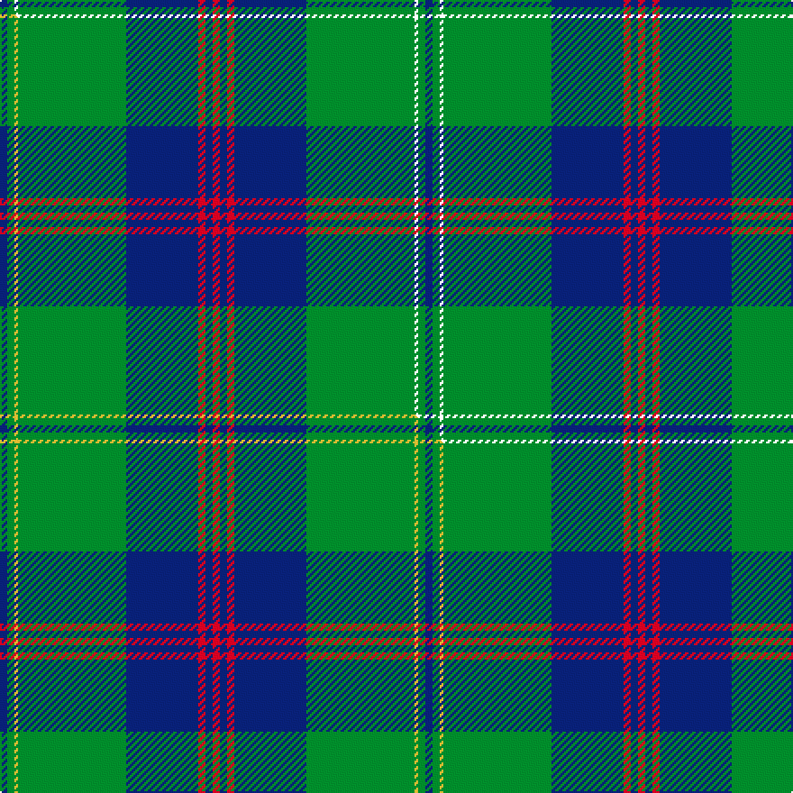

This is one **variant** — a specific cloth: this exact thread count and colourway, with its own
provenance below. It is one weaving of the [sett](/tartans/g/gr/gretna/) (the scale-free proportion — the
same cloth at any scale or shade), whose colour order is pattern [BGKGBRBR](/stripes/bgkgbrbr/).

Part of the [Gretna](/tartans/g/gr/gretna/) tartan — the named design grouping this sett with its other cloths.

Sourced from house-of-tartan.  It is a [8 stripe tartan](/stripes/stripes8/).

Original link [http://www.house-of-tartan.scotland.net/house/TartanViewjs.asp?colr=Def&tnam=5119](http://www.house-of-tartan.scotland.net/house/TartanViewjs.asp?colr=Def&tnam=5119)

## Provenance

Earliest known date: 01/01/1996 Designed in 1996 by Lochcarron for Tartan & Tweeds of Gretna Green. Gretna Green became famous for runaway marriages when 'irregular' marriages were banned by law in England in 1753. Couples were able to run to Scotland and become legally married by proclamation in front of two witnesses. This form of marriage was recognised worldwide. From the middle of the 18th century these marriages were in such demand that the blacksmith, conveniently situated on the crossroads at Gretna Green, became known as the 'anvil priest', giving birth to the anvil as the symbol of Gretna Green. Many couples are still married at the original smithy while many others, although married elsewhere, visit Gretna Green to take the traditional Scottish oath. The Gretna Green tartan reflects the twin influences of this history and that of the powerful border clan Johnstone, so influential in this area of Dumfriesshire, on which this tartan is based. Sample in Scottish Tartans Authority's Johnston Collection.

Dataset <small>— provenance for this record, inherited from the source manifest</small>

<dl class="dataset-prov">
<dt>source</dt><dd><a href="/sources/house-of-tartan/">House of Tartan</a></dd>
<dt>data captured from</dt><dd><a href="https://github.com/thetartan/tartan-database/blob/master/data/house-of-tartan/data.csv">https://github.com/thetartan/tartan-database/blob/master/data/house-of-tartan/data.csv</a></dd>
<dt>data date</dt><dd>01/01/1996 <small>(this record)</small></dd>
<dt>licence</dt><dd><a href="https://creativecommons.org/licenses/by-nc-nd/4.0/">CC BY-NC-ND 4.0</a></dd>
</dl>

Capture chain <small>— the hands this data passed through, oldest first; each capture carries its own licence</small>

<ol class="capture-chain">
<li><a href="http://www.house-of-tartan.scotland.net/">House of Tartan</a> <small>the weaver/retailer's database — the site is now offline; the URL is kept as the ultimate source's identity</small></li>
<li><a href="https://github.com/thetartan/tartan-database">thetartan/tartan-database</a> <small>2016-2017</small> · <a href="https://creativecommons.org/licenses/by-nc-nd/4.0/">CC BY-NC-ND 4.0</a> <small>Levko Kravets's frozen compilation — the capture we vendored, and where its CC licence text came from</small></li>
<li>this dictionary <small>captured 2026-06-10 · commit 5bf86c7566</small> <small>each re-capture is a git commit to data/sources</small></li>
</ol>

## Thread count
DB/4 G4 K2 G60 DB40 R4 DB4 R/4

One full sett is **236 threads**.

## Palette
<table><thead><tr><th>Colour</th><th>Shade</th><th>OKLCh</th></tr></thead><tbody><tr><td>DB</td><td><code style="background-color:#082077;">#082077</code> <small style="color:#888">#082077</small></td><td><small style="color:#888">oklch(30.0% 0.149 265.1)</small></td></tr><tr><td>G</td><td><code style="background-color:#008B2A;">#008B2A</code> <small style="color:#888">#008B2A</small></td><td><small style="color:#888">oklch(55.4% 0.170 145.9)</small></td></tr><tr><td>R</td><td><code style="background-color:#D60020;">#D60020</code> <small style="color:#888">#D60020</small></td><td><small style="color:#888">oklch(55.2% 0.224 25.5)</small></td></tr></tbody></table>

# Sample pattern

## Compared to the master

This cloth is one sett of its design; the master sett (the exemplar the design is anchored on) is below for comparison.

Its **ΔTartan distance** from the master is **0.30** — the same measure the nearest-tartans table ranks by (0 is identical; a re-scale of the same cloth is near 0, a recolour or a different proportion further).

<figure class="master-compare" style="margin:0">

this sett
master sett ★

<figcaption style="color:#888;font-size:smaller">One weave of this sett against the <a href="/setts/db2g2ly1g30db20r2db2r2/">master sett ★</a>, split on the diagonal: a shared proportion runs seamlessly across it with only the shades shifting; a different proportion breaks on it.</figcaption>
</figure>

## Nearest tartan variants

The nearest existing variants by ΔTartan distance, with this cloth at the top so the swatches line up against it.

ΔTartan

Threads

Variant

Sett

—

236

<a href="/variants/s8/db2g2k1g30db20r2db2r2~x2/">Gretna Green Fashion Tartan</a>

<a href="/ttd/edit/#slug=db2g2ly1g30db20r2db2r2~x2&amp;base=db2g2k1g30db20r2db2r2~x2" title="compare in the TTD">0.30</a>

236

<a href="/variants/s8/db2g2ly1g30db20r2db2r2~x2/">Gretna Green</a>

<a href="/ttd/edit/#slug=r6db2r1db8r3db16g28w2g4~x2&amp;base=db2g2k1g30db20r2db2r2~x2" title="compare in the TTD">0.94</a>

260

<a href="/variants/s9/r6db2r1db8r3db16g28w2g4~x2/">George (Personal)</a>

<a href="/ttd/edit/#slug=r6db2r1db16r3db16g28w2g4~x2&amp;base=db2g2k1g30db20r2db2r2~x2" title="compare in the TTD">1.07</a>

292

<a href="/variants/s9/r6db2r1db16r3db16g28w2g4~x2/">George (Personal)</a>

<a href="/ttd/edit/#slug=g38w2g6db24o6db2o3db2~x2&amp;base=db2g2k1g30db20r2db2r2~x2" title="compare in the TTD">1.27</a>

252

<a href="/variants/s8/g38w2g6db24o6db2o3db2~x2/">MacAuliffe/McAucliffe</a>

<a href="/ttd/edit/#slug=y3g2k1g30db24k2db2k2&amp;base=db2g2k1g30db20r2db2r2~x2" title="compare in the TTD">1.74</a>

127

<a href="/variants/s8/y3g2k1g30db24k2db2k2/">Johnston</a>

<a href="/ttd/edit/#slug=y3g2k1g30db24k2db2k2~x2&amp;base=db2g2k1g30db20r2db2r2~x2" title="compare in the TTD">1.74</a>

254

<a href="/variants/s8/y3g2k1g30db24k2db2k2~x2/">Johnston Clan Tartan</a>

<a href="/ttd/edit/#slug=y3g2k1g30b24k2b2k2~x2~b2105244&amp;base=db2g2k1g30db20r2db2r2~x2" title="compare in the TTD">1.74</a>

254

<a href="/variants/s8/y3g2k1g30t24k2t2k2~x2~t2105244/">Johnston/Johnstone</a>

<a href="/ttd/edit/#slug=y3db1k2g26db28w1db1r2~x2&amp;base=db2g2k1g30db20r2db2r2~x2" title="compare in the TTD">2.12</a>

246

<a href="/variants/s8/y3db1k2g26db28w1db1r2~x2/">Johnston, Diana Hunting (Personal)</a>

<a href="/ttd/edit/#slug=ly3db1k2g26db28w1db1r2~x2&amp;base=db2g2k1g30db20r2db2r2~x2" title="compare in the TTD">2.12</a>

246

<a href="/variants/s8/ly3db1k2g26db28w1db1r2~x2/">Johnston, Diana Hunting (Personal)</a>

<a href="/ttd/edit/#slug=dg4w1dg26t26k2t4~x4&amp;base=db2g2k1g30db20r2db2r2~x2" title="compare in the TTD">2.35</a>

472

<a href="/variants/s6/dg4w1dg26t26k2t4~x4/">Melville (Two black lines)</a>

## Neighbour map

Every grey dot is one of 13656 variants placed by the first two principal components of the ΔTartan feature space (42% of its variance). Red is this tartan; blue dots are its nearest — click one to open its page. The map is a flat projection of a many-dimensional space — [how to read it](/posts/neighbourhood-maps/).

<svg viewBox="0 0 640 380" role="img" style="max-width:100%;height:auto;border:1px solid #e0e0e0;border-radius:4px;display:block" xmlns="http://www.w3.org/2000/svg"><image href="/nn/cloud.v1.png" width="640" height="380"/><a href="/variants/s8/db2g2ly1g30db20r2db2r2~x2/"><circle cx="360.7" cy="136.7" r="4" fill="#3465a4"><title>Gretna Green</title></circle></a><a href="/variants/s9/r6db2r1db8r3db16g28w2g4~x2/"><circle cx="288.5" cy="146.1" r="4" fill="#3465a4"><title>George (Personal)</title></circle></a><a href="/variants/s9/r6db2r1db16r3db16g28w2g4~x2/"><circle cx="281.7" cy="150.9" r="4" fill="#3465a4"><title>George (Personal)</title></circle></a><a href="/variants/s8/g38w2g6db24o6db2o3db2~x2/"><circle cx="335.4" cy="163.9" r="4" fill="#3465a4"><title>MacAuliffe/McAucliffe</title></circle></a><a href="/variants/s8/y3g2k1g30db24k2db2k2/"><circle cx="303.0" cy="121.7" r="4" fill="#3465a4"><title>Johnston</title></circle></a><a href="/variants/s8/y3g2k1g30db24k2db2k2~x2/"><circle cx="303.0" cy="121.7" r="4" fill="#3465a4"><title>Johnston Clan Tartan</title></circle></a><a href="/variants/s8/y3g2k1g30t24k2t2k2~x2~t2105244/"><circle cx="346.9" cy="122.5" r="4" fill="#3465a4"><title>Johnston/Johnstone</title></circle></a><a href="/variants/s8/y3db1k2g26db28w1db1r2~x2/"><circle cx="265.2" cy="94.9" r="4" fill="#3465a4"><title>Johnston, Diana Hunting (Personal)</title></circle></a><a href="/variants/s8/ly3db1k2g26db28w1db1r2~x2/"><circle cx="256.3" cy="92.0" r="4" fill="#3465a4"><title>Johnston, Diana Hunting (Personal)</title></circle></a><a href="/variants/s6/dg4w1dg26t26k2t4~x4/"><circle cx="344.9" cy="168.3" r="4" fill="#3465a4"><title>Melville (Two black lines)</title></circle></a><circle cx="336.2" cy="120.9" r="5" fill="#c00000"/><text x="320" y="376" text-anchor="middle" font-size="11" fill="#999">ground</text><text x="11" y="190" text-anchor="middle" font-size="11" fill="#999" transform="rotate(-90 11 190)">complexity</text></svg>

ID: /variants/s8/db2g2k1g30db20r2db2r2~x2/
