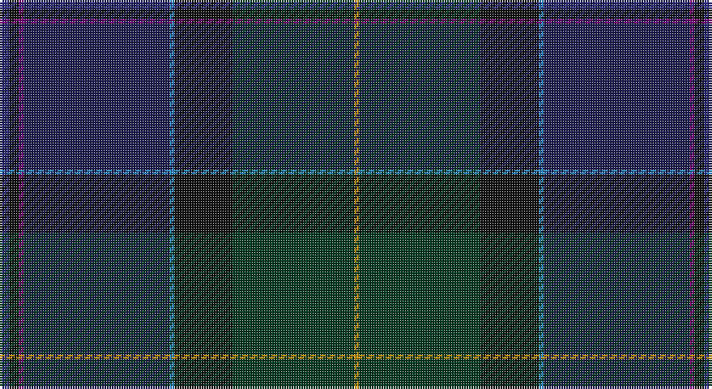

This page is one **sett** — a single exact thread-count. It belongs to the [tartan](/setts/db2k2dp1dbi30t1k12dg25lo1/)
(the same proportion at any scale), whose colour order is pattern [BKBBBKGY](/stripes/bkbbbkgy/).

Sourced from tartans-authority.  It is a [8 stripe tartan](/stripes/stripes8/).

Original link http://www.tartansauthority.com/tartan-ferret/display/7972/

## Register references

External register numbers recorded for this tartan.

- Scottish Register of Tartans: [7972](https://www.tartanregister.gov.uk/tartanDetails?ref=7972)
- Scottish Tartans Authority (ITI): 7972

## Thread count
DB/4 K4 P2 DBa60 B2 K24 DG50 DY/2

One full sett is **290 threads**.

## Palette

Palette: <strong>Tartan Register</strong>
<table><thead><tr><th>Colour</th><th>Threads</th><th>Shade</th><th>Base</th><th>OKLCh</th></tr></thead><tbody><tr><td>DB/</td><td style="text-align:right;font-variant-numeric:tabular-nums">4</td><td><code style="background-color:#2C2C80;">#2C2C80</code> <small style="color:#888">#2C2C80</small></td><td>B <code style="background-color:#2A418A;">#2A418A</code></td><td><small style="color:#888">oklch(35.0% 0.138 276.6)</small></td></tr><tr><td>K</td><td style="text-align:right;font-variant-numeric:tabular-nums">4</td><td><code style="background-color:#101010;">#101010</code> <small style="color:#888">#101010</small></td><td>K <code style="background-color:#000000;">#000000</code></td><td><small style="color:#888">oklch(17.3% 0.000 89.9)</small></td></tr><tr><td>P</td><td style="text-align:right;font-variant-numeric:tabular-nums">2</td><td><code style="background-color:#780078;">#780078</code> <small style="color:#888">#780078</small></td><td>B <code style="background-color:#2A418A;">#2A418A</code></td><td><small style="color:#888">oklch(40.2% 0.185 328.4)</small></td></tr><tr><td>DBa</td><td style="text-align:right;font-variant-numeric:tabular-nums">60</td><td><code style="background-color:#1C1C50;">#1C1C50</code> <small style="color:#888">#1C1C50</small></td><td>B <code style="background-color:#2A418A;">#2A418A</code></td><td><small style="color:#888">oklch(26.2% 0.093 277.9)</small></td></tr><tr><td>B</td><td style="text-align:right;font-variant-numeric:tabular-nums">2</td><td><code style="background-color:#2888C4;">#2888C4</code> <small style="color:#888">#2888C4</small></td><td>B <code style="background-color:#2A418A;">#2A418A</code></td><td><small style="color:#888">oklch(60.1% 0.125 241.5)</small></td></tr><tr><td>K</td><td style="text-align:right;font-variant-numeric:tabular-nums">24</td><td><code style="background-color:#101010;">#101010</code> <small style="color:#888">#101010</small></td><td>K <code style="background-color:#000000;">#000000</code></td><td><small style="color:#888">oklch(17.3% 0.000 89.9)</small></td></tr><tr><td>DG</td><td style="text-align:right;font-variant-numeric:tabular-nums">50</td><td><code style="background-color:#003820;">#003820</code> <small style="color:#888">#003820</small></td><td>G <code style="background-color:#006100;">#006100</code></td><td><small style="color:#888">oklch(30.0% 0.070 158.3)</small></td></tr><tr><td>DY/</td><td style="text-align:right;font-variant-numeric:tabular-nums">2</td><td><code style="background-color:#BC8C00;">#BC8C00</code> <small style="color:#888">#BC8C00</small></td><td>Y <code style="background-color:#F2BF00;">#F2BF00</code></td><td><small style="color:#888">oklch(66.8% 0.137 84.1)</small></td></tr></tbody></table>

# Sample pattern

## Nearest tartans

The nearest existing variants by ΔTartan distance, with this tartan at the top so the swatches line up against it.

ΔTartan

Tartan

Sett

—

<a href="/ttd/edit/#slug=db2k2dp1dbi30t1k12dg25lo1~x2">Castellari of Lochaber Lairds (Pers</a> <a class="nn-out" href="/variants/s8/db2k2dp1dbi30t1k12dg25lo1~x2/" title="open its dictionary page">↗</a>

1.32

<a href="/ttd/edit/#slug=k4dp2r7dp60y15dt60n5w3&amp;base=db2k2dp1dbi30t1k12dg25lo1~x2">Albannach (Corporate)</a> <a class="nn-out" href="/variants/s8/k4dp2r7dp60y15dt60n5w3/" title="open its dictionary page">↗</a>

1.54

<a href="/ttd/edit/#slug=db2r1dg26ly1k18db26y1r1db2~x2&amp;base=db2k2dp1dbi30t1k12dg25lo1~x2">Robb Hunting (Personal)</a> <a class="nn-out" href="/variants/s9/db2r1dg26ly1k18db26y1r1db2~x2/" title="open its dictionary page">↗</a>

1.82

<a href="/ttd/edit/#slug=db6k2dp9lb1dp9k2dt4k6dt24w1db6~x2&amp;base=db2k2dp1dbi30t1k12dg25lo1~x2">Newlands, Charlie (Personal)</a> <a class="nn-out" href="/variants/s11/db6k2dp9lb1dp9k2dt4k6dt24w1db6~x2/" title="open its dictionary page">↗</a>

1.97

<a href="/ttd/edit/#slug=db45dp6o6dp30dg6dp6dg30k4r4k3&amp;base=db2k2dp1dbi30t1k12dg25lo1~x2">Dalgliesh, Ewen (Personal)</a> <a class="nn-out" href="/variants/s10/db45dp6o6dp30dg6dp6dg30k4r4k3/" title="open its dictionary page">↗</a>

2.01

<a href="/ttd/edit/#slug=r5do8dp13dt21dg34dgi55r3&amp;base=db2k2dp1dbi30t1k12dg25lo1~x2">Uitwaaien Papi (Personal)</a> <a class="nn-out" href="/variants/s7/r5do8dp13dt21dg34dgi55r3/" title="open its dictionary page">↗</a>

2.03

<a href="/ttd/edit/#slug=dy31y6o3db31dy8yi60y7b7~x2&amp;base=db2k2dp1dbi30t1k12dg25lo1~x2">Little-Dowse Wedding</a> <a class="nn-out" href="/variants/s8/dy31y6o3db31dy8yi60y7b7~x2/" title="open its dictionary page">↗</a>

2.10

<a href="/ttd/edit/#slug=p3dt1do3o8dg4o3dg17do11db6do4db21dt1~x2&amp;base=db2k2dp1dbi30t1k12dg25lo1~x2">Doane</a> <a class="nn-out" href="/variants/s12/p3dt1do3o8dg4o3dg17do11db6do4db21dt1~x2/" title="open its dictionary page">↗</a>

2.11

<a href="/ttd/edit/#slug=dg28k2dbi3k11dbi3k2dbi17db4lr2~x2&amp;base=db2k2dp1dbi30t1k12dg25lo1~x2">West of Wells (Personal)</a> <a class="nn-out" href="/variants/s9/dg28k2dbi3k11dbi3k2dbi17db4lr2~x2/" title="open its dictionary page">↗</a>

2.14

<a href="/ttd/edit/#slug=o7dg20y2dg4k5db4k2db20k3w1~x2&amp;base=db2k2dp1dbi30t1k12dg25lo1~x2">McMeeken</a> <a class="nn-out" href="/variants/s10/o7dg20y2dg4k5db4k2db20k3w1~x2/" title="open its dictionary page">↗</a>

2.19

<a href="/variants/s17/ki2dg2k1dg2k1dg2k1dg12dt4ki3dt3ki3dt3ki3dt4dp24r2~x2/">Rendell, Charles</a>

## Neighbour map

Every grey dot is one of 14360 variants placed by the first two principal components of the ΔTartan feature space (44% of its variance). Red is this tartan; blue dots are its nearest — click one to open its page.

<svg viewBox="0 0 640 380" role="img" style="max-width:100%;height:auto;border:1px solid #e0e0e0;border-radius:4px;display:block" xmlns="http://www.w3.org/2000/svg"><image href="/nn/cloud.v1.png" width="640" height="380"/><a href="/variants/s8/k4dp2r7dp60y15dt60n5w3/"><circle cx="330.3" cy="149.8" r="4" fill="#3465a4"><title>Albannach (Corporate)</title></circle></a><a href="/variants/s9/db2r1dg26ly1k18db26y1r1db2~x2/"><circle cx="311.1" cy="160.8" r="4" fill="#3465a4"><title>Robb Hunting (Personal)</title></circle></a><a href="/variants/s11/db6k2dp9lb1dp9k2dt4k6dt24w1db6~x2/"><circle cx="309.1" cy="184.4" r="4" fill="#3465a4"><title>Newlands, Charlie (Personal)</title></circle></a><a href="/variants/s10/db45dp6o6dp30dg6dp6dg30k4r4k3/"><circle cx="259.9" cy="192.5" r="4" fill="#3465a4"><title>Dalgliesh, Ewen (Personal)</title></circle></a><a href="/variants/s7/r5do8dp13dt21dg34dgi55r3/"><circle cx="309.9" cy="231.1" r="4" fill="#3465a4"><title>Uitwaaien Papi (Personal)</title></circle></a><a href="/variants/s8/dy31y6o3db31dy8yi60y7b7~x2/"><circle cx="285.8" cy="185.7" r="4" fill="#3465a4"><title>Little-Dowse Wedding</title></circle></a><a href="/variants/s12/p3dt1do3o8dg4o3dg17do11db6do4db21dt1~x2/"><circle cx="284.7" cy="198.0" r="4" fill="#3465a4"><title>Doane</title></circle></a><a href="/variants/s9/dg28k2dbi3k11dbi3k2dbi17db4lr2~x2/"><circle cx="317.8" cy="222.5" r="4" fill="#3465a4"><title>West of Wells (Personal)</title></circle></a><a href="/variants/s10/o7dg20y2dg4k5db4k2db20k3w1~x2/"><circle cx="253.2" cy="170.1" r="4" fill="#3465a4"><title>McMeeken</title></circle></a><a href="/variants/s17/ki2dg2k1dg2k1dg2k1dg12dt4ki3dt3ki3dt3ki3dt4dp24r2~x2/"><circle cx="302.6" cy="155.4" r="4" fill="#3465a4"><title>Rendell, Charles</title></circle></a><circle cx="340.9" cy="165.7" r="5" fill="#c00000"/></svg>

ID: /variants/s8/db2k2dp1dbi30t1k12dg25lo1~x2/
