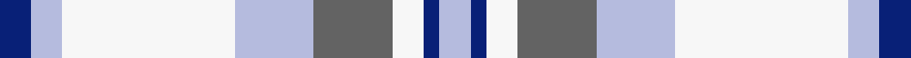

This page is one **sett** — a single exact thread-count. It belongs to the [tartan](/setts/db2lb2w11lb5n5w2db1lb2/)
(the same proportion at any scale), whose colour order is pattern [BWWWBWBW](/stripes/bwwwbwbw/).

Sourced from house-of-tartan.  It is a [8 stripe tartan](/stripes/stripes8/).

Original link http://www.house-of-tartan.scotland.net/house/TartanViewjs.asp?colr=Def&tnam=2095

## Provenance

Earliest known date: 1982 Designed to represent Canadian landscape in winter and sandy beaches in summer. Robert Conquergood, born in 1818 in Ormston, in the Parish of Roxburgh, Scotland, emigrated to Ontario, Canada with his father, also Robert, who was born in 1781. The Conquergood family in Canada approved this tartan at their 1990 biennial family reunion held at Kelowna, British Columbia.

## Thread count
DB/4 LB4 W22 LB10 N10 W4 DB2 LB/4

One full sett is **112 threads**.

## Palette
<table><thead><tr><th>Colour</th><th>Shade</th><th>OKLCh</th></tr></thead><tbody><tr><td>B</td><td><code style="background-color:#B5BBDE;">#B5BBDE</code> <small style="color:#888">#B5BBDE</small></td><td><small style="color:#888">oklch(79.9% 0.050 277.6)</small></td></tr><tr><td>DB</td><td><code style="background-color:#082077;">#082077</code> <small style="color:#888">#082077</small></td><td><small style="color:#888">oklch(30.0% 0.149 265.1)</small></td></tr><tr><td>LN</td><td><code style="background-color:#F7F7F7;">#F7F7F7</code> <small style="color:#888">#F7F7F7</small></td><td><small style="color:#888">oklch(97.6% 0.000 89.9)</small></td></tr><tr><td>N</td><td><code style="background-color:#636363;">#636363</code> <small style="color:#888">#636363</small></td><td><small style="color:#888">oklch(50.0% 0.000 89.9)</small></td></tr></tbody></table>

# Sample pattern

## Nearest variants

The nearest existing variants by ΔTartan distance, with this cloth at the top so the swatches line up against it.

ΔTartan

Threads

Variant

Sett

—

112

<a href="/variants/s8/db2lb2w11lb5n5w2db1lb2~x2/">Conquergood Family Tartan</a>

<a href="/ttd/edit/#slug=db2lb2db15lb1w10lb15db2lb2~x2&amp;base=db2lb2w11lb5n5w2db1lb2~x2" title="compare in the TTD">2.90</a>

188

<a href="/variants/s8/db2lb2db15lb1w10lb15db2lb2~x2/">Bannockbane Light Blue</a>

## Neighbour map

Every grey dot is one of 13620 variants placed by the first two principal components of the ΔTartan feature space (42% of its variance). Red is this tartan; blue dots are its nearest — click one to open its page.

<svg viewBox="0 0 640 380" role="img" style="max-width:100%;height:auto;border:1px solid #e0e0e0;border-radius:4px;display:block" xmlns="http://www.w3.org/2000/svg"><image href="/nn/cloud.v1.png" width="640" height="380"/><a href="/variants/s8/db2lb2db15lb1w10lb15db2lb2~x2/"><circle cx="290.1" cy="221.1" r="4" fill="#3465a4"><title>Bannockbane Light Blue</title></circle></a><circle cx="272.7" cy="237.6" r="5" fill="#c00000"/><text x="320" y="376" text-anchor="middle" font-size="11" fill="#999">ground</text><text x="11" y="190" text-anchor="middle" font-size="11" fill="#999" transform="rotate(-90 11 190)">complexity</text></svg>

ID: /variants/s8/db2lb2w11lb5n5w2db1lb2~x2/
