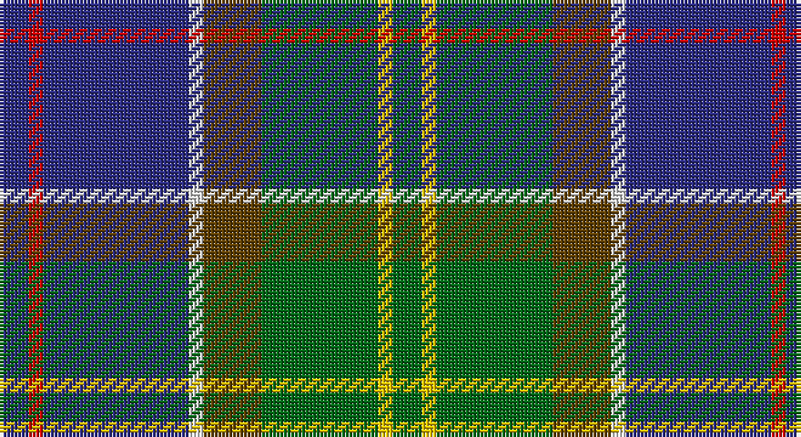

This page is one **sett** — a single exact thread-count. It belongs to the [tartan](/setts/db2r1db10w1dy4g8ly1g2/)
(the same proportion at any scale), whose colour order is pattern [BRBWGGYG](/stripes/brbwggyg/).

Part of the [Ayrshire](/tartans/ayrshire/) tartan — the named design grouping this sett with its other cloths.

Sourced from house-of-tartan.  It is a [8 stripe tartan](/stripes/stripes8/).

Original link http://www.house-of-tartan.scotland.net/house/TartanViewjs.asp?colr=Def&tnam=436

## Provenance

Earliest known date: 1988 Dr Phil Smith, a Fellow of the Scottish Tartans Society, designed the Ayrshire district tartan at the suggestion of the Clan Boyd and Clan Cunningham Societies. In his book, 'District Tartans' (1992) co-authored with Dr G Teall, he says, the colours "..reflect the gold of the rising sun, the green of the land and brown of the coast, the blue of the sea and the red of the setting sun. The Ayrshire tartan is intended for those with connections in the districts of Kyle, Cunninghame and Inverclyde."

## Thread count
DB/8 R4 DB40 LN4 T16 G32 Y4 G/8

One full sett is **216 threads**.

## Palette

Palette: <strong>Tartan Register</strong>
<table><thead><tr><th>Colour</th><th>Threads</th><th>Shade</th><th>Base</th><th>OKLCh</th></tr></thead><tbody><tr><td>DB/</td><td style="text-align:right;font-variant-numeric:tabular-nums">8</td><td><code style="background-color:#2C2C80;">#2C2C80</code> <small style="color:#888">#2C2C80</small></td><td>B <code style="background-color:#2A418A;">#2A418A</code></td><td><small style="color:#888">oklch(35.0% 0.138 276.6)</small></td></tr><tr><td>R</td><td style="text-align:right;font-variant-numeric:tabular-nums">4</td><td><code style="background-color:#C80000;">#C80000</code> <small style="color:#888">#C80000</small></td><td>R <code style="background-color:#CC0000;">#CC0000</code></td><td><small style="color:#888">oklch(52.3% 0.215 29.2)</small></td></tr><tr><td>DB</td><td style="text-align:right;font-variant-numeric:tabular-nums">40</td><td><code style="background-color:#2C2C80;">#2C2C80</code> <small style="color:#888">#2C2C80</small></td><td>B <code style="background-color:#2A418A;">#2A418A</code></td><td><small style="color:#888">oklch(35.0% 0.138 276.6)</small></td></tr><tr><td>LN</td><td style="text-align:right;font-variant-numeric:tabular-nums">4</td><td><code style="background-color:#E0E0E0;">#E0E0E0</code> <small style="color:#888">#E0E0E0</small></td><td>W <code style="background-color:#F7F7F7;">#F7F7F7</code></td><td><small style="color:#888">oklch(90.7% 0.000 89.9)</small></td></tr><tr><td>T</td><td style="text-align:right;font-variant-numeric:tabular-nums">16</td><td><code style="background-color:#604000;">#604000</code> <small style="color:#888">#604000</small></td><td>G <code style="background-color:#006100;">#006100</code></td><td><small style="color:#888">oklch(39.8% 0.083 76.8)</small></td></tr><tr><td>G</td><td style="text-align:right;font-variant-numeric:tabular-nums">32</td><td><code style="background-color:#006818;">#006818</code> <small style="color:#888">#006818</small></td><td>G <code style="background-color:#006100;">#006100</code></td><td><small style="color:#888">oklch(45.0% 0.142 145.0)</small></td></tr><tr><td>Y</td><td style="text-align:right;font-variant-numeric:tabular-nums">4</td><td><code style="background-color:#E8C000;">#E8C000</code> <small style="color:#888">#E8C000</small></td><td>Y <code style="background-color:#F2BF00;">#F2BF00</code></td><td><small style="color:#888">oklch(81.9% 0.168 93.7)</small></td></tr><tr><td>G/</td><td style="text-align:right;font-variant-numeric:tabular-nums">8</td><td><code style="background-color:#006818;">#006818</code> <small style="color:#888">#006818</small></td><td>G <code style="background-color:#006100;">#006100</code></td><td><small style="color:#888">oklch(45.0% 0.142 145.0)</small></td></tr></tbody></table>

# Sample pattern

## Compared to the master

This cloth is one sett of its design; the master sett (the exemplar the design is anchored on) is below for comparison.

<figure style="margin:0"><figcaption style="color:#888;font-size:smaller">this sett</figcaption></figure>
<figure style="margin:0"><figcaption style="color:#888;font-size:smaller"><a href="/setts/db2r1db10w1y4g8g1g2/">master sett →</a></figcaption></figure>

## Nearest tartans

The nearest existing variants by ΔTartan distance, with this tartan at the top so the swatches line up against it.

ΔTartan

Tartan

Sett

—

<a href="/ttd/edit/#slug=db2r1db10w1dy4g8ly1g2~x4">Ayrshire District Tartan</a> <a class="nn-out" href="/variants/s8/db2r1db10w1dy4g8ly1g2~x4/" title="open its dictionary page">↗</a>

0.48

<a href="/ttd/edit/#slug=db3r2db18k6gi18ly2g3~x2&amp;base=db2r1db10w1dy4g8ly1g2~x4">McComb (Personal)</a> <a class="nn-out" href="/variants/s7/db3r2db18k6gi18ly2g3~x2/" title="open its dictionary page">↗</a>

0.59

<a href="/ttd/edit/#slug=db1dy4g8ly1g8db12w1db2r1~x4&amp;base=db2r1db10w1dy4g8ly1g2~x4">Connor (Personal)</a> <a class="nn-out" href="/variants/s9/db1dy4g8ly1g8db12w1db2r1~x4/" title="open its dictionary page">↗</a>

0.66

<a href="/ttd/edit/#slug=db2r1db10w1o4g8ly1g2~x4&amp;base=db2r1db10w1dy4g8ly1g2~x4">Ayrshire</a> <a class="nn-out" href="/variants/s8/db2r1db10w1o4g8ly1g2~x4/" title="open its dictionary page">↗</a>

0.85

<a href="/ttd/edit/#slug=n10w5n48k35g5k5g35r5g5dp5&amp;base=db2r1db10w1dy4g8ly1g2~x4">Big Rory (Corporate)</a> <a class="nn-out" href="/variants/s10/n10w5n48k35g5k5g35r5g5dp5/" title="open its dictionary page">↗</a>

0.85

<a href="/ttd/edit/#slug=k3db20dbi8db4g20k2g2r2g3ly3~x2&amp;base=db2r1db10w1dy4g8ly1g2~x4">Schmidt (2014)</a> <a class="nn-out" href="/variants/s10/k3db20dbi8db4g20k2g2r2g3ly3~x2/" title="open its dictionary page">↗</a>

0.90

<a href="/ttd/edit/#slug=dg3lo2m10dg10b20dg12r3b10w2~x2&amp;base=db2r1db10w1dy4g8ly1g2~x4">Patel (2013)</a> <a class="nn-out" href="/variants/s9/dg3lo2m10dg10b20dg12r3b10w2~x2/" title="open its dictionary page">↗</a>

0.93

<a href="/variants/s12/db3r2db18k6gi18ly2g3~x2/">MacComb Family Tartan</a>

0.95

<a href="/ttd/edit/#slug=r2k6ly1dg12ly1db6lr2~x4&amp;base=db2r1db10w1dy4g8ly1g2~x4">James (Personal)</a> <a class="nn-out" href="/variants/s7/r2k6ly1dg12ly1db6lr2~x4/" title="open its dictionary page">↗</a>

0.96

<a href="/ttd/edit/#slug=dt48lo25dy15r7lb5dt7k10lb10~x2&amp;base=db2r1db10w1dy4g8ly1g2~x4">State Seal of Utah (Fashion)</a> <a class="nn-out" href="/variants/s8/dt48lo25dy15r7lb5dt7k10lb10~x2/" title="open its dictionary page">↗</a>

0.96

<a href="/ttd/edit/#slug=r3g2db27k19g27dp2ly3~x2&amp;base=db2r1db10w1dy4g8ly1g2~x4">Christian Hunting (Personal)</a> <a class="nn-out" href="/variants/s7/r3g2db27k19g27dp2ly3~x2/" title="open its dictionary page">↗</a>

## Neighbour map

Every grey dot is one of 14360 variants placed by the first two principal components of the ΔTartan feature space (44% of its variance). Red is this tartan; blue dots are its nearest — click one to open its page.

<svg viewBox="0 0 640 380" role="img" style="max-width:100%;height:auto;border:1px solid #e0e0e0;border-radius:4px;display:block" xmlns="http://www.w3.org/2000/svg"><image href="/nn/cloud.v1.png" width="640" height="380"/><a href="/variants/s7/db3r2db18k6gi18ly2g3~x2/"><circle cx="184.9" cy="185.1" r="4" fill="#3465a4"><title>McComb (Personal)</title></circle></a><a href="/variants/s9/db1dy4g8ly1g8db12w1db2r1~x4/"><circle cx="216.8" cy="167.0" r="4" fill="#3465a4"><title>Connor (Personal)</title></circle></a><a href="/variants/s8/db2r1db10w1o4g8ly1g2~x4/"><circle cx="191.7" cy="173.1" r="4" fill="#3465a4"><title>Ayrshire</title></circle></a><a href="/variants/s10/n10w5n48k35g5k5g35r5g5dp5/"><circle cx="169.4" cy="162.6" r="4" fill="#3465a4"><title>Big Rory (Corporate)</title></circle></a><a href="/variants/s10/k3db20dbi8db4g20k2g2r2g3ly3~x2/"><circle cx="174.9" cy="159.6" r="4" fill="#3465a4"><title>Schmidt (2014)</title></circle></a><a href="/variants/s9/dg3lo2m10dg10b20dg12r3b10w2~x2/"><circle cx="185.6" cy="190.5" r="4" fill="#3465a4"><title>Patel (2013)</title></circle></a><a href="/variants/s12/db3r2db18k6gi18ly2g3~x2/"><circle cx="170.7" cy="166.0" r="4" fill="#3465a4"><title>MacComb Family Tartan</title></circle></a><a href="/variants/s7/r2k6ly1dg12ly1db6lr2~x4/"><circle cx="163.3" cy="170.6" r="4" fill="#3465a4"><title>James (Personal)</title></circle></a><a href="/variants/s8/dt48lo25dy15r7lb5dt7k10lb10~x2/"><circle cx="157.5" cy="163.9" r="4" fill="#3465a4"><title>State Seal of Utah (Fashion)</title></circle></a><a href="/variants/s7/r3g2db27k19g27dp2ly3~x2/"><circle cx="174.9" cy="167.6" r="4" fill="#3465a4"><title>Christian Hunting (Personal)</title></circle></a><circle cx="190.9" cy="173.6" r="5" fill="#c00000"/></svg>

ID: /variants/s8/db2r1db10w1dy4g8ly1g2~x4/
