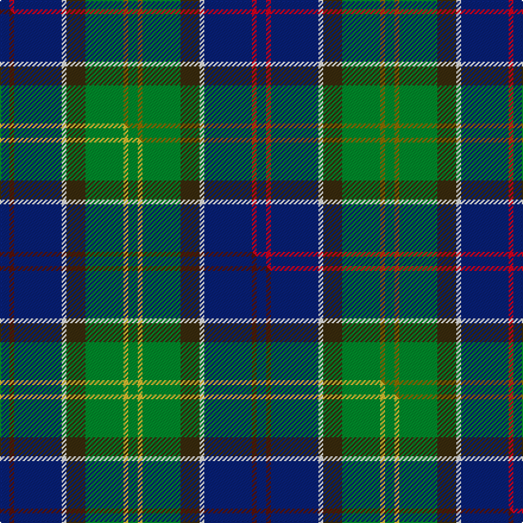

This page is one **sett** — a single exact thread-count. It belongs to the [tartan](/setts/db2r1db10w1dy4g8y1g2/)
(the same proportion at any scale), whose colour order is pattern [BRBWGGGG](/stripes/brbwgggg/).

Part of the [Ayrshire](/tartans/ayrshire/) tartan — the named design grouping this sett with its other cloths.

Sourced from house-of-tartan.  It is a [8 stripe tartan](/stripes/stripes8/).

Original link http://www.house-of-tartan.scotland.net/house/TartanViewjs.asp?colr=Def&tnam=436

## Provenance

Earliest known date: 1988 Dr Phil Smith, a Fellow of the Scottish Tartans Society, designed the Ayrshire district tartan at the suggestion of the Clan Boyd and Clan Cunningham Societies. In his book, 'District Tartans' (1992) co-authored with Dr G Teall, he says, the colours "..reflect the gold of the rising sun, the green of the land and brown of the coast, the blue of the sea and the red of the setting sun. The Ayrshire tartan is intended for those with connections in the districts of Kyle, Cunninghame and Inverclyde."

## Thread count
DB/8 R4 DB40 W4 DY16 G32 Y4 G/8

One full sett is **216 threads**.

## Palette
<table><thead><tr><th>Colour</th><th>Shade</th><th>OKLCh</th></tr></thead><tbody><tr><td>DB</td><td><code style="background-color:#082077;">#082077</code> <small style="color:#888">#082077</small></td><td><small style="color:#888">oklch(30.0% 0.149 265.1)</small></td></tr><tr><td>G</td><td><code style="background-color:#008B2A;">#008B2A</code> <small style="color:#888">#008B2A</small></td><td><small style="color:#888">oklch(55.4% 0.170 145.9)</small></td></tr><tr><td>W</td><td><code style="background-color:#F7F7F7;">#F7F7F7</code> <small style="color:#888">#F7F7F7</small></td><td><small style="color:#888">oklch(97.6% 0.000 89.9)</small></td></tr><tr><td>R</td><td><code style="background-color:#D60020;">#D60020</code> <small style="color:#888">#D60020</small></td><td><small style="color:#888">oklch(55.2% 0.224 25.5)</small></td></tr><tr><td>DY</td><td><code style="background-color:#3A2B0D;">#3A2B0D</code> <small style="color:#888">#3A2B0D</small></td><td><small style="color:#888">oklch(30.0% 0.049 82.0)</small></td></tr><tr><td>Y</td><td><code style="background-color:#8B6E00;">#8B6E00</code> <small style="color:#888">#8B6E00</small></td><td><small style="color:#888">oklch(55.1% 0.113 90.4)</small></td></tr></tbody></table>

# Sample pattern

## Compared to the master

This cloth is one sett of its design; the master sett (the exemplar the design is anchored on) is below for comparison.

Its **ΔTartan distance** from the master is **1.05** — the same measure the nearest-tartans table ranks by (0 is identical; a re-scale of the same cloth is near 0, a recolour or a different proportion further).

<figure class="master-compare" style="margin:0">

this sett
master sett ★

<figcaption style="color:#888;font-size:smaller">One weave of this sett against the <a href="/setts/db2dr1db10w1dy4g8ly1g2/">master sett ★</a>, split on the diagonal: a shared proportion runs seamlessly across it with only the shades shifting; a different proportion breaks on it.</figcaption>
</figure>

## Nearest variants

The nearest existing variants by ΔTartan distance, with this cloth at the top so the swatches line up against it.

ΔTartan

Threads

Variant

Sett

—

216

<a href="/variants/s8/db2r1db10w1dy4g8y1g2~x4/">Ayrshire District Tartan</a>

<a href="/ttd/edit/#slug=db2dr1db10w1dy4g8ly1g2~x4&amp;base=db2r1db10w1dy4g8y1g2~x4" title="compare in the TTD">0.00</a>

216

<a href="/variants/s8/db2dr1db10w1dy4g8ly1g2~x4/">Ayrshire (District)</a>

<a href="/ttd/edit/#slug=db2r1db10w1o4g8y1g2~x4&amp;base=db2r1db10w1dy4g8y1g2~x4" title="compare in the TTD">0.60</a>

216

<a href="/variants/s8/db2r1db10w1o4g8y1g2~x4/">Ayrshire</a>

<a href="/ttd/edit/#slug=db1dy4g8y1g8db12w1db2r1~x4&amp;base=db2r1db10w1dy4g8y1g2~x4" title="compare in the TTD">1.94</a>

296

<a href="/variants/s9/db1dy4g8y1g8db12w1db2r1~x4/">Connor (Personal)</a>

<a href="/ttd/edit/#slug=g11r4g4r7g41dy11lb4db41r4db8&amp;base=db2r1db10w1dy4g8y1g2~x4" title="compare in the TTD">2.28</a>

251

<a href="/variants/s10/g11r4g4r7g41dy11lb4db41r4db8/">Stewart of Appin Hunting Clan Tartan</a>

<a href="/ttd/edit/#slug=w1db16ly1r3ly1dg6g2dg6w1~x2~dg1806142-g2408144&amp;base=db2r1db10w1dy4g8y1g2~x4" title="compare in the TTD">2.37</a>

144

<a href="/variants/s9/w1db16ly1r3ly1dg6g2dg6w1~x2~dg1806142-g2408144/">Kleto, Susan (Personal)</a>

<a href="/ttd/edit/#slug=y15db8r25db72dg98w15&amp;base=db2r1db10w1dy4g8y1g2~x4" title="compare in the TTD">2.39</a>

436

<a href="/variants/s6/y15db8r25db72dg98w15/">Afternoon Tea / Darjeeling</a>

<a href="/ttd/edit/#slug=y2g20db8r3db2r2db16w1lb2~x2&amp;base=db2r1db10w1dy4g8y1g2~x4" title="compare in the TTD">2.40</a>

216

<a href="/variants/s9/y2g20db8r3db2r2db16w1lb2~x2/">Scotland’s Golf Coast</a>

<a href="/ttd/edit/#slug=dg3lo2o10dg10db20dg12r3db10w2~x2&amp;base=db2r1db10w1dy4g8y1g2~x4" title="compare in the TTD">2.46</a>

278

<a href="/variants/s9/dg3lo2o10dg10db20dg12r3db10w2~x2/">Patel Name Tartan</a>

2.48

—

<a href="/variants/s8/dg5g2dbi2db15r2lg2dg5r2~x4~dbi1406275-db1204274/">Remember the Somme 1916</a>

<a href="/ttd/edit/#slug=lr4g24db10r3db12lo4~x2&amp;base=db2r1db10w1dy4g8y1g2~x4" title="compare in the TTD">2.50</a>

212

<a href="/variants/s6/lr4g24db10r3db12lo4~x2/">Inglis (Name)</a>

## Neighbour map

Every grey dot is one of 13620 variants placed by the first two principal components of the ΔTartan feature space (42% of its variance). Red is this tartan; blue dots are its nearest — click one to open its page.

<svg viewBox="0 0 640 380" role="img" style="max-width:100%;height:auto;border:1px solid #e0e0e0;border-radius:4px;display:block" xmlns="http://www.w3.org/2000/svg"><image href="/nn/cloud.v1.png" width="640" height="380"/><a href="/variants/s8/db2dr1db10w1dy4g8ly1g2~x4/"><circle cx="209.5" cy="191.1" r="4" fill="#3465a4"><title>Ayrshire (District)</title></circle></a><a href="/variants/s8/db2r1db10w1o4g8y1g2~x4/"><circle cx="190.9" cy="176.6" r="4" fill="#3465a4"><title>Ayrshire</title></circle></a><a href="/variants/s9/db1dy4g8y1g8db12w1db2r1~x4/"><circle cx="215.1" cy="169.5" r="4" fill="#3465a4"><title>Connor (Personal)</title></circle></a><a href="/variants/s10/g11r4g4r7g41dy11lb4db41r4db8/"><circle cx="217.1" cy="171.0" r="4" fill="#3465a4"><title>Stewart of Appin Hunting Clan Tartan</title></circle></a><a href="/variants/s9/w1db16ly1r3ly1dg6g2dg6w1~x2~dg1806142-g2408144/"><circle cx="213.8" cy="138.6" r="4" fill="#3465a4"><title>Kleto, Susan (Personal)</title></circle></a><a href="/variants/s6/y15db8r25db72dg98w15/"><circle cx="227.6" cy="195.9" r="4" fill="#3465a4"><title>Afternoon Tea / Darjeeling</title></circle></a><a href="/variants/s9/y2g20db8r3db2r2db16w1lb2~x2/"><circle cx="245.7" cy="133.2" r="4" fill="#3465a4"><title>Scotland’s Golf Coast</title></circle></a><a href="/variants/s9/dg3lo2o10dg10db20dg12r3db10w2~x2/"><circle cx="196.4" cy="191.6" r="4" fill="#3465a4"><title>Patel Name Tartan</title></circle></a><a href="/variants/s8/dg5g2dbi2db15r2lg2dg5r2~x4~dbi1406275-db1204274/"><circle cx="210.9" cy="187.8" r="4" fill="#3465a4"><title>Remember the Somme 1916</title></circle></a><a href="/variants/s6/lr4g24db10r3db12lo4~x2/"><circle cx="201.6" cy="219.8" r="4" fill="#3465a4"><title>Inglis (Name)</title></circle></a><circle cx="196.1" cy="180.1" r="5" fill="#c00000"/><text x="320" y="376" text-anchor="middle" font-size="11" fill="#999">ground</text><text x="11" y="190" text-anchor="middle" font-size="11" fill="#999" transform="rotate(-90 11 190)">complexity</text></svg>

ID: /variants/s8/db2r1db10w1dy4g8y1g2~x4/
