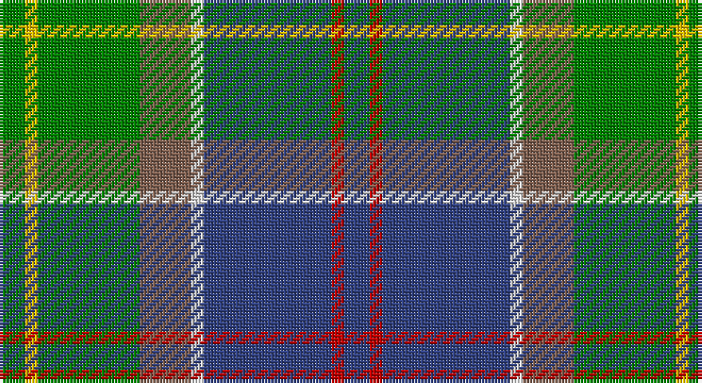

This page is one **sett** — a single exact thread-count. It belongs to the [tartan](/setts/db2r1db10w1o4g8ly1g2/)
(the same proportion at any scale), whose colour order is pattern [BRBWRGYG](/stripes/brbwrgyg/).

Sourced from weddslist.  It is a [8 stripe tartan](/stripes/stripes8/).

Original link http://www.weddslist.com/cgi-bin/tartans/pg.pl?source=sts

## Thread count
G/8 Y4 G32 LT16 LN4 B40 R4 B/8

One full sett is **216 threads**.

## Palette

Palette: <strong>Tartan Dictionary</strong> <small style="color:#888">(1 of 6 colours)</small>
<table><thead><tr><th>Colour</th><th>Threads</th><th>Shade</th><th>Base</th><th>OKLCh</th></tr></thead><tbody><tr><td>G/</td><td style="text-align:right;font-variant-numeric:tabular-nums">8</td><td><code style="background-color:#008000;">#008000</code> <small style="color:#888">#008000</small></td><td>G <code style="background-color:#006100;">#006100</code></td><td><small style="color:#888">oklch(52.0% 0.177 142.5)</small></td></tr><tr><td>Y</td><td style="text-align:right;font-variant-numeric:tabular-nums">4</td><td><code style="background-color:#F0C000;">#F0C000</code> <small style="color:#888">#F0C000</small></td><td>Y <code style="background-color:#F2BF00;">#F2BF00</code></td><td><small style="color:#888">oklch(82.7% 0.169 90.5)</small></td></tr><tr><td>G</td><td style="text-align:right;font-variant-numeric:tabular-nums">32</td><td><code style="background-color:#008000;">#008000</code> <small style="color:#888">#008000</small></td><td>G <code style="background-color:#006100;">#006100</code></td><td><small style="color:#888">oklch(52.0% 0.177 142.5)</small></td></tr><tr><td>LT</td><td style="text-align:right;font-variant-numeric:tabular-nums">16</td><td><code style="background-color:#806050;">#806050</code> <small style="color:#888">#806050</small></td><td>R <code style="background-color:#CC0000;">#CC0000</code></td><td><small style="color:#888">oklch(51.7% 0.049 47.8)</small></td></tr><tr><td>LN</td><td style="text-align:right;font-variant-numeric:tabular-nums">4</td><td><code style="background-color:#E0E0E0;">#E0E0E0</code> <small style="color:#888">#E0E0E0</small></td><td>W <code style="background-color:#F7F7F7;">#F7F7F7</code></td><td><small style="color:#888">oklch(90.7% 0.000 89.9)</small></td></tr><tr><td>B</td><td style="text-align:right;font-variant-numeric:tabular-nums">40</td><td><code style="background-color:#304080;">#304080</code> <small style="color:#888">#304080</small></td><td>B <code style="background-color:#2A418A;">#2A418A</code></td><td><small style="color:#888">oklch(39.4% 0.109 270.2)</small></td></tr><tr><td>R</td><td style="text-align:right;font-variant-numeric:tabular-nums">4</td><td><code style="background-color:#C00000;">#C00000</code> <small style="color:#888">#C00000</small></td><td>R <code style="background-color:#CC0000;">#CC0000</code></td><td><small style="color:#888">oklch(50.7% 0.208 29.2)</small></td></tr><tr><td>B/</td><td style="text-align:right;font-variant-numeric:tabular-nums">8</td><td><code style="background-color:#304080;">#304080</code> <small style="color:#888">#304080</small></td><td>B <code style="background-color:#2A418A;">#2A418A</code></td><td><small style="color:#888">oklch(39.4% 0.109 270.2)</small></td></tr></tbody></table>

# Sample pattern

## Nearest tartans

The nearest existing variants by ΔTartan distance, with this tartan at the top so the swatches line up against it.

ΔTartan

Tartan

Sett

—

<a href="/ttd/edit/#slug=db2r1db10w1o4g8ly1g2~x4">Ayrshire</a> <a class="nn-out" href="/variants/s8/db2r1db10w1o4g8ly1g2~x4/" title="open its dictionary page">↗</a>

0.66

<a href="/ttd/edit/#slug=db2r1db10w1dy4g8ly1g2~x4&amp;base=db2r1db10w1o4g8ly1g2~x4">Ayrshire District Tartan</a> <a class="nn-out" href="/variants/s8/db2r1db10w1dy4g8ly1g2~x4/" title="open its dictionary page">↗</a>

0.75

<a href="/ttd/edit/#slug=db1dy4g8ly1g8db12w1db2r1~x4&amp;base=db2r1db10w1o4g8ly1g2~x4">Connor (Personal)</a> <a class="nn-out" href="/variants/s9/db1dy4g8ly1g8db12w1db2r1~x4/" title="open its dictionary page">↗</a>

0.87

<a href="/ttd/edit/#slug=dg3ly2ri10dg10g20dg12r3g10w2~x2&amp;base=db2r1db10w1o4g8ly1g2~x4">Patel (2013)</a> <a class="nn-out" href="/variants/s9/dg3ly2ri10dg10g20dg12r3g10w2~x2/" title="open its dictionary page">↗</a>

0.96

<a href="/ttd/edit/#slug=db3r2db18k6gi18ly2g3~x2&amp;base=db2r1db10w1o4g8ly1g2~x4">McComb (Personal)</a> <a class="nn-out" href="/variants/s7/db3r2db18k6gi18ly2g3~x2/" title="open its dictionary page">↗</a>

1.01

<a href="/ttd/edit/#slug=db4dg41lo4g4lo4g9r18lo4w4~x2&amp;base=db2r1db10w1o4g8ly1g2~x4">Gallagher Ancient</a> <a class="nn-out" href="/variants/s9/db4dg41lo4g4lo4g9r18lo4w4~x2/" title="open its dictionary page">↗</a>

1.02

<a href="/ttd/edit/#slug=o3db1o11w1k5n14lo3~x4&amp;base=db2r1db10w1o4g8ly1g2~x4">Glen Lyon (Fashion)</a> <a class="nn-out" href="/variants/s7/o3db1o11w1k5n14lo3~x4/" title="open its dictionary page">↗</a>

1.02

<a href="/ttd/edit/#slug=dy2o2dg19o6dg2o6lo14r4w2~x2&amp;base=db2r1db10w1o4g8ly1g2~x4">Royal Pharmaceutical Society (Corp)</a> <a class="nn-out" href="/variants/s9/dy2o2dg19o6dg2o6lo14r4w2~x2/" title="open its dictionary page">↗</a>

1.03

<a href="/ttd/edit/#slug=lb2k2g8gi8r1gi1w1~x4&amp;base=db2r1db10w1o4g8ly1g2~x4">Lundy (Personal)</a> <a class="nn-out" href="/variants/s7/lb2k2g8gi8r1gi1w1~x4/" title="open its dictionary page">↗</a>

1.05

<a href="/ttd/edit/#slug=n10w5n48k35g5k5g35r5g5dp5&amp;base=db2r1db10w1o4g8ly1g2~x4">Big Rory (Corporate)</a> <a class="nn-out" href="/variants/s10/n10w5n48k35g5k5g35r5g5dp5/" title="open its dictionary page">↗</a>

1.05

<a href="/ttd/edit/#slug=db4dg41lo4g4lo4g9o18lo4w4~x2&amp;base=db2r1db10w1o4g8ly1g2~x4">Gallagher Irish Fashion Tartan</a> <a class="nn-out" href="/variants/s9/db4dg41lo4g4lo4g9o18lo4w4~x2/" title="open its dictionary page">↗</a>

## Neighbour map

Every grey dot is one of 14360 variants placed by the first two principal components of the ΔTartan feature space (44% of its variance). Red is this tartan; blue dots are its nearest — click one to open its page.

<svg viewBox="0 0 640 380" role="img" style="max-width:100%;height:auto;border:1px solid #e0e0e0;border-radius:4px;display:block" xmlns="http://www.w3.org/2000/svg"><image href="/nn/cloud.v1.png" width="640" height="380"/><a href="/variants/s8/db2r1db10w1dy4g8ly1g2~x4/"><circle cx="190.9" cy="173.6" r="4" fill="#3465a4"><title>Ayrshire District Tartan</title></circle></a><a href="/variants/s9/db1dy4g8ly1g8db12w1db2r1~x4/"><circle cx="216.8" cy="167.0" r="4" fill="#3465a4"><title>Connor (Personal)</title></circle></a><a href="/variants/s9/dg3ly2ri10dg10g20dg12r3g10w2~x2/"><circle cx="167.1" cy="179.9" r="4" fill="#3465a4"><title>Patel (2013)</title></circle></a><a href="/variants/s7/db3r2db18k6gi18ly2g3~x2/"><circle cx="184.9" cy="185.1" r="4" fill="#3465a4"><title>McComb (Personal)</title></circle></a><a href="/variants/s9/db4dg41lo4g4lo4g9r18lo4w4~x2/"><circle cx="203.0" cy="143.9" r="4" fill="#3465a4"><title>Gallagher Ancient</title></circle></a><a href="/variants/s7/o3db1o11w1k5n14lo3~x4/"><circle cx="181.2" cy="164.7" r="4" fill="#3465a4"><title>Glen Lyon (Fashion)</title></circle></a><a href="/variants/s9/dy2o2dg19o6dg2o6lo14r4w2~x2/"><circle cx="157.2" cy="162.8" r="4" fill="#3465a4"><title>Royal Pharmaceutical Society (Corp)</title></circle></a><a href="/variants/s7/lb2k2g8gi8r1gi1w1~x4/"><circle cx="157.6" cy="181.9" r="4" fill="#3465a4"><title>Lundy (Personal)</title></circle></a><a href="/variants/s10/n10w5n48k35g5k5g35r5g5dp5/"><circle cx="169.4" cy="162.6" r="4" fill="#3465a4"><title>Big Rory (Corporate)</title></circle></a><a href="/variants/s9/db4dg41lo4g4lo4g9o18lo4w4~x2/"><circle cx="209.3" cy="147.4" r="4" fill="#3465a4"><title>Gallagher Irish Fashion Tartan</title></circle></a><circle cx="191.7" cy="173.1" r="5" fill="#c00000"/></svg>

ID: /variants/s8/db2r1db10w1o4g8ly1g2~x4/
