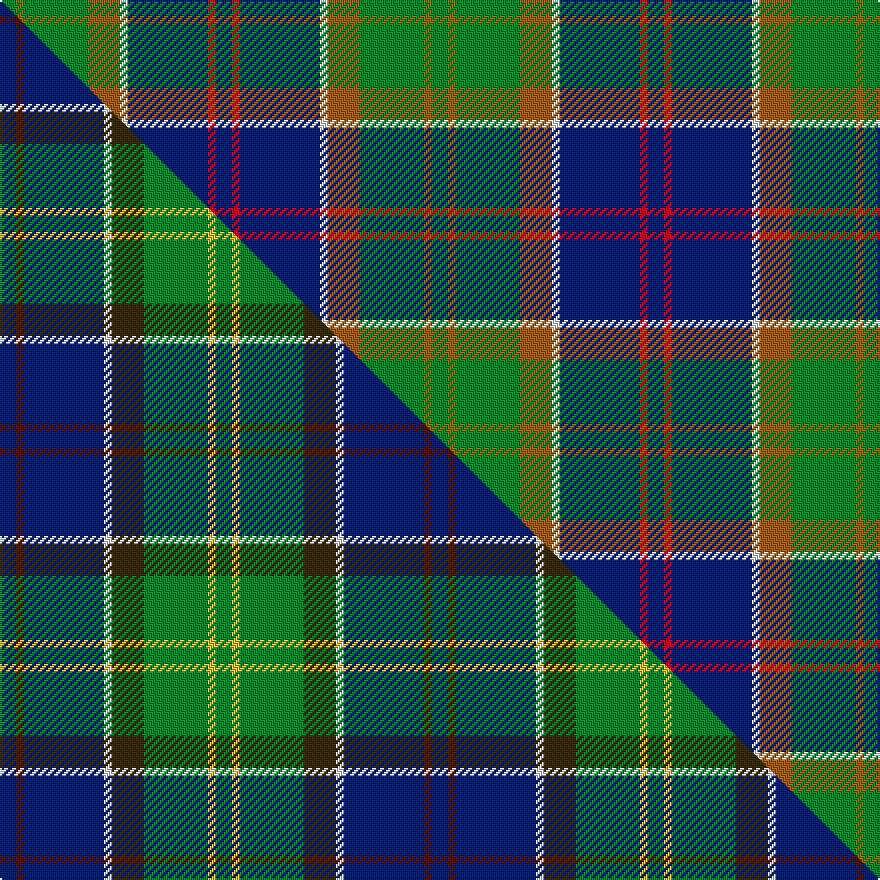

This page is one **sett** — a single exact thread-count. It belongs to the [tartan](/setts/db2r1db10w1o4g8y1g2/)
(the same proportion at any scale), whose colour order is pattern [BRBWRGGG](/stripes/brbwrggg/).

Part of the [Ayrshire](/tartans/ayrshire/) tartan — the named design grouping this sett with its other cloths.

Sourced from weddslist.  It is a [8 stripe tartan](/stripes/stripes8/).

Original link http://www.weddslist.com/cgi-bin/tartans/pg.pl?source=sts

## Thread count
G/8 Y4 G32 O16 W4 DB40 R4 DB/8

One full sett is **216 threads**.

## Palette
<table><thead><tr><th>Colour</th><th>Shade</th><th>OKLCh</th></tr></thead><tbody><tr><td>DB</td><td><code style="background-color:#082077;">#082077</code> <small style="color:#888">#082077</small></td><td><small style="color:#888">oklch(30.0% 0.149 265.1)</small></td></tr><tr><td>G</td><td><code style="background-color:#008B2A;">#008B2A</code> <small style="color:#888">#008B2A</small></td><td><small style="color:#888">oklch(55.4% 0.170 145.9)</small></td></tr><tr><td>W</td><td><code style="background-color:#F7F7F7;">#F7F7F7</code> <small style="color:#888">#F7F7F7</small></td><td><small style="color:#888">oklch(97.6% 0.000 89.9)</small></td></tr><tr><td>O</td><td><code style="background-color:#A65C11;">#A65C11</code> <small style="color:#888">#A65C11</small></td><td><small style="color:#888">oklch(55.0% 0.125 58.3)</small></td></tr><tr><td>R</td><td><code style="background-color:#D60020;">#D60020</code> <small style="color:#888">#D60020</small></td><td><small style="color:#888">oklch(55.2% 0.224 25.5)</small></td></tr><tr><td>Y</td><td><code style="background-color:#8B6E00;">#8B6E00</code> <small style="color:#888">#8B6E00</small></td><td><small style="color:#888">oklch(55.1% 0.113 90.4)</small></td></tr></tbody></table>

# Sample pattern

## Compared to the master

This cloth is one sett of its design; the master sett (the exemplar the design is anchored on) is below for comparison.

Its **ΔTartan distance** from the master is **1.30** — the same measure the nearest-tartans table ranks by (0 is identical; a re-scale of the same cloth is near 0, a recolour or a different proportion further).

<figure class="master-compare" style="margin:0">

this sett
master sett ★

<figcaption style="color:#888;font-size:smaller">One weave of this sett against the <a href="/setts/db2dr1db10w1dy4g8ly1g2/">master sett ★</a>, split on the diagonal: a shared proportion runs seamlessly across it with only the shades shifting; a different proportion breaks on it.</figcaption>
</figure>

## Nearest variants

The nearest existing variants by ΔTartan distance, with this cloth at the top so the swatches line up against it.

ΔTartan

Threads

Variant

Sett

—

216

<a href="/variants/s8/db2r1db10w1o4g8y1g2~x4/">Ayrshire</a>

<a href="/ttd/edit/#slug=db2r1db10w1dy4g8y1g2~x4&amp;base=db2r1db10w1o4g8y1g2~x4" title="compare in the TTD">0.60</a>

216

<a href="/variants/s8/db2r1db10w1dy4g8y1g2~x4/">Ayrshire District Tartan</a>

<a href="/ttd/edit/#slug=db2dr1db10w1dy4g8ly1g2~x4&amp;base=db2r1db10w1o4g8y1g2~x4" title="compare in the TTD">0.60</a>

216

<a href="/variants/s8/db2dr1db10w1dy4g8ly1g2~x4/">Ayrshire (District)</a>

<a href="/ttd/edit/#slug=db1dy4g8y1g8db12w1db2r1~x4&amp;base=db2r1db10w1o4g8y1g2~x4" title="compare in the TTD">2.25</a>

296

<a href="/variants/s9/db1dy4g8y1g8db12w1db2r1~x4/">Connor (Personal)</a>

<a href="/ttd/edit/#slug=lr4g24db10r3db12lo4~x2&amp;base=db2r1db10w1o4g8y1g2~x4" title="compare in the TTD">2.27</a>

212

<a href="/variants/s6/lr4g24db10r3db12lo4~x2/">Inglis (Name)</a>

<a href="/ttd/edit/#slug=g11r4g4r7g41o11lb4db41r4db8&amp;base=db2r1db10w1o4g8y1g2~x4" title="compare in the TTD">2.28</a>

251

<a href="/variants/s10/g11r4g4r7g41o11lb4db41r4db8/">Stewart of Appin, Ancient hunting</a>

<a href="/ttd/edit/#slug=w1db16ly1r3ly1dg6g2dg6w1~x2~dg1806142-g2408144&amp;base=db2r1db10w1o4g8y1g2~x4" title="compare in the TTD">2.37</a>

144

<a href="/variants/s9/w1db16ly1r3ly1dg6g2dg6w1~x2~dg1806142-g2408144/">Kleto, Susan (Personal)</a>

<a href="/ttd/edit/#slug=dg3lo2o10dg10db20dg12r3db10w2~x2&amp;base=db2r1db10w1o4g8y1g2~x4" title="compare in the TTD">2.46</a>

278

<a href="/variants/s9/dg3lo2o10dg10db20dg12r3db10w2~x2/">Patel Name Tartan</a>

2.48

—

<a href="/variants/s8/dg5g2dbi2db15r2lg2dg5r2~x4~dbi1406275-db1204274/">Remember the Somme 1916</a>

<a href="/ttd/edit/#slug=db34w5db5r5db5do26g33o6~x2&amp;base=db2r1db10w1o4g8y1g2~x4" title="compare in the TTD">2.51</a>

396

<a href="/variants/s8/db34w5db5r5db5do26g33o6~x2/">Blairmore</a>

<a href="/ttd/edit/#slug=w3db28g26r3g26db26lb12db3lb3&amp;base=db2r1db10w1o4g8y1g2~x4" title="compare in the TTD">2.52</a>

254

<a href="/variants/s9/w3db28g26r3g26db26lb12db3lb3/">Seaford House</a>

## Neighbour map

Every grey dot is one of 13620 variants placed by the first two principal components of the ΔTartan feature space (42% of its variance). Red is this tartan; blue dots are its nearest — click one to open its page.

<svg viewBox="0 0 640 380" role="img" style="max-width:100%;height:auto;border:1px solid #e0e0e0;border-radius:4px;display:block" xmlns="http://www.w3.org/2000/svg"><image href="/nn/cloud.v1.png" width="640" height="380"/><a href="/variants/s8/db2r1db10w1dy4g8y1g2~x4/"><circle cx="196.1" cy="180.1" r="4" fill="#3465a4"><title>Ayrshire District Tartan</title></circle></a><a href="/variants/s8/db2dr1db10w1dy4g8ly1g2~x4/"><circle cx="209.5" cy="191.1" r="4" fill="#3465a4"><title>Ayrshire (District)</title></circle></a><a href="/variants/s9/db1dy4g8y1g8db12w1db2r1~x4/"><circle cx="215.1" cy="169.5" r="4" fill="#3465a4"><title>Connor (Personal)</title></circle></a><a href="/variants/s6/lr4g24db10r3db12lo4~x2/"><circle cx="201.6" cy="219.8" r="4" fill="#3465a4"><title>Inglis (Name)</title></circle></a><a href="/variants/s10/g11r4g4r7g41o11lb4db41r4db8/"><circle cx="217.5" cy="170.8" r="4" fill="#3465a4"><title>Stewart of Appin, Ancient hunting</title></circle></a><a href="/variants/s9/w1db16ly1r3ly1dg6g2dg6w1~x2~dg1806142-g2408144/"><circle cx="213.8" cy="138.6" r="4" fill="#3465a4"><title>Kleto, Susan (Personal)</title></circle></a><a href="/variants/s9/dg3lo2o10dg10db20dg12r3db10w2~x2/"><circle cx="196.4" cy="191.6" r="4" fill="#3465a4"><title>Patel Name Tartan</title></circle></a><a href="/variants/s8/dg5g2dbi2db15r2lg2dg5r2~x4~dbi1406275-db1204274/"><circle cx="210.9" cy="187.8" r="4" fill="#3465a4"><title>Remember the Somme 1916</title></circle></a><a href="/variants/s8/db34w5db5r5db5do26g33o6~x2/"><circle cx="150.7" cy="195.7" r="4" fill="#3465a4"><title>Blairmore</title></circle></a><a href="/variants/s9/w3db28g26r3g26db26lb12db3lb3/"><circle cx="207.2" cy="197.5" r="4" fill="#3465a4"><title>Seaford House</title></circle></a><circle cx="190.9" cy="176.6" r="5" fill="#c00000"/><text x="320" y="376" text-anchor="middle" font-size="11" fill="#999">ground</text><text x="11" y="190" text-anchor="middle" font-size="11" fill="#999" transform="rotate(-90 11 190)">complexity</text></svg>

ID: /variants/s8/db2r1db10w1o4g8y1g2~x4/
