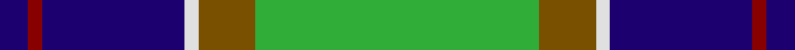
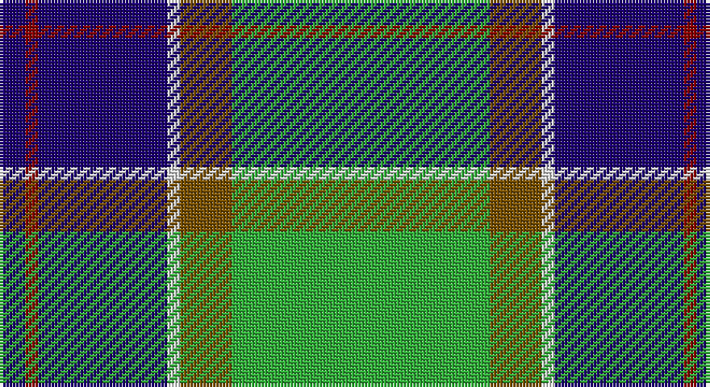

This page is one **sett** — a single exact thread-count. It belongs to the [tartan](/setts/db2r1db10w1y4g8g1g2/)
(the same proportion at any scale), whose colour order is pattern [BRBWGGGG](/stripes/brbwgggg/).

Part of the [Ayrshire](/tartans/ayrshire/) tartan — the named design grouping this sett with its other cloths.

Sourced from register-of-tartans.  It is a [8 stripe tartan](/stripes/stripes8/).

Original link https://www.tartanregister.gov.uk/tartanDetails.aspx?ref=151

## Register references

External register numbers recorded for this tartan.

- Scottish Register of Tartans: [151](https://www.tartanregister.gov.uk/tartanDetails.aspx?ref=151)
- Scottish Tartans Authority (ITI): 436
- Scottish Tartans World Register: 436

## Thread count
DB/8 DR4 DB40 LN4 T16 G32 G4 G/8

One full sett is **216 threads**.

## Palette

Palette: <strong>Tartan Register</strong> <small style="color:#888">(4 of 6 colours)</small>
<table><thead><tr><th>Colour</th><th>Threads</th><th>Shade</th><th>Base</th><th>OKLCh</th></tr></thead><tbody><tr><td>DB/</td><td style="text-align:right;font-variant-numeric:tabular-nums">8</td><td><code style="background-color:#1C0070;">#1C0070</code> <small style="color:#888">#1C0070</small></td><td>B <code style="background-color:#2A418A;">#2A418A</code></td><td><small style="color:#888">oklch(26.3% 0.162 277.1)</small></td></tr><tr><td>DR</td><td style="text-align:right;font-variant-numeric:tabular-nums">4</td><td><code style="background-color:#880000;">#880000</code> <small style="color:#888">#880000</small></td><td>R <code style="background-color:#CC0000;">#CC0000</code></td><td><small style="color:#888">oklch(39.4% 0.162 29.2)</small></td></tr><tr><td>DB</td><td style="text-align:right;font-variant-numeric:tabular-nums">40</td><td><code style="background-color:#1C0070;">#1C0070</code> <small style="color:#888">#1C0070</small></td><td>B <code style="background-color:#2A418A;">#2A418A</code></td><td><small style="color:#888">oklch(26.3% 0.162 277.1)</small></td></tr><tr><td>LN</td><td style="text-align:right;font-variant-numeric:tabular-nums">4</td><td><code style="background-color:#E0E0E0;">#E0E0E0</code> <small style="color:#888">#E0E0E0</small></td><td>W <code style="background-color:#F7F7F7;">#F7F7F7</code></td><td><small style="color:#888">oklch(90.7% 0.000 89.9)</small></td></tr><tr><td>T</td><td style="text-align:right;font-variant-numeric:tabular-nums">16</td><td><code style="background-color:#785000;">#785000</code> <small style="color:#888">#785000</small></td><td>G <code style="background-color:#006100;">#006100</code></td><td><small style="color:#888">oklch(46.4% 0.098 75.7)</small></td></tr><tr><td>G</td><td style="text-align:right;font-variant-numeric:tabular-nums">32</td><td><code style="background-color:#30AC38;">#30AC38</code> <small style="color:#888">#30AC38</small></td><td>G <code style="background-color:#006100;">#006100</code></td><td><small style="color:#888">oklch(65.4% 0.189 143.9)</small></td></tr><tr><td>G</td><td style="text-align:right;font-variant-numeric:tabular-nums">4</td><td><code style="background-color:#30AC38;">#30AC38</code> <small style="color:#888">#30AC38</small></td><td>G <code style="background-color:#006100;">#006100</code></td><td><small style="color:#888">oklch(65.4% 0.189 143.9)</small></td></tr><tr><td>G/</td><td style="text-align:right;font-variant-numeric:tabular-nums">8</td><td><code style="background-color:#30AC38;">#30AC38</code> <small style="color:#888">#30AC38</small></td><td>G <code style="background-color:#006100;">#006100</code></td><td><small style="color:#888">oklch(65.4% 0.189 143.9)</small></td></tr></tbody></table>

# Sample pattern

## Nearest tartans

The nearest existing variants by ΔTartan distance, with this tartan at the top so the swatches line up against it.

ΔTartan

Tartan

Sett

—

<a href="/ttd/edit/#slug=db2r1db10w1y4g8g1g2~x4">Ayrshire</a> <a class="nn-out" href="/variants/s8/db2r1db10w1y4g8g1g2~x4/" title="open its dictionary page">↗</a>

0.79

<a href="/ttd/edit/#slug=db3g11w11r2g7db22ly2db2~x2&amp;base=db2r1db10w1y4g8g1g2~x4">Bahamas</a> <a class="nn-out" href="/variants/s8/db3g11w11r2g7db22ly2db2~x2/" title="open its dictionary page">↗</a>

0.83

<a href="/ttd/edit/#slug=k3r1ly1db11g13db5r1ly1~x2&amp;base=db2r1db10w1y4g8g1g2~x4">Snodgrass</a> <a class="nn-out" href="/variants/s8/k3r1ly1db11g13db5r1ly1~x2/" title="open its dictionary page">↗</a>

0.85

<a href="/ttd/edit/#slug=g5dt2g17ly2db5ly2r5db17g2ly4~x2&amp;base=db2r1db10w1y4g8g1g2~x4">Antrim Irish County Tartan</a> <a class="nn-out" href="/variants/s10/g5dt2g17ly2db5ly2r5db17g2ly4~x2/" title="open its dictionary page">↗</a>

0.86

<a href="/ttd/edit/#slug=db3r2db22k11g24lp2g3~x2&amp;base=db2r1db10w1y4g8g1g2~x4">MacThomas</a> <a class="nn-out" href="/variants/s7/db3r2db22k11g24lp2g3~x2/" title="open its dictionary page">↗</a>

0.87

<a href="/ttd/edit/#slug=w3db28g26r3g26db26lb12db3lb3&amp;base=db2r1db10w1y4g8g1g2~x4">Seaford House</a> <a class="nn-out" href="/variants/s9/w3db28g26r3g26db26lb12db3lb3/" title="open its dictionary page">↗</a>

0.88

<a href="/ttd/edit/#slug=db2r1db10w1y4g8lo1g2~x4&amp;base=db2r1db10w1y4g8g1g2~x4">Ayrshire (District)</a> <a class="nn-out" href="/variants/s8/db2r1db10w1y4g8lo1g2~x4/" title="open its dictionary page">↗</a>

0.89

<a href="/ttd/edit/#slug=db15lb2g2ly15r3db21r3g15~x2&amp;base=db2r1db10w1y4g8g1g2~x4">Loyalhanna</a> <a class="nn-out" href="/variants/s8/db15lb2g2ly15r3db21r3g15~x2/" title="open its dictionary page">↗</a>

0.90

<a href="/ttd/edit/#slug=k6ly2g18w3g13k3ly4k3db18w3~x2&amp;base=db2r1db10w1y4g8g1g2~x4">Corstorphine Trial A</a> <a class="nn-out" href="/variants/s10/k6ly2g18w3g13k3ly4k3db18w3~x2/" title="open its dictionary page">↗</a>

0.91

<a href="/ttd/edit/#slug=db10ly3db30ly5k8g16r4g16r2~x2&amp;base=db2r1db10w1y4g8g1g2~x4">MacMillan, hunting</a> <a class="nn-out" href="/variants/s9/db10ly3db30ly5k8g16r4g16r2~x2/" title="open its dictionary page">↗</a>

0.95

<a href="/ttd/edit/#slug=k5g30ly3b15k15b7w3~x2&amp;base=db2r1db10w1y4g8g1g2~x4">Dick (Personal)</a> <a class="nn-out" href="/variants/s7/k5g30ly3b15k15b7w3~x2/" title="open its dictionary page">↗</a>

## Neighbour map

Every grey dot is one of 14360 variants placed by the first two principal components of the ΔTartan feature space (44% of its variance). Red is this tartan; blue dots are its nearest — click one to open its page.

<svg viewBox="0 0 640 380" role="img" style="max-width:100%;height:auto;border:1px solid #e0e0e0;border-radius:4px;display:block" xmlns="http://www.w3.org/2000/svg"><image href="/nn/cloud.v1.png" width="640" height="380"/><a href="/variants/s8/db3g11w11r2g7db22ly2db2~x2/"><circle cx="191.6" cy="167.1" r="4" fill="#3465a4"><title>Bahamas</title></circle></a><a href="/variants/s8/k3r1ly1db11g13db5r1ly1~x2/"><circle cx="221.6" cy="161.9" r="4" fill="#3465a4"><title>Snodgrass</title></circle></a><a href="/variants/s10/g5dt2g17ly2db5ly2r5db17g2ly4~x2/"><circle cx="155.8" cy="162.5" r="4" fill="#3465a4"><title>Antrim Irish County Tartan</title></circle></a><a href="/variants/s7/db3r2db22k11g24lp2g3~x2/"><circle cx="195.0" cy="177.1" r="4" fill="#3465a4"><title>MacThomas</title></circle></a><a href="/variants/s9/w3db28g26r3g26db26lb12db3lb3/"><circle cx="196.4" cy="190.2" r="4" fill="#3465a4"><title>Seaford House</title></circle></a><a href="/variants/s8/db2r1db10w1y4g8lo1g2~x4/"><circle cx="152.4" cy="154.1" r="4" fill="#3465a4"><title>Ayrshire (District)</title></circle></a><a href="/variants/s8/db15lb2g2ly15r3db21r3g15~x2/"><circle cx="175.6" cy="177.8" r="4" fill="#3465a4"><title>Loyalhanna</title></circle></a><a href="/variants/s10/k6ly2g18w3g13k3ly4k3db18w3~x2/"><circle cx="147.6" cy="169.4" r="4" fill="#3465a4"><title>Corstorphine Trial A</title></circle></a><a href="/variants/s9/db10ly3db30ly5k8g16r4g16r2~x2/"><circle cx="188.5" cy="162.4" r="4" fill="#3465a4"><title>MacMillan, hunting</title></circle></a><a href="/variants/s7/k5g30ly3b15k15b7w3~x2/"><circle cx="159.9" cy="191.6" r="4" fill="#3465a4"><title>Dick (Personal)</title></circle></a><circle cx="177.2" cy="170.8" r="5" fill="#c00000"/></svg>

ID: /variants/s8/db2r1db10w1y4g8g1g2~x4/
