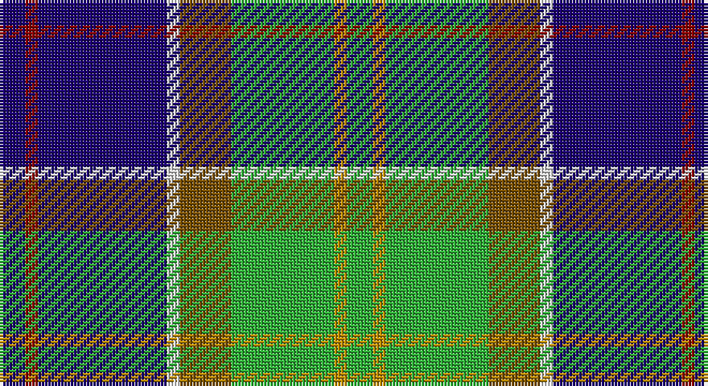

This page is one **sett** — a single exact thread-count. It belongs to the [tartan](/setts/db2r1db10w1y4g8lo1g2/)
(the same proportion at any scale), whose colour order is pattern [BRBWGGYG](/stripes/brbwggyg/).

Sourced from tartans-authority.  It is a [8 stripe tartan](/stripes/stripes8/).

Original link http://www.tartansauthority.com/tartan-ferret/display/436/

## Register references

External register numbers recorded for this tartan.

- Scottish Tartans Authority (ITI): 436

## Thread count
DB/8 DR4 DB40 LN4 T16 G32 DY4 G/8

One full sett is **216 threads**.

## Palette

Palette: <strong>Tartan Register</strong> <small style="color:#888">(4 of 6 colours)</small>
<table><thead><tr><th>Colour</th><th>Threads</th><th>Shade</th><th>Base</th><th>OKLCh</th></tr></thead><tbody><tr><td>DB/</td><td style="text-align:right;font-variant-numeric:tabular-nums">8</td><td><code style="background-color:#1C0070;">#1C0070</code> <small style="color:#888">#1C0070</small></td><td>B <code style="background-color:#2A418A;">#2A418A</code></td><td><small style="color:#888">oklch(26.3% 0.162 277.1)</small></td></tr><tr><td>DR</td><td style="text-align:right;font-variant-numeric:tabular-nums">4</td><td><code style="background-color:#880000;">#880000</code> <small style="color:#888">#880000</small></td><td>R <code style="background-color:#CC0000;">#CC0000</code></td><td><small style="color:#888">oklch(39.4% 0.162 29.2)</small></td></tr><tr><td>DB</td><td style="text-align:right;font-variant-numeric:tabular-nums">40</td><td><code style="background-color:#1C0070;">#1C0070</code> <small style="color:#888">#1C0070</small></td><td>B <code style="background-color:#2A418A;">#2A418A</code></td><td><small style="color:#888">oklch(26.3% 0.162 277.1)</small></td></tr><tr><td>LN</td><td style="text-align:right;font-variant-numeric:tabular-nums">4</td><td><code style="background-color:#E0E0E0;">#E0E0E0</code> <small style="color:#888">#E0E0E0</small></td><td>W <code style="background-color:#F7F7F7;">#F7F7F7</code></td><td><small style="color:#888">oklch(90.7% 0.000 89.9)</small></td></tr><tr><td>T</td><td style="text-align:right;font-variant-numeric:tabular-nums">16</td><td><code style="background-color:#785000;">#785000</code> <small style="color:#888">#785000</small></td><td>G <code style="background-color:#006100;">#006100</code></td><td><small style="color:#888">oklch(46.4% 0.098 75.7)</small></td></tr><tr><td>G</td><td style="text-align:right;font-variant-numeric:tabular-nums">32</td><td><code style="background-color:#30AC38;">#30AC38</code> <small style="color:#888">#30AC38</small></td><td>G <code style="background-color:#006100;">#006100</code></td><td><small style="color:#888">oklch(65.4% 0.189 143.9)</small></td></tr><tr><td>DY</td><td style="text-align:right;font-variant-numeric:tabular-nums">4</td><td><code style="background-color:#BC8C00;">#BC8C00</code> <small style="color:#888">#BC8C00</small></td><td>Y <code style="background-color:#F2BF00;">#F2BF00</code></td><td><small style="color:#888">oklch(66.8% 0.137 84.1)</small></td></tr><tr><td>G/</td><td style="text-align:right;font-variant-numeric:tabular-nums">8</td><td><code style="background-color:#30AC38;">#30AC38</code> <small style="color:#888">#30AC38</small></td><td>G <code style="background-color:#006100;">#006100</code></td><td><small style="color:#888">oklch(65.4% 0.189 143.9)</small></td></tr></tbody></table>

# Sample pattern

## Nearest tartans

The nearest existing variants by ΔTartan distance, with this tartan at the top so the swatches line up against it.

ΔTartan

Tartan

Sett

—

<a href="/ttd/edit/#slug=db2r1db10w1y4g8lo1g2~x4">Ayrshire (District)</a> <a class="nn-out" href="/variants/s8/db2r1db10w1y4g8lo1g2~x4/" title="open its dictionary page">↗</a>

0.82

<a href="/ttd/edit/#slug=r2k1lo2g3lo4g3db12k1lb2~x4&amp;base=db2r1db10w1y4g8lo1g2~x4">Federated Women's Institutes of</a> <a class="nn-out" href="/variants/s9/r2k1lo2g3lo4g3db12k1lb2~x4/" title="open its dictionary page">↗</a>

0.87

<a href="/ttd/edit/#slug=k6r3g30ly10db30w3~x2&amp;base=db2r1db10w1y4g8lo1g2~x4">Turnbull of Thornton (Personal)</a> <a class="nn-out" href="/variants/s6/k6r3g30ly10db30w3~x2/" title="open its dictionary page">↗</a>

0.88

<a href="/ttd/edit/#slug=k10ly3k2b20k10g15k2r3w3~x2&amp;base=db2r1db10w1y4g8lo1g2~x4">McCuaig (2010) (Name)</a> <a class="nn-out" href="/variants/s9/k10ly3k2b20k10g15k2r3w3~x2/" title="open its dictionary page">↗</a>

0.88

<a href="/ttd/edit/#slug=db2r1db10w1y4g8g1g2~x4&amp;base=db2r1db10w1y4g8lo1g2~x4">Ayrshire</a> <a class="nn-out" href="/variants/s8/db2r1db10w1y4g8g1g2~x4/" title="open its dictionary page">↗</a>

0.89

<a href="/ttd/edit/#slug=dt36y20dg6w12k6r3~x2&amp;base=db2r1db10w1y4g8lo1g2~x4">Sirens &amp; Swords</a> <a class="nn-out" href="/variants/s6/dt36y20dg6w12k6r3~x2/" title="open its dictionary page">↗</a>

0.94

<a href="/ttd/edit/#slug=o5dt30w3dg15ly8r4~x2&amp;base=db2r1db10w1y4g8lo1g2~x4">Carleton College Rugby</a> <a class="nn-out" href="/variants/s6/o5dt30w3dg15ly8r4~x2/" title="open its dictionary page">↗</a>

0.99

<a href="/ttd/edit/#slug=r4g14k3lp3g12db36w4~x2&amp;base=db2r1db10w1y4g8lo1g2~x4">Vipont</a> <a class="nn-out" href="/variants/s7/r4g14k3lp3g12db36w4~x2/" title="open its dictionary page">↗</a>

1.00

<a href="/ttd/edit/#slug=db6r4db24lb3k6g18lo4g2lo2g4~x2&amp;base=db2r1db10w1y4g8lo1g2~x4">Greene</a> <a class="nn-out" href="/variants/s10/db6r4db24lb3k6g18lo4g2lo2g4~x2/" title="open its dictionary page">↗</a>

1.01

<a href="/ttd/edit/#slug=k6w3k2db30r9k4g20ly3~x2&amp;base=db2r1db10w1y4g8lo1g2~x4">Minnesota (District)</a> <a class="nn-out" href="/variants/s8/k6w3k2db30r9k4g20ly3~x2/" title="open its dictionary page">↗</a>

1.03

<a href="/variants/s8/w4k2t18g18k18wi3k18r3~x2/">Hislop (Name)</a>

## Neighbour map

Every grey dot is one of 14360 variants placed by the first two principal components of the ΔTartan feature space (44% of its variance). Red is this tartan; blue dots are its nearest — click one to open its page.

<svg viewBox="0 0 640 380" role="img" style="max-width:100%;height:auto;border:1px solid #e0e0e0;border-radius:4px;display:block" xmlns="http://www.w3.org/2000/svg"><image href="/nn/cloud.v1.png" width="640" height="380"/><a href="/variants/s9/r2k1lo2g3lo4g3db12k1lb2~x4/"><circle cx="141.6" cy="137.7" r="4" fill="#3465a4"><title>Federated Women's Institutes of</title></circle></a><a href="/variants/s6/k6r3g30ly10db30w3~x2/"><circle cx="143.5" cy="174.0" r="4" fill="#3465a4"><title>Turnbull of Thornton (Personal)</title></circle></a><a href="/variants/s9/k10ly3k2b20k10g15k2r3w3~x2/"><circle cx="115.1" cy="160.5" r="4" fill="#3465a4"><title>McCuaig (2010) (Name)</title></circle></a><a href="/variants/s8/db2r1db10w1y4g8g1g2~x4/"><circle cx="177.2" cy="170.8" r="4" fill="#3465a4"><title>Ayrshire</title></circle></a><a href="/variants/s6/dt36y20dg6w12k6r3~x2/"><circle cx="153.7" cy="163.5" r="4" fill="#3465a4"><title>Sirens &amp; Swords</title></circle></a><a href="/variants/s6/o5dt30w3dg15ly8r4~x2/"><circle cx="171.4" cy="168.8" r="4" fill="#3465a4"><title>Carleton College Rugby</title></circle></a><a href="/variants/s7/r4g14k3lp3g12db36w4~x2/"><circle cx="220.7" cy="154.8" r="4" fill="#3465a4"><title>Vipont</title></circle></a><a href="/variants/s10/db6r4db24lb3k6g18lo4g2lo2g4~x2/"><circle cx="154.2" cy="139.2" r="4" fill="#3465a4"><title>Greene</title></circle></a><a href="/variants/s8/k6w3k2db30r9k4g20ly3~x2/"><circle cx="154.3" cy="133.7" r="4" fill="#3465a4"><title>Minnesota (District)</title></circle></a><a href="/variants/s8/w4k2t18g18k18wi3k18r3~x2/"><circle cx="145.4" cy="176.4" r="4" fill="#3465a4"><title>Hislop (Name)</title></circle></a><circle cx="152.4" cy="154.1" r="5" fill="#c00000"/></svg>

ID: /variants/s8/db2r1db10w1y4g8lo1g2~x4/
