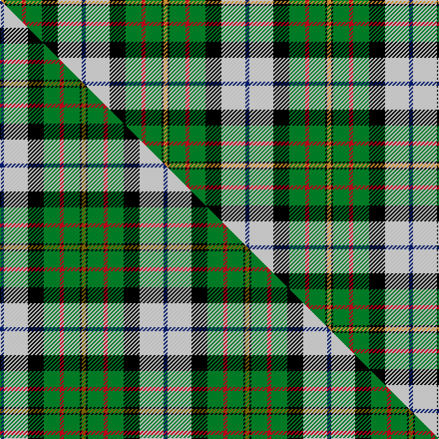

This page is one **sett** — a single exact thread-count. It belongs to the [tartan](/setts/db2w12k8g8r2g8k1lo2/)
(the same proportion at any scale), whose colour order is pattern [BWKGRGKY](/stripes/bwkgrgky/).

Part of the [MacLaren Dress](/tartans/maclaren-dress/) tartan — the named design grouping this sett with its other cloths.

Sourced from tartans-authority.  It is a [8 stripe tartan](/stripes/stripes8/).

Original link http://www.tartansauthority.com/tartan-ferret/display/649/

## Register references

External register numbers recorded for this tartan.

- Scottish Tartans Authority (ITI): 649

## Thread count
LO/4 K2 G16 R4 G16 K16 W24 DB/4

One full sett is **164 threads**.

## Palette
<table><thead><tr><th>Colour</th><th>Shade</th><th>OKLCh</th></tr></thead><tbody><tr><td>DB</td><td><code style="background-color:#082077;">#082077</code> <small style="color:#888">#082077</small></td><td><small style="color:#888">oklch(30.0% 0.149 265.1)</small></td></tr><tr><td>LO</td><td><code style="background-color:#FF9C34;">#FF9C34</code> <small style="color:#888">#FF9C34</small></td><td><small style="color:#888">oklch(77.9% 0.161 61.8)</small></td></tr><tr><td>G</td><td><code style="background-color:#008B2A;">#008B2A</code> <small style="color:#888">#008B2A</small></td><td><small style="color:#888">oklch(55.4% 0.170 145.9)</small></td></tr><tr><td>K</td><td><code style="background-color:#000000;">#000000</code> <small style="color:#888">#000000</small></td><td><small style="color:#888">oklch(0.0% 0.000 0.0)</small></td></tr><tr><td>R</td><td><code style="background-color:#D60020;">#D60020</code> <small style="color:#888">#D60020</small></td><td><small style="color:#888">oklch(55.2% 0.224 25.5)</small></td></tr><tr><td>W</td><td><code style="background-color:#F7F7F7;">#F7F7F7</code> <small style="color:#888">#F7F7F7</small></td><td><small style="color:#888">oklch(97.6% 0.000 89.9)</small></td></tr></tbody></table>

# Sample pattern

## Compared to the master

This cloth is one sett of its design; the master sett (the exemplar the design is anchored on) is below for comparison.

Its **ΔTartan distance** from the master is **0.11** — the same measure the nearest-tartans table ranks by (0 is identical; a re-scale of the same cloth is near 0, a recolour or a different proportion further).

<figure class="master-compare" style="margin:0">

this sett
master sett ★

<figcaption style="color:#888;font-size:smaller">One weave of this sett against the <a href="/setts/db2w12k8g8r2g8k1y2/">master sett ★</a>, split on the diagonal: a shared proportion runs seamlessly across it with only the shades shifting; a different proportion breaks on it.</figcaption>
</figure>

## Nearest variants

The nearest existing variants by ΔTartan distance, with this cloth at the top so the swatches line up against it.

ΔTartan

Threads

Variant

Sett

—

164

<a href="/variants/s8/db2w12k8g8r2g8k1lo2~x2/">MacLaren Dress (Clan)</a>

<a href="/ttd/edit/#slug=db2w12k8g8r2g8k1y2~x2&amp;base=db2w12k8g8r2g8k1lo2~x2" title="compare in the TTD">0.30</a>

164

<a href="/variants/s8/db2w12k8g8r2g8k1y2~x2/">MacLaren Dress</a>

<a href="/ttd/edit/#slug=db7w30k13g9r6g16k2y7~x2&amp;base=db2w12k8g8r2g8k1lo2~x2" title="compare in the TTD">0.83</a>

332

<a href="/variants/s8/db7w30k13g9r6g16k2y7~x2/">MacLaren dress</a>

<a href="/ttd/edit/#slug=db8w33k15g17lb3g17lb3~x2&amp;base=db2w12k8g8r2g8k1lo2~x2" title="compare in the TTD">2.04</a>

362

<a href="/variants/s7/db8w33k15g17lb3g17lb3~x2/">MacRobart, dress</a>

<a href="/ttd/edit/#slug=db8w33k15dg17lb3dg17lb3~x2&amp;base=db2w12k8g8r2g8k1lo2~x2" title="compare in the TTD">2.04</a>

362

<a href="/variants/s7/db8w33k15dg17lb3dg17lb3~x2/">MacRobart Dress (Personal)</a>

<a href="/ttd/edit/#slug=y6k2g15r6g8k12w25lb2w3lb2~x2&amp;base=db2w12k8g8r2g8k1lo2~x2" title="compare in the TTD">2.37</a>

308

<a href="/variants/s10/y6k2g15r6g8k12w25lb2w3lb2~x2/">Gillies, dress Green</a>

<a href="/ttd/edit/#slug=y6k2g12r4g8k10w24t2w3t2~x2&amp;base=db2w12k8g8r2g8k1lo2~x2" title="compare in the TTD">2.43</a>

276

<a href="/variants/s10/y6k2g12r4g8k10w24t2w3t2~x2/">Gillies Dress, Green (Dance)</a>

<a href="/ttd/edit/#slug=b2w2b1w9k5dg3dr2dg5k1ly2~x4&amp;base=db2w12k8g8r2g8k1lo2~x2" title="compare in the TTD">2.48</a>

240

<a href="/variants/s10/b2w2b1w9k5dg3dr2dg5k1ly2~x4/">Firth of Tay</a>

<a href="/ttd/edit/#slug=o5g2o2g26k9lr9lb13w5~x2~lr2800000-lb3203246&amp;base=db2w12k8g8r2g8k1lo2~x2" title="compare in the TTD">2.55</a>

264

<a href="/variants/s8/o5g2o2g26k9lr9lb13w5~x2~lr2800000-lb3203246/">Alexander of Menstry Htg (Personal)</a>

<a href="/ttd/edit/#slug=o5g2o2g26k9lr9lb13w5~x2~g2203152-lr2800000-lb3203246&amp;base=db2w12k8g8r2g8k1lo2~x2" title="compare in the TTD">2.55</a>

264

<a href="/variants/s8/o5g2o2g26k9lr9lb13w5~x2~g2203152-lr2800000-lb3203246/">Alexander of Menstry Hunting</a>

<a href="/ttd/edit/#slug=g16db4g8k2y1k6w8r10~x2&amp;base=db2w12k8g8r2g8k1lo2~x2" title="compare in the TTD">2.67</a>

168

<a href="/variants/s8/g16db4g8k2y1k6w8r10~x2/">Red Deer, City of</a>

## Neighbour map

Every grey dot is one of 13620 variants placed by the first two principal components of the ΔTartan feature space (42% of its variance). Red is this tartan; blue dots are its nearest — click one to open its page.

<svg viewBox="0 0 640 380" role="img" style="max-width:100%;height:auto;border:1px solid #e0e0e0;border-radius:4px;display:block" xmlns="http://www.w3.org/2000/svg"><image href="/nn/cloud.v1.png" width="640" height="380"/><a href="/variants/s8/db2w12k8g8r2g8k1y2~x2/"><circle cx="83.6" cy="158.7" r="4" fill="#3465a4"><title>MacLaren Dress</title></circle></a><a href="/variants/s8/db7w30k13g9r6g16k2y7~x2/"><circle cx="69.8" cy="149.4" r="4" fill="#3465a4"><title>MacLaren dress</title></circle></a><a href="/variants/s7/db8w33k15g17lb3g17lb3~x2/"><circle cx="101.3" cy="184.9" r="4" fill="#3465a4"><title>MacRobart, dress</title></circle></a><a href="/variants/s7/db8w33k15dg17lb3dg17lb3~x2/"><circle cx="100.9" cy="180.8" r="4" fill="#3465a4"><title>MacRobart Dress (Personal)</title></circle></a><a href="/variants/s10/y6k2g15r6g8k12w25lb2w3lb2~x2/"><circle cx="77.3" cy="134.6" r="4" fill="#3465a4"><title>Gillies, dress Green</title></circle></a><a href="/variants/s10/y6k2g12r4g8k10w24t2w3t2~x2/"><circle cx="87.4" cy="134.4" r="4" fill="#3465a4"><title>Gillies Dress, Green (Dance)</title></circle></a><a href="/variants/s10/b2w2b1w9k5dg3dr2dg5k1ly2~x4/"><circle cx="51.9" cy="156.1" r="4" fill="#3465a4"><title>Firth of Tay</title></circle></a><a href="/variants/s8/o5g2o2g26k9lr9lb13w5~x2~lr2800000-lb3203246/"><circle cx="112.1" cy="153.6" r="4" fill="#3465a4"><title>Alexander of Menstry Htg (Personal)</title></circle></a><a href="/variants/s8/o5g2o2g26k9lr9lb13w5~x2~g2203152-lr2800000-lb3203246/"><circle cx="119.8" cy="153.5" r="4" fill="#3465a4"><title>Alexander of Menstry Hunting</title></circle></a><a href="/variants/s8/g16db4g8k2y1k6w8r10~x2/"><circle cx="119.0" cy="153.1" r="4" fill="#3465a4"><title>Red Deer, City of</title></circle></a><circle cx="83.2" cy="158.2" r="5" fill="#c00000"/><text x="320" y="376" text-anchor="middle" font-size="11" fill="#999">ground</text><text x="11" y="190" text-anchor="middle" font-size="11" fill="#999" transform="rotate(-90 11 190)">complexity</text></svg>

ID: /variants/s8/db2w12k8g8r2g8k1lo2~x2/
