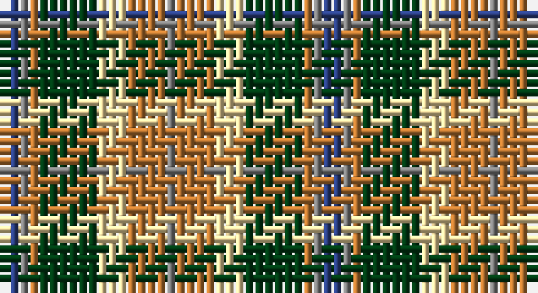

This page is one **sett** — a single exact thread-count. It belongs to the [tartan](/setts/db2y1o1dg6w3o3o1y1/)
(the same proportion at any scale), whose colour order is pattern [BGRGWRRG](/stripes/bgrgwrrg/).

Sourced from register-of-tartans.  It is a [8 stripe tartan](/stripes/stripes8/).

Original link https://www.tartanregister.gov.uk/tartanDetails.aspx?ref=1118

## Register references

External register numbers recorded for this tartan.

- Scottish Register of Tartans: [1118](https://www.tartanregister.gov.uk/tartanDetails.aspx?ref=1118)
- Scottish Tartans World Register: 1996

## Thread count
B/2 N1 DO1 DG6 LY3 DO3 DO1 N/1

One full sett is **33 threads**.

## Palette

Palette: <strong>Tartan Register</strong> <small style="color:#888">(4 of 5 colours)</small>
<table><thead><tr><th>Colour</th><th>Threads</th><th>Shade</th><th>Base</th><th>OKLCh</th></tr></thead><tbody><tr><td>B/</td><td style="text-align:right;font-variant-numeric:tabular-nums">2</td><td><code style="background-color:#2C4084;">#2C4084</code> <small style="color:#888">#2C4084</small></td><td>B <code style="background-color:#2A418A;">#2A418A</code></td><td><small style="color:#888">oklch(39.4% 0.117 268.3)</small></td></tr><tr><td>N</td><td style="text-align:right;font-variant-numeric:tabular-nums">1</td><td><code style="background-color:#808080;">#808080</code> <small style="color:#888">#808080</small></td><td>G <code style="background-color:#006100;">#006100</code></td><td><small style="color:#888">oklch(60.0% 0.000 89.9)</small></td></tr><tr><td>DO</td><td style="text-align:right;font-variant-numeric:tabular-nums">1</td><td><code style="background-color:#BE7832;">#BE7832</code> <small style="color:#888">#BE7832</small></td><td>R <code style="background-color:#CC0000;">#CC0000</code></td><td><small style="color:#888">oklch(63.5% 0.121 62.2)</small></td></tr><tr><td>DG</td><td style="text-align:right;font-variant-numeric:tabular-nums">6</td><td><code style="background-color:#003C14;">#003C14</code> <small style="color:#888">#003C14</small></td><td>G <code style="background-color:#006100;">#006100</code></td><td><small style="color:#888">oklch(31.1% 0.089 148.5)</small></td></tr><tr><td>LY</td><td style="text-align:right;font-variant-numeric:tabular-nums">3</td><td><code style="background-color:#F5DCA0;">#F5DCA0</code> <small style="color:#888">#F5DCA0</small></td><td>W <code style="background-color:#F7F7F7;">#F7F7F7</code></td><td><small style="color:#888">oklch(90.1% 0.082 88.0)</small></td></tr><tr><td>DO</td><td style="text-align:right;font-variant-numeric:tabular-nums">3</td><td><code style="background-color:#BE7832;">#BE7832</code> <small style="color:#888">#BE7832</small></td><td>R <code style="background-color:#CC0000;">#CC0000</code></td><td><small style="color:#888">oklch(63.5% 0.121 62.2)</small></td></tr><tr><td>DO</td><td style="text-align:right;font-variant-numeric:tabular-nums">1</td><td><code style="background-color:#BE7832;">#BE7832</code> <small style="color:#888">#BE7832</small></td><td>R <code style="background-color:#CC0000;">#CC0000</code></td><td><small style="color:#888">oklch(63.5% 0.121 62.2)</small></td></tr><tr><td>N/</td><td style="text-align:right;font-variant-numeric:tabular-nums">1</td><td><code style="background-color:#808080;">#808080</code> <small style="color:#888">#808080</small></td><td>G <code style="background-color:#006100;">#006100</code></td><td><small style="color:#888">oklch(60.0% 0.000 89.9)</small></td></tr></tbody></table>

# Sample pattern

## Nearest tartans

The nearest existing variants by ΔTartan distance, with this tartan at the top so the swatches line up against it.

ΔTartan

Tartan

Sett

—

<a href="/ttd/edit/#slug=db2y1o1dg6w3o3o1y1">Equorian Olympic</a> <a class="nn-out" href="/variants/s8/db2y1o1dg6w3o3o1y1/" title="open its dictionary page">↗</a>

0.74

<a href="/ttd/edit/#slug=w6ri8g24ri8db6r8db8w3~x2&amp;base=db2y1o1dg6w3o3o1y1">Utah Centennial</a> <a class="nn-out" href="/variants/s8/w6ri8g24ri8db6r8db8w3~x2/" title="open its dictionary page">↗</a>

0.96

<a href="/ttd/edit/#slug=o6w2k4dy12k4w2o6r3~x2&amp;base=db2y1o1dg6w3o3o1y1">Strathblane</a> <a class="nn-out" href="/variants/s8/o6w2k4dy12k4w2o6r3~x2/" title="open its dictionary page">↗</a>

0.98

<a href="/ttd/edit/#slug=dy17g5db2w12db2ly4g7~x4&amp;base=db2y1o1dg6w3o3o1y1">Northern Ontario</a> <a class="nn-out" href="/variants/s7/dy17g5db2w12db2ly4g7~x4/" title="open its dictionary page">↗</a>

0.99

<a href="/ttd/edit/#slug=do3o1lr1do1o3do3lr3ly6n1~x6&amp;base=db2y1o1dg6w3o3o1y1">Toorak Chapler</a> <a class="nn-out" href="/variants/s9/do3o1lr1do1o3do3lr3ly6n1~x6/" title="open its dictionary page">↗</a>

1.02

<a href="/ttd/edit/#slug=ly5g2r2g12k9t12r2t2r2t2~x2&amp;base=db2y1o1dg6w3o3o1y1">Lobban (Personal)</a> <a class="nn-out" href="/variants/s10/ly5g2r2g12k9t12r2t2r2t2~x2/" title="open its dictionary page">↗</a>

1.05

<a href="/ttd/edit/#slug=dg8gi6dg48w31o42g6o8&amp;base=db2y1o1dg6w3o3o1y1">Bannockbane, Green</a> <a class="nn-out" href="/variants/s7/dg8gi6dg48w31o42g6o8/" title="open its dictionary page">↗</a>

1.05

<a href="/ttd/edit/#slug=r4db18ri4g19w25r10w4~x2&amp;base=db2y1o1dg6w3o3o1y1">Fraser, Red dress</a> <a class="nn-out" href="/variants/s7/r4db18ri4g19w25r10w4~x2/" title="open its dictionary page">↗</a>

1.06

<a href="/ttd/edit/#slug=dg4g3dg24w15lo21gi3lo4~x2&amp;base=db2y1o1dg6w3o3o1y1">Bannockbane Dark Green</a> <a class="nn-out" href="/variants/s7/dg4g3dg24w15lo21gi3lo4~x2/" title="open its dictionary page">↗</a>

1.09

<a href="/ttd/edit/#slug=r3g18r4lg3r4k13r3lg18g2ly3~x2&amp;base=db2y1o1dg6w3o3o1y1">Stirling &amp; Bannockburn (District)</a> <a class="nn-out" href="/variants/s10/r3g18r4lg3r4k13r3lg18g2ly3~x2/" title="open its dictionary page">↗</a>

1.12

<a href="/ttd/edit/#slug=dy17o5db2w12db2ly4g7~x2&amp;base=db2y1o1dg6w3o3o1y1">Ontario Northern Canadian District Tartan</a> <a class="nn-out" href="/variants/s7/dy17o5db2w12db2ly4g7~x2/" title="open its dictionary page">↗</a>

## Neighbour map

Every grey dot is one of 14360 variants placed by the first two principal components of the ΔTartan feature space (44% of its variance). Red is this tartan; blue dots are its nearest — click one to open its page.

<svg viewBox="0 0 640 380" role="img" style="max-width:100%;height:auto;border:1px solid #e0e0e0;border-radius:4px;display:block" xmlns="http://www.w3.org/2000/svg"><image href="/nn/cloud.v1.png" width="640" height="380"/><a href="/variants/s8/w6ri8g24ri8db6r8db8w3~x2/"><circle cx="107.2" cy="190.5" r="4" fill="#3465a4"><title>Utah Centennial</title></circle></a><a href="/variants/s8/o6w2k4dy12k4w2o6r3~x2/"><circle cx="87.3" cy="207.2" r="4" fill="#3465a4"><title>Strathblane</title></circle></a><a href="/variants/s7/dy17g5db2w12db2ly4g7~x4/"><circle cx="102.8" cy="176.6" r="4" fill="#3465a4"><title>Northern Ontario</title></circle></a><a href="/variants/s9/do3o1lr1do1o3do3lr3ly6n1~x6/"><circle cx="79.1" cy="190.9" r="4" fill="#3465a4"><title>Toorak Chapler</title></circle></a><a href="/variants/s10/ly5g2r2g12k9t12r2t2r2t2~x2/"><circle cx="91.6" cy="184.2" r="4" fill="#3465a4"><title>Lobban (Personal)</title></circle></a><a href="/variants/s7/dg8gi6dg48w31o42g6o8/"><circle cx="142.4" cy="185.0" r="4" fill="#3465a4"><title>Bannockbane, Green</title></circle></a><a href="/variants/s7/r4db18ri4g19w25r10w4~x2/"><circle cx="86.0" cy="193.7" r="4" fill="#3465a4"><title>Fraser, Red dress</title></circle></a><a href="/variants/s7/dg4g3dg24w15lo21gi3lo4~x2/"><circle cx="144.3" cy="185.4" r="4" fill="#3465a4"><title>Bannockbane Dark Green</title></circle></a><a href="/variants/s10/r3g18r4lg3r4k13r3lg18g2ly3~x2/"><circle cx="106.6" cy="163.4" r="4" fill="#3465a4"><title>Stirling &amp; Bannockburn (District)</title></circle></a><a href="/variants/s7/dy17o5db2w12db2ly4g7~x2/"><circle cx="87.2" cy="167.3" r="4" fill="#3465a4"><title>Ontario Northern Canadian District Tartan</title></circle></a><circle cx="95.6" cy="195.7" r="5" fill="#c00000"/></svg>

ID: /variants/s8/db2y1o1dg6w3o3o1y1/
