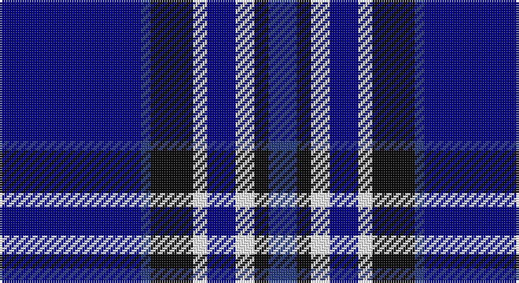

This page is one **sett** — a single exact thread-count. It belongs to the [tartan](/setts/db30dbi2k9w3db6w4k3dbi6/)
(the same proportion at any scale), whose colour order is pattern [BBKWBWKB](/stripes/bbkwbwkb/).

Sourced from register-of-tartans.  It is a [8 stripe tartan](/stripes/stripes8/).

Original link https://www.tartanregister.gov.uk/tartanDetails.aspx?ref=11431

## Register references

External register numbers recorded for this tartan.

- Scottish Register of Tartans: [11431](https://www.tartanregister.gov.uk/tartanDetails.aspx?ref=11431)

## Thread count
DB/60 B4 K18 W6 DB12 W8 K6 B/12

One full sett is **180 threads**.

## Palette

Palette: <strong>Tartan Register</strong> <small style="color:#888">(3 of 4 colours)</small>
<table><thead><tr><th>Colour</th><th>Threads</th><th>Shade</th><th>Base</th><th>OKLCh</th></tr></thead><tbody><tr><td>DB/</td><td style="text-align:right;font-variant-numeric:tabular-nums">60</td><td><code style="background-color:#000080;">#000080</code> <small style="color:#888">#000080</small></td><td>B <code style="background-color:#2A418A;">#2A418A</code></td><td><small style="color:#888">oklch(27.1% 0.188 264.1)</small></td></tr><tr><td>B</td><td style="text-align:right;font-variant-numeric:tabular-nums">4</td><td><code style="background-color:#2C4084;">#2C4084</code> <small style="color:#888">#2C4084</small></td><td>B <code style="background-color:#2A418A;">#2A418A</code></td><td><small style="color:#888">oklch(39.4% 0.117 268.3)</small></td></tr><tr><td>K</td><td style="text-align:right;font-variant-numeric:tabular-nums">18</td><td><code style="background-color:#101010;">#101010</code> <small style="color:#888">#101010</small></td><td>K <code style="background-color:#000000;">#000000</code></td><td><small style="color:#888">oklch(17.3% 0.000 89.9)</small></td></tr><tr><td>W</td><td style="text-align:right;font-variant-numeric:tabular-nums">6</td><td><code style="background-color:#FFFFFF;">#FFFFFF</code> <small style="color:#888">#FFFFFF</small></td><td>W <code style="background-color:#F7F7F7;">#F7F7F7</code></td><td><small style="color:#888">oklch(100.0% 0.000 89.9)</small></td></tr><tr><td>DB</td><td style="text-align:right;font-variant-numeric:tabular-nums">12</td><td><code style="background-color:#000080;">#000080</code> <small style="color:#888">#000080</small></td><td>B <code style="background-color:#2A418A;">#2A418A</code></td><td><small style="color:#888">oklch(27.1% 0.188 264.1)</small></td></tr><tr><td>W</td><td style="text-align:right;font-variant-numeric:tabular-nums">8</td><td><code style="background-color:#FFFFFF;">#FFFFFF</code> <small style="color:#888">#FFFFFF</small></td><td>W <code style="background-color:#F7F7F7;">#F7F7F7</code></td><td><small style="color:#888">oklch(100.0% 0.000 89.9)</small></td></tr><tr><td>K</td><td style="text-align:right;font-variant-numeric:tabular-nums">6</td><td><code style="background-color:#101010;">#101010</code> <small style="color:#888">#101010</small></td><td>K <code style="background-color:#000000;">#000000</code></td><td><small style="color:#888">oklch(17.3% 0.000 89.9)</small></td></tr><tr><td>B/</td><td style="text-align:right;font-variant-numeric:tabular-nums">12</td><td><code style="background-color:#2C4084;">#2C4084</code> <small style="color:#888">#2C4084</small></td><td>B <code style="background-color:#2A418A;">#2A418A</code></td><td><small style="color:#888">oklch(39.4% 0.117 268.3)</small></td></tr></tbody></table>

# Sample pattern

## Nearest tartans

The nearest existing variants by ΔTartan distance, with this tartan at the top so the swatches line up against it.

ΔTartan

Tartan

Sett

—

<a href="/ttd/edit/#slug=db30dbi2k9w3db6w4k3dbi6~x2">Auto Docs</a> <a class="nn-out" href="/variants/s8/db30dbi2k9w3db6w4k3dbi6~x2/" title="open its dictionary page">↗</a>

1.07

<a href="/ttd/edit/#slug=r3db2w2db26k22w3db3w3~x2&amp;base=db30dbi2k9w3db6w4k3dbi6~x2">DeCloud-McMasters (Personal)</a> <a class="nn-out" href="/variants/s8/r3db2w2db26k22w3db3w3~x2/" title="open its dictionary page">↗</a>

1.14

<a href="/ttd/edit/#slug=k10db30g3db3g3db3r6~x2&amp;base=db30dbi2k9w3db6w4k3dbi6~x2">Kinding</a> <a class="nn-out" href="/variants/s7/k10db30g3db3g3db3r6~x2/" title="open its dictionary page">↗</a>

1.26

<a href="/ttd/edit/#slug=dbi9k1db4k1dbi18b5k1b1k1b5dbi4~x2&amp;base=db30dbi2k9w3db6w4k3dbi6~x2">Indigo Blue Works</a> <a class="nn-out" href="/variants/s11/dbi9k1db4k1dbi18b5k1b1k1b5dbi4~x2/" title="open its dictionary page">↗</a>

1.29

<a href="/ttd/edit/#slug=db6lo3db3lo15dbi7db7dbi5db17dbi46w4&amp;base=db30dbi2k9w3db6w4k3dbi6~x2">Rhys Welsh Name Tartan</a> <a class="nn-out" href="/variants/s10/db6lo3db3lo15dbi7db7dbi5db17dbi46w4/" title="open its dictionary page">↗</a>

1.30

<a href="/ttd/edit/#slug=w2db35k9w3k9ly2~x2&amp;base=db30dbi2k9w3db6w4k3dbi6~x2">Hannah (Personal)</a> <a class="nn-out" href="/variants/s6/w2db35k9w3k9ly2~x2/" title="open its dictionary page">↗</a>

1.36

<a href="/ttd/edit/#slug=db20o1db1o1dg8k1w3~x2&amp;base=db30dbi2k9w3db6w4k3dbi6~x2">Chestico</a> <a class="nn-out" href="/variants/s7/db20o1db1o1dg8k1w3~x2/" title="open its dictionary page">↗</a>

1.37

<a href="/variants/s6/ly8k3b40ki12k3ly3~x2/">Wolverine Corporate Tartan</a>

1.38

<a href="/ttd/edit/#slug=db4w1db1w3db24y9k1y9k3~x2&amp;base=db30dbi2k9w3db6w4k3dbi6~x2">Historic Scotland</a> <a class="nn-out" href="/variants/s9/db4w1db1w3db24y9k1y9k3~x2/" title="open its dictionary page">↗</a>

1.39

<a href="/ttd/edit/#slug=db7r3db26t2db2t26ly4~x2&amp;base=db30dbi2k9w3db6w4k3dbi6~x2">Int. Police Association (Official)</a> <a class="nn-out" href="/variants/s7/db7r3db26t2db2t26ly4~x2/" title="open its dictionary page">↗</a>

1.40

<a href="/ttd/edit/#slug=w2b35k9w3k9ly2~x2&amp;base=db30dbi2k9w3db6w4k3dbi6~x2">Hannah (Personal)</a> <a class="nn-out" href="/variants/s6/w2b35k9w3k9ly2~x2/" title="open its dictionary page">↗</a>

## Neighbour map

Every grey dot is one of 14360 variants placed by the first two principal components of the ΔTartan feature space (44% of its variance). Red is this tartan; blue dots are its nearest — click one to open its page.

<svg viewBox="0 0 640 380" role="img" style="max-width:100%;height:auto;border:1px solid #e0e0e0;border-radius:4px;display:block" xmlns="http://www.w3.org/2000/svg"><image href="/nn/cloud.v1.png" width="640" height="380"/><a href="/variants/s8/r3db2w2db26k22w3db3w3~x2/"><circle cx="256.3" cy="162.2" r="4" fill="#3465a4"><title>DeCloud-McMasters (Personal)</title></circle></a><a href="/variants/s7/k10db30g3db3g3db3r6~x2/"><circle cx="326.6" cy="191.4" r="4" fill="#3465a4"><title>Kinding</title></circle></a><a href="/variants/s11/dbi9k1db4k1dbi18b5k1b1k1b5dbi4~x2/"><circle cx="357.9" cy="163.8" r="4" fill="#3465a4"><title>Indigo Blue Works</title></circle></a><a href="/variants/s10/db6lo3db3lo15dbi7db7dbi5db17dbi46w4/"><circle cx="297.5" cy="169.5" r="4" fill="#3465a4"><title>Rhys Welsh Name Tartan</title></circle></a><a href="/variants/s6/w2db35k9w3k9ly2~x2/"><circle cx="349.3" cy="172.4" r="4" fill="#3465a4"><title>Hannah (Personal)</title></circle></a><a href="/variants/s7/db20o1db1o1dg8k1w3~x2/"><circle cx="331.4" cy="139.0" r="4" fill="#3465a4"><title>Chestico</title></circle></a><a href="/variants/s6/ly8k3b40ki12k3ly3~x2/"><circle cx="314.0" cy="181.3" r="4" fill="#3465a4"><title>Wolverine Corporate Tartan</title></circle></a><a href="/variants/s9/db4w1db1w3db24y9k1y9k3~x2/"><circle cx="301.2" cy="138.3" r="4" fill="#3465a4"><title>Historic Scotland</title></circle></a><a href="/variants/s7/db7r3db26t2db2t26ly4~x2/"><circle cx="288.1" cy="180.6" r="4" fill="#3465a4"><title>Int. Police Association (Official)</title></circle></a><a href="/variants/s6/w2b35k9w3k9ly2~x2/"><circle cx="320.8" cy="163.5" r="4" fill="#3465a4"><title>Hannah (Personal)</title></circle></a><circle cx="301.0" cy="170.0" r="5" fill="#c00000"/></svg>

ID: /variants/s8/db30dbi2k9w3db6w4k3dbi6~x2/
