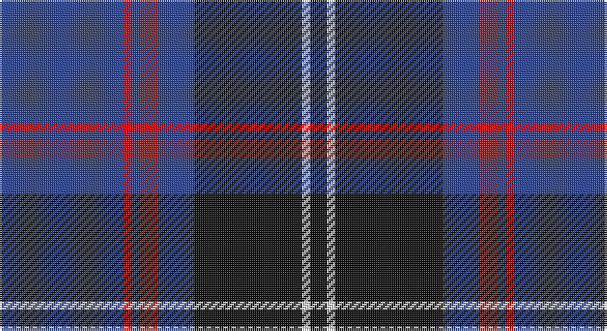

This page is one **sett** — a single exact thread-count. It belongs to the [tartan](/setts/db30r2db2r4db9k26w2k4/)
(the same proportion at any scale), whose colour order is pattern [BRBRBKWK](/stripes/brbrbkwk/).

Sourced from register-of-tartans.  It is a [8 stripe tartan](/stripes/stripes8/).

Original link https://www.tartanregister.gov.uk/tartanDetails.aspx?ref=5986

## Register references

External register numbers recorded for this tartan.

- Scottish Register of Tartans: [5986](https://www.tartanregister.gov.uk/tartanDetails.aspx?ref=5986)
- Scottish Tartans World Register: 3272

## Thread count
B/60 R4 B4 R8 B18 K52 LN4 K/8

One full sett is **248 threads**.

## Palette

Palette: <strong>Tartan Register</strong>
<table><thead><tr><th>Colour</th><th>Threads</th><th>Shade</th><th>Base</th><th>OKLCh</th></tr></thead><tbody><tr><td>B/</td><td style="text-align:right;font-variant-numeric:tabular-nums">60</td><td><code style="background-color:#2C4084;">#2C4084</code> <small style="color:#888">#2C4084</small></td><td>B <code style="background-color:#2A418A;">#2A418A</code></td><td><small style="color:#888">oklch(39.4% 0.117 268.3)</small></td></tr><tr><td>R</td><td style="text-align:right;font-variant-numeric:tabular-nums">4</td><td><code style="background-color:#DC0000;">#DC0000</code> <small style="color:#888">#DC0000</small></td><td>R <code style="background-color:#CC0000;">#CC0000</code></td><td><small style="color:#888">oklch(56.2% 0.230 29.2)</small></td></tr><tr><td>B</td><td style="text-align:right;font-variant-numeric:tabular-nums">4</td><td><code style="background-color:#2C4084;">#2C4084</code> <small style="color:#888">#2C4084</small></td><td>B <code style="background-color:#2A418A;">#2A418A</code></td><td><small style="color:#888">oklch(39.4% 0.117 268.3)</small></td></tr><tr><td>R</td><td style="text-align:right;font-variant-numeric:tabular-nums">8</td><td><code style="background-color:#DC0000;">#DC0000</code> <small style="color:#888">#DC0000</small></td><td>R <code style="background-color:#CC0000;">#CC0000</code></td><td><small style="color:#888">oklch(56.2% 0.230 29.2)</small></td></tr><tr><td>B</td><td style="text-align:right;font-variant-numeric:tabular-nums">18</td><td><code style="background-color:#2C4084;">#2C4084</code> <small style="color:#888">#2C4084</small></td><td>B <code style="background-color:#2A418A;">#2A418A</code></td><td><small style="color:#888">oklch(39.4% 0.117 268.3)</small></td></tr><tr><td>K</td><td style="text-align:right;font-variant-numeric:tabular-nums">52</td><td><code style="background-color:#101010;">#101010</code> <small style="color:#888">#101010</small></td><td>K <code style="background-color:#000000;">#000000</code></td><td><small style="color:#888">oklch(17.3% 0.000 89.9)</small></td></tr><tr><td>LN</td><td style="text-align:right;font-variant-numeric:tabular-nums">4</td><td><code style="background-color:#E0E0E0;">#E0E0E0</code> <small style="color:#888">#E0E0E0</small></td><td>W <code style="background-color:#F7F7F7;">#F7F7F7</code></td><td><small style="color:#888">oklch(90.7% 0.000 89.9)</small></td></tr><tr><td>K/</td><td style="text-align:right;font-variant-numeric:tabular-nums">8</td><td><code style="background-color:#101010;">#101010</code> <small style="color:#888">#101010</small></td><td>K <code style="background-color:#000000;">#000000</code></td><td><small style="color:#888">oklch(17.3% 0.000 89.9)</small></td></tr></tbody></table>

# Sample pattern

## Nearest tartans

The nearest existing variants by ΔTartan distance, with this tartan at the top so the swatches line up against it.

ΔTartan

Tartan

Sett

—

<a href="/ttd/edit/#slug=db30r2db2r4db9k26w2k4~x2">Murdoch Celebration (Personal)</a> <a class="nn-out" href="/variants/s8/db30r2db2r4db9k26w2k4~x2/" title="open its dictionary page">↗</a>

0.63

<a href="/ttd/edit/#slug=k21db8r4db2r2db23k4w2~x2&amp;base=db30r2db2r4db9k26w2k4~x2">Murdoch Clebration (Personal)</a> <a class="nn-out" href="/variants/s8/k21db8r4db2r2db23k4w2~x2/" title="open its dictionary page">↗</a>

0.92

<a href="/ttd/edit/#slug=dg20db2g6db2dg4db27lo2db8~x2&amp;base=db30r2db2r4db9k26w2k4~x2">Kinross (Fashion)</a> <a class="nn-out" href="/variants/s8/dg20db2g6db2dg4db27lo2db8~x2/" title="open its dictionary page">↗</a>

0.96

<a href="/ttd/edit/#slug=db2ly1db18g7r7db1g1~x2&amp;base=db30r2db2r4db9k26w2k4~x2">Unnamed C20th - USA</a> <a class="nn-out" href="/variants/s7/db2ly1db18g7r7db1g1~x2/" title="open its dictionary page">↗</a>

1.05

<a href="/ttd/edit/#slug=db10r3db3r6db26g12r6g2r3g6lo2~x2&amp;base=db30r2db2r4db9k26w2k4~x2">Law of Atholl (Personal)</a> <a class="nn-out" href="/variants/s11/db10r3db3r6db26g12r6g2r3g6lo2~x2/" title="open its dictionary page">↗</a>

1.06

<a href="/ttd/edit/#slug=k14t3k3w4k3t3k14db4k4db30k4~x2&amp;base=db30r2db2r4db9k26w2k4~x2">Scottish Jewish Community</a> <a class="nn-out" href="/variants/s11/k14t3k3w4k3t3k14db4k4db30k4~x2/" title="open its dictionary page">↗</a>

1.08

<a href="/ttd/edit/#slug=k36r3k3r3k9b36g3b2~x2&amp;base=db30r2db2r4db9k26w2k4~x2">Home (Clan)</a> <a class="nn-out" href="/variants/s8/k36r3k3r3k9b36g3b2~x2/" title="open its dictionary page">↗</a>

1.08

<a href="/ttd/edit/#slug=o11dbi1o3db1dbi9r1~x4&amp;base=db30r2db2r4db9k26w2k4~x2">Dege, of Saville Row</a> <a class="nn-out" href="/variants/s6/o11dbi1o3db1dbi9r1~x4/" title="open its dictionary page">↗</a>

1.11

<a href="/ttd/edit/#slug=lo6db3lo3db15dbi7lo7dbi5lo17dbi46lo4&amp;base=db30r2db2r4db9k26w2k4~x2">Rhys (Welsh Name)</a> <a class="nn-out" href="/variants/s10/lo6db3lo3db15dbi7lo7dbi5lo17dbi46lo4/" title="open its dictionary page">↗</a>

1.11

<a href="/ttd/edit/#slug=r10db15g2db2w1db1w1~x4&amp;base=db30r2db2r4db9k26w2k4~x2">Ikelman #4 (Personal)</a> <a class="nn-out" href="/variants/s7/r10db15g2db2w1db1w1~x4/" title="open its dictionary page">↗</a>

1.12

<a href="/variants/s8/g47r3g6db35lo3~x2/">Gracie</a>

## Neighbour map

Every grey dot is one of 14360 variants placed by the first two principal components of the ΔTartan feature space (44% of its variance). Red is this tartan; blue dots are its nearest — click one to open its page.

<svg viewBox="0 0 640 380" role="img" style="max-width:100%;height:auto;border:1px solid #e0e0e0;border-radius:4px;display:block" xmlns="http://www.w3.org/2000/svg"><image href="/nn/cloud.v1.png" width="640" height="380"/><a href="/variants/s8/k21db8r4db2r2db23k4w2~x2/"><circle cx="308.6" cy="199.4" r="4" fill="#3465a4"><title>Murdoch Clebration (Personal)</title></circle></a><a href="/variants/s8/dg20db2g6db2dg4db27lo2db8~x2/"><circle cx="333.8" cy="198.5" r="4" fill="#3465a4"><title>Kinross (Fashion)</title></circle></a><a href="/variants/s7/db2ly1db18g7r7db1g1~x2/"><circle cx="349.9" cy="173.6" r="4" fill="#3465a4"><title>Unnamed C20th - USA</title></circle></a><a href="/variants/s11/db10r3db3r6db26g12r6g2r3g6lo2~x2/"><circle cx="279.0" cy="180.5" r="4" fill="#3465a4"><title>Law of Atholl (Personal)</title></circle></a><a href="/variants/s11/k14t3k3w4k3t3k14db4k4db30k4~x2/"><circle cx="284.0" cy="186.6" r="4" fill="#3465a4"><title>Scottish Jewish Community</title></circle></a><a href="/variants/s8/k36r3k3r3k9b36g3b2~x2/"><circle cx="318.2" cy="161.4" r="4" fill="#3465a4"><title>Home (Clan)</title></circle></a><a href="/variants/s6/o11dbi1o3db1dbi9r1~x4/"><circle cx="328.7" cy="209.2" r="4" fill="#3465a4"><title>Dege, of Saville Row</title></circle></a><a href="/variants/s10/lo6db3lo3db15dbi7lo7dbi5lo17dbi46lo4/"><circle cx="285.0" cy="159.6" r="4" fill="#3465a4"><title>Rhys (Welsh Name)</title></circle></a><a href="/variants/s7/r10db15g2db2w1db1w1~x4/"><circle cx="339.6" cy="170.6" r="4" fill="#3465a4"><title>Ikelman #4 (Personal)</title></circle></a><a href="/variants/s8/g47r3g6db35lo3~x2/"><circle cx="326.0" cy="190.4" r="4" fill="#3465a4"><title>Gracie</title></circle></a><circle cx="334.1" cy="183.0" r="5" fill="#c00000"/></svg>

ID: /variants/s8/db30r2db2r4db9k26w2k4~x2/
