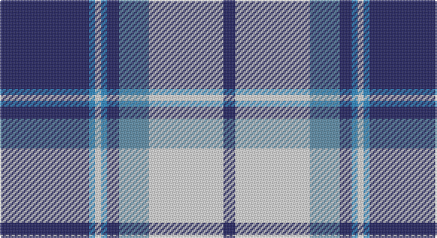

This page is one **sett** — a single exact thread-count. It belongs to the [tartan](/setts/db30t2w2t2db4ti10w25db4/)
(the same proportion at any scale), whose colour order is pattern [BBWBBBWB](/stripes/bbwbbbwb/).

Sourced from house-of-tartan.  It is a [8 stripe tartan](/stripes/stripes8/).

Original link http://www.house-of-tartan.scotland.net/house/TartanViewjs.asp?colr=Def&tnam=4799

## Provenance

Earliest known date: 01/01/1980 A Dancers' Fancy from Dalgliesh. This appears under three different names - Longniddry #5486, Eildon #4799 and Harmony Eildon #87 (original Scottish Tartans Authority references). Needs resolving. Sample in Scottish Tartans Authority's Dalgety Collection. /Threadcount and colours aren't 100% original. Generated manually./

## Thread count
DB/60 B4 LN4 B4 DB8 Ba20 LN50 DB/8

One full sett is **248 threads**.

## Palette

Palette: <strong>Tartan Register</strong>
<table><thead><tr><th>Colour</th><th>Threads</th><th>Shade</th><th>Base</th><th>OKLCh</th></tr></thead><tbody><tr><td>DB/</td><td style="text-align:right;font-variant-numeric:tabular-nums">60</td><td><code style="background-color:#202060;">#202060</code> <small style="color:#888">#202060</small></td><td>B <code style="background-color:#2A418A;">#2A418A</code></td><td><small style="color:#888">oklch(28.9% 0.111 276.9)</small></td></tr><tr><td>B</td><td style="text-align:right;font-variant-numeric:tabular-nums">4</td><td><code style="background-color:#2888C4;">#2888C4</code> <small style="color:#888">#2888C4</small></td><td>B <code style="background-color:#2A418A;">#2A418A</code></td><td><small style="color:#888">oklch(60.1% 0.125 241.5)</small></td></tr><tr><td>LN</td><td style="text-align:right;font-variant-numeric:tabular-nums">4</td><td><code style="background-color:#E0E0E0;">#E0E0E0</code> <small style="color:#888">#E0E0E0</small></td><td>W <code style="background-color:#F7F7F7;">#F7F7F7</code></td><td><small style="color:#888">oklch(90.7% 0.000 89.9)</small></td></tr><tr><td>B</td><td style="text-align:right;font-variant-numeric:tabular-nums">4</td><td><code style="background-color:#2888C4;">#2888C4</code> <small style="color:#888">#2888C4</small></td><td>B <code style="background-color:#2A418A;">#2A418A</code></td><td><small style="color:#888">oklch(60.1% 0.125 241.5)</small></td></tr><tr><td>DB</td><td style="text-align:right;font-variant-numeric:tabular-nums">8</td><td><code style="background-color:#202060;">#202060</code> <small style="color:#888">#202060</small></td><td>B <code style="background-color:#2A418A;">#2A418A</code></td><td><small style="color:#888">oklch(28.9% 0.111 276.9)</small></td></tr><tr><td>Ba</td><td style="text-align:right;font-variant-numeric:tabular-nums">20</td><td><code style="background-color:#5C8CA8;">#5C8CA8</code> <small style="color:#888">#5C8CA8</small></td><td>B <code style="background-color:#2A418A;">#2A418A</code></td><td><small style="color:#888">oklch(61.7% 0.067 235.0)</small></td></tr><tr><td>LN</td><td style="text-align:right;font-variant-numeric:tabular-nums">50</td><td><code style="background-color:#E0E0E0;">#E0E0E0</code> <small style="color:#888">#E0E0E0</small></td><td>W <code style="background-color:#F7F7F7;">#F7F7F7</code></td><td><small style="color:#888">oklch(90.7% 0.000 89.9)</small></td></tr><tr><td>DB/</td><td style="text-align:right;font-variant-numeric:tabular-nums">8</td><td><code style="background-color:#202060;">#202060</code> <small style="color:#888">#202060</small></td><td>B <code style="background-color:#2A418A;">#2A418A</code></td><td><small style="color:#888">oklch(28.9% 0.111 276.9)</small></td></tr></tbody></table>

# Sample pattern

## Nearest tartans

The nearest existing variants by ΔTartan distance, with this tartan at the top so the swatches line up against it.

ΔTartan

Tartan

Sett

—

<a href="/ttd/edit/#slug=db30t2w2t2db4ti10w25db4~x2">Eildon/Longniddry Blue Dress Fashion Tartan</a> <a class="nn-out" href="/variants/s8/db30t2w2t2db4ti10w25db4~x2/" title="open its dictionary page">↗</a>

0.74

<a href="/ttd/edit/#slug=db41ti2w2ti2db5t12w31db4~x2&amp;base=db30t2w2t2db4ti10w25db4~x2">Harmony Eildon (Dance)</a> <a class="nn-out" href="/variants/s8/db41ti2w2ti2db5t12w31db4~x2/" title="open its dictionary page">↗</a>

0.75

<a href="/ttd/edit/#slug=r3dy1w12dy2db2dy2db14w2db2~x2&amp;base=db30t2w2t2db4ti10w25db4~x2">Lord Arran (Corporate)</a> <a class="nn-out" href="/variants/s9/r3dy1w12dy2db2dy2db14w2db2~x2/" title="open its dictionary page">↗</a>

0.85

<a href="/ttd/edit/#slug=db41t2w2t2db5b12w31db4~x2&amp;base=db30t2w2t2db4ti10w25db4~x2">Harmony, Eildon</a> <a class="nn-out" href="/variants/s8/db41t2w2t2db5b12w31db4~x2/" title="open its dictionary page">↗</a>

0.91

<a href="/ttd/edit/#slug=db42lbi2lb2lbi2db5dt12lb32db4~x2&amp;base=db30t2w2t2db4ti10w25db4~x2">Longniddry Eildon Blue Dress Fancy Tartan</a> <a class="nn-out" href="/variants/s8/db42lbi2lb2lbi2db5dt12lb32db4~x2/" title="open its dictionary page">↗</a>

0.93

<a href="/ttd/edit/#slug=b3db2k2db28w30db2w3~x2&amp;base=db30t2w2t2db4ti10w25db4~x2">Cunningham, Dress Blue (Dance)</a> <a class="nn-out" href="/variants/s7/b3db2k2db28w30db2w3~x2/" title="open its dictionary page">↗</a>

0.93

<a href="/ttd/edit/#slug=ly12dbi2ly2dbi30db3dbi2db13w4~x2&amp;base=db30t2w2t2db4ti10w25db4~x2">Highlands School (N. Carolina) Corporate Tartan</a> <a class="nn-out" href="/variants/s8/ly12dbi2ly2dbi30db3dbi2db13w4~x2/" title="open its dictionary page">↗</a>

0.96

<a href="/ttd/edit/#slug=b27w2b14k14lg4k4lg4k4lg27&amp;base=db30t2w2t2db4ti10w25db4~x2">(1) Abercrombie</a> <a class="nn-out" href="/variants/s9/b27w2b14k14lg4k4lg4k4lg27/" title="open its dictionary page">↗</a>

1.00

<a href="/ttd/edit/#slug=t57k5t9m29k18w9m9w5&amp;base=db30t2w2t2db4ti10w25db4~x2">Yale College, Wrexham</a> <a class="nn-out" href="/variants/s8/t57k5t9m29k18w9m9w5/" title="open its dictionary page">↗</a>

1.02

<a href="/ttd/edit/#slug=db4r2db31k10g4w21g2~x2&amp;base=db30t2w2t2db4ti10w25db4~x2">Sinclair Dress (Dance)</a> <a class="nn-out" href="/variants/s7/db4r2db31k10g4w21g2~x2/" title="open its dictionary page">↗</a>

1.03

<a href="/ttd/edit/#slug=db30lb2k9w3db6w4k3lb6~x2&amp;base=db30t2w2t2db4ti10w25db4~x2">Detroit Lions</a> <a class="nn-out" href="/variants/s8/db30lb2k9w3db6w4k3lb6~x2/" title="open its dictionary page">↗</a>

## Neighbour map

Every grey dot is one of 14360 variants placed by the first two principal components of the ΔTartan feature space (44% of its variance). Red is this tartan; blue dots are its nearest — click one to open its page.

<svg viewBox="0 0 640 380" role="img" style="max-width:100%;height:auto;border:1px solid #e0e0e0;border-radius:4px;display:block" xmlns="http://www.w3.org/2000/svg"><image href="/nn/cloud.v1.png" width="640" height="380"/><a href="/variants/s8/db41ti2w2ti2db5t12w31db4~x2/"><circle cx="278.5" cy="134.5" r="4" fill="#3465a4"><title>Harmony Eildon (Dance)</title></circle></a><a href="/variants/s9/r3dy1w12dy2db2dy2db14w2db2~x2/"><circle cx="224.4" cy="144.0" r="4" fill="#3465a4"><title>Lord Arran (Corporate)</title></circle></a><a href="/variants/s8/db41t2w2t2db5b12w31db4~x2/"><circle cx="285.9" cy="135.9" r="4" fill="#3465a4"><title>Harmony, Eildon</title></circle></a><a href="/variants/s8/db42lbi2lb2lbi2db5dt12lb32db4~x2/"><circle cx="288.7" cy="139.6" r="4" fill="#3465a4"><title>Longniddry Eildon Blue Dress Fancy Tartan</title></circle></a><a href="/variants/s7/b3db2k2db28w30db2w3~x2/"><circle cx="268.2" cy="141.5" r="4" fill="#3465a4"><title>Cunningham, Dress Blue (Dance)</title></circle></a><a href="/variants/s8/ly12dbi2ly2dbi30db3dbi2db13w4~x2/"><circle cx="259.8" cy="156.5" r="4" fill="#3465a4"><title>Highlands School (N. Carolina) Corporate Tartan</title></circle></a><a href="/variants/s9/b27w2b14k14lg4k4lg4k4lg27/"><circle cx="184.0" cy="160.4" r="4" fill="#3465a4"><title>(1) Abercrombie</title></circle></a><a href="/variants/s8/t57k5t9m29k18w9m9w5/"><circle cx="223.1" cy="167.6" r="4" fill="#3465a4"><title>Yale College, Wrexham</title></circle></a><a href="/variants/s7/db4r2db31k10g4w21g2~x2/"><circle cx="213.2" cy="144.0" r="4" fill="#3465a4"><title>Sinclair Dress (Dance)</title></circle></a><a href="/variants/s8/db30lb2k9w3db6w4k3lb6~x2/"><circle cx="290.8" cy="154.2" r="4" fill="#3465a4"><title>Detroit Lions</title></circle></a><circle cx="243.4" cy="147.6" r="5" fill="#c00000"/></svg>

ID: /variants/s8/db30t2w2t2db4ti10w25db4~x2/
