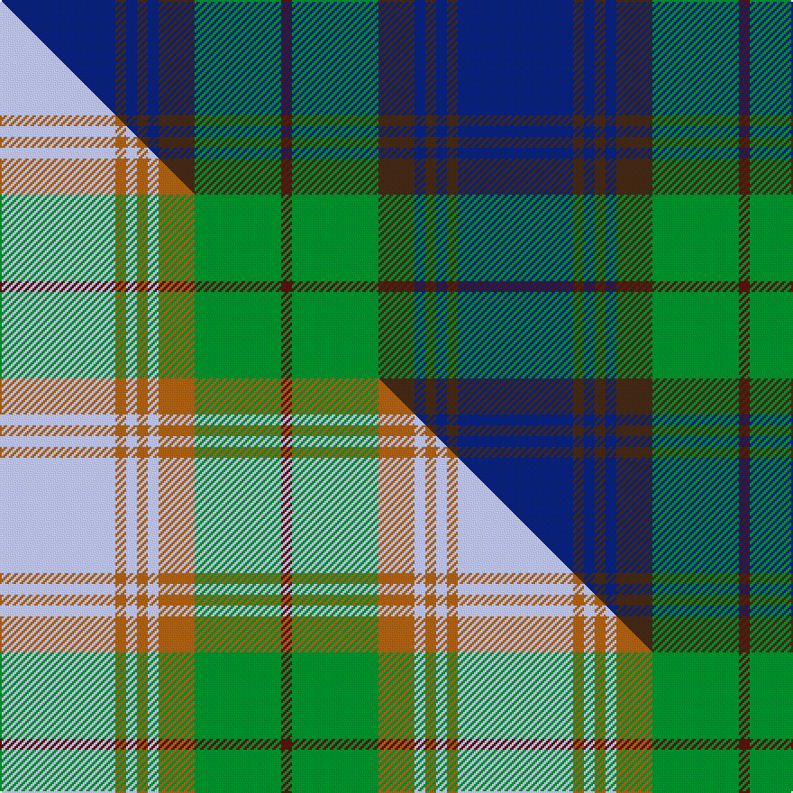

This page is one **sett** — a single exact thread-count. It belongs to the [tartan](/setts/db32do3db3do3db3do10g24dr3/)
(the same proportion at any scale), whose colour order is pattern [BBBBBBGB](/stripes/bbbbbbgb/).

Part of the [Gammell](/tartans/gammell/) tartan — the named design grouping this sett with its other cloths.

Sourced from weddslist.  It is a [8 stripe tartan](/stripes/stripes8/).

Original link http://www.weddslist.com/cgi-bin/tartans/pg.pl?source=sts

## Provenance

Earliest known date: 1965 Designed (probably by David Thomas and Arthur Mackie of Strathmore Woollen Co) for the Hill family of Angus as a personal tartan. Tommy Gemmell (6.3.05) said "The tartan was designed using the largest Government sett by Mrs Hill's mother - a Mrs Gammell - who was a handweaver."

2 attestations — the source records this cloth was collapsed from (oldest owns this page)

<ul>
<li>undated — Gammell (weddslist, <a href="http://www.weddslist.com/cgi-bin/tartans/pg.pl?source=sts">record</a>) </li>
<li>undated — Gammell Family Tartan (house-of-tartan, <a href="http://www.house-of-tartan.scotland.net/house/TartanViewjs.asp?colr=Def&tnam=597">record</a>) </li>
</ul>

## Thread count
DB/64 DO6 DB6 DO6 DB6 DO20 G48 DR/6

One full sett is **254 threads**.

## Palette
<table><thead><tr><th>Colour</th><th>Shade</th><th>OKLCh</th></tr></thead><tbody><tr><td>DB</td><td><code style="background-color:#082077;">#082077</code> <small style="color:#888">#082077</small></td><td><small style="color:#888">oklch(30.0% 0.149 265.1)</small></td></tr><tr><td>DR</td><td><code style="background-color:#55120C;">#55120C</code> <small style="color:#888">#55120C</small></td><td><small style="color:#888">oklch(30.0% 0.099 29.3)</small></td></tr><tr><td>DO</td><td><code style="background-color:#412714;">#412714</code> <small style="color:#888">#412714</small></td><td><small style="color:#888">oklch(30.1% 0.050 55.7)</small></td></tr><tr><td>G</td><td><code style="background-color:#008B2A;">#008B2A</code> <small style="color:#888">#008B2A</small></td><td><small style="color:#888">oklch(55.4% 0.170 145.9)</small></td></tr></tbody></table>

# Sample pattern

## Compared to the master

This cloth is one sett of its design; the master sett (the exemplar the design is anchored on) is below for comparison.

Its **ΔTartan distance** from the master is **0.24** — the same measure the nearest-tartans table ranks by (0 is identical; a re-scale of the same cloth is near 0, a recolour or a different proportion further).

<figure class="master-compare" style="margin:0">

this sett
master sett ★

<figcaption style="color:#888;font-size:smaller">One weave of this sett against the <a href="/setts/lb32o3lb3o3lb3o10g24dr3/">master sett ★</a>, split on the diagonal: a shared proportion runs seamlessly across it with only the shades shifting; a different proportion breaks on it.</figcaption>
</figure>

## Nearest tartan variants

The nearest existing variants by ΔTartan distance, with this cloth at the top so the swatches line up against it.

ΔTartan

Threads

Variant

Sett

—

254

<a href="/variants/s8/db32do3db3do3db3do10g24dr3~x2/">Gammell</a>

<a href="/ttd/edit/#slug=dp4db18dr2db2dr2db9g20db3g4~x2&amp;base=db32do3db3do3db3do10g24dr3~x2" title="compare in the TTD">1.89</a>

240

<a href="/variants/s9/dp4db18dr2db2dr2db9g20db3g4~x2/">St. Andrews New Golf Club (Corp)</a>

<a href="/ttd/edit/#slug=db20dy2db2dy2db2dy6g15dy2~x2&amp;base=db32do3db3do3db3do10g24dr3~x2" title="compare in the TTD">1.92</a>

160

<a href="/variants/s8/db20dy2db2dy2db2dy6g15dy2~x2/">Gammell (Brown) (Personal)</a>

<a href="/ttd/edit/#slug=y7db32dp4db4dp8db4dp8g32y3~x2&amp;base=db32do3db3do3db3do10g24dr3~x2" title="compare in the TTD">2.03</a>

388

<a href="/variants/s9/y7db32dp4db4dp8db4dp8g32y3~x2/">Children 1st (Corporate)</a>

<a href="/ttd/edit/#slug=db12dr1db1dr1db1dr4g12y1g2~x4&amp;base=db32do3db3do3db3do10g24dr3~x2" title="compare in the TTD">2.13</a>

224

<a href="/variants/s9/db12dr1db1dr1db1dr4g12y1g2~x4/">Durie (Clan)</a>

<a href="/ttd/edit/#slug=db10dr3db3dr6db26g12dr6g2dr3g6lo2~x2&amp;base=db32do3db3do3db3do10g24dr3~x2" title="compare in the TTD">2.20</a>

292

<a href="/variants/s11/db10dr3db3dr6db26g12dr6g2dr3g6lo2~x2/">Law of Atholl (Personal)</a>

<a href="/ttd/edit/#slug=db6lb3db3lb15dg7db7dg5db17dg46dgi4~dgi1605139&amp;base=db32do3db3do3db3do10g24dr3~x2" title="compare in the TTD">2.26</a>

216

<a href="/variants/s10/db6lb3db3lb15dg7db7dg5db17dg46dgi4~dgi1605139/">Jones (Welsh Name)</a>

<a href="/ttd/edit/#slug=dg36db3dg3db3dg6t34dr4t4~x2&amp;base=db32do3db3do3db3do10g24dr3~x2" title="compare in the TTD">2.50</a>

292

<a href="/variants/s8/dg36db3dg3db3dg6t34dr4t4~x2/">Wcwm 1530</a>

<a href="/ttd/edit/#slug=g25db10dy3db2dy2db6~x2&amp;base=db32do3db3do3db3do10g24dr3~x2" title="compare in the TTD">2.54</a>

130

<a href="/variants/s6/g25db10dy3db2dy2db6~x2/">Inkster</a>

<a href="/ttd/edit/#slug=db2b22dg11y2dg11db2~x2&amp;base=db32do3db3do3db3do10g24dr3~x2" title="compare in the TTD">2.57</a>

192

<a href="/variants/s6/db2b22dg11y2dg11db2~x2/">Cetoloni</a>

<a href="/ttd/edit/#slug=w2t4dy3dt3dy3dt20dy3t16dt8lb2~x2~t2102222-dt1102249&amp;base=db32do3db3do3db3do10g24dr3~x2" title="compare in the TTD">2.58</a>

248

<a href="/variants/s10/w2t4dy3dt3dy3dt20dy3t16dt8lb2~x2~t2102222-dt1102249/">Sverker</a>

## Neighbour map

Every grey dot is one of 13620 variants placed by the first two principal components of the ΔTartan feature space (42% of its variance). Red is this tartan; blue dots are its nearest — click one to open its page.

<svg viewBox="0 0 640 380" role="img" style="max-width:100%;height:auto;border:1px solid #e0e0e0;border-radius:4px;display:block" xmlns="http://www.w3.org/2000/svg"><image href="/nn/cloud.v1.png" width="640" height="380"/><a href="/variants/s9/dp4db18dr2db2dr2db9g20db3g4~x2/"><circle cx="321.9" cy="216.6" r="4" fill="#3465a4"><title>St. Andrews New Golf Club (Corp)</title></circle></a><a href="/variants/s8/db20dy2db2dy2db2dy6g15dy2~x2/"><circle cx="339.2" cy="230.6" r="4" fill="#3465a4"><title>Gammell (Brown) (Personal)</title></circle></a><a href="/variants/s9/y7db32dp4db4dp8db4dp8g32y3~x2/"><circle cx="262.9" cy="211.5" r="4" fill="#3465a4"><title>Children 1st (Corporate)</title></circle></a><a href="/variants/s9/db12dr1db1dr1db1dr4g12y1g2~x4/"><circle cx="287.3" cy="195.7" r="4" fill="#3465a4"><title>Durie (Clan)</title></circle></a><a href="/variants/s11/db10dr3db3dr6db26g12dr6g2dr3g6lo2~x2/"><circle cx="311.2" cy="196.9" r="4" fill="#3465a4"><title>Law of Atholl (Personal)</title></circle></a><a href="/variants/s10/db6lb3db3lb15dg7db7dg5db17dg46dgi4~dgi1605139/"><circle cx="328.4" cy="180.7" r="4" fill="#3465a4"><title>Jones (Welsh Name)</title></circle></a><a href="/variants/s8/dg36db3dg3db3dg6t34dr4t4~x2/"><circle cx="379.9" cy="214.8" r="4" fill="#3465a4"><title>Wcwm 1530</title></circle></a><a href="/variants/s6/g25db10dy3db2dy2db6~x2/"><circle cx="337.3" cy="213.0" r="4" fill="#3465a4"><title>Inkster</title></circle></a><a href="/variants/s6/db2b22dg11y2dg11db2~x2/"><circle cx="337.8" cy="242.1" r="4" fill="#3465a4"><title>Cetoloni</title></circle></a><a href="/variants/s10/w2t4dy3dt3dy3dt20dy3t16dt8lb2~x2~t2102222-dt1102249/"><circle cx="309.8" cy="205.1" r="4" fill="#3465a4"><title>Sverker</title></circle></a><circle cx="323.2" cy="215.4" r="5" fill="#c00000"/><text x="320" y="376" text-anchor="middle" font-size="11" fill="#999">ground</text><text x="11" y="190" text-anchor="middle" font-size="11" fill="#999" transform="rotate(-90 11 190)">complexity</text></svg>

ID: /variants/s8/db32do3db3do3db3do10g24dr3~x2/
