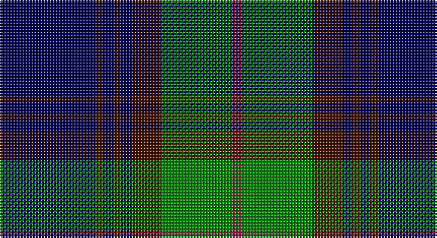

This page is one **sett** — a single exact thread-count. It belongs to the [tartan](/setts/db32dr3db3dr3db3dr10g24m3/)
(the same proportion at any scale), whose colour order is pattern [BBBBBBGR](/stripes/bbbbbbgr/).

Sourced from weddslist.  It is a [8 stripe tartan](/stripes/stripes8/).

Original link http://www.weddslist.com/cgi-bin/tartans/pg.pl?source=sts

## Thread count
DB/64 DRa6 DB6 DRa6 DB6 DRa20 G48 DR/6

One full sett is **254 threads**.

## Palette

Palette: <strong>custom</strong>
<table><thead><tr><th>Colour</th><th>Threads</th><th>Shade</th><th>Base</th><th>OKLCh</th></tr></thead><tbody><tr><td>DB/</td><td style="text-align:right;font-variant-numeric:tabular-nums">64</td><td><code style="background-color:#000050;">#000050</code> <small style="color:#888">#000050</small></td><td>B <code style="background-color:#2A418A;">#2A418A</code></td><td><small style="color:#888">oklch(19.5% 0.135 264.1)</small></td></tr><tr><td>DRa</td><td style="text-align:right;font-variant-numeric:tabular-nums">6</td><td><code style="background-color:#401000;">#401000</code> <small style="color:#888">#401000</small></td><td>B <code style="background-color:#2A418A;">#2A418A</code></td><td><small style="color:#888">oklch(25.3% 0.079 39.9)</small></td></tr><tr><td>DB</td><td style="text-align:right;font-variant-numeric:tabular-nums">6</td><td><code style="background-color:#000050;">#000050</code> <small style="color:#888">#000050</small></td><td>B <code style="background-color:#2A418A;">#2A418A</code></td><td><small style="color:#888">oklch(19.5% 0.135 264.1)</small></td></tr><tr><td>DRa</td><td style="text-align:right;font-variant-numeric:tabular-nums">6</td><td><code style="background-color:#401000;">#401000</code> <small style="color:#888">#401000</small></td><td>B <code style="background-color:#2A418A;">#2A418A</code></td><td><small style="color:#888">oklch(25.3% 0.079 39.9)</small></td></tr><tr><td>DB</td><td style="text-align:right;font-variant-numeric:tabular-nums">6</td><td><code style="background-color:#000050;">#000050</code> <small style="color:#888">#000050</small></td><td>B <code style="background-color:#2A418A;">#2A418A</code></td><td><small style="color:#888">oklch(19.5% 0.135 264.1)</small></td></tr><tr><td>DRa</td><td style="text-align:right;font-variant-numeric:tabular-nums">20</td><td><code style="background-color:#401000;">#401000</code> <small style="color:#888">#401000</small></td><td>B <code style="background-color:#2A418A;">#2A418A</code></td><td><small style="color:#888">oklch(25.3% 0.079 39.9)</small></td></tr><tr><td>G</td><td style="text-align:right;font-variant-numeric:tabular-nums">48</td><td><code style="background-color:#008000;">#008000</code> <small style="color:#888">#008000</small></td><td>G <code style="background-color:#006100;">#006100</code></td><td><small style="color:#888">oklch(52.0% 0.177 142.5)</small></td></tr><tr><td>DR/</td><td style="text-align:right;font-variant-numeric:tabular-nums">6</td><td><code style="background-color:#802040;">#802040</code> <small style="color:#888">#802040</small></td><td>R <code style="background-color:#CC0000;">#CC0000</code></td><td><small style="color:#888">oklch(40.8% 0.132 5.2)</small></td></tr></tbody></table>

# Sample pattern

## Nearest tartans

The nearest existing variants by ΔTartan distance, with this tartan at the top so the swatches line up against it.

ΔTartan

Tartan

Sett

—

<a href="/ttd/edit/#slug=db32dr3db3dr3db3dr10g24m3~x2">Gammell</a> <a class="nn-out" href="/variants/s8/db32dr3db3dr3db3dr10g24m3~x2/" title="open its dictionary page">↗</a>

0.74

<a href="/ttd/edit/#slug=k1g12k12r1k1r1k12b12r1~x4&amp;base=db32dr3db3dr3db3dr10g24m3~x2">Guthrie (Name)</a> <a class="nn-out" href="/variants/s9/k1g12k12r1k1r1k12b12r1~x4/" title="open its dictionary page">↗</a>

0.89

<a href="/ttd/edit/#slug=k4g24db6dp3k6dp12g3dp4~x2&amp;base=db32dr3db3dr3db3dr10g24m3~x2">Gary/Garry (Name)</a> <a class="nn-out" href="/variants/s8/k4g24db6dp3k6dp12g3dp4~x2/" title="open its dictionary page">↗</a>

0.91

<a href="/ttd/edit/#slug=dg4k4dg23k11r2k2r2k20w4~x2&amp;base=db32dr3db3dr3db3dr10g24m3~x2">New Golf Club</a> <a class="nn-out" href="/variants/s9/dg4k4dg23k11r2k2r2k20w4~x2/" title="open its dictionary page">↗</a>

0.95

<a href="/ttd/edit/#slug=db3r2db22k11g22r2g3~x2&amp;base=db32dr3db3dr3db3dr10g24m3~x2">Gammell (1978) (Personal)</a> <a class="nn-out" href="/variants/s7/db3r2db22k11g22r2g3~x2/" title="open its dictionary page">↗</a>

1.07

<a href="/ttd/edit/#slug=db24g3db3g3lo2g18r2~x2&amp;base=db32dr3db3dr3db3dr10g24m3~x2">Greenways Marketing Intl (Corporate)</a> <a class="nn-out" href="/variants/s7/db24g3db3g3lo2g18r2~x2/" title="open its dictionary page">↗</a>

1.09

<a href="/ttd/edit/#slug=r6k55db8g6db10g6db6g4~x2&amp;base=db32dr3db3dr3db3dr10g24m3~x2">Frederiction Police Force</a> <a class="nn-out" href="/variants/s8/r6k55db8g6db10g6db6g4~x2/" title="open its dictionary page">↗</a>

1.09

<a href="/ttd/edit/#slug=db36lb4db4lb4db16dg64r9db6~x2&amp;base=db32dr3db3dr3db3dr10g24m3~x2">Colvin</a> <a class="nn-out" href="/variants/s8/db36lb4db4lb4db16dg64r9db6~x2/" title="open its dictionary page">↗</a>

1.11

<a href="/ttd/edit/#slug=k1n1k1n8dy8k1dy1lt1~x6&amp;base=db32dr3db3dr3db3dr10g24m3~x2">Auld Lang Syne Burns Commemorative Tartan</a> <a class="nn-out" href="/variants/s8/k1n1k1n8dy8k1dy1lt1~x6/" title="open its dictionary page">↗</a>

1.12

<a href="/ttd/edit/#slug=g10r1g1r1g1r4db12r1db2~x2&amp;base=db32dr3db3dr3db3dr10g24m3~x2">Unidentified Portrait</a> <a class="nn-out" href="/variants/s9/g10r1g1r1g1r4db12r1db2~x2/" title="open its dictionary page">↗</a>

1.13

<a href="/ttd/edit/#slug=db1k1db8k2lo1g12lo1db8k1db1~x4&amp;base=db32dr3db3dr3db3dr10g24m3~x2">Rowan (Name)</a> <a class="nn-out" href="/variants/s10/db1k1db8k2lo1g12lo1db8k1db1~x4/" title="open its dictionary page">↗</a>

## Neighbour map

Every grey dot is one of 14360 variants placed by the first two principal components of the ΔTartan feature space (44% of its variance). Red is this tartan; blue dots are its nearest — click one to open its page.

<svg viewBox="0 0 640 380" role="img" style="max-width:100%;height:auto;border:1px solid #e0e0e0;border-radius:4px;display:block" xmlns="http://www.w3.org/2000/svg"><image href="/nn/cloud.v1.png" width="640" height="380"/><a href="/variants/s9/k1g12k12r1k1r1k12b12r1~x4/"><circle cx="256.0" cy="187.6" r="4" fill="#3465a4"><title>Guthrie (Name)</title></circle></a><a href="/variants/s8/k4g24db6dp3k6dp12g3dp4~x2/"><circle cx="213.8" cy="213.7" r="4" fill="#3465a4"><title>Gary/Garry (Name)</title></circle></a><a href="/variants/s9/dg4k4dg23k11r2k2r2k20w4~x2/"><circle cx="287.9" cy="194.1" r="4" fill="#3465a4"><title>New Golf Club</title></circle></a><a href="/variants/s7/db3r2db22k11g22r2g3~x2/"><circle cx="231.6" cy="211.5" r="4" fill="#3465a4"><title>Gammell (1978) (Personal)</title></circle></a><a href="/variants/s7/db24g3db3g3lo2g18r2~x2/"><circle cx="312.1" cy="197.7" r="4" fill="#3465a4"><title>Greenways Marketing Intl (Corporate)</title></circle></a><a href="/variants/s8/r6k55db8g6db10g6db6g4~x2/"><circle cx="321.3" cy="169.4" r="4" fill="#3465a4"><title>Frederiction Police Force</title></circle></a><a href="/variants/s8/db36lb4db4lb4db16dg64r9db6~x2/"><circle cx="290.3" cy="178.2" r="4" fill="#3465a4"><title>Colvin</title></circle></a><a href="/variants/s8/k1n1k1n8dy8k1dy1lt1~x6/"><circle cx="255.2" cy="206.1" r="4" fill="#3465a4"><title>Auld Lang Syne Burns Commemorative Tartan</title></circle></a><a href="/variants/s9/g10r1g1r1g1r4db12r1db2~x2/"><circle cx="266.8" cy="190.8" r="4" fill="#3465a4"><title>Unidentified Portrait</title></circle></a><a href="/variants/s10/db1k1db8k2lo1g12lo1db8k1db1~x4/"><circle cx="300.2" cy="186.1" r="4" fill="#3465a4"><title>Rowan (Name)</title></circle></a><circle cx="262.3" cy="194.5" r="5" fill="#c00000"/></svg>

ID: /variants/s8/db32dr3db3dr3db3dr10g24m3~x2/
